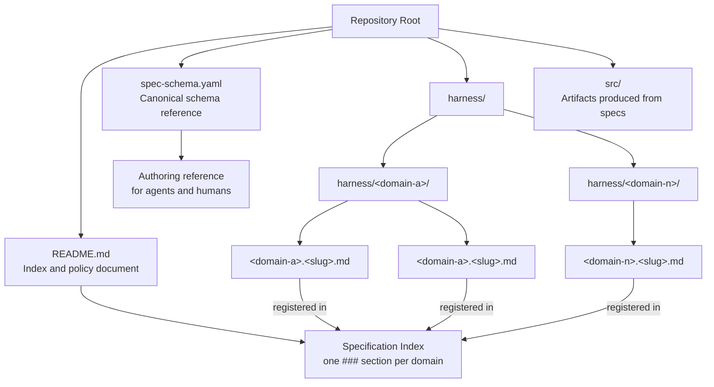

# Declarative Specification Harness

**Domain:** harness

---

## Raw Requirement

> I want to use a declarative harness to facilitate changes made to a more complex harness by maintaining a series of specifications in a consistent, coherent and structured format. Produce the base harness according to the following decisions — no further input is required.
>
> **REPOSITORY STRUCTURE**
> - The repository root contains: README.md, spec-schema.yaml, harness/, and src/
> - harness/ contains one subfolder per domain; each domain folder contains its specification files
> - src/ contains all artifacts produced from specifications
>
> **README**
> - The README serves as a lightweight index and orientation document for both human authors and agents
> - It contains: a title, a one-line purpose statement, a Policies section, a Specification requirements section, a How to use section, and a Specification index section
> - It must provide enough context for an agent to understand the project's purpose and navigate to the correct specification — no more
> - The specification index is empty at initialisation; it is organised by domain using ### subheadings, one per domain, added as domains are introduced
> - The index section must document the expected structure: domain subsections, and the three columns (Name, Description, Path) with a description of what each column contains
> - The README links to spec-schema.yaml as the schema reference
>
> **README — POLICIES SECTION**
> The following policies must be stated explicitly:
> - No drift: every specification must remain consistent with its parent specifications and any decisions they record; a child spec may not introduce behaviour that contradicts an inherited decision
> - No modification of existing specifications: specifications are immutable once authored; an agent must never edit an existing specification file; if a requirement changes, a new specification must be created that supersedes the old one with a backlink recording the relationship
> - Contradictions require human intervention: if a proposed specification contradicts an existing decision, the agent must stop, surface the contradiction, and wait for a human to resolve it before proceeding
>
> **README — SPECIFICATION REQUIREMENTS SECTION**
> The following requirements must be stated explicitly:
> - All specifications must conform to spec-schema.yaml; no required field may be omitted
> - Specifications are stored under harness/<domain>/
> - Filenames follow the pattern <domain>.<slug>.md where domain matches the containing folder and slug is a concise kebab-case description of the subject
> - Every specification must be registered in the specification index in README.md; an unregistered specification is not considered part of the harness
>
> **SPEC-SCHEMA.YAML**
> - A single YAML file at the repository root defining the canonical structure for all specification files
> - Specifications are pure markdown; the schema is a reference used when authoring, not embedded in each file
> - The schema must define the following fields: title, domain, raw_requirement, description, diagram, backlinks (parents, external), steps, decisions, rubric (structured, qualitative)
>
> **NAMING CONVENTION**
> - Specification filenames: <domain>.<slug>.md
> - Domain folder names: single lowercase word or hyphenated phrase
> - Examples: harness/auth/auth.token-rotation.md, harness/payments/payments.refund-flow.md

---

## Description

A file-based, immutable specification harness in which requirements and design decisions are captured as versioned markdown files. Each specification conforms to a canonical schema defined once in `spec-schema.yaml` at the repository root. Specifications are grouped into domain folders under `harness/`, named by convention, and indexed in `README.md`. Source artifacts derived from specifications are placed under `src/`. Three policies enforced at the harness level — no drift, no mutation, human-mediated contradiction resolution — preserve the integrity of the decision record across the lifetime of the repository.

---

## Diagram



---

## Backlinks

### Parents

| Label | Path | Purpose |
|-------|------|---------|
| README | [README.md](../../README.md) | Root index and policy document; this specification is the first entry it will record |

### External

*(none — this is a self-contained internal system)*

---

## Steps

1. **Create the repository root documents**
   Produce `README.md` and `spec-schema.yaml` at the repository root. `README.md` must contain the five required sections (title, purpose statement, Policies, Specification requirements, How to use, Specification index). `spec-schema.yaml` must define all required fields with inline comments explaining the intent and conventions of each. Neither file is a specification; they are infrastructure documents and are not subject to the immutability policy.

2. **Create the directory structure**
   Create `harness/` and `src/` at the repository root. `harness/` receives domain subfolders as domains are introduced; `src/` receives all artifacts produced from those specifications. Do not pre-populate either directory.

3. **Author specifications per domain**
   For each new domain, create `harness/<domain>/`. Within it, author specification files named `<domain>.<slug>.md`. Every file must conform to `spec-schema.yaml` — no required field may be omitted. Each specification must include a Mermaid diagram block in its body. Consult `spec-schema.yaml` before authoring.

4. **Register each specification in the index**
   After authoring a specification, add a row to the appropriate `###` domain subsection of the specification index in `README.md`. If the domain subsection does not yet exist, create it. The row must contain three columns: Name (human-readable title), Description (single sentence), and Path (relative path from the repo root). An unregistered specification is not considered part of the harness.

5. **Produce and place artifacts**
   Place all source artifacts derived from specifications under `src/`. Each artifact should be traceable to its originating specification either by naming convention or by an explicit comment or header referencing the spec path.

6. **Handle requirement changes with superseding specifications**
   When a requirement captured in an existing specification changes, do not edit the existing file. Author a new specification whose `backlinks.parents` section includes a link to the superseded specification with `purpose: supersedes`. The old specification remains in the harness unchanged as a historical record.

---

## Decisions

### Specifications are markdown files conforming to a single YAML schema

**Rationale:** Markdown is human-readable, diff-friendly, and renderable by standard tooling. A single YAML schema at the root provides a stable, auditable reference that agents can consult without parsing each spec. Embedding the schema inside every spec would couple schema evolution to every existing file.

**Alternatives:**

| Option | Reason Rejected |
|--------|----------------|
| YAML or JSON specification files | Less readable for humans; prose fields (rationale, raw requirement) are awkward in structured data formats |
| Schema embedded as frontmatter in each spec | Couples schema definition to every file; any schema update requires touching every spec, violating immutability |
| Convention only — no schema file | Implicit; provides no stable reference for agents or validators |

**Consequences:** Authoring agents and humans must consult `spec-schema.yaml` before writing any specification. Validation tooling should target the schema file as its single source of truth.

---

### Specifications are immutable once authored

**Rationale:** Mutability creates an unreliable audit trail. If a spec can be silently edited, there is no stable record of what was decided and when. Immutability forces all changes to produce a new, traceable document — making the evolution of decisions explicit and reviewable.

**Alternatives:**

| Option | Reason Rejected |
|--------|----------------|
| Allow in-place edits with a changelog section | Requires sustained discipline; history becomes implicit and easy to corrupt |
| Rely on git history as the audit trail | Git history surfaces diffs, not intent; decision context is not captured at a glance |
| Allow edits before a formal "ratified" state | Adds process complexity; the boundary between draft and ratified is hard to enforce |

**Consequences:** When a requirement changes, a new specification must be authored. The new spec must carry a backlink to the spec it supersedes. Every specification file, once created, is permanent within the harness.

---

### Contradictions require human intervention — agents must not resolve them autonomously

**Rationale:** Autonomous resolution risks silently overriding a prior architectural decision that was made deliberately. An agent cannot reliably determine which decision takes precedence or whether the contradiction reveals a gap in the design. Human judgement is required.

**Alternatives:**

| Option | Reason Rejected |
|--------|----------------|
| Last-write wins | Destroys the integrity of the decision record |
| Agent selects the most-recent decision | Assumes recency implies correctness, which is false in design contexts |
| Agent selects the decision with broader scope | Scope judgements are themselves design decisions that require human input |

**Consequences:** Agents must halt on contradiction, surface the specific conflict with full context (both specs, the conflicting fields), and wait for explicit human resolution before proceeding. This may pause automated workflows.

---

### The specification index lives in README.md, organised by domain with `###` subheadings

**Rationale:** README.md is the first file an agent or human reads when entering the repository. Keeping the index there avoids indirection and mirrors the `harness/` directory structure, making navigation predictable. Domain-scoped subheadings scale as the number of specs grows.

**Alternatives:**

| Option | Reason Rejected |
|--------|----------------|
| Separate index file (e.g. INDEX.md) | Adds a navigation step; README is already the orientation document |
| Flat chronological list | Loses domain context; harder to navigate by concern area as the harness grows |
| Generated index from file system scan | Requires tooling; makes registration implicit and removes the forcing function of a manual entry |

**Consequences:** Each new domain introduced to the harness requires a new `###` subsection in the README index. The index is append-only by convention — entries are not removed when a spec is superseded.

---

### Backlinks are split into `parents` and `external` groups

**Rationale:** Internal links (to parent specs or the README) and external links (to tickets, policies, ADRs) serve distinct traceability purposes and have different structural requirements. Separating them makes each navigable independently and prevents conflation of internal structure with external citations.

**Alternatives:**

| Option | Reason Rejected |
|--------|----------------|
| Single flat links list | Conflates internal and external references; harder to navigate; loses structural meaning |
| No mandatory link structure | Backlinks become inconsistently formatted; agents cannot reliably parse them |

**Consequences:** Every specification must declare at minimum one parent link — to `README.md` or to a parent specification. External links are required only when external sources exist.

---

## Rubric

### Structured

| Name | Description | Threshold | Pass Condition |
|------|-------------|-----------|----------------|
| Schema compliance | All fields defined as required in `spec-schema.yaml` are present in the specification file | 100% of required fields present | Manual review or schema-aware linter reports zero missing required fields |
| Filename convention | Specification filenames match `<domain>.<slug>.md`; the domain prefix matches the containing folder name | 100% of files | Regex `^[a-z][a-z0-9-]*\.[a-z][a-z0-9-]*\.md$` matches the filename and the domain prefix equals the folder name |
| Diagram presence | Every specification includes at least one Mermaid diagram block in its markdown body | 100% of files | Grep for ` ```mermaid ` block returns a match in every spec file |
| Index registration | Every specification file has a corresponding row in the README specification index | 100% of files | Cross-reference of `harness/**/*.md` paths against README index entries yields zero unregistered files |
| Immutability | No existing specification file is modified after its initial commit | Zero post-creation modifications to any spec | `git log --follow --oneline -- <spec-path>` returns exactly one commit for every file under `harness/` |

### Qualitative

- **Step executability:** Each step in the steps section must be detailed enough for an agent or developer to execute without requiring additional context. A reviewer unfamiliar with the project should be able to complete any step from its description alone.
- **Decision record completeness:** Each decision must include a non-trivial rationale, at least one considered alternative with a concrete rejection reason, and a consequences statement that describes forward commitments — not a restatement of the decision itself.
- **Diagram fidelity:** The Mermaid diagram must faithfully represent the structure or flow described in the specification body. A reviewer must be able to verify the diagram against the steps and description without finding a discrepancy.
- **Raw requirement integrity:** The raw requirement section must contain the verbatim text of the originating brief. Paraphrasing or normalisation of any kind is grounds for rejection.
