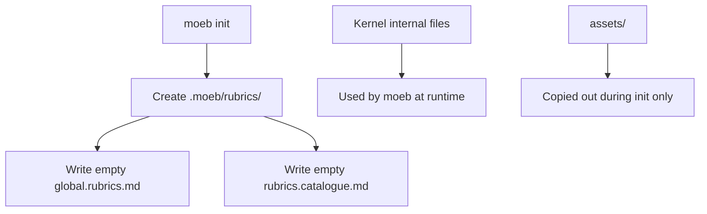

# Moeb Init Rubric Storage Boundary

## Raw Requirement

An empty i.e. file without any rubrics added, global rubric file and rubric catalogue should be created in the rubrics folder of .moeb/ for a project when moeb init is called. We need definition between stored files, assets/ should be only for those to be copied out, whereas those to be used internally by the moeb kernel belong in another folder within the kernel

## Description

Define the initial rubric-storage layout created by `moeb init` and separate binary-bundled assets from kernel-internal source files. The initialization flow must create an empty project rubric directory containing the global rubric file and rubric catalogue, while the binary assets directory remains reserved for files that are copied into a project during initialization.

## Diagram

## Backlinks

### Parents

| Label | Path | Purpose |
|-------|------|---------|
| Declarative Specification Harness | README.md | Root harness index and governing policies |
| Rubric Context Layers: Binary-Bundled Baseline Criteria per Command Context | specifications/moeb/moeb.rubric-context-layers.md | Establishes the binary-bundled rubric asset layer and the project-local rubric layer created by initialization |
| Rubric System Rationalisation: Five-Layer Model and Trait-Keyed Catalogue | specifications/harness/harness.rubric-index-rationalisation.md | Defines the rubric catalogue file name, its role, and the empty global baseline asset |
| Agent Skills | specifications/moeb/moeb.agent-skills.md | Records the copy-out pattern for binary assets versus project-local overrides |

### External

| Label | URL | Purpose |
|-------|-----|---------|

## Steps

### Step 1 — Define the project rubric directory contents

Update the `moeb init` implementation so it creates `.moeb/rubrics/` in a new project and writes two files into that directory: `.moeb/rubrics/global.rubrics.md` and `.moeb/rubrics/rubrics.catalogue.md`. Both files must exist after initialization completes, and both must be created empty with zero bytes.

### Step 2 — Reserve `assets/` for copy-out artifacts

Keep only files that are intended to be copied into a project under the binary-bundled `assets/` tree. Do not place internal kernel implementation files there. If a file is used only by the kernel during execution and is not copied into the project, relocate it into a separate kernel-internal source area.

### Step 3 — Introduce a kernel-internal source location for non-copy-out files

Create or use a dedicated internal folder within the kernel source tree for files that support initialization or runtime behavior but are not part of the project payload. Update any references so `moeb init` reads from the internal location for its logic and writes only the project-facing files into `.moeb/rubrics/`.

### Step 4 — Preserve existing rubric layer semantics

Ensure the empty global rubric file acts as the project-local layer 3 file and the empty catalogue file acts as the mutable selection source expected by the spec authoring flow. The creation of these files must not populate default criteria.

## Decisions

### Decision 1 — `moeb init` creates empty project rubric files by default

`moeb init` must create `.moeb/rubrics/global.rubrics.md` and `.moeb/rubrics/rubrics.catalogue.md` as empty files so a new project starts with the expected rubric structure without seeding project-specific criteria.

**Rationale:** The rubric layer model expects the files to exist even when no local project rubric has been defined yet. Creating empty files preserves the directory contract and avoids special-case checks for missing files in later prompt assembly.

**Alternatives considered:**
- Populate the files with starter criteria — rejected because it would introduce project-local defaults where the specification requires an empty baseline.
- Omit file creation until first use — rejected because it forces downstream code to handle absent files and weakens the initialization guarantee.

**Consequences:** The initialization path must always create both files, and later rubric loading logic must treat empty files as valid, no-op inputs.

### Decision 2 — Binary assets are copy-out inputs only

The `assets/` tree is reserved for files that are packaged with the binary and copied out into a new project during initialization. Files used exclusively by the kernel itself must live in a separate internal source location.

**Rationale:** This separation makes the role of `assets/` unambiguous and prevents kernel-internal implementation details from being mistaken for project template content.

**Alternatives considered:**
- Keep internal files in `assets/` — rejected because it blurs the distinction between distributable templates and runtime-only support files.
- Move everything into the project root — rejected because it would mix binary resources with source logic and make embedding less clear.

**Consequences:** Any new kernel-only initialization resources must be stored outside `assets/`, and initialization code must explicitly distinguish copy-out payloads from internal support files.

## Rubric

### Structured

| Name | Description | Threshold | Pass Condition |
|------|-------------|-----------|----------------|
| `no-drift` | The specification does not violate any decision recorded in a linked parent specification | Zero contradictions | Manual review of every decision in every parent spec listed in Backlinks |
| `spec-schema-compliance` | All required frontmatter fields and body sections are present and correctly ordered | 100% of required fields and sections | Validation in `domain/spec.rs` exits 0 during `moeb spec` |
| `init-creates-empty-rubric-files` | `moeb init` creates `.moeb/rubrics/global.rubrics.md` and `.moeb/rubrics/rubrics.catalogue.md` as empty files | Both files exist and are zero bytes after init | File existence checks succeed and file size is 0 for both paths |
| `assets-reserved-for-copy-out` | The specification distinguishes binary assets copied into a project from kernel-internal files | Clear separation documented and implemented | Review confirms `assets/` contains only copy-out resources and internal files live elsewhere |

### Qualitative

| Name | Description |
|------|-------------|
| Initialization clarity | A reader can tell exactly which rubric files are created, where they are placed, and which folders are reserved for binary assets versus kernel-internal support files. |