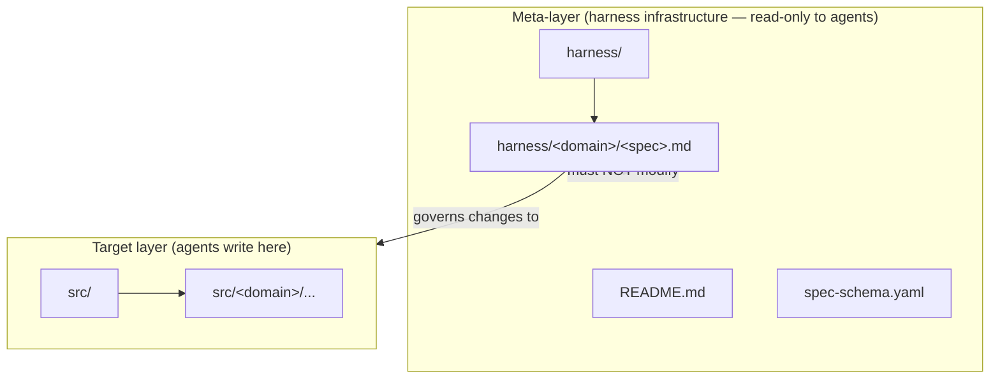

# README Scope Boundary Clarification

**Domain:** harness

---

## Raw Requirement

> The base README at the top level of the basic harness appears to not be explicit enough that the existing structure of README.md, spec-schema.yaml and harness/ is not for the specifications to act upon directly, any specification for new code (or code on that top level that already existed) should be created in a folder called src/ the README must be updated to reflect this.

---

## Description

The current README mentions `src/` only incidentally in the "How to use" section and says nothing to prevent an agent from interpreting the harness infrastructure files (README.md, spec-schema.yaml, harness/) as targets for code changes. The README must be updated to include an explicit repository-layer statement that names the two layers — meta-layer (harness infrastructure) and target layer (src/) — and forbids agents from landing code changes inside the harness infrastructure. The meta-layer files exist to govern how changes are made; they are not themselves subject to specification-driven code changes. All code produced from specifications, whether new or replacing code that previously existed at the repository root, must be placed under `src/`.

---

## Diagram

---

## Backlinks

### Parents

| Label | Path | Purpose |
|-------|------|---------|
| Declarative Specification Harness | [harness/harness/harness.base-harness.md](harness.base-harness.md) | Parent specification; establishes the repository structure and policies this spec refines |
| README | [README.md](../../README.md) | Root index; the document this specification governs an update to |

### External

*(none)*

---

## Steps

1. **Add a "Repository layers" section to README.md**
   Insert a new `## Repository layers` section between the existing `## Policies` section and the existing `## Specification requirements` section. The section must contain the following information, stated as policy-level prose:
   - The repository has two distinct layers with different roles.
   - The **meta-layer** consists of `README.md`, `spec-schema.yaml`, and `harness/`. These files govern how changes are made. Agents must not land code changes inside any of these files or directories when implementing a specification.
   - The **target layer** is `src/`. All code produced from specifications — whether new or replacing code that previously existed at the repository root — must be placed under `src/`.
   - If a specification does not reference `src/` as the destination for its artifacts, the agent must not infer an alternative location; it must stop and seek clarification.

2. **Register this specification in the README index**
   Add a row to the `### harness` subsection of the specification index in `README.md` with:
   - **Name:** README Scope Boundary Clarification
   - **Description:** Adds an explicit repository-layer statement to README.md distinguishing the harness meta-layer from the src/ target layer.
   - **Path:** `harness/harness/harness.readme-scope-boundary.md`

---

## Decisions

### Add a new dedicated "Repository layers" section rather than amending "How to use"

**Rationale:** The boundary between the harness meta-layer and the target layer is a constraint of equal weight to the policies already stated in the Policies section. Folding it into "How to use" would bury it in procedural text. A dedicated section at the same heading level as Policies ensures it is encountered early, stands alone, and is clearly demarcated as a binding rule rather than usage guidance.

**Alternatives:**

| Option | Reason Rejected |
|--------|----------------|
| Amend the existing "How to use" section | The boundary is a constraint, not a usage instruction; placing it under a procedural heading understates its authority |
| Add a paragraph to the Policies section | The Policies section governs specification authorship behaviour; the layer boundary governs implementation behaviour — mixing the two reduces clarity |
| Leave implicit via directory structure alone | Insufficient; the current README already implies src/ exists without preventing agents from targeting harness files |

**Consequences:** README.md will have a "Repository layers" section placed between Policies and Specification requirements. Future specifications that touch repository structure must be consistent with this two-layer model.

---

### All code displaced from the repository root must land under src/, not a domain-specific alternative

**Rationale:** Allowing domain teams to nominate their own output directories would fragment the target layer and make it impossible to reason about where agent changes land without reading every spec. `src/` as the single, unconditional target is consistent with the base harness decision to keep structure predictable.

**Alternatives:**

| Option | Reason Rejected |
|--------|----------------|
| Allow per-domain output directories at the root | Creates an unpredictable layout; agents cannot determine the target layer without reading every specification |
| Allow code to remain at the repository root if it existed there before | Ambiguous precedent; the harness infrastructure files are also at the root, making the boundary unclear |

**Consequences:** Any code previously living at the repository root is considered misplaced relative to this harness. When a specification addresses such code, the implementation must relocate it under `src/`. No exceptions are made for pre-existing root-level code.

---

## Rubric

### Structured

| Name | Description | Threshold | Pass Condition |
|------|-------------|-----------|----------------|
| Layer section present | README.md contains a `## Repository layers` section | Required | Grep for `## Repository layers` in README.md returns a match |
| Meta-layer prohibition stated | The new section explicitly names README.md, spec-schema.yaml, and harness/ as files agents must not modify when implementing specs | All three named | Manual review confirms all three are named and the prohibition is unambiguous |
| Target layer stated | The new section explicitly identifies src/ as the destination for all code produced from specifications | Required | Manual review confirms src/ is named as the sole target layer for code changes |
| Spec registered | This specification has a row in the harness domain subsection of the README index | Required | Row with path `harness/harness/harness.readme-scope-boundary.md` present in README index |

### Qualitative

- **Agent-readiness:** An agent with no prior context should be able to read the new section and determine unambiguously that it must not modify any file under harness/, README.md, or spec-schema.yaml when implementing a specification, and that src/ is where its changes belong.
- **Tone consistency:** The new section should match the declarative, imperative tone of the existing Policies section — short sentences, no hedging, no conditional language.
