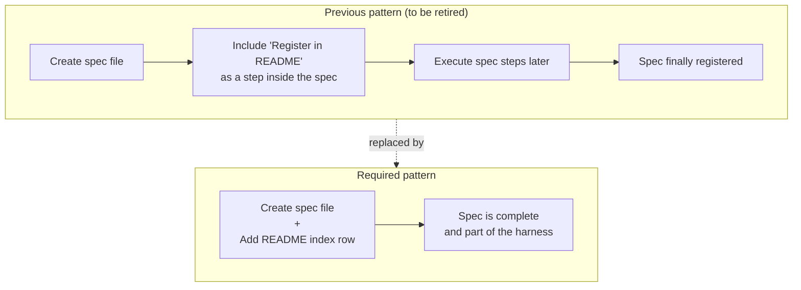

# Registration at Creation

**Domain:** harness

---

## Raw Requirement

> Specifications should be registered in the README.md when they are first created rather than relying on a later step in the spec itself to do so.

---

## Description

The current harness authoring pattern treats README.md registration as a deferred implementation step — a task listed inside the spec and executed separately after the spec file is created. This creates a window in which a specification exists on disk but is not part of the harness, and it places responsibility for a harness-integrity concern inside the artifact being governed rather than at the point of authoring. The registration requirement in README.md must be updated to state that registration is atomic with creation: the index row must be added in the same authoring action that creates the specification file. Specifications must not include a README registration step.

---

## Diagram

---

## Backlinks

### Parents

| Label | Path | Purpose |
|-------|------|---------|
| Declarative Specification Harness | [harness/harness/harness.base-harness.md](harness.base-harness.md) | Parent specification; Step 4 describes registration as a post-authoring action — this spec refines that timing to be atomic |
| README | [README.md](../../README.md) | Root index; the Registration requirement in Specification requirements is the target of the update this spec governs |

### External

*(none)*

---

## Steps

1. **Update the Registration requirement in README.md**
   In the `## Specification requirements` section, replace the existing **Registration** paragraph with the following:

   > **Registration.** Every specification must be registered in the [Specification index](#specification-index) at the time it is first authored. Registration must not be deferred to a later implementation step inside the specification. A specification that is not registered here is not considered part of the harness.

2. **Apply the atomic pattern going forward**
   When authoring any specification from this point forward, the README index row must be added in the same authoring action that creates the specification file. Specifications must not include a step whose purpose is to register the spec in README.md.

---

## Decisions

### Registration is a condition of authoring, not an implementation task

**Rationale:** A specification that exists on disk but is not registered in the index is in an indeterminate state — it is present but has no standing. Treating registration as a spec step creates that window deliberately and places harness-integrity responsibility inside the artifact being governed. Making registration atomic with creation eliminates the indeterminate state entirely.

**Alternatives:**

| Option | Reason Rejected |
|--------|----------------|
| Keep registration as a spec step, rely on authors to execute it promptly | Still creates the indeterminate window; the window's length depends on when the step is executed, not on the harness rules |
| Automate registration via a file-system hook or CI check | Introduces tooling dependency; the harness is intentionally document-first and does not require external tooling to remain coherent |
| Require registration only after a spec is "approved" | Introduces an approval state the harness does not currently model; adds complexity without clear benefit |

**Consequences:** Every specification file creation must be accompanied by a README index row in the same atomic authoring action. The indeterminate window between spec creation and registration is closed. Specs authored before this policy was introduced are grandfathered — they are immutable and cannot be modified to remove their registration steps.

---

### Specifications must not include a README registration step

**Rationale:** If registration is atomic with creation, a registration step inside the spec is either already done (making the step redundant) or not yet done (meaning the spec was created in violation of policy). Either way the step is wrong. Including it signals to future authors that deferred registration is acceptable.

**Alternatives:**

| Option | Reason Rejected |
|--------|----------------|
| Keep a registration step as a reminder/checklist item | Conflicts with the atomic requirement; ambiguous whether the step is already executed or pending |
| Replace the registration step with a note confirming registration was done | Unnecessary narrative; the index entry itself is the evidence |

**Consequences:** Specifications authored under this policy will have no registration step. Reviewers checking a new spec for compliance should treat the presence of a registration step as a policy violation.

---

## Rubric

### Structured

| Name | Description | Threshold | Pass Condition |
|------|-------------|-----------|----------------|
| Registration requirement updated | The Registration paragraph in README.md `## Specification requirements` states that registration must occur at authoring time and must not be deferred | Required | Manual review confirms the updated wording is present and unambiguous |
| No registration step in new specs | Specifications authored after this spec is in effect do not contain a step whose purpose is to register the spec in README.md | 100% of new specs | Manual review of each new spec's steps section finds no registration step |
| Atomic authoring demonstrated | The spec file and its README index row are created in the same authoring action | Required | The spec file and its index row exist with no intermediate commit or action between them |

### Qualitative

- **Wording clarity:** The updated Registration paragraph must leave no ambiguity about timing. An agent reading it for the first time must understand that the index row is part of the act of creating the spec, not a task to complete afterwards.
- **No regression in standing:** Every specification in the harness, including this one, must have an index row at the time of review. No spec should be discoverable on disk without a corresponding index entry.
