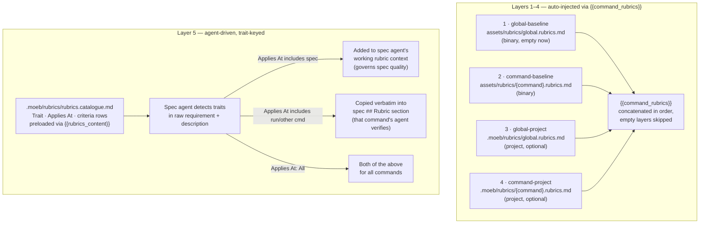

# Rubric System Rationalisation: Five-Layer Model and Trait-Keyed Catalogue

## Raw Requirement

> rubrics.index.md may now be unnecessary in full as we have specific command rubric
> files, unless there is a rubric required for all commands, so when combining rubrics
> layers it would be baseline + project-specific + global, as it stands it just
> duplicates spec and run specific contents.
>
> The rubrics.index.md should be treated as a source for runs with particular traits
> e.g. we have a rubric for ai-adapters currently in our index, given a user runs
> moeb spec and the rubric relates to specifications containing that trait then it
> needs to be applied to the spec command, if the rubric relates to validating the
> specification created then it needs to be copied into the specification itself for
> the run command to pick up on, so the layers are:
> global-baseline -> command-baseline -> global-project -> command-project -> index (selected if relevant)
> We need more metadata within the index, it may also deserve a rename given its function.

## Description

The `.moeb/rubrics/rubrics.index.md` catalogue currently duplicates six of its seven
criteria — all are now authoritatively owned by a command rubric layer. More importantly,
the one remaining entry (`adapter-structural-parity`) has no mechanism to be applied
automatically: it relies on spec authors remembering to include it when their spec touches
AI adapter code. This is the same silent-omission problem the rubrics index was introduced
to solve.

This specification makes three connected changes:

**1. Five-layer combination model.** The auto-injected `{{command_rubrics}}` content is
assembled from four ordered layers, each loaded independently:

| # | Layer | Source |
|---|-------|--------|
| 1 | global-baseline | `assets/rubrics/global.rubrics.md` (binary-bundled) |
| 2 | command-baseline | `assets/rubrics/{command}.rubrics.md` (binary-bundled) |
| 3 | global-project | `.moeb/rubrics/global.rubrics.md` (project file, optional) |
| 4 | command-project | `.moeb/rubrics/{command}.rubrics.md` (project file, optional) |
| 5 | catalogue-selected | `.moeb/rubrics/rubrics.catalogue.md` — agent-driven, trait-keyed |

Layers 1–4 are concatenated in order and substituted via `{{command_rubrics}}`. Layer 5
is not pre-injected; it is applied by the spec agent based on trait detection (see below).

**2. Catalogue rename and metadata enrichment.** `rubrics.index.md` is renamed to
`rubrics.catalogue.md` to reflect its function as a conditional selection source rather
than a flat lookup. Two metadata columns are added to each entry:

- **Traits** — a comma-separated list of tags that trigger selection (e.g. `ai-adapter`).
  The spec agent detects these traits in the raw requirement and description.
- **Applies At** — determines how a selected entry is used. A comma-separated list of
  command names (e.g. `spec`, `run`, `spec, run`) or the special value `All` meaning
  every moeb command. For each listed command:
  - `spec` — the criterion is added to the spec agent's working rubric context for the
    current `moeb spec` invocation; it governs the *quality of the specification being authored*.
  - `run` — the criterion row is copied verbatim into the `## Rubric / ### Structured`
    table of the specification being authored, so the *run agent verifies it during implementation*.
  - Future commands (e.g. `replay`) follow the same pattern as `run`: the row is copied
    into the spec's rubric section for that command's agent to verify.

**3. Removal of duplicated entries.** The six catalogue entries already managed by an
automated layer are removed. `adapter-structural-parity` is updated with its trait and
applies-at metadata. The six removed entries are removed entirely; they remain
authoritative in their respective command rubric files.

No existing command rubric asset files change. The `{{command_rubrics}}` token and its
substitution mechanism are unchanged in structure; only the loading code is refactored to
four explicit layers. The `{{rubrics_content}}` token in `spec.prompt` continues to
preload the catalogue; the authoring instructions are updated to describe trait detection
and dual application modes.

## Diagram



## Backlinks

### Parents

| Label | Path | Purpose |
|-------|------|---------|
| Rubrics Index | [specifications/harness/harness.rubrics-index.md](specifications/harness/harness.rubrics-index.md) | Introduced `rubrics.index.md`; this spec renames it, enriches its metadata, and replaces the manual-copy convention with trait-driven selection |
| Rubric Context Layers | [specifications/moeb/moeb.rubric-context-layers.md](specifications/moeb/moeb.rubric-context-layers.md) | Introduced command rubric layers and `{{command_rubrics}}`; this spec refactors the loading to four explicit ordered layers and adds the global layer |
| Spec Prompt: Static File Pre-load | [specifications/moeb/moeb.spec-prompt-preload.md](specifications/moeb/moeb.spec-prompt-preload.md) | Established `{{rubrics_content}}` preloading of `rubrics.index.md`; this spec updates the path to `rubrics.catalogue.md` and replaces the authoring instruction |
| README | [README.md](../../README.md) | Root index |

### External

*(none)*

## Steps

### Step 1 — Rename and rewrite `.moeb/rubrics/rubrics.index.md`

Rename the file `.moeb/rubrics/rubrics.index.md` to `.moeb/rubrics/rubrics.catalogue.md`.

Replace the entire file content with the following. The `## Criteria` table gains two
new columns (`Traits`, `Applies At`) and retains only `adapter-structural-parity`:

```markdown
# Rubrics Catalogue

A trait-keyed catalogue of conditionally applicable rubric criteria. Entries are selected
by the spec agent based on traits detected in the raw requirement and description of the
specification being authored. They are not auto-injected — selection is agent-driven.

Each entry carries:
- **Domain** — the harness domain this criterion belongs to.
  Used as a coarse pre-filter before trait matching; agents skip entries whose domain
  is unrelated to the specification being authored.
- **Traits** — comma-separated tags that trigger selection within the domain (e.g. `ai-adapter`).
- **Applies At** — comma-separated list of command names (e.g. `spec`, `run`, `spec, run`)
  or the special value `All` (every moeb command). Governs how the entry is applied per
  command: `spec` governs spec authoring quality for this invocation; any other command
  name causes the row to be copied into the spec's `## Rubric` section for that command's
  agent to verify during implementation.

To retire a criterion, set its `status` to `superseded` and add a note identifying the
replacement. Do not delete rows.

## Criteria

| id | Name | Description | Threshold | Pass Condition | Domain | Traits | Applies At | Status |
|----|------|-------------|-----------|----------------|--------|--------|------------|--------|
| `adapter-structural-parity` | Adapter implementations are structurally identical | `AnthropicAdapter::send` and `OpenAiAdapter::send` follow the same retry loop skeleton; only API-specific serialisation differs | Identical structure | Code review of both adapter files side-by-side finds no structural asymmetry | `moeb` | `ai-adapter` | `run` | active |
```

### Step 2 — Create `src/moeb/assets/rubrics/global.rubrics.md`

Create the file `src/moeb/assets/rubrics/global.rubrics.md` with zero-byte content.
This is the binary-bundled global-baseline (layer 1). It starts empty; content is added
here when a criterion that applies to every moeb command across every project is identified.

### Step 3 — Update `src/moeb/src/domain/run.rs`

Read `src/moeb/src/domain/run.rs` in full.

Replace the existing `let command_rubrics = {` block with a four-layer explicit loading
pattern. Each layer is loaded independently and empty layers are skipped:

```rust
let command_rubrics = {
    let layers: &[(&str, std::path::PathBuf)] = &[
        // Layer 1: global-baseline (binary)
        ("rubrics/global.rubrics.md", std::path::PathBuf::new()),
        // Layer 2: command-baseline (binary) — no project path
        ("rubrics/run.rubrics.md", std::path::PathBuf::new()),
    ];
    let binary_layers: Vec<String> = layers.iter()
        .filter_map(|(asset, _)| {
            Assets::get(asset)
                .and_then(|f| std::str::from_utf8(f.data.as_ref()).ok().map(str::to_owned))
                .filter(|s| !s.trim().is_empty())
        })
        .collect();

    // Layer 3: global-project (project file, optional)
    let global_project_path = working_dir.join(".moeb/rubrics/global.rubrics.md");
    let global_project = if global_project_path.exists() {
        std::fs::read_to_string(&global_project_path).unwrap_or_default()
    } else {
        String::new()
    };

    // Layer 4: command-project (project file, optional)
    let command_project_path = working_dir.join(".moeb/rubrics/run.rubrics.md");
    let command_project = if command_project_path.exists() {
        std::fs::read_to_string(&command_project_path).unwrap_or_default()
    } else {
        String::new()
    };

    let mut combined: Vec<String> = binary_layers;
    if !global_project.trim().is_empty() { combined.push(global_project); }
    if !command_project.trim().is_empty() { combined.push(command_project); }
    combined.join("\n\n")
};
```

Remove any prior `global_rubrics` variable that was a preceding step in an earlier draft
of this specification. The combined variable `command_rubrics` is the only output.

### Step 4 — Update `src/moeb/src/domain/spec.rs`

Read `src/moeb/src/domain/spec.rs` in full.

Apply the identical four-layer loading pattern as Step 3 to the spec command context,
using `rubrics/spec.rubrics.md` as the command-baseline asset (layer 2) and
`.moeb/rubrics/spec.rubrics.md` as the command-project path (layer 4). The global layers
(1 and 3) are identical paths to Step 3.

Also update the path used to load `{{rubrics_content}}`: change the source path from
`.moeb/rubrics/rubrics.index.md` to `.moeb/rubrics/rubrics.catalogue.md`.

### Step 5 — Update `src/prompts/spec.prompt`

Read `src/prompts/spec.prompt` in full.

Find the paragraph that describes how to use the rubrics index when authoring the
`## Rubric / ### Structured` table (introduced by `moeb.spec-prompt-preload.md`). Replace
it with the following:

```
When authoring the `## Rubric / ### Structured` table, apply the rubrics catalogue in
two passes:

**Pass 1 — mandatory baseline rows (always included):**
Copy every row from the "Rubric criteria" section above verbatim. These rows come from
the auto-injected layers (global-baseline, command-baseline, global-project,
command-project) and are mandatory in every specification.

**Pass 2 — catalogue-selected rows (domain then trait-driven):**
Read the "Rubrics Catalogue" section preloaded above. First filter by Domain: discard any
entry whose Domain does not match the domain of the specification being authored (e.g.
ignore `moeb` entries when authoring a `harness` specification). Then examine the raw
requirement and description to identify which traits are present among the remaining
entries (e.g. `ai-adapter` if the spec adds or modifies an AI adapter, `openai` if it
specifically targets the OpenAI adapter). For each catalogue entry that passes both the
domain filter and has a matching trait:
- If `Applies At` contains `run` (or `All`, or any other non-`spec` command name): copy
  the criterion row verbatim into the `## Rubric / ### Structured` table. That command's
  agent will verify this criterion when implementing the specification.
- If `Applies At` contains `spec` (or `All`): add the criterion to your working rubric
  for this `moeb spec` invocation. Verify it against the specification you are authoring
  before marking the spec complete. Do not copy it into the spec's rubric table.

Do not include catalogue entries whose traits are absent from this specification. Do not
omit a catalogue entry whose trait is clearly present without explicit justification.
```

### Step 6 — Update harness README

In `.moeb/README.md`, find the **Rubrics** paragraph under `## Specification requirements`
and replace it with:

```markdown
**Rubrics.** Rubric criteria are applied at five layers. Layers 1–4 are automatically
combined (in order, empty layers skipped) and injected into agent prompts via
`{{command_rubrics}}`. Layer 5 is applied by the spec agent based on trait detection.

| Layer | Source | Scope |
|-------|--------|-------|
| 1 · global-baseline | `assets/rubrics/global.rubrics.md` (binary) | Every command, every project |
| 2 · command-baseline | `assets/rubrics/{command}.rubrics.md` (binary) | Every execution of that command |
| 3 · global-project | `.moeb/rubrics/global.rubrics.md` (project file) | Every command in this project |
| 4 · command-project | `.moeb/rubrics/{command}.rubrics.md` (project file) | That command in this project |
| 5 · catalogue-selected | `.moeb/rubrics/rubrics.catalogue.md` | Specs whose traits match the entry |

**Catalogue (`rubrics.catalogue.md`).** A trait-keyed catalogue of conditionally applicable
criteria. Each entry declares which traits trigger its selection and whether it applies at
`spec` time (governs spec authoring quality), `run` time (copied into the spec's `## Rubric`
section for the run agent to verify), or `both`. The catalogue is a mutable harness
document and is not subject to the immutability policy.
```

### Step 7 — Verify

Run `cargo build --release` — zero errors. Run `cargo test` — all tests pass.

Confirm the catalogue exists with the new name and retains one active entry:

```
test -f .moeb/rubrics/rubrics.catalogue.md && echo "present"
grep -c "adapter-structural-parity" .moeb/rubrics/rubrics.catalogue.md
```

Both must succeed / return `1`.

Confirm the old file is absent:

```
test ! -f .moeb/rubrics/rubrics.index.md && echo "absent"
```

Must print `absent`.

Confirm the new metadata columns exist in the catalogue:

```
grep -c "Applies At" .moeb/rubrics/rubrics.catalogue.md
grep -c "Traits" .moeb/rubrics/rubrics.catalogue.md
```

Both must return at least `1`.

Confirm the global asset is embedded:

```
Assets::get("rubrics/global.rubrics.md").is_some()  // must be true
```

Confirm four-layer loading in each domain file:

```
grep -c "global.rubrics.md" src/moeb/src/domain/run.rs
grep -c "global.rubrics.md" src/moeb/src/domain/spec.rs
```

Both must return at least `1`.

Confirm the catalogue path is updated in `spec.rs`:

```
grep -c "rubrics.catalogue.md" src/moeb/src/domain/spec.rs
```

Must return at least `1`.

## Decisions

### Decision 1 — Rename `rubrics.index.md` to `rubrics.catalogue.md`

**Rationale:** An "index" implies exhaustive, flat enumeration — a lookup table where
every entry is always in scope. The file's actual function is a conditional selection
source: you browse it, identify what applies to your context, and selectively activate
entries. "Catalogue" captures this: a curated set of items you select from, not a complete
list of everything. The rename also prevents future entries from being added to the
catalogue under the assumption that all entries are automatically applied.

**Alternatives:**

| Option | Reason Rejected |
|--------|-----------------|
| Keep `rubrics.index.md` name | Name implies all entries are always relevant; encourages treating it like the auto-injected layers |
| `rubrics.library.md` | Library implies reusable components, not a browsable catalogue with selection rules |
| `rubrics.conditional.md` | Mechanistic; doesn't describe the browsing/selection intent |

**Consequences:** Any code or prompt that references `rubrics.index.md` by path must be
updated to `rubrics.catalogue.md`. This is isolated to `spec.rs` (the `{{rubrics_content}}`
path) and the harness README.

---

### Decision 2 — Trait-keyed selection replaces the manual copy-verbatim convention

**Rationale:** The previous convention ("copy verbatim if applicable") placed the
responsibility for remembering which criteria apply entirely on the spec author. A spec
touching an AI adapter could omit `adapter-structural-parity` with no signal or check.
Trait-keyed selection inverts this: the spec agent reads the raw requirement, detects
traits, and is instructed to apply every matching catalogue entry. Omission requires
explicit justification; inclusion is the default for a detected trait.

**Alternatives:**

| Option | Reason Rejected |
|--------|-----------------|
| Retain manual copy-verbatim with no metadata | Same silent-omission problem; spec authors must independently recall which criteria apply |
| Kernel-driven trait detection (frontmatter `traits:` field) | Requires spec schema change, kernel parse of traits, and new matching logic; agent-driven detection achieves the same outcome without code changes |

**Consequences:** The `spec.prompt` authoring instructions must describe trait detection
and the two application modes explicitly. New catalogue entries require both a `Traits`
value and an `Applies At` value before they are useful.

---

### Decision 3 — Two application modes: `spec` vs `run`

**Rationale:** Not all conditionally applicable criteria govern the same thing. Some
criteria govern the quality of the specification document itself (e.g. "this spec must
document the adapter interface contract") — these belong in the spec agent's current
invocation context. Other criteria govern the correctness of the implementation produced
from the specification (e.g. `adapter-structural-parity`) — these must travel inside the
specification document so the run agent encounters them when it executes the spec. A single
`Applies At` field captures this distinction unambiguously.

**Alternatives:**

| Option | Reason Rejected |
|--------|-----------------|
| All catalogue entries apply only at run time (copy into spec) | Loses the ability to set spec-authoring quality gates for trait-specific patterns |
| All catalogue entries apply only at spec time (inject into spec context) | Run agent never sees the criterion; implementation can skip adapter parity with no check |
| Boolean `both` flag instead of comma-separated list | Does not extend to future commands; adding `replay` would require a schema change rather than a value addition |

**Consequences:** Catalogue entries must declare `Applies At` clearly. `spec` entries
produce no addition to the spec document; they are transient to the spec-authoring
invocation. `run` entries produce a concrete row in the spec's `## Rubric` section that
persists in the specification file and is verified by the run agent.

---

### Decision 4 — Layers 1–4 use an explicit ordered concatenation; layer 5 is agent-driven

**Rationale:** Layers 1–4 are deterministic: the kernel knows the paths at compile time
and can load them unconditionally. Layer 5 requires semantic understanding of the
specification content to determine which traits apply — that is inherently agent-work.
Mixing agent-driven selection into the kernel's loading loop would require the kernel to
parse traits, maintain a trait vocabulary, and match against catalogue entries. The spec
agent already reads the catalogue via `{{rubrics_content}}` and is the right place to
perform selection.

**Alternatives:**

| Option | Reason Rejected |
|--------|-----------------|
| Kernel parses traits from spec frontmatter and injects catalogue entries into `{{command_rubrics}}` | Requires kernel trait parser, schema change for `traits:` frontmatter field, and new kernel matching logic for no benefit over agent-side selection |
| All five layers auto-injected; agent ignores catalogue | Injects every catalogue entry into every run regardless of relevance; pollutes rubric context |

**Consequences:** The five-layer model is a conceptual ordering. Layers 1–4 are
mechanically assembled; layer 5 is a behavioral instruction to the spec agent. The split
is appropriate given the nature of each layer.

---

### Decision 5 — Remove duplicated entries from the catalogue; they are not retained as references

**Rationale:** Retaining entries like `binary-builds` in the catalogue "for reference"
while they are authoritatively managed by a command rubric file creates exactly the drift
problem the catalogue was meant to prevent: two descriptions of the same criterion that
can silently diverge. There is no value in a reference copy inside the catalogue — agents
and spec authors read the injected `{{command_rubrics}}` content for the authoritative
wording. Removal is clean and final.

**Alternatives:**

| Option | Reason Rejected |
|--------|-----------------|
| Keep entries with `Applies At: reference` marker | Invents a non-functional status; agents might attempt to apply them |
| Keep entries but mark `status: superseded` | `superseded` means replaced by another criterion; these are not superseded, they are managed elsewhere |

**Consequences:** Any spec author looking for `binary-builds` will find it in
`.moeb/rubrics/run.rubrics.md` (injected automatically), not in the catalogue.

## Rubric

### Structured

| Name | Description | Threshold | Pass Condition |
|------|-------------|-----------|----------------|
| `no-drift` | The specification does not violate any decision recorded in a linked parent specification | Zero contradictions | Manual review of every decision in every parent spec listed in Backlinks |
| `spec-schema-compliance` | All required frontmatter fields and body sections are present and correctly ordered | 100% of required fields and sections | Validation in `domain/spec.rs` exits 0 during `moeb spec` |
| `binary-builds` | `cargo build --release` exits 0 | Zero errors | CI build exits 0 |
| `all-tests-pass` | `cargo test` exits 0 | Zero failures | `cargo test` exits 0 |
| `no-test-regression` | All existing tests pass without modification | Zero failures | `cargo test` exits 0; no test file edited |
| `catalogue-renamed` | `.moeb/rubrics/rubrics.catalogue.md` exists; `.moeb/rubrics/rubrics.index.md` is absent | Both conditions | `test -f` and `test ! -f` checks pass |
| `catalogue-metadata-present` | Catalogue table contains `Domain`, `Traits`, and `Applies At` columns | All three columns present | grep checks return ≥ 1 each |
| `catalogue-single-active-entry` | Catalogue contains exactly one active entry: `adapter-structural-parity` with `Domain: moeb`, `Traits: ai-adapter`, `Applies At: run` | One row | Manual review of catalogue table |
| `global-asset-embedded` | `assets/rubrics/global.rubrics.md` is embedded in the binary | Present | `Assets::get("rubrics/global.rubrics.md")` is `Some` |
| `four-layer-loading-run` | `domain/run.rs` loads all four layers in order and concatenates non-empty results | Four path references present | grep for `global.rubrics.md` and `run.rubrics.md` returns expected counts |
| `four-layer-loading-spec` | `domain/spec.rs` loads all four layers in order and concatenates non-empty results | Four path references present | grep for `global.rubrics.md` and `spec.rubrics.md` returns expected counts |
| `catalogue-path-updated-spec` | `domain/spec.rs` references `rubrics.catalogue.md`, not `rubrics.index.md` | Updated path present | grep check confirms |
| `spec-prompt-trait-instruction` | `spec.prompt` contains the two-pass authoring instruction describing trait detection and dual application modes | Instruction present | Manual review of spec.prompt |

### Qualitative

- **Catalogue is self-describing:** A spec agent opening `rubrics.catalogue.md` for the first time should immediately understand the file's function, how to read the `Traits` and `Applies At` columns, and what action to take for each match. The introductory text and column descriptions must make this unambiguous without cross-referencing other documents.
- **No prompt content change when global layer is empty:** Since `global.rubrics.md` starts empty, the four-layer combination for run and spec must produce output identical to the prior two-layer combination for existing projects. The empty-layer skip guard must ensure this.
- **Five-layer model is self-documenting in the README:** An agent reading the harness README must understand the ordering, the source of each layer, and the difference between auto-injected (layers 1–4) and agent-driven (layer 5) without consulting any other document.
