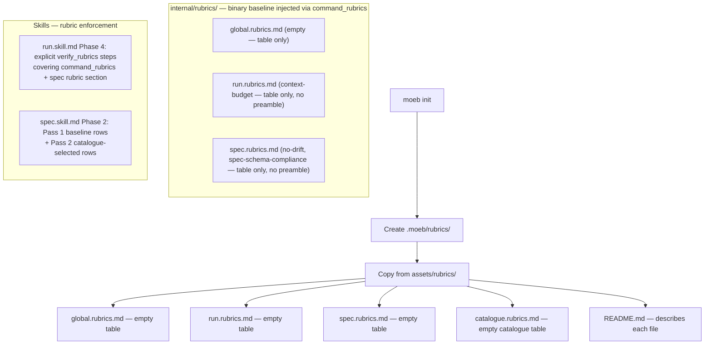

# Rubric Templates, Init Copy, Consistent Naming, and Skill-Based Enforcement

## Raw Requirement

The rubrics files currently created by moeb init as empty files in code should instead be copied from files in assets/rubrics. assets/rubrics should contain the template version of each rubric.md, so rubrics.catalogue.md, global.rubrics.md, run.rubrics.md, spec.rubrics.md. rubrics.catalogue.md does not follow the convention of other rubrics file names, make it consistent. The description for a rubric file ought to belong in a rubrics readme file, name this appropriately, add to assets and copy out on init, this should replace preamble in the files and leave just the table in each file. Enforcement of rubrics should be done as part of each workflow or skill that we currently have rather than relying purely on prompt text of spec and run

## Description

This specification makes four connected changes to the rubric system:

**1. Template files in `assets/rubrics/`.** Five new files are created under `src/moeb/assets/rubrics/`: template versions of `global.rubrics.md`, `run.rubrics.md`, `spec.rubrics.md`, `catalogue.rubrics.md` (each containing only a table header row with no criteria), and a `README.md` that describes the purpose and format of each rubric file. `moeb init` copies all five files into the new project's `.moeb/rubrics/` directory instead of hardcoding empty file creation.

**2. Consistent catalogue naming.** `rubrics.catalogue.md` is renamed to `catalogue.rubrics.md` to follow the established `{name}.rubrics.md` convention shared by `global.rubrics.md`, `run.rubrics.md`, and `spec.rubrics.md`. All references in source code, prompts, skill files, and harness documentation are updated.

**3. Preamble removal from internal rubric files.** The descriptive preamble paragraphs in `src/moeb/internal/rubrics/run.rubrics.md` and `src/moeb/internal/rubrics/spec.rubrics.md` are stripped; each file retains only its criteria table. The description of each rubric file's purpose now lives exclusively in the copied-out `README.md` asset.

**4. Skill-based rubric enforcement.** The `run.skill.md` Phase 4 and `spec.skill.md` Phase 2 are updated to include explicit rubric enforcement steps, so agents are instructed to verify rubric compliance as a formal workflow phase rather than relying solely on prompt-level instructions.

## Diagram



## Backlinks

### Parents

| Label | Path | Purpose |
|-------|------|---------|
| Declarative Specification Harness | README.md | Root harness index and governing policies |
| Moeb Init Rubric Storage Boundary | specifications/harness/harness.init-rubric-storage-boundary.md | Defined the init rubric creation pattern; this spec supersedes Decision 1 (empty files) with asset template copying |
| Rubric System Rationalisation: Five-Layer Model and Trait-Keyed Catalogue | specifications/harness/harness.rubric-index-rationalisation.md | Named the catalogue file `rubrics.catalogue.md`; this spec supersedes Decision 1 with the consistent `catalogue.rubrics.md` name |
| Agent Skills | specifications/moeb/moeb.agent-skills.md | Established the skill file loading pattern used here to extend run and spec skills |
| Rubric Context Layers: Binary-Bundled Baseline Criteria per Command Context | specifications/moeb/moeb.rubric-context-layers.md | Introduced binary-bundled internal rubric layers; this spec removes their preamble text |

### External

| Label | URL | Purpose |
|-------|-----|---------|

## Steps

### Step 1 — Create `src/moeb/assets/rubrics/README.md`

Create the file `src/moeb/assets/rubrics/README.md` with the following content:

```markdown
# Rubrics

This directory contains the project rubric files for this moeb-governed project. They
supplement the binary-bundled baseline criteria (injected automatically via
`{{command_rubrics}}`) to form the complete set of quality gates applied during `moeb run`
and `moeb spec` invocations.

## Files

### global.rubrics.md

Criteria that apply to every moeb command in this project (layer 3 in the five-layer
model). Add criteria here when they apply regardless of which command is being run.

### run.rubrics.md

Criteria that apply to every `moeb run` execution in this project (layer 4 for run).
Add build, test, and implementation quality gates here.

### spec.rubrics.md

Criteria that apply to every `moeb spec` invocation in this project (layer 4 for spec).
Add specification authoring quality gates here.

### catalogue.rubrics.md

A trait-keyed catalogue of conditionally applicable criteria (layer 5). Entries are not
auto-injected — the spec agent selects them based on traits detected in the specification
being authored.

Columns: `id`, `Name`, `Description`, `Threshold`, `Pass Condition`, `Domain`, `Traits`,
`Applies At`, `Status`. To retire a criterion, set `Status` to `superseded`; do not
delete rows.
```

### Step 2 — Create the four template rubric files in `src/moeb/assets/rubrics/`

Create each of the following four files. Each must contain only a table header row and separator row with no criteria rows.

**`src/moeb/assets/rubrics/global.rubrics.md`:**
```markdown
| Name | Description | Threshold | Pass Condition |
|------|-------------|-----------|----------------|
```

**`src/moeb/assets/rubrics/run.rubrics.md`:**
```markdown
| Name | Description | Threshold | Pass Condition |
|------|-------------|-----------|----------------|
```

**`src/moeb/assets/rubrics/spec.rubrics.md`:**
```markdown
| Name | Description | Threshold | Pass Condition |
|------|-------------|-----------|----------------|
```

**`src/moeb/assets/rubrics/catalogue.rubrics.md`:**
```markdown
| id | Name | Description | Threshold | Pass Condition | Domain | Traits | Applies At | Status |
|----|------|-------------|-----------|----------------|--------|--------|------------|--------|
```

### Step 3 — Update `src/moeb/src/commands/init.rs`

Read `src/moeb/src/commands/init.rs` in full.

Replace the two `fs::write` calls that create empty rubric files:

```rust
fs::write(rubrics_dst.join("global.rubrics.md"), b"")
    .context("Failed to create .moeb/rubrics/global.rubrics.md")?;
fs::write(rubrics_dst.join("rubrics.catalogue.md"), b"")
    .context("Failed to create .moeb/rubrics/rubrics.catalogue.md")?;
```

With a loop that copies all five rubric assets:

```rust
for name in &[
    "global.rubrics.md",
    "run.rubrics.md",
    "spec.rubrics.md",
    "catalogue.rubrics.md",
    "README.md",
] {
    copy_rubric_asset(name, &rubrics_dst)?;
}
```

Add the following helper function to the same file (alongside the existing `move_or_extract` and `ensure_gitignore` functions):

```rust
fn copy_rubric_asset(name: &str, dst: &Path) -> Result<()> {
    let key = format!("rubrics/{}", name);
    let asset = Assets::get(&key)
        .with_context(|| format!("Embedded rubric asset '{}' not found in binary", key))?;
    fs::write(dst.join(name), asset.data.as_ref())
        .with_context(|| format!("Failed to write rubric asset to {}", dst.join(name).display()))?;
    Ok(())
}
```

### Step 4 — Strip preamble from `src/moeb/internal/rubrics/run.rubrics.md`

Read `src/moeb/internal/rubrics/run.rubrics.md`.

Remove the heading `## Baseline run rubric criteria` and the paragraph beginning "The following criterion applies to every `moeb run` execution...". Retain only the criteria table. The file must begin with the `| Name |` header row.

After this step the file contains:

```markdown
| Name | Description | Threshold | Pass Condition |
|------|-------------|-----------|----------------|
| `context-budget` | All implementation files created or modified during this run are ≤ 300 lines; `*_tests.rs` companion files are ≤ 400 lines. If any file exceeds budget, refactor it before passing this criterion. | Zero over-budget files after any required refactoring | Agent checks line counts of every file written; refactors any over-budget file, then marks pass only after all files meet the budget |
```

### Step 5 — Strip preamble from `src/moeb/internal/rubrics/spec.rubrics.md`

Read `src/moeb/internal/rubrics/spec.rubrics.md`.

Remove the heading `## Baseline spec rubric criteria` and the paragraph beginning "The following criteria must appear in the `## Rubric / ### Structured` table...". Retain only the criteria table. The file must begin with the `| Name |` header row.

After this step the file contains:

```markdown
| Name | Description | Threshold | Pass Condition |
|------|-------------|-----------|----------------|
| `no-drift` | The specification does not violate any decision recorded in a linked parent specification | Zero contradictions | Manual review of every decision in every parent spec listed in Backlinks |
| `spec-schema-compliance` | All required frontmatter fields and body sections are present and correctly ordered | 100% of required fields and sections | Validation in `domain/spec.rs` exits 0 during `moeb spec` |
```

### Step 6 — Update the `RUBRICS_PATH` constant in `src/moeb/src/domain/spec.rs`

Read `src/moeb/src/domain/spec.rs` in full.

Change the constant:

```rust
const RUBRICS_PATH: &str = "rubrics/rubrics.catalogue.md";
```

to:

```rust
const RUBRICS_PATH: &str = "rubrics/catalogue.rubrics.md";
```

No other change to this file.

### Step 7 — Update the pre-loaded section label in `src/prompts/spec.prompt`

Read `src/prompts/spec.prompt` in full.

Change the pre-loaded section header:

```
=== rubrics/rubrics.catalogue.md ===
```

to:

```
=== rubrics/catalogue.rubrics.md ===
```

No other change to this file.

### Step 8 — Rename the project catalogue file

Rename `.moeb/rubrics/rubrics.catalogue.md` to `.moeb/rubrics/catalogue.rubrics.md`.

The file content is unchanged; only the filename changes. After this step `.moeb/rubrics/catalogue.rubrics.md` must exist and `.moeb/rubrics/rubrics.catalogue.md` must be absent.

### Step 9 — Update `.moeb/README.md`

Read `.moeb/README.md` in full.

In the rubric layer table under `## Specification requirements`, change the Layer 5 row:

```
| 5 · catalogue-selected | `.moeb/rubrics/rubrics.catalogue.md` | Specs whose traits match the entry |
```

to:

```
| 5 · catalogue-selected | `.moeb/rubrics/catalogue.rubrics.md` | Specs whose traits match the entry |
```

In the **Catalogue** paragraph immediately below the table, change `rubrics.catalogue.md` to `catalogue.rubrics.md` wherever it appears (both the bold label and any inline code references).

### Step 10 — Update `src/moeb/internal/skills/run.skill.md` for explicit rubric enforcement

Read `src/moeb/internal/skills/run.skill.md` in full.

Replace the existing `## Phase 4 — Verify` section with:

```markdown
## Phase 4 — Verify

Collect all rubric criteria from two sources:

1. The injected `{{command_rubrics}}` section (the combined baseline and project layers).
   Every row in this section is mandatory and must receive a verdict.
2. The specification's `## Rubric / ### Structured` table. Every row is mandatory.

For each criterion, evaluate pass, fail, or na:

- `context-budget`: Check the line count of every file written during this run. If any
  implementation file exceeds 300 lines, or any `*_tests.rs` companion file exceeds
  400 lines, refactor it to meet the budget before assigning a verdict. This criterion
  is never `na`.
- All other criteria: apply the stated Pass Condition. Mark `na` only when the criterion
  genuinely does not apply to this specification's scope.

Call `verify_rubrics` with the complete list of verdicts covering all criteria from both
sources. Do not call `verify_rubrics` with a partial list.
```

### Step 11 — Update `src/moeb/internal/skills/spec.skill.md` for explicit rubric enforcement

Read `src/moeb/internal/skills/spec.skill.md` in full.

In Phase 2 — Author, replace the line:

```
- For rubric criteria, copy any applicable standard criterion from `rubrics.index.md`
  verbatim (id as the Name value). Add spec-specific criteria as additional rows.
```

with:

```
- For the `## Rubric / ### Structured` table, apply criteria in two passes:

  **Pass 1 — baseline rows (mandatory):**
  Copy every row from the injected `{{command_rubrics}}` section verbatim into the
  `## Rubric / ### Structured` table. These rows are mandatory in every specification.

  **Pass 2 — catalogue-selected rows (trait-driven):**
  Read the `catalogue.rubrics.md` section pre-loaded above. Filter by Domain to match
  the domain of the specification being authored, then identify traits present in the
  raw requirement and description. For each matching catalogue entry:
  - If `Applies At` contains `run`, `All`, or any command other than `spec`: copy the
    criterion row verbatim into the `## Rubric / ### Structured` table.
  - If `Applies At` contains `spec` or `All`: verify this criterion against the
    specification you are authoring before marking it complete. Do not copy it into
    the rubric table.
```

In Phase 3 — Validate before output, add the following bullet to the checklist:

```
- The `## Rubric / ### Structured` table contains at minimum every row copied from the
  `{{command_rubrics}}` baseline (Pass 1 above).
```

### Step 12 — Verify

Run `cargo build --release` — must exit 0 with zero errors.

Run `cargo test` — must exit 0 with zero failures.

Confirm template assets are embedded and begin with a table row:
- `Assets::get("rubrics/global.rubrics.md")` is `Some`
- `Assets::get("rubrics/run.rubrics.md")` is `Some`
- `Assets::get("rubrics/spec.rubrics.md")` is `Some`
- `Assets::get("rubrics/catalogue.rubrics.md")` is `Some`
- `Assets::get("rubrics/README.md")` is `Some`

Confirm preamble removal:
- First non-empty line of `src/moeb/internal/rubrics/run.rubrics.md` begins with `|`
- First non-empty line of `src/moeb/internal/rubrics/spec.rubrics.md` begins with `|`

Confirm catalogue rename:
- `.moeb/rubrics/catalogue.rubrics.md` exists
- `.moeb/rubrics/rubrics.catalogue.md` is absent
- `grep -c "catalogue.rubrics.md" src/moeb/src/domain/spec.rs` returns ≥ 1
- `grep -c "rubrics.catalogue.md" src/moeb/src/domain/spec.rs` returns 0
- `grep -c "catalogue.rubrics.md" src/prompts/spec.prompt` returns ≥ 1

Confirm init copies from assets:
- `grep -c "copy_rubric_asset" src/moeb/src/commands/init.rs` returns ≥ 1
- `grep -c "fs::write.*rubrics" src/moeb/src/commands/init.rs` returns 0

## Decisions

### Decision 1 — Template files rather than empty files on `moeb init`

`moeb init` copies template files from `assets/rubrics/` into the project's `.moeb/rubrics/` directory. Templates contain only table headers with no criteria rows, giving new projects a correct table structure ready to fill in.

**Supersedes:** Decision 1 of `specifications/harness/harness.init-rubric-storage-boundary.md` ("moeb init creates empty project rubric files by default").

**Rationale:** Empty files created by hardcoded `fs::write(…, b"")` calls have no structure. A developer opening `global.rubrics.md` after init sees a blank file with no indication of the expected format. Template files with table headers make the expected format immediately apparent without requiring the developer to read external documentation. The pattern is consistent with how `README.md` is already handled — extracted from a bundled asset rather than hardcoded in `init.rs`.

**Alternatives considered:**

| Option | Reason Rejected |
|--------|-----------------|
| Keep empty file creation via hardcoded `fs::write` | No structural hint for new users; format must be discovered from documentation or existing project examples |
| Populate templates with starter criteria | Introduces opinionated defaults that vary across project types; contradicts the principle that projects own their own criteria |

**Consequences:** The `assets/rubrics/` directory now contains project-layer template files. `moeb init` retrieves them via `Assets::get`, the same mechanism used for `README.md`. Any future project-layer rubric file must have a corresponding template in `assets/rubrics/`.

---

### Decision 2 — Rename `rubrics.catalogue.md` to `catalogue.rubrics.md`

The catalogue file is renamed to `catalogue.rubrics.md` to follow the `{name}.rubrics.md` convention.

**Supersedes:** Decision 1 of `specifications/harness/harness.rubric-index-rationalisation.md` ("Rename `rubrics.index.md` to `rubrics.catalogue.md`"), which chose a name that inverted the established convention.

**Rationale:** The three other project rubric files (`global.rubrics.md`, `run.rubrics.md`, `spec.rubrics.md`) all follow the `{qualifier}.rubrics.md` pattern — the qualifier identifies the scope and `.rubrics.md` is the shared type suffix. `rubrics.catalogue.md` inverts this with `.rubrics` as a qualifier, making the file look like it describes the rubric system rather than being part of it. `catalogue.rubrics.md` is consistent with its siblings, sorts alphabetically alongside them, and makes the naming convention immediately learnable.

**Alternatives considered:**

| Option | Reason Rejected |
|--------|-----------------|
| Keep `rubrics.catalogue.md` | Inconsistent with the three sibling files; `.rubrics` as qualifier implies a different namespace from the data files |
| Use `index.rubrics.md` | "Index" implies exhaustive enumeration always in scope; the file is a conditional selection source |

**Consequences:** All references to `rubrics.catalogue.md` in source code (`spec.rs` constant), prompt templates (`spec.prompt`), skill files (`spec.skill.md`), harness README, and the project rubric directory must be updated. The previous name must be absent after this change.

---

### Decision 3 — Rubric files contain only tables; descriptions live in `assets/rubrics/README.md`

The preamble paragraphs in `internal/rubrics/run.rubrics.md` and `internal/rubrics/spec.rubrics.md` are removed. Each rubric file (both binary-bundled and project copies) begins with its table header row.

**Rationale:** Rubric files are data — tables of criteria consumed by agents and humans alike. The preamble paragraphs in the internal files are instructional text that tells the agent what to DO with the table, not what is IN it. Mixing instructional prose with data creates two problems: data cannot be processed cleanly without parsing around prose, and instructions buried in a data file are hard to find and update independently. Instructions for how to apply rubrics belong in skill files (see Decision 4). Descriptions of what each file is for belong in a `README.md` copied alongside the files into the project.

**Alternatives considered:**

| Option | Reason Rejected |
|--------|-----------------|
| Keep preamble in internal rubric files | Mixes data and instruction; enforcement can silently duplicate or diverge between the preamble and the skill |
| Remove preamble but add no README | No documentation for human authors setting up a new project |

**Consequences:** Agents reading injected rubric content via `{{command_rubrics}}` receive only the criteria table rows. All enforcement instructions must come from skill files. The `assets/rubrics/README.md` serves as the human-readable reference for each file's purpose and is copied into the project on init.

---

### Decision 4 — Rubric enforcement is a formal skill phase, not solely a prompt instruction

`run.skill.md` Phase 4 and `spec.skill.md` Phase 2 are updated with explicit rubric enforcement steps covering all rubric sources. The existing rubric instructions in the prompt templates are retained as redundant safety nets.

**Rationale:** Skill files define the agent's explicit workflow phases; an agent executing the skill follows each phase in sequence. A Phase 4 that explicitly names both rubric sources (`{{command_rubrics}}` and the spec's own `## Rubric` section) and mandates a complete `verify_rubrics` call before the run is considered done creates a formal, auditable enforcement checkpoint. The current Phase 4 only references the spec's `## Rubric` section, silently omitting the injected `{{command_rubrics}}` criteria. Prompt-level HARD RULE 5 compensates for this gap but is a safety net rather than a first-class workflow step. Skills are the right place for workflow logic.

**Alternatives considered:**

| Option | Reason Rejected |
|--------|-----------------|
| Remove HARD RULE 5 from `run.prompt` and rely solely on the skill | Defense in depth is preferable; the prompt instruction and skill phase are complementary, not mutually exclusive |
| Strengthen prompt instructions only; leave skills unchanged | Skills are the agent's primary workflow document; enforcement that appears only in the prompt is less visible when the agent is mid-execution |

**Consequences:** Any project-local override of `run.skill.md` or `spec.skill.md` must preserve the rubric enforcement phase to maintain compliance with the rubric verification contract. The skill is now the primary source of rubric enforcement logic; the prompt is the secondary safety net.

## Rubric

### Structured

| Name | Description | Threshold | Pass Condition |
|------|-------------|-----------|----------------|
| `no-drift` | The specification does not violate any decision recorded in a linked parent specification | Zero contradictions | Manual review of every decision in every parent spec listed in Backlinks |
| `spec-schema-compliance` | All required frontmatter fields and body sections are present and correctly ordered | 100% of required fields and sections | Validation in `domain/spec.rs` exits 0 during `moeb spec` |
| `binary-builds` | `cargo build --release` exits 0 | Zero errors | CI build exits 0 |
| `all-tests-pass` | `cargo test` exits 0 | Zero failures | `cargo test` exits 0 |
| `no-test-regression` | All existing tests pass without modification | Zero failures | `cargo test` exits 0; no test file edited |
| `assets-rubrics-templates-present` | `assets/rubrics/` contains all five template files, each beginning with a `\|` table row | Five files present with correct content | File existence checks and head-line confirmation |
| `init-copies-from-assets` | `init.rs` uses `copy_rubric_asset` (or equivalent `Assets::get` calls) for all rubric files; no `fs::write(…, b"")` for rubric paths remains | Asset-based copy confirmed | Code review of `init.rs` |
| `catalogue-renamed-consistently` | `catalogue.rubrics.md` is used everywhere; `rubrics.catalogue.md` is absent from source, prompts, skills, and project files | Old name absent; new name present in all references | grep and file-existence checks confirm |
| `preamble-stripped` | `internal/rubrics/run.rubrics.md` and `internal/rubrics/spec.rubrics.md` each begin with a `\|` header row | Both files start with `\|` | `head -1` on each file |
| `skill-rubric-enforcement` | `run.skill.md` Phase 4 explicitly covers both `{{command_rubrics}}` and the spec's `## Rubric` section; `spec.skill.md` Phase 2 contains Pass 1/Pass 2 rubric authoring steps and Phase 3 checks baseline row completeness | Both skill phases updated with rubric enforcement content | Manual review of both skill files |

### Qualitative

| Name | Description |
|------|-------------|
| Template usability | A developer running `moeb init` in a new project should open any of the five rubric files and immediately understand the expected table format without reading external documentation. |
| Skill coherence | An agent following `run.skill.md` or `spec.skill.md` step-by-step should reach rubric verification as a named workflow phase with unambiguous instructions on which criteria to collect and how to call `verify_rubrics`. |
| README completeness | A developer reading `assets/rubrics/README.md` should understand the purpose of every file in `.moeb/rubrics/` and the difference between the five-layer auto-injected model and the agent-driven catalogue selection without consulting any other document. |
