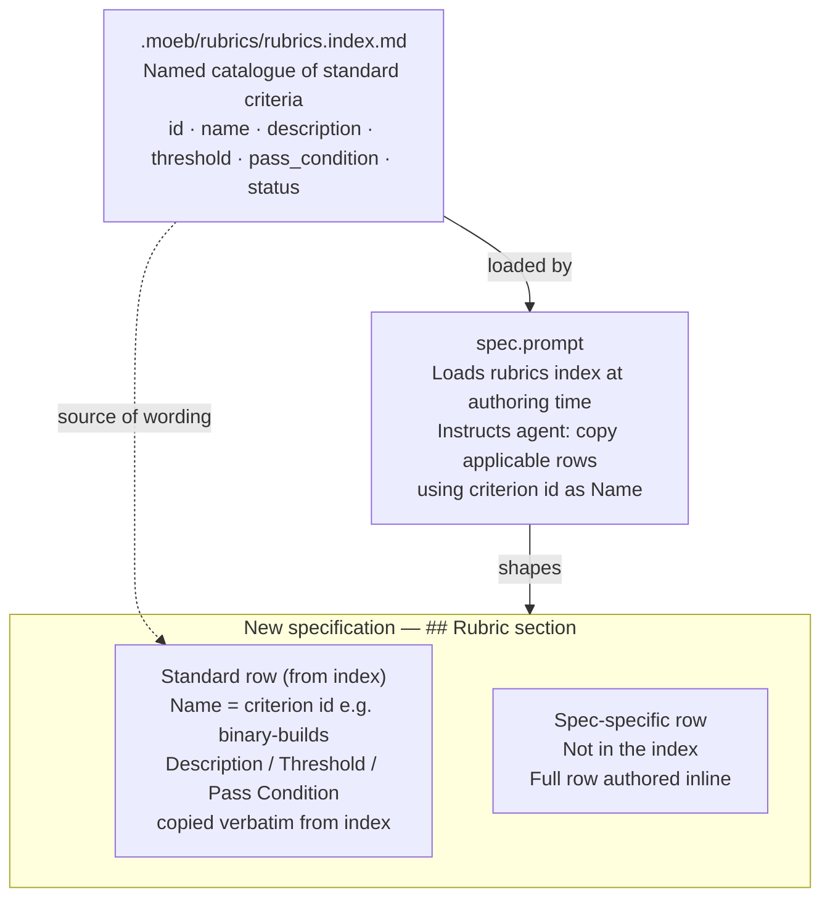

# Rubrics Index

## Raw Requirement

> We could maintain a separate rubrics index with an active/draft/superseded state?
> The index should contain a table of rubrics, specifications should likewise still
> contain their rubrics section but may want to re-use from the index.

## Description

Standard rubric criteria — `cargo build --release` passes, `cargo test` passes, no
existing test regression — appear across nearly every moeb specification but are
re-enumerated from scratch in each one. This creates drift: wording diverges between
specs, thresholds shift informally, and a criterion can be silently omitted from a new
spec without any check catching the gap.

A standalone harness document, `.moeb/rubrics/rubrics.index.md`, is introduced as a
named catalogue of standard criteria. Each entry carries an `id`, a name, description,
threshold, pass condition, and a `status` field (`active`, `draft`, `superseded`).
Entries can be retired by marking them superseded without touching spec files.

Specification files retain their required `## Rubric` section. When a standard named
criterion applies, the spec includes it by copying the row from the index verbatim and
using the criterion `id` as the Name column value. This keeps each spec self-contained
and readable without the index, while ensuring consistent wording for shared criteria.
The `spec.prompt` is updated to load the index and instruct the agent to apply this
pattern.

The rubrics index is a mutable harness document — not a specification — and is not
governed by the immutability policy. It evolves as the project's quality expectations
evolve.

## Diagram



## Backlinks

### Parents

| Label | Path | Purpose |
|-------|------|---------|
| Declarative Specification Harness | [specifications/harness/harness.base-harness.md](specifications/harness/harness.base-harness.md) | Established the `## Rubric` section as a required part of every specification; this spec standardises the content of shared criteria within that section |
| Registration at Creation | [specifications/harness/harness.registration-at-creation.md](specifications/harness/harness.registration-at-creation.md) | Governs how harness documents are introduced; the rubrics index is a harness document, not a specification, and is exempt from immutability |
| README | [README.md](../../README.md) | Root index |

### External

*(none)*

## Steps

### Step 1 — Create `.moeb/rubrics/rubrics.index.md`

Create the directory `.moeb/rubrics/` and the file `.moeb/rubrics/rubrics.index.md` with
the following content. This file is a mutable harness document; it is not a specification
and is not subject to the immutability policy.

```markdown
# Rubrics Index

A catalogue of named standard rubric criteria. Specifications that apply a criterion
should copy its row verbatim into their `## Rubric / ### Structured` table and use the
criterion `id` as the Name column value.

To retire a criterion, set its `status` to `superseded` and add a note in the
description identifying the criterion that replaces it. Do not delete rows.

## Criteria

| id | Name | Description | Threshold | Pass Condition | Status |
|----|------|-------------|-----------|----------------|--------|
| `binary-builds` | Binary builds cleanly | `cargo build --release` completes without error | Zero errors | CI build exits 0 | active |
| `all-tests-pass` | All unit tests pass | `cargo test` completes without failure | Zero failures | `cargo test` exits 0 | active |
| `no-test-regression` | No existing test regression | All tests present before this change pass without modification to test code | Zero failures | `cargo test` exits 0; no test file edited | active |
| `no-drift` | No contradiction with parent specs | The implementation does not violate any decision recorded in a linked parent specification | Zero contradictions | Manual review of every decision in every parent spec listed in Backlinks | active |
| `spec-schema-compliance` | Spec conforms to schema | All required frontmatter fields and body sections are present and correctly ordered | 100% of required fields and sections | Validation in `domain/spec.rs` exits 0 during `moeb spec` | active |
| `adapter-structural-parity` | Adapter implementations are structurally identical | `AnthropicAdapter::send` and `OpenAiAdapter::send` follow the same retry loop skeleton; only API-specific serialisation differs | Identical structure | Code review of both adapter files side-by-side finds no structural asymmetry | active |
```

### Step 2 — Update README to mention the rubrics index

In `.moeb/README.md`, under `## Specification requirements`, append the following
paragraph after the **Supersedes** paragraph:

> **Rubrics.** A catalogue of named standard rubric criteria is maintained at
> [`.moeb/rubrics/rubrics.index.md`](./rubrics/rubrics.index.md). Specifications must
> include their own `## Rubric` section. Where a standard named criterion from the
> catalogue applies, its row should be copied verbatim into the spec's structured rubric
> table with the criterion `id` as the Name value. Criteria specific to the spec are
> listed as additional rows. The rubrics index is a mutable harness document and is not
> subject to the immutability policy.

### Step 3 — Update `spec.prompt` to load and apply the rubrics index

In `src/prompts/spec.prompt`, make the following changes:

1. **Load the index as context.** Add a step before the authoring instructions that
   reads `.moeb/rubrics/rubrics.index.md` and presents its contents to the agent. This
   can be prepended to the prompt template using the existing `{{...}}` token mechanism,
   or added as an explicit instruction to call `read_file` on
   `.moeb/rubrics/rubrics.index.md` before beginning the rubric section.

2. **Add authoring instructions for the rubric section.** In the section that describes
   how to author `## Rubric / ### Structured`, add:

   > For each criterion in the rubrics index whose `status` is `active`, evaluate whether
   > it applies to this specification. If it does, copy the row verbatim from the index
   > and use the criterion `id` (e.g. `binary-builds`) as the Name column value. Add any
   > spec-specific criteria as additional rows beneath the standard ones. Do not omit a
   > standard criterion that applies without explicit justification.

3. **Add a note about the qualitative section.** State that the `### Qualitative` section
   is always spec-specific and is never drawn from the index.

### Step 4 — Verify

Confirm that `.moeb/rubrics/rubrics.index.md` exists and contains the six seeded criteria.
Confirm that the README `## Specification requirements` section references the rubrics
index. Confirm that `spec.prompt` instructs the agent to consult and apply the index.
No kernel code changes are required by this specification; `cargo build` and `cargo test`
are expected to pass without modification.

## Decisions

### Decision 1 — The rubrics index is a standalone harness document, not a specification

**Rationale:** Rubric criteria are a shared quality checklist. Governing each criterion
through the full spec machinery — with immutability, decisions, diagrams, and backlinks —
adds process overhead disproportionate to the scope of a checklist entry. A mutable
catalogue allows criteria to be added, revised, and retired without authoring a new
specification for each change.

**Alternatives:**

| Option | Reason Rejected |
|--------|-----------------|
| Each criterion is a full specification in a `rubrics/` domain | Correct governance overhead for architectural decisions; excessive for shared test criteria |
| Criteria embedded in `spec-schema.yaml` | Schema describes structure, not quality gates; conflates two distinct concerns |
| No shared catalogue; each spec re-enumerates freely | Current state; permits wording drift and silent omissions |

**Consequences:** The rubrics index is not subject to the immutability policy. It can be
edited directly to add, revise, or supersede criteria. Changes to the index do not require
a new specification, but significant changes (e.g. retiring a widely-used criterion)
should be noted in a commit message for traceability.

---

### Decision 2 — Specs copy rows verbatim from the index; they do not reference by ID alone

**Rationale:** A spec that lists only an ID (e.g. `binary-builds`) in its rubric section
is not self-contained — a reader must consult the index to understand the criterion. Specs
are the primary unit of governance and must be readable and actionable without cross-
referencing other documents. Copying the row verbatim preserves self-containment while
using the ID as the Name column creates a machine-readable link to the index entry.

**Alternatives:**

| Option | Reason Rejected |
|--------|-----------------|
| Reference by ID only, omit description and threshold | Spec becomes unreadable without the index; reviewing a spec in isolation loses the acceptance gate |
| Repeat the full row without the ID | No machine-readable link between spec row and index entry; wording drift cannot be detected |
| Embed the index content directly in each spec via a template | Couples spec content to the index version at authoring time; makes updates to the index invisible in existing specs |

**Consequences:** When an index criterion's wording is updated, existing specs that
copied the old wording are not automatically updated (they are immutable). This is
acceptable: the old spec's rubric governed the work it described at the time it was
written. Future specs will use the updated wording.

---

### Decision 3 — The index carries a `status` field per criterion mirroring spec status values

**Rationale:** Criteria need a lifecycle parallel to specs. A criterion that is no longer
applicable (e.g. `adapter-structural-parity` if both adapters are merged) should be
retirable without deletion, preserving the historical record. Using the same three values
(`active`, `draft`, `superseded`) as spec status is consistent and requires no new
vocabulary.

**Alternatives:**

| Option | Reason Rejected |
|--------|-----------------|
| Delete retired criteria | Destroys historical record; specs that referenced the criterion lose their audit trail |
| No status field; criteria are permanent | Cannot signal that a criterion no longer applies without editing every spec that referenced it |

**Consequences:** When retiring a criterion, set its status to `superseded` and add a
note identifying the replacement (if any). The `spec.prompt` instruction to copy only
`active` criteria ensures newly authored specs do not inherit retired criteria.

---

### Decision 4 — `spec.prompt` loads the index as live context, not as a static template token

**Rationale:** The index will evolve over the lifetime of the project. Embedding its
content as a static token in the prompt template would require a binary release to pick
up index changes. Loading it as a live file read at prompt construction time (or via an
instruction to the agent to `read_file` it) ensures newly authored specs always see the
current index without a kernel change.

**Alternatives:**

| Option | Reason Rejected |
|--------|-----------------|
| Embed index content as a `{{rubrics_index}}` template token | Requires kernel change on every index update; defeats the purpose of a mutable catalogue |
| No prompt integration; rely on agent reading the index independently | Agent may omit the index read; inconsistent rubric coverage across specs |

**Consequences:** The `spec.prompt` must either pre-load the index via a template token
resolved at prompt-construction time in `domain/spec.rs`, or instruct the agent to call
`read_file` on `.moeb/rubrics/rubrics.index.md` as one of its first actions. Either
implementation satisfies this decision; the choice is left to the implementer based on
whichever requires fewer changes to the existing prompt infrastructure.

## Rubric

### Structured

| Name | Description | Threshold | Pass Condition |
|------|-------------|-----------|----------------|
| `no-drift` | No contradiction with parent specs | Implementation does not violate any decision in a linked parent spec | Manual review of every decision in every parent spec listed in Backlinks |
| Index file created | `.moeb/rubrics/rubrics.index.md` exists with all six seeded criteria | Six rows present, each with all six columns populated | File read confirms presence and column count |
| All seeded criteria are `active` | No seeded criterion carries `draft` or `superseded` status at initial creation | Six active entries | Manual review of the Status column |
| README references rubrics index | The Specification requirements section contains a Rubrics paragraph linking to the index | Paragraph present | Manual review of README |
| `spec.prompt` instructs agent to consult index | The prompt contains an instruction to read and apply rubrics.index.md when authoring the Rubric section | Instruction present | Manual review of spec.prompt |

### Qualitative

- **Index readability without tooling:** The rubrics index must be readable and actionable by a human or agent with no tooling beyond a markdown viewer. Column headers must be clear; the `id` column must be obviously the value to use as the Name in a spec's rubric table.
- **Criteria are specific enough to fail:** Each criterion's pass condition must be unambiguous — a reviewer must be able to determine pass or fail without subjective judgement. Criteria that cannot be objectively evaluated belong in the Qualitative section of the spec's rubric, not in the index.
- **No duplicate coverage:** The seeded criteria must not overlap in what they test. `all-tests-pass` and `no-test-regression` are distinct: the former confirms the test suite is green; the latter confirms no pre-existing test was modified to make it green.
