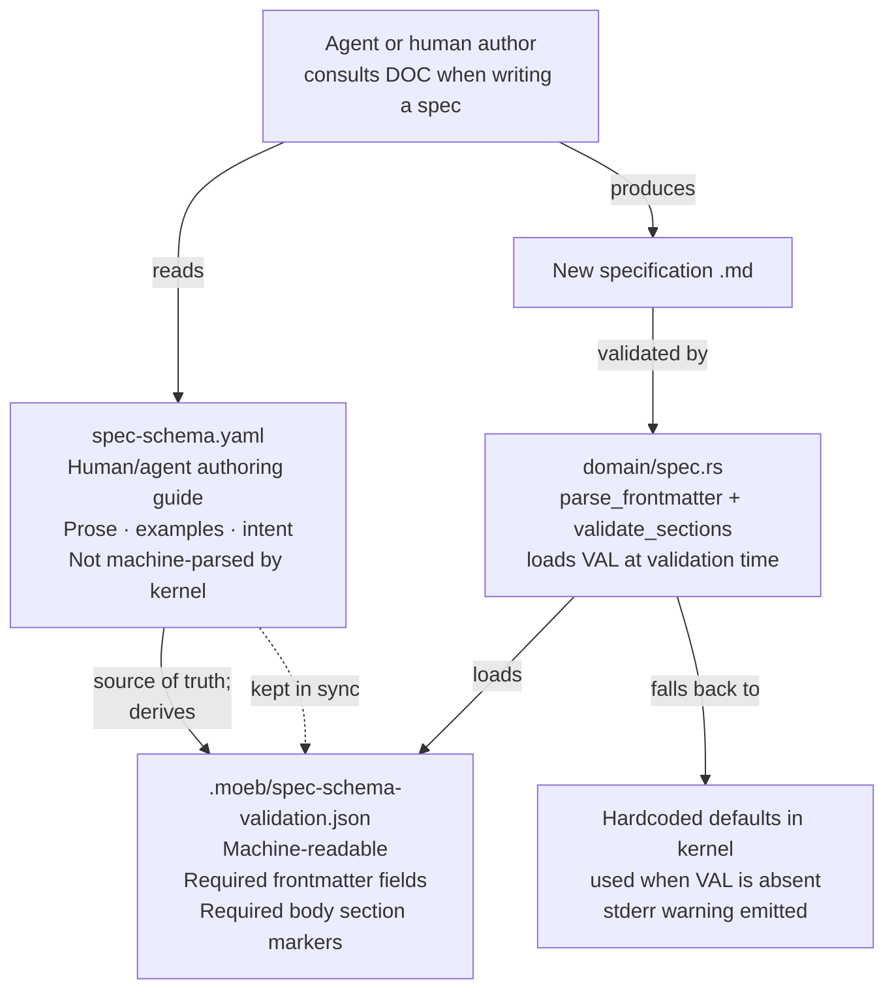

# Schema Split: Documentation and Validation

## Raw Requirement

> Would we benefit from having two copies, one for prompting, one for validation (these
> should be kept in step / the validation only schema derived from the documentation /
> prompt version)?

## Description

`spec-schema.yaml` currently serves two purposes that have different audiences and
different stability requirements. As an authoring guide it is read by agents and humans
and needs prose, examples, and explanatory comments. As a validation source it needs
exact field names, required flags, and section markers — but no prose.

The two purposes are separated into two files:

- **`spec-schema.yaml`** remains the human/agent authoring guide. Prose, intent, and
  examples stay here. This file is not machine-parsed by the kernel.
- **`spec-schema-validation.json`** is a new, compact JSON file derived from the
  documentation schema. It carries only what the kernel needs to validate a specification:
  required and optional frontmatter field names, and the ordered list of required body
  section markers. The kernel loads this file at validation time.

JSON is chosen for the validation schema because `serde_json` is already a kernel
dependency; no new crate is required. When the validation schema file is absent the
kernel falls back to its current hardcoded defaults and emits a stderr warning, preserving
behaviour in partially-initialised environments.

Both files must be updated in the same authoring action whenever the schema changes. The
documentation schema is the source of truth; the validation schema is derived from it.

## Diagram



## Backlinks

### Parents

| Label | Path | Purpose |
|-------|------|---------|
| Declarative Specification Harness | [specifications/harness/harness.base-harness.md](specifications/harness/harness.base-harness.md) | Established `spec-schema.yaml` as the canonical schema reference; this spec splits that file's responsibilities |
| Spec Command Output Enforcement and File Persistence | [specifications/moeb/moeb.spec-output-enforcement.md](specifications/moeb/moeb.spec-output-enforcement.md) | Introduced `REQUIRED_SECTIONS` and `parse_frontmatter` in `domain/spec.rs`; this spec replaces the hardcoded constants with values loaded from the validation schema |
| Specification Status Field | [specifications/harness/harness.spec-status.md](specifications/harness/harness.spec-status.md) | Added `status` as a required frontmatter field; the validation schema must include it in `frontmatter.required` |
| Formal Supersedes Field | [specifications/harness/harness.supersedes-field.md](specifications/harness/harness.supersedes-field.md) | Added `supersedes` as an optional frontmatter field; the validation schema must include it in `frontmatter.optional` |
| README | [README.md](../../README.md) | Root index |

### External

*(none)*

## Steps

### Step 1 — Create `.moeb/spec-schema-validation.json`

Create the file `.moeb/spec-schema-validation.json` with the following content. This is
the machine-readable schema derived from `spec-schema.yaml`. It encodes exactly what the
kernel validates — no more, no less.

```json
{
  "frontmatter": {
    "required": ["domain", "slug", "status"],
    "optional": ["supersedes"]
  },
  "body": {
    "required_sections": [
      "# ",
      "## Raw Requirement",
      "## Description",
      "```mermaid",
      "## Backlinks",
      "## Steps",
      "## Decisions",
      "## Rubric"
    ]
  }
}
```

This file lives inside `.moeb/` (harness meta-layer). It is never placed under `src/`.

### Step 2 — Add `ValidationSchema` structs to `domain/spec.rs`

In `src/moeb/src/domain/spec.rs`, add the following structs and loader function. Place
them after the existing `const` declarations and before `SpecService`:

```rust
#[derive(serde::Deserialize)]
struct ValidationSchema {
    frontmatter: FrontmatterSchema,
    body: BodySchema,
}

#[derive(serde::Deserialize)]
struct FrontmatterSchema {
    required: Vec<String>,
    #[serde(default)]
    optional: Vec<String>,
}

#[derive(serde::Deserialize)]
struct BodySchema {
    required_sections: Vec<String>,
}

fn load_validation_schema(working_dir: &Path) -> Option<ValidationSchema> {
    let path = working_dir.join("spec-schema-validation.json");
    match fs::read_to_string(&path) {
        Ok(content) => match serde_json::from_str::<ValidationSchema>(&content) {
            Ok(schema) => Some(schema),
            Err(e) => {
                eprintln!(
                    "[moeb] warning: spec-schema-validation.json is malformed ({}); \
                     falling back to built-in validation rules.",
                    e
                );
                None
            }
        },
        Err(_) => {
            eprintln!(
                "[moeb] warning: spec-schema-validation.json not found in {:?}; \
                 falling back to built-in validation rules.",
                working_dir
            );
            None
        }
    }
}
```

### Step 3 — Replace the hardcoded `REQUIRED_SECTIONS` with schema-driven section validation

`validate_sections` currently iterates `REQUIRED_SECTIONS`, a hardcoded `const &[&str]`.
Replace it with a function that accepts a slice:

```rust
fn validate_sections(body: &str, required: &[impl AsRef<str>]) -> Result<()> {
    let mut remaining = required.iter().peekable();

    for line in body.lines() {
        let Some(expected) = remaining.peek() else {
            break;
        };
        if line.trim_start().starts_with(expected.as_ref()) {
            remaining.next();
        }
    }

    if let Some(missing) = remaining.peek() {
        bail!(
            "Required section missing or out of order: '{}'",
            missing.as_ref()
        );
    }

    Ok(())
}
```

Update `run_in` to load the validation schema and pass the appropriate section list:

```rust
let schema = load_validation_schema(working_dir);
let required_sections: Vec<String> = schema
    .as_ref()
    .map(|s| s.body.required_sections.clone())
    .unwrap_or_else(|| {
        REQUIRED_SECTIONS
            .iter()
            .map(|s| s.to_string())
            .collect()
    });

// ... (existing agent loop call) ...

let result = parse_frontmatter(&raw)
    .and_then(|(domain, slug, status, supersedes, body)| {
        validate_sections(&body, &required_sections)?;
        Ok((domain, slug, status, supersedes, body))
    });
```

Keep `REQUIRED_SECTIONS` as the fallback constant — do not remove it.

### Step 4 — Add schema-driven required-field presence check to `parse_frontmatter`

After the existing per-field parsing in `parse_frontmatter`, add a presence check driven
by the schema. Because `parse_frontmatter` does not currently receive `working_dir`, pass
the loaded `schema` as an optional parameter, or perform the check in `run_in` after
calling `parse_frontmatter`. The latter is simpler and avoids changing the function
signature further.

In `run_in`, after the `parse_frontmatter` call succeeds and before writing the file,
verify that all fields listed in `schema.frontmatter.required` were parsed to non-empty
values. The current required fields (`domain`, `slug`, `status`) are already individually
validated inside `parse_frontmatter`; this step is a forward-compatibility guard so that
any new required field added to the JSON schema is caught without a kernel code change.

```rust
// Forward-compatibility check: verify all schema-required frontmatter fields are present.
// Current fields are already validated individually; this catches future additions.
if let Some(ref s) = schema {
    let found_fields: std::collections::HashSet<&str> =
        ["domain", "slug", "status"].iter().copied().collect();
    for required_field in &s.frontmatter.required {
        if !found_fields.contains(required_field.as_str()) {
            eprintln!(
                "[moeb] warning: schema requires frontmatter field '{}' \
                 but the kernel has no parser for it yet.",
                required_field
            );
        }
    }
}
```

This logs a warning rather than failing — adding a new required field to the JSON schema
without updating the parser should surface as a warning, not silently pass or hard-fail.

### Step 5 — Update README to document the two-schema policy

In `.moeb/README.md`, under `## Specification requirements`, update the **Schema**
paragraph to read:

> **Schema.** Every specification must be authored according to the structure defined in
> [`spec-schema.yaml`](./spec-schema.yaml). No field defined as required in the schema
> may be omitted. A derived machine-readable validation schema is maintained at
> [`spec-schema-validation.json`](./spec-schema-validation.json); both files must be
> updated in the same authoring action whenever the schema changes. `spec-schema.yaml`
> is the source of truth; `spec-schema-validation.json` is derived from it.

### Step 6 — Update `spec.prompt` to reference both schema files

In `src/prompts/spec.prompt`, update the section that references the schema. State that:

- The agent must consult `spec-schema.yaml` when authoring a specification (for prose
  guidance, examples, and intent).
- The kernel validates against `spec-schema-validation.json`; the agent must not attempt
  to modify this file.
- When asked to update the schema (e.g. to add a new required section), the agent must
  update both files in the same run.

### Step 7 — Verify

Run `cargo build --release` and confirm zero compilation errors. Run `cargo test` and
confirm all existing tests pass. Verify manually that:

1. With `spec-schema-validation.json` present, a valid spec passes validation.
2. With `spec-schema-validation.json` present, a spec missing `## Rubric` is rejected
   with an error referencing `## Rubric`.
3. With `spec-schema-validation.json` absent (renamed temporarily), validation proceeds
   using hardcoded defaults and a warning is emitted to stderr.

## Decisions

### Decision 1 — Validation schema is JSON, not YAML

**Rationale:** `serde_json` is already a kernel dependency. Parsing JSON requires no
new crate. `serde_yaml` would add a dependency for a non-critical use case where the
quality difference is negligible. JSON also has stricter syntax, making malformed files
easier to diagnose.

**Alternatives:**

| Option | Reason Rejected |
|--------|-----------------|
| YAML validation schema (`serde_yaml`) | Adds a dependency for marginal benefit; JSON serves the same structural purpose |
| TOML validation schema (`toml` already present) | TOML is less natural for lists-of-strings; JSON maps directly to the `Vec<String>` types already used |
| Hardcoded Rust struct with no external file | Removes the ability to update validation rules without a binary release |

**Consequences:** The validation schema file is `.moeb/spec-schema-validation.json`.
Any tooling that reads the schema for purposes other than kernel validation must handle
JSON. The documentation schema remains YAML for human readability.

---

### Decision 2 — Fall back to hardcoded defaults when the validation schema is absent

**Rationale:** The kernel must not break in environments where `.moeb/` is partially
initialised — for example, immediately after `moeb init` before all harness files are
in place. A graceful fallback with a stderr warning preserves operability while alerting
the user to the missing file.

**Alternatives:**

| Option | Reason Rejected |
|--------|-----------------|
| Hard-fail if the validation schema is absent | Breaks `moeb spec` in a partially initialised environment; too aggressive |
| Silently use hardcoded defaults with no warning | Hides the missing file; user cannot distinguish "file absent" from "schema loaded" |

**Consequences:** The hardcoded `REQUIRED_SECTIONS` constant is retained as the fallback.
It must be kept in sync with `spec-schema-validation.json` manually. This is a known
maintenance cost, accepted as preferable to hard-failing.

---

### Decision 3 — Documentation schema is the source of truth; validation schema is derived

**Rationale:** The documentation schema is the canonical reference for what a
specification must contain. It is the file that agents and humans read. If the two files
diverge, the documentation schema represents intent; the validation schema is wrong.
Reversing this would mean agents are guided by a prose document that does not govern
validation, which is equally confusing but in a less discoverable direction.

**Alternatives:**

| Option | Reason Rejected |
|--------|-----------------|
| Validation schema is authoritative; documentation schema is derived | Agents would be authored against one schema while the kernel validates against another with no clear canonical version |
| Both schemas are peers with no defined precedence | Any divergence becomes unresolvable without human arbitration |

**Consequences:** When the schemas diverge, the documentation schema is correct by
definition. The validation schema must be updated to match. The README policy and
`spec.prompt` both state this explicitly.

---

### Decision 4 — Section validation is fully dynamic; frontmatter field validation is a presence check with per-field parsing retained

**Rationale:** Section markers are strings that can be trivially externalised — the
validation logic is `line.starts_with(marker)` regardless of the marker value. Frontmatter
field parsing is different: each field has semantic meaning (`domain` drives the output
path, `status` is validated against an enumeration). Making field parsing fully dynamic
would require the kernel to understand arbitrary field semantics from the schema, which
is far beyond the scope of this specification. The presence check (forward-compatibility
guard) is a lightweight bridge: it warns when the JSON schema lists a field the kernel
has no parser for, without requiring the kernel to handle it blindly.

**Alternatives:**

| Option | Reason Rejected |
|--------|-----------------|
| Fully dynamic frontmatter parsing | Requires the kernel to infer field semantics from the schema; out of scope |
| No forward-compatibility check | New required fields added to JSON schema are silently ignored until someone notices validation is incomplete |

**Consequences:** Adding a new required frontmatter field requires both updating
`spec-schema-validation.json` and adding a dedicated parser branch in `parse_frontmatter`.
The warning emitted by the presence check signals when the second step has been missed.

## Rubric

### Structured

| Name | Description | Threshold | Pass Condition |
|------|-------------|-----------|----------------|
| `binary-builds` | `cargo build --release` exits 0 | Zero errors | CI build exits 0 |
| `all-tests-pass` | `cargo test` exits 0 | Zero failures | `cargo test` exits 0 |
| `no-test-regression` | All pre-existing tests pass without modification | Zero failures | `cargo test` exits 0 |
| Schema file present | `.moeb/spec-schema-validation.json` exists and is valid JSON | File parses without error | `serde_json::from_str` on the file contents returns `Ok` |
| Section validation uses schema | `validate_sections` uses `required_sections` from the loaded JSON, not a hardcoded constant, when the file is present | Confirmed by test | Unit test: remove `## Rubric` from required_sections JSON, confirm a spec missing `## Rubric` passes validation |
| Absent schema falls back gracefully | When `spec-schema-validation.json` is absent, validation proceeds with hardcoded defaults and a warning is emitted | Warning on stderr, no panic | Manual test: rename the file, run `moeb spec`, observe warning and successful validation |
| Malformed schema falls back gracefully | When `spec-schema-validation.json` contains invalid JSON, validation proceeds with hardcoded defaults and a warning is emitted | Warning on stderr, no panic | Unit test: pass malformed JSON to `load_validation_schema`, confirm it returns `None` |

### Qualitative

- **No validation regression:** Specifications that passed validation before this spec was implemented must continue to pass. The section list loaded from the JSON file must be identical in content to the previous `REQUIRED_SECTIONS` constant.
- **Single responsibility per file:** After implementation, `spec-schema.yaml` must contain no machine-parsed fields, and `spec-schema-validation.json` must contain no prose or explanatory comments. Each file must be legible to its intended audience without reference to the other.
- **Sync discipline:** Any future harness spec that adds or removes a required section or frontmatter field must update both schema files in the same step. This requirement must appear explicitly in the step that changes the schema, not as a general note in README alone.
