# Specification Status Field

## Raw Requirement

> Specs should gain a field for status, they should be marked with their status in the README.

## Description

Specifications currently carry no machine-readable lifecycle state. A spec that has been
superseded by a later one is indistinguishable in the index from one that is actively
governing the codebase. This makes the index misleading and prevents tooling from
detecting stale authority.

A required `status` frontmatter field with three permitted values — `active`,
`superseded`, `draft` — is added to every specification. The README index gains a
**Status** column. When a superseding spec is registered, the agent performing that
registration must also update the superseded spec's README row to `superseded` in the
same authoring action, keeping index state atomic with the event that caused it.

Existing spec files are immutable and are not modified. Their README index rows are
updated with the appropriate status value as part of the implementation of this
specification.

## Diagram

```mermaid
stateDiagram-v2
  [*] --> draft : moeb spec initiated,\nspec file created but\nnot yet fully formed
  draft --> active : spec registered\nin README index
  active --> superseded : a superseding spec\nis registered;\nagent updates this\nrow atomically
  superseded --> [*]

  note right of active
    status: active
    Governing the codebase.
    README row unmarked.
  end note

  note right of superseded
    status: superseded
    Historical record only.
    README row visually marked.
  end note
```



## Backlinks

### Parents

| Label | Path | Purpose |
|-------|------|---------|
| Declarative Specification Harness | [specifications/harness/harness.base-harness.md](specifications/harness/harness.base-harness.md) | Established the frontmatter convention (`domain`, `slug`) this spec extends |
| Spec Command Output Enforcement and File Persistence | [specifications/moeb/moeb.spec-output-enforcement.md](specifications/moeb/moeb.spec-output-enforcement.md) | Introduced `parse_frontmatter` in `domain/spec.rs`; this spec adds `status` extraction to that function |
| README | [README.md](../../README.md) | Root index; the specification index table structure is the primary target of this spec |

### External

*(none)*

## Steps

### Step 1 — Update `spec-schema.yaml` to document the `status` field

In `.moeb/spec-schema.yaml`, add the following block immediately after the `domain: string` entry in the Identity section:

```yaml
  status: string
  # Lifecycle state of this specification.
  # Required. Must be one of: active, superseded, draft.
  #   active     — the specification is currently governing the codebase.
  #   superseded — a later specification has overridden this one; it remains
  #                as an immutable historical record.
  #   draft      — the specification is being authored and is not yet
  #                considered part of the harness.
```

### Step 2 — Update `parse_frontmatter` in `domain/spec.rs` to extract and validate `status`

In `src/moeb/src/domain/spec.rs`, modify the `parse_frontmatter` function:

1. Add a `status` binding alongside `domain` and `slug`:

```rust
let mut domain = None;
let mut slug = None;
let mut status: Option<String> = None;
```

2. In the line-parsing loop, add a branch for `status:`:

```rust
} else if let Some(val) = line.strip_prefix("status:") {
    status = Some(val.trim().to_string());
}
```

3. After extracting the three fields, validate `status`:

```rust
let status = status.context("Frontmatter missing 'status' field.")?;
const VALID_STATUSES: &[&str] = &["active", "superseded", "draft"];
if !VALID_STATUSES.contains(&status.as_str()) {
    bail!(
        "Frontmatter 'status' field has invalid value '{}'. \
         Must be one of: active, superseded, draft.",
        status
    );
}
```

4. Return `status` alongside `domain` and `slug`. Update the function signature and all call
   sites accordingly. The return type becomes `Result<(String, String, String, String)>`
   where the four values are `(domain, slug, status, body)`. Update `run_in` to destructure
   the new tuple and use `status` only for logging (e.g. emit a stderr note if a `draft`
   spec is being run).

### Step 3 — Add a Status column to the README specification index

In `.moeb/README.md`, update the column-description table in the `## Specification index`
section to document the new column:

```markdown
| Column | Content |
|--------|---------|
| **Name** | The human-readable title of the specification |
| **Description** | A single sentence describing the specification's subject and scope |
| **Path** | The relative path to the specification file from the repo root |
| **Status** | Lifecycle state: `active`, `superseded`, or `draft` |
```

Then add a **Status** column to every domain table header and to every existing row, setting
all existing rows to `active`. For example, the harness table becomes:

```markdown
| Name | Description | Path | Status |
|------|-------------|------|--------|
| Declarative Specification Harness | ... | [...] | active |
```

Apply the same column addition to the moeb and vcs domain tables.

### Step 4 — Add a Status Discipline policy to README

In `.moeb/README.md`, under `## Policies`, append the following policy after the existing
three policy paragraphs:

> **Status discipline.** Every specification carries a `status` field in its frontmatter
> with one of the values `active`, `superseded`, or `draft`. When a superseding
> specification is registered in this index, the agent performing that registration must
> also update the superseded specification's index row to `superseded` in the same
> authoring action. A specification whose README row reads `superseded` remains immutable
> on disk and retains its standing as a historical record; it no longer governs the
> codebase.

### Step 5 — Update `spec.prompt` to include `status: active` in the frontmatter template

In `src/prompts/spec.prompt`, locate the section that instructs the agent on frontmatter
format. Add `status: active` as a required field in the frontmatter block template. The
instruction must state:

- The `status` field is required and must be set to `active` for all newly authored
  specifications.
- Setting `status: draft` is permitted only when explicitly instructed by the user.
- The agent must never set `status: superseded` when authoring a new specification; that
  value is set only when updating an existing README index row.

### Step 6 — Verify

Run `cargo build --release` and confirm zero compilation errors. Run `cargo test` and
confirm all existing tests pass. Verify that a spec with a missing or invalid `status`
field is rejected by `parse_frontmatter` with a descriptive error message.

## Decisions

### Decision 1 — `status` is a frontmatter field, not a body section

**Rationale:** Status is machine-readable lifecycle metadata, not human-authored prose.
Frontmatter is the established location for machine-readable fields (`domain`, `slug`).
Placing status in a body section would require prose parsing to extract it and would
conflate governance metadata with content.

**Alternatives:**

| Option | Reason Rejected |
|--------|-----------------|
| Status as a body section (e.g. `## Status`) | Requires prose parsing; inconsistent with the frontmatter convention for structured metadata |
| Status encoded in the filename (e.g. `moeb.foo.superseded.md`) | Filename changes violate immutability; breaks existing path references in backlinks |
| Status only in the README index, not in the file | File and index would diverge; the file itself would carry no lifecycle information |

**Consequences:** Every spec file authored from this point forward must include `status:` in
its YAML frontmatter block. `parse_frontmatter` enforces this; specs that omit the field
will fail validation and be retried.

---

### Decision 2 — Three permitted values: `active`, `superseded`, `draft`

**Rationale:** `active` and `superseded` cover the primary lifecycle states. `draft` is
included to allow an authored spec to be held back from the harness deliberately — for
example, when a spec is being iteratively refined before being considered governing. The
three values are exhaustive; no further states are needed.

**Alternatives:**

| Option | Reason Rejected |
|--------|-----------------|
| Only `active` and `superseded` | No way to signal a work-in-progress spec without registering it as active |
| Additional states (`deprecated`, `rejected`, `archived`) | Adds distinctions without meaningful operational difference for this harness |
| Free-form string | Cannot be validated; tooling cannot enumerate states |

**Consequences:** The validation in `parse_frontmatter` must hard-code the three permitted
values. Adding a new state requires a new harness specification.

---

### Decision 3 — Existing spec files are not modified; their README rows are updated

**Rationale:** Spec files are immutable once authored. Existing files predate the `status`
field requirement and cannot be edited. The README index is mutable infrastructure (it has
been updated by previous harness specs). Updating the index rows to add `active` status
for all existing specs is the correct mechanism for expressing their current state without
touching the immutable files.

**Alternatives:**

| Option | Reason Rejected |
|--------|-----------------|
| Require all existing specs to be re-authored with status | Violates the immutability policy |
| Leave existing specs unmarked (no status in their README rows) | Creates ambiguity; the index would mix specs with and without status data |

**Consequences:** The `parse_frontmatter` validation for `status` applies only to specs
produced by `moeb spec` going forward. Existing spec files on disk will not pass
frontmatter validation if fed to `parse_frontmatter`, but they are never re-validated —
they are read as static context, not as input to be parsed. No code path re-validates an
existing spec file.

---

### Decision 4 — Superseded row update is atomic with superseding spec registration

**Rationale:** If the superseded row update is deferred, there is a window in which both
the old and new spec appear `active`. That window is indeterminate and violates the
intent of having status at all. Requiring the agent to perform both updates in the same
authoring action closes the window.

**Alternatives:**

| Option | Reason Rejected |
|--------|-----------------|
| Update superseded row in a separate `moeb run` after registration | Creates the ambiguous window; relies on a follow-up action that may be missed |
| Automate via a post-registration hook | Adds tooling infrastructure; the harness is intentionally document-first |

**Consequences:** Agents registering a superseding spec must read the superseded spec's
path from the `supersedes` frontmatter field (established by `harness.supersedes-field`)
and update that spec's README row in the same write action.

## Rubric

### Structured

| Name | Description | Threshold | Pass Condition |
|------|-------------|-----------|----------------|
| `binary-builds` | `cargo build --release` exits 0 | Zero errors | CI build exits 0 |
| `all-tests-pass` | `cargo test` exits 0 | Zero failures | `cargo test` exits 0 |
| `no-test-regression` | All pre-existing tests pass without modification | Zero failures | `cargo test` exits 0 |
| Status field validated | `parse_frontmatter` rejects a spec with a missing `status` field with a descriptive error | Error contains "status" | Unit test with a valid spec body but no `status:` frontmatter line returns `Err` |
| Invalid status value rejected | `parse_frontmatter` rejects `status: pending` with a descriptive error | Error contains the invalid value | Unit test with `status: pending` returns `Err` whose message includes "pending" |
| README Status column present | All domain tables in the README index contain a Status column | 100% of tables | Manual review of README confirms column header and values |
| New spec includes `status: active` | A spec generated by `moeb spec` contains `status: active` in its frontmatter | Required | Manual inspection of generated spec frontmatter |

### Qualitative

- **Validation error clarity:** The error message produced when `status` is missing or invalid must name the field and, for invalid values, reproduce the offending value alongside the list of permitted values. A user reading the error cold must understand what to fix without consulting documentation.
- **README consistency:** Every row in every domain table must carry a Status value after this spec is implemented. No row may be left without a Status column entry.
- **No behaviour change for valid specs:** A spec with `status: active` must pass `parse_frontmatter` and proceed identically to a spec without the field did before this change. The only new behaviour is rejection of invalid or missing status values.
