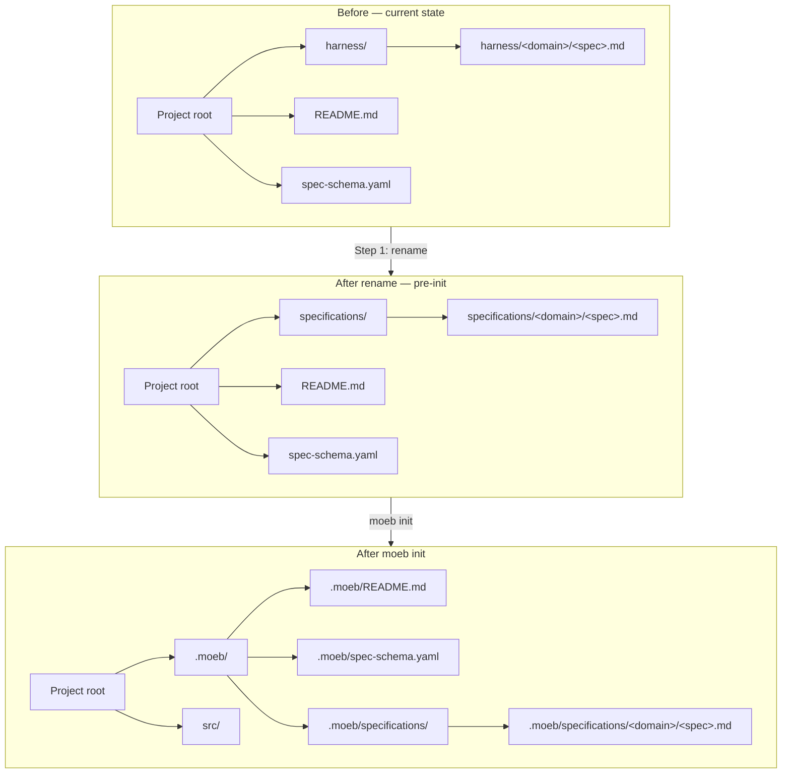

# Specifications Directory Rename and .moeb/ Path Resolution

**Domain:** harness

---

## Raw Requirement

> moeb init will be run on this folder, which will in turn move the README.md, spec-schema.yaml files and harness/ folder along with any pre-existing specifications; the folder harness/ should be renamed to specifications/, given the files that will need to be used in prompts are going to be located in .moeb/ instead of at the root, this will need to be accounted for also

---

## Description

Two related changes are captured together because both are consequences of running `moeb init` on this project directory. First, the `harness/` directory is renamed to `specifications/` everywhere it appears — in the directory structure, in README.md, in spec-schema.yaml, in the moeb kernel's `init` and `run` command implementations, and in the harness assets embedded in the binary. Second, `moeb run`'s prompt template is updated to prefix file paths with `.moeb/`, because the working directory for `moeb run` is the project root and harness files will reside under `.moeb/` after `moeb init` is executed. `moeb spec`'s prompt template is unchanged because its agent loop already uses `.moeb/` as its working directory, making relative paths like `README.md` resolve correctly. In `moeb run`, the spec path substituted into `{{spec}}` is also updated to retain the `.moeb/` prefix rather than stripping it, so the template can reference it without additional wrapping.

---

## Diagram



---

## Backlinks

### Parents

| Label | Path | Purpose |
|-------|------|---------|
| Declarative Specification Harness | [harness/harness/harness.base-harness.md](harness.base-harness.md) | Parent spec that established the harness/ directory name; this spec renames that directory |
| README Scope Boundary Clarification | [harness/harness/harness.readme-scope-boundary.md](harness.readme-scope-boundary.md) | Named harness/ as part of the meta-layer; this spec updates that reference to specifications/ |
| Moeb Kernel | [harness/moeb/moeb.kernel.md](../moeb/moeb.kernel.md) | Established moeb init and moeb run; this spec changes both to use specifications/ and updates run.prompt path resolution |
| README | [README.md](../../README.md) | Root index; path references and location requirement updated by this spec |

### External

*(none)*

---

## Steps

1. **Rename `harness/` to `specifications/` at the project root**
   Move the entire `harness/` directory to `specifications/`. All existing specification files move with it. No file content changes — only the parent directory name changes. After this step, the directory tree is `specifications/harness/`, `specifications/moeb/`, `specifications/vcs/`.

2. **Update README.md**
   Make the following replacements in `README.md`:
   - In `## Repository layers`: replace `harness/` (as the meta-layer directory name) with `specifications/`.
   - In `## Specification requirements — Location`: replace `harness/<domain>/` with `specifications/<domain>/`.
   - In `## Specification requirements — Naming convention`: replace both example paths (`harness/auth/auth.token-rotation.md` and `harness/payments/payments.refund-flow.md`) with `specifications/auth/...` and `specifications/payments/...`.
   - In `## Specification index`: update every path in the **Path** column from `harness/<domain>/...` to `specifications/<domain>/...`. Apply to all rows in all domain subsections.
   Do not alter the project title ("Declarative Harness"), the word "harness" where it refers to the concept or system name, or any prose that does not contain a path reference to the directory.

3. **Update spec-schema.yaml**
   In the `domain` field comment, replace `under harness/` with `under specifications/`.

4. **Update `src/moeb/src/commands/init.rs`**
   Change the directory name constant used for the specifications folder from `harness` to `specifications` throughout `init.rs`. Specifically:
   - `let harness_src = Path::new("harness");` → `Path::new("specifications")`
   - `let harness_dst = moeb.join("harness");` → `moeb.join("specifications")`
   - Update any error message strings that reference `harness/` to reference `specifications/`.

5. **Update `src/moeb/src/commands/run.rs`**
   Two changes:
   - Change the `HARNESS_DIR` constant from `".moeb/harness"` to `".moeb/specifications"`.
   - Change the path resolution block so that the `.moeb/` prefix is **retained** rather than stripped. Replace the current `strip_prefix(moeb_dir)` call with a direct conversion that preserves the full relative path from the project root, e.g.:
     ```rust
     let rel_path = spec_path.to_string_lossy().replace('\\', "/");
     ```
   After this change, `{{spec}}` in the run prompt expands to a path such as `.moeb/specifications/harness/harness.base-harness.md`, which is resolvable from the project root.

6. **Update `src/prompts/run.prompt`**
   Replace the content of `src/prompts/run.prompt` with:
   ```
   study .moeb/README.md
   study {{spec}}

   Choose the next most important part to implement for the specification and execute it
   Once that is complete repeat this
   ```
   The `study README.md` line becomes `study .moeb/README.md` so the agent — whose working directory during `moeb run` is the project root — resolves the file correctly. `study {{spec}}` is unchanged; after Step 5, `{{spec}}` already carries the `.moeb/` prefix.

7. **Rebuild embedded harness assets in `src/moeb/assets/`**
   Overwrite `src/moeb/assets/README.md` and `src/moeb/assets/spec-schema.yaml` with the updated versions from the project root produced in Steps 2 and 3. These embedded defaults must stay in sync with the live documents so that `moeb init` copies the correct content to new projects.

8. **Verify with `cargo check`**
   Run `cargo check` in `src/moeb/` and confirm zero errors. Correct any compilation failures before considering this specification implemented.

---

## Decisions

### Rename the directory `harness/` to `specifications/`

**Rationale:** The directory holds specification files. `specifications/` directly names its contents, making the structure self-evident to a reader who has not studied the harness documentation. The word "harness" is already used for the overall system name ("Declarative Harness"), the meta-layer concept, and the domain name — using it also as the directory name creates unnecessary ambiguity.

**Alternatives:**

| Option | Reason Rejected |
|--------|----------------|
| Keep `harness/` | Ambiguous — collides with the system name and the meta-layer concept label |
| Use `specs/` | Abbreviation adds no clarity; `specifications/` is unambiguous |
| Use `docs/` | Too broad; implies general documentation rather than structured, schema-governed specification files |

**Consequences:** All path references to `harness/<domain>/` in documentation, code, and embedded assets must be updated to `specifications/<domain>/`. The domain name inside each specification file (the `domain:` field) is unaffected — it matches the subdirectory name, not the parent directory name.

---

### `moeb run` prompt paths are prefixed with `.moeb/`; `moeb spec` prompt is unchanged

**Rationale:** `moeb run` runs its agent loop with the project root as the working directory so that the agent can write artifacts to `src/`. File paths in the prompt must therefore be explicit about their location under `.moeb/`. `moeb spec` runs its agent loop with `.moeb/` as the working directory, so relative paths such as `README.md` already resolve to `.moeb/README.md` without modification. Applying the same prefix to `spec.prompt` would require the agent to navigate `..` — unnecessary complication.

**Alternatives:**

| Option | Reason Rejected |
|--------|----------------|
| Change `moeb run` working directory to `.moeb/` for reading, project root for writing | Two working directories per loop is not supported by the current agent loop design; would require a structural change to `agent.rs` |
| Add a system message to inject `.moeb/` context | Violates the prompt-fidelity rubric criterion in `moeb.kernel.md`, which prohibits wrapping not explicit in the template |
| Keep `run.prompt` using relative paths and document that the user must `cd .moeb` first | Breaks the expected invocation model and makes `moeb run` non-functional from the project root |

**Consequences:** `run.prompt` is the single source of truth for how `moeb run` directs the agent. Any future change to where the harness directory is located must be reflected in `run.prompt` and in the path-resolution logic in `run.rs`. `spec.prompt` is decoupled from this concern and needs no changes when the harness location changes, as long as `moeb spec` continues to use `.moeb/` as its working directory.

---

### The `.moeb/` prefix is retained in the `{{spec}}` substitution rather than prepended in the template

**Rationale:** The `run.rs` path resolution already knows the full path to the spec file. Stripping `.moeb/` and then re-adding it in the template duplicates information and creates a coupling between the template literal and the strip logic in code. Retaining the full path in `{{spec}}` makes the substitution self-contained and the template easier to read and verify.

**Alternatives:**

| Option | Reason Rejected |
|--------|----------------|
| Strip `.moeb/` in code, prepend `.moeb/` in template as `.moeb/{{spec}}` | Splits the path across two places; changing the harness location requires updating both |
| Pass only the filename (no path) and rely on the agent to locate the file | Removes precision; the agent might find the wrong file or none at all |

**Consequences:** `run.rs` must not call `strip_prefix` on the resolved spec path. The `rel_path` variable passed to the template substitution is a project-root-relative path beginning with `.moeb/`.

---

## Rubric

### Structured

| Name | Description | Threshold | Pass Condition |
|------|-------------|-----------|----------------|
| Directory renamed | `specifications/` exists at the project root; `harness/` does not | Both conditions | `Test-Path specifications` returns true; `Test-Path harness` returns false |
| README paths updated | No instance of `harness/<domain>/` (as a path, not a concept label) remains in README.md | Zero path-form occurrences | `Select-String -Pattern 'harness/' README.md` returns only non-path uses of the word "harness" |
| spec-schema.yaml updated | The domain field comment references `specifications/` not `harness/` | Required | Content check of spec-schema.yaml |
| init.rs updated | `init.rs` references `specifications` not `harness` for the directory being moved | Required | `Select-String -Pattern 'harness' src/moeb/src/commands/init.rs` returns zero matches |
| run.rs HARNESS_DIR updated | `HARNESS_DIR` constant equals `.moeb/specifications` | Required | Content check of `run.rs` |
| run.rs path retains prefix | Path passed to template substitution begins with `.moeb/` | Required | Confirmed by inspection of `rel_path` construction in `run.rs` |
| run.prompt updated | `run.prompt` contains `study .moeb/README.md` as the first line | Required | Content check of `src/prompts/run.prompt` |
| Embedded assets synced | `src/moeb/assets/README.md` and `src/moeb/assets/spec-schema.yaml` match the live root-level documents | Byte-for-byte match | Diff of assets against root files returns empty |
| cargo check passes | `cargo check` in `src/moeb/` completes with zero errors | Zero errors | CI or manual invocation |

### Qualitative

- **Concept vs. path discipline:** The word "harness" must be retained everywhere it refers to the system name, the meta-layer concept, or the domain name. Only path-form references to the directory (`harness/`, `harness/<domain>/`) must be replaced with `specifications/`. A reviewer must be able to confirm this distinction was applied consistently throughout README.md.
- **Prompt coherence:** After this change, an agent receiving the `run.prompt` output must be able to read both `.moeb/README.md` and the resolved spec path without encountering a file-not-found error when operating from the project root.
