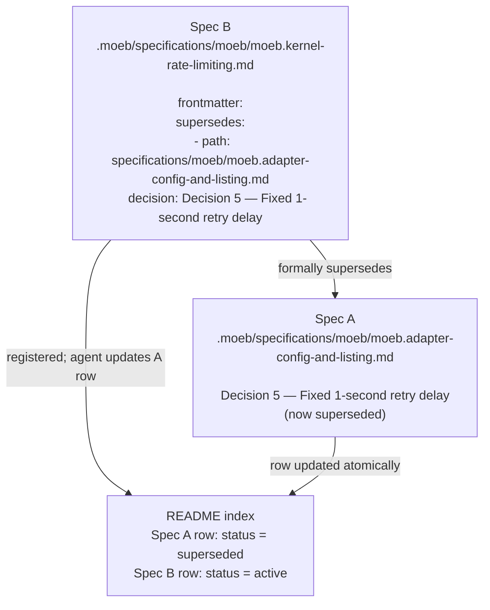

# Formal Supersedes Field

## Raw Requirement

> When a spec overrides a parent's decision, this should be formalised and structured
> rather than captured only as prose in the Decisions section.

## Description

When a specification overrides a named decision recorded in a parent specification, the
relationship is currently expressed only as prose in the Decisions section and as a
backlink with `purpose: supersedes`. This is human-readable but not machine-readable:
no tooling can detect which specific decision has been overridden, or verify that the
override was declared.

A structured `supersedes` YAML block is added to the frontmatter. Each entry names a
path and a decision title, creating an unambiguous, machine-readable record of every
override. The prose rationale in the Decisions section is still required — the frontmatter
entry is its machine-readable companion, not its replacement.

The field is optional: most specifications are additive and override no prior decision.
Requiring it universally would add noise without benefit.

## Diagram



## Backlinks

### Parents

| Label | Path | Purpose |
|-------|------|---------|
| Declarative Specification Harness | [specifications/harness/harness.base-harness.md](specifications/harness/harness.base-harness.md) | Established the immutability policy and the prose supersedes convention this spec formalises |
| Specification Status Field | [specifications/harness/harness.spec-status.md](specifications/harness/harness.spec-status.md) | Defines `status: superseded`; the supersedes field is what triggers a status transition on the parent spec's README row |
| README | [README.md](../../README.md) | Root index; the Specification requirements section is updated by this spec |

### External

*(none)*

## Steps

### Step 1 — Document the `supersedes` field in `spec-schema.yaml`

In `.moeb/spec-schema.yaml`, add the following block in the frontmatter section,
immediately after the `status: string` entry:

```yaml
  supersedes:          # optional
    # Formal record of decisions in parent specifications that this spec overrides.
    # Omit entirely if this spec does not override any named decision.
    # When present, prose rationale in the Decisions section is still required —
    # this block is the machine-readable companion, not a replacement.
    - path: string     # relative path to the superseded spec from the .moeb/ root
                       # e.g. specifications/moeb/moeb.adapter-config-and-listing.md
      decision: string # exact title of the decision being overridden
                       # e.g. "Decision 5 — Fixed 1-second retry delay"
```

### Step 2 — Extract `supersedes` entries in `parse_frontmatter`

In `src/moeb/src/domain/spec.rs`, extend `parse_frontmatter` to extract `supersedes`
entries from the frontmatter block.

The frontmatter block is already split into individual lines. Add a small state machine
that recognises the `supersedes:` list. Because the frontmatter is minimal YAML (only
scalar values and simple sequences are used), a line-by-line parser is sufficient:

```rust
let mut supersedes: Vec<(String, String)> = Vec::new();
let mut in_supersedes = false;
let mut current_path: Option<String> = None;
let mut current_decision: Option<String> = None;

for line in fm_text.lines() {
    if line.trim_start() == "supersedes:" {
        in_supersedes = true;
        continue;
    }
    if in_supersedes {
        // A new top-level key ends the supersedes block
        if !line.starts_with(' ') && !line.starts_with('\t') && !line.starts_with('-') {
            in_supersedes = false;
        } else if let Some(val) = line.trim_start_matches([' ', '-']).strip_prefix("path:") {
            // Flush any complete pair before starting a new one
            if let (Some(p), Some(d)) = (current_path.take(), current_decision.take()) {
                supersedes.push((p, d));
            }
            current_path = Some(val.trim().to_string());
        } else if let Some(val) = line.trim_start().strip_prefix("decision:") {
            current_decision = Some(val.trim().trim_matches('"').to_string());
        }
    } else if let Some(val) = line.strip_prefix("domain:") {
        domain = Some(val.trim().to_string());
    } else if let Some(val) = line.strip_prefix("slug:") {
        slug = Some(val.trim().to_string());
    } else if let Some(val) = line.strip_prefix("status:") {
        status = Some(val.trim().to_string());
    }
}
// Flush the last pair
if let (Some(p), Some(d)) = (current_path, current_decision) {
    supersedes.push((p, d));
}
```

Return `supersedes` as part of the parse result. Update the return type to
`Result<(String, String, String, Vec<(String, String)>, String)>` where the five values
are `(domain, slug, status, supersedes, body)`. Update `run_in` to destructure the new
tuple. For now, log each supersedes entry to stderr at info level:

```rust
for (path, decision) in &supersedes {
    eprintln!("[moeb] spec supersedes: {} — {}", path, decision);
}
```

No further action on the supersedes entries is required in this specification; downstream
use (e.g. automated README row updates) is left to future tooling.

### Step 3 — Update the README Specification requirements section

In `.moeb/README.md`, under `## Specification requirements`, append the following
paragraph after the **Registration** paragraph:

> **Supersedes.** When a specification overrides a named decision recorded in a parent
> specification, it must include a `supersedes:` block in its YAML frontmatter identifying
> each overridden decision by its path and decision title. Prose rationale for the override
> must still appear in the Decisions section of the new specification. The frontmatter
> entry is the machine-readable companion to that prose; both are required when a decision
> is being overridden.

### Step 4 — Update `spec.prompt` with the `supersedes` field syntax

In `src/prompts/spec.prompt`, in the section that describes required frontmatter fields,
add guidance for `supersedes`:

- State that `supersedes` is optional and should be omitted when the spec does not
  override any named decision from a parent.
- Provide the two-line entry syntax (`- path: ...` / `  decision: ...`) with a concrete
  example using a placeholder path and decision title.
- State that when `supersedes` is included, the overridden decision must also be addressed
  explicitly in the Decisions section with a rationale for why the override is warranted.

### Step 5 — Verify

Run `cargo build --release` and confirm zero compilation errors. Run `cargo test` and
confirm all existing tests pass. Manually verify that a spec frontmatter containing a
`supersedes:` block is parsed without error and that the entries are logged to stderr.
Verify that a spec with no `supersedes:` field also parses without error.

## Decisions

### Decision 1 — `supersedes` is a frontmatter field, not a body section

**Rationale:** The field must be machine-readable. Frontmatter is the established location
for machine-readable fields in this harness. A body section would require prose parsing
and would conflate structured metadata with human-authored content.

**Alternatives:**

| Option | Reason Rejected |
|--------|-----------------|
| Extended backlinks entry with `purpose: supersedes-decision` | Backlinks capture document relationships, not decision-level overrides; the granularity is insufficient |
| Prose only in the Decisions section | Already the current practice; this spec exists because prose alone is not machine-readable |
| A separate supersedes file listing all overrides | Adds indirection; the override record belongs with the spec that introduces it |

**Consequences:** All future specs that override a named decision must include the
frontmatter block. Specs that do not override any decision omit the field entirely.
`parse_frontmatter` must handle both cases without error.

---

### Decision 2 — The field is optional

**Rationale:** Most specifications are additive — they introduce new behaviour without
overriding a prior decision. Making `supersedes` required would force every spec author
to declare `supersedes: []` or similar, adding noise to the majority of specs for the
benefit of the minority that actually override something.

**Alternatives:**

| Option | Reason Rejected |
|--------|-----------------|
| Required with an empty list when not applicable | Adds mandatory noise; empty lists carry no information |
| Required with a `none` sentinel value | Non-standard YAML convention; harder to parse reliably |

**Consequences:** `parse_frontmatter` treats an absent `supersedes` block as equivalent
to an empty list. Validation does not fail on absence.

---

### Decision 3 — Both the frontmatter entry and prose rationale are required when superseding

**Rationale:** The frontmatter entry is machine-readable but carries no explanation of
why the override is warranted. The prose in the Decisions section provides that
explanation. Neither is sufficient without the other: the frontmatter entry without prose
is an unexplained assertion; the prose without the frontmatter entry is not
machine-readable. Requiring both ensures the record is complete for both human and
automated readers.

**Alternatives:**

| Option | Reason Rejected |
|--------|-----------------|
| Frontmatter only, prose optional | Loses the rationale; future authors cannot understand why the override was made |
| Prose only, frontmatter optional | Reverts to the current state this spec is intended to improve |

**Consequences:** Spec authors must include an entry in both the `supersedes` frontmatter
block and the Decisions section whenever a prior decision is being overridden. The
`spec.prompt` must reinforce this dual requirement.

---

### Decision 4 — Path is relative to the `.moeb/` root; decision is the exact title string

**Rationale:** Paths relative to `.moeb/` are consistent with how the README index
references specification files. Using the exact decision title string ensures the
reference is unambiguous — a partial or paraphrased title could match more than one
decision. Decision titles in this harness follow the `### Decision N — Title` convention,
which provides a stable, human-readable identifier.

**Alternatives:**

| Option | Reason Rejected |
|--------|-----------------|
| Path relative to the repo root | Longer strings; inconsistent with README index path convention |
| Decision identified by number only (e.g. `decision: 5`) | Numbers are positional and fragile; a decision inserted earlier shifts all subsequent numbers |
| Decision identified by a generated UUID | Requires tooling to assign UUIDs at authoring time; unnecessary complexity |

**Consequences:** Decision titles must be stable once a spec is authored — changing a
decision title in a parent spec would break any `supersedes` reference to it. This
reinforces the immutability of spec content.

## Rubric

### Structured

| Name | Description | Threshold | Pass Condition |
|------|-------------|-----------|----------------|
| `binary-builds` | `cargo build --release` exits 0 | Zero errors | CI build exits 0 |
| `all-tests-pass` | `cargo test` exits 0 | Zero failures | `cargo test` exits 0 |
| `no-test-regression` | All pre-existing tests pass without modification | Zero failures | `cargo test` exits 0 |
| Supersedes block parsed without error | A frontmatter block containing a valid `supersedes:` list is accepted by `parse_frontmatter` | No error returned | Unit test with a two-entry supersedes block returns `Ok` with both entries in the result |
| Absent supersedes block accepted | A frontmatter block with no `supersedes:` field is accepted by `parse_frontmatter` | No error returned | All existing unit tests continue to pass with no change to test inputs |
| Supersedes entries logged | Each parsed supersedes entry is emitted to stderr during `moeb spec` execution | One line per entry | Manual invocation with a spec containing a supersedes block shows the log lines |

### Qualitative

- **No validation tightening for absence:** A spec that does not need to supersede anything must not be penalised. The validation path for a spec with no `supersedes` field must be identical in outcome to the path before this spec was implemented.
- **Parse robustness:** The frontmatter parser must not panic or produce incorrect results when the `supersedes` block is malformed (e.g. a `path:` entry with no corresponding `decision:`). In such cases it should emit a stderr warning and proceed with the entries it could fully parse, rather than failing the entire spec.
- **Prompt clarity:** The `spec.prompt` instruction for `supersedes` must be unambiguous about when to include the field. An agent reading the prompt for the first time must not include `supersedes` in specs that do not override a prior decision.
