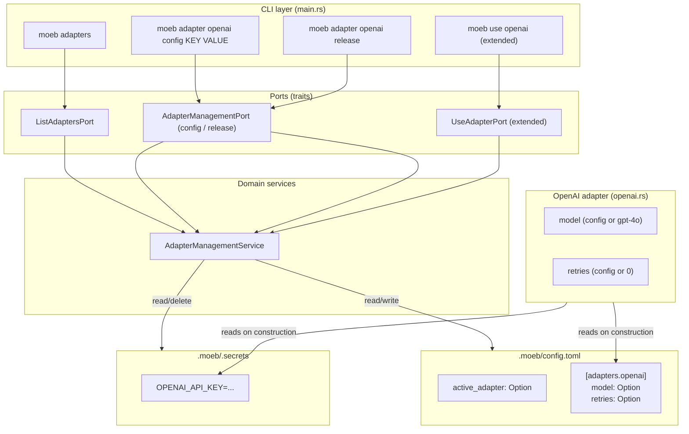

# Adapter Configuration, Release, and Listing

## Raw Requirement

> currently a model is supplied by default in the openai adapter, the user should be able to supply
> this, when the adapter is configured using moeb use, it should output into the terminal a line that
> lets the user of this and any other config options along with the required command to change them,
> this could be moeb adapter openai config MODEL <argument>, a separate command
> moeb adapter openai release could be used to remove configuration secrets, moeb adapters should
> return all available adapters and their current state (configured or not). another configuration
> option would be number of retries, this should be set via moeb adapter openai config RETRIES
> <retry count>

## Description

Three new command groups extend the moeb CLI surface alongside the existing `moeb use <name>`:

- `moeb adapters` (plural noun form) reads the list of all compiled-in adapters and, for each one,
  checks whether credentials are present in `.moeb/.secrets` and whether the adapter is currently
  active. It prints a human-readable status table so the user can see at a glance what is
  configured.

- `moeb adapter <name> config <KEY> <VALUE>` writes a named configuration value for the specified
  adapter into a per-adapter table in `.moeb/config.toml` under `[adapters.<name>]`. For the
  `openai` adapter the recognised keys are `MODEL` (a string accepted verbatim as the model
  identifier) and `RETRIES` (a non-negative integer capping per-call HTTP retries inside the
  adapter before the error is propagated). Unknown keys and out-of-range values are rejected with
  an actionable error message.

- `moeb adapter <name> release` removes the adapter's secret credentials from `.moeb/.secrets` and,
  if `active_adapter` in `config.toml` names that adapter, clears the field. The per-adapter
  `[adapters.<name>]` config block is left untouched so that options like `MODEL` survive a
  re-configuration via `moeb use`.

`moeb use <name>` is extended to print a configuration summary immediately after the existing
success message. The summary lists every configurable key for the adapter, its current effective
value (config file value if set, otherwise the compiled-in default), and the exact CLI command
the user must run to change it.

The OpenAI adapter is updated to read its model identifier and per-call retry count from the
`[adapters.openai]` block in `config.toml`, falling back to the compiled-in defaults (`gpt-4o`
and `0` respectively) when absent.

## Diagram



## Backlinks

### Parents

| Label | Path | Purpose |
|-------|------|---------|
| Moeb Kernel | [specifications/moeb/moeb.kernel.md](specifications/moeb/moeb.kernel.md) | Establishes the adapter trait, `.moeb/.secrets` storage, and `moeb use` command |
| Moeb Hexagonal Architecture | [specifications/moeb/moeb.hex-architecture.md](specifications/moeb/moeb.hex-architecture.md) | Mandates ports-and-adapters structure; new commands must follow the same pattern |
| Spec Validation Retry | [specifications/moeb/moeb.spec-retry-on-validation-failure.md](specifications/moeb/moeb.spec-retry-on-validation-failure.md) | Establishes `spec_retry_limit` in `MoebConfig`; the new `AdapterConfig.retries` field is a separate concern and must not conflict |

### External

*(none)*

## Steps

### Step 1 — Add `AdapterConfig` and extend `MoebConfig`

In `src/moeb/src/config.rs`, introduce a new struct:

```rust
#[derive(Debug, Default, Clone, Serialize, Deserialize)]
pub struct AdapterConfig {
    pub model: Option<String>,
    pub retries: Option<u32>,
}

impl AdapterConfig {
    pub fn effective_model(&self, default: &str) -> String {
        self.model.clone().unwrap_or_else(|| default.to_string())
    }

    pub fn effective_retries(&self) -> u32 {
        self.retries.unwrap_or(0)
    }
}
```

Extend `MoebConfig`:

```rust
#[derive(Debug, Default, Serialize, Deserialize)]
pub struct MoebConfig {
    pub active_adapter: Option<String>,
    pub spec_retry_limit: Option<u32>,
    #[serde(default)]
    pub adapters: std::collections::HashMap<String, AdapterConfig>,
}
```

Add a helper for convenient per-adapter access:

```rust
impl MoebConfig {
    pub fn adapter_config(&self, name: &str) -> AdapterConfig {
        self.adapters.get(name).cloned().unwrap_or_default()
    }
}
```

Serialisation of the empty `adapters` map must not write an `[adapters]` header to `config.toml`;
use `#[serde(skip_serializing_if = "HashMap::is_empty")]` on the field to achieve this.

Add unit tests in `config.rs`:
- `adapter_config_returns_default_when_absent`: construct `MoebConfig::default()` and assert
  `adapter_config("openai").effective_model("gpt-4o") == "gpt-4o"` and
  `adapter_config("openai").effective_retries() == 0`.
- `adapter_config_round_trips_through_toml`: write a config with `adapters.openai.model =
  Some("gpt-4o-mini")` and `retries = Some(3)`, save, reload, and assert values are preserved.
- `empty_adapters_map_not_written`: save a `MoebConfig::default()` and assert the resulting
  `config.toml` text does not contain the string `adapters`.

### Step 2 — Update `OpenAiAdapter` to read model and retries from config

In `src/moeb/src/adapters/openai.rs`:

1. Add a `model: String` and `retries: u32` field to `OpenAiAdapter`.

2. Rename `from_secrets()` to `from_secrets_and_config()`:

```rust
pub fn from_secrets_and_config() -> Result<Self> {
    let secrets = Secrets::load()?;
    let api_key = secrets
        .get("OPENAI_API_KEY")
        .context("OPENAI_API_KEY not set. Run `moeb use openai` first.")?
        .to_string();
    let cfg = MoebConfig::load().unwrap_or_default();
    let adapter_cfg = cfg.adapter_config("openai");
    Ok(Self {
        api_key,
        model: adapter_cfg.effective_model(DEFAULT_MODEL),
        retries: adapter_cfg.effective_retries(),
        client: reqwest::blocking::Client::new(),
    })
}
```

where `DEFAULT_MODEL` replaces the existing `MODEL` constant.

3. In `Adapter::send`, replace the hardcoded `"model": MODEL` in the JSON body with
   `"model": self.model`.

4. Wrap the HTTP call in a retry loop using `self.retries`. On each attempt, if the response status
   is 429 (rate-limited) or 5xx (server error), wait one second and retry. Any other error or a
   successful response exits the loop immediately. If all attempts are exhausted, return the last
   error. A `retries` value of `0` means a single attempt with no retries.

5. Update all call sites of `from_secrets()` to `from_secrets_and_config()`. The primary call site
   is in `src/moeb/src/adapters/cli.rs` (or wherever the adapter is constructed for `SpecPort` and
   `RunPort`).

### Step 3 — Extend `moeb use openai` to print a configuration summary

In `src/moeb/src/commands/use_cmd.rs` (or the domain service that `UseAdapterPort` delegates to),
after printing `"OpenAI adapter configured."`, read the current `[adapters.openai]` block from
`config.toml` and print:

```
OpenAI adapter configured.

Configuration options (current effective values):
  MODEL    gpt-4o          moeb adapter openai config MODEL <value>
  RETRIES  0               moeb adapter openai config RETRIES <count>

To remove credentials: moeb adapter openai release
```

The effective value column must show the value from `config.toml` if present, or the compiled-in
default otherwise. Column widths must be aligned with spaces for readability. This output goes to
stdout.

### Step 4 — Define `ListAdaptersPort` and implement `moeb adapters`

In `src/moeb/src/ports/`, create `list_adapters.rs`:

```rust
use anyhow::Result;

pub trait ListAdaptersPort {
    fn run(&self) -> Result<()>;
}
```

Export it from `src/moeb/src/ports/mod.rs`.

In `src/moeb/src/commands/adapters.rs`, implement the logic:

1. Define a static list of all compiled-in adapter names: `const KNOWN_ADAPTERS: &[&str] =
   &["openai"];`.

2. Load `MoebConfig` and `Secrets`.

3. For each adapter name, determine:
   - **active**: `config.active_adapter == Some(name)`
   - **credentials present**: the relevant secret key exists in `.moeb/.secrets`
     (for `openai`: `OPENAI_API_KEY`)
   - **state label**: `"configured"` if credentials are present, otherwise `"not configured"`

4. Print a table to stdout:

```
ADAPTER    STATE           ACTIVE
openai     configured      yes
```

If no adapters are configured, still print the header and rows with `"not configured"` and `"no"`.

Implement `ListAdaptersPort` for `CliAdapter` by calling `commands::adapters::run()`.

### Step 5 — Define `AdapterManagementPort` and implement `moeb adapter <name> config <KEY> <VALUE>`

In `src/moeb/src/ports/`, create `adapter_management.rs`:

```rust
use anyhow::Result;

pub trait AdapterManagementPort {
    fn configure(&self, adapter: &str, key: &str, value: &str) -> Result<()>;
    fn release(&self, adapter: &str) -> Result<()>;
}
```

Export from `mod.rs`.

In `src/moeb/src/commands/adapter_management.rs`, implement `configure`:

1. Validate adapter name against `KNOWN_ADAPTERS`; unknown adapter → bail with list of known
   adapters.

2. Match on `key` (case-insensitive):
   - `"MODEL"`: accept any non-empty string as the value and write it to
     `config.adapters["openai"].model`.
   - `"RETRIES"`: parse the value as a `u32`; reject if parse fails or if the value is not a
     decimal integer. Write to `config.adapters["openai"].retries`.
   - Any other key: bail listing the valid keys for this adapter.

3. Load `MoebConfig`, update the field, call `MoebConfig::save()`.

4. Print: `"openai MODEL set to gpt-4o-mini."` (or whichever key/value was set).

### Step 6 — Implement `moeb adapter <name> release`

In `src/moeb/src/commands/adapter_management.rs`, implement `release`:

1. Validate adapter name.

2. Determine the secret key for the adapter (for `openai`: `OPENAI_API_KEY`).

3. Load `Secrets`, remove the entry for the adapter's secret key, flush.

4. Load `MoebConfig`; if `active_adapter == Some(adapter_name)`, set it to `None` and call
   `MoebConfig::save()`.

5. Print: `"openai credentials removed."`.

The per-adapter `[adapters.openai]` block in `config.toml` is **not** touched — MODEL and RETRIES
survive a release so they are still in effect when the user re-runs `moeb use openai`.

### Step 7 — Wire new subcommands in `main.rs`

Extend the `Commands` enum in `src/moeb/src/main.rs`:

```rust
#[derive(Subcommand)]
enum Commands {
    // existing variants unchanged
    Init,
    Use { adapter: String },
    Spec { #[arg(trailing_var_arg = true)] input: Vec<String> },
    Run { spec: String },
    /// List all adapters and their configured state
    Adapters,
    /// Manage a specific adapter's configuration or credentials
    Adapter {
        name: String,
        #[command(subcommand)]
        action: AdapterAction,
    },
}

#[derive(Subcommand)]
enum AdapterAction {
    /// Set a configuration value for this adapter
    Config { key: String, value: String },
    /// Remove this adapter's credentials
    Release,
}
```

In `main`:

```rust
Commands::Adapters => ListAdaptersPort::run(&adapter),
Commands::Adapter { name, action: AdapterAction::Config { key, value } } =>
    AdapterManagementPort::configure(&adapter, &name, &key, &value),
Commands::Adapter { name, action: AdapterAction::Release } =>
    AdapterManagementPort::release(&adapter, &name),
```

Implement `ListAdaptersPort` and `AdapterManagementPort` for `CliAdapter` in
`src/moeb/src/adapters/cli.rs` by delegating to the command functions.

### Step 8 — Update tests

In `src/moeb/src/commands/adapter_management.rs` or an adjacent test module:

- `configure_openai_model_updates_config`: call `configure("openai", "MODEL", "gpt-4o-mini")` in a
  temp dir with `.moeb/`; assert `config.toml` reads back `model = "gpt-4o-mini"` under
  `[adapters.openai]`.

- `configure_openai_retries_updates_config`: call `configure("openai", "RETRIES", "5")`; assert
  `retries = 5`.

- `configure_rejects_invalid_retries`: call `configure("openai", "RETRIES", "abc")`; assert the
  error message contains the word "integer".

- `configure_rejects_unknown_key`: call `configure("openai", "TIMEOUT", "30")`; assert the error
  message lists valid keys.

- `release_removes_secret_and_clears_active_adapter`: seed `.moeb/.secrets` with
  `OPENAI_API_KEY=sk-test`, set `active_adapter = "openai"` in config, call `release("openai")`;
  assert secret is absent and `active_adapter` is `None`.

- `release_leaves_adapter_config_intact`: same setup plus `model = "gpt-4o-mini"` in
  `[adapters.openai]`; call `release("openai")`; assert the model value is still present in
  `config.toml`.

- `list_adapters_shows_configured_state`: seed secrets and config as above; capture stdout from
  `run()`; assert output contains `"openai"` and `"configured"`.

- `openai_adapter_uses_configured_model`: construct `OpenAiAdapter::from_secrets_and_config()` in a
  temp dir with `model = "gpt-4o-mini"` in config and a dummy API key; assert
  `adapter.model == "gpt-4o-mini"`.

## Decisions

### Decision 1 — Per-adapter config stored in `config.toml` under `[adapters.<name>]`

**Rationale:** Keeping all non-secret configuration in a single human-readable `config.toml`
is consistent with the existing `active_adapter` and `spec_retry_limit` fields and with the
decision in `moeb.kernel.md` to use TOML for config. The `[adapters.<name>]` sub-table pattern
is idiomatic TOML and scales naturally to multiple adapters without structural change.

**Alternatives:**

| Option | Reason Rejected |
|--------|-----------------|
| Separate per-adapter config file (`openai.toml`) | Fragments config across multiple files; harder to inspect at a glance |
| Flat keys in `config.toml` (`openai_model`, `openai_retries`) | Does not scale; naming collisions become likely as adapter count grows |
| Store model identifier in `.moeb/.secrets` | Secrets store is for credentials only; non-secret values do not belong there |

**Consequences:** `MoebConfig` gains a `HashMap<String, AdapterConfig>` field. Any future adapter
that has configurable non-secret parameters can add its own sub-table with no schema changes.

---

### Decision 2 — `MODEL` and `RETRIES` as the only configurable keys for the OpenAI adapter

**Rationale:** The raw requirement names exactly these two options. Keeping the configurable surface
minimal reduces documentation burden and avoids exposing parameters (timeouts, base URLs) that most
users should not need to change.

**Alternatives:**

| Option | Reason Rejected |
|--------|-----------------|
| Expose all OpenAI request parameters | Over-engineering; parameters like `temperature` belong in prompts, not adapter config |
| Make `RETRIES` an alias for `spec_retry_limit` | They are different concerns: `spec_retry_limit` retries the full spec-generation loop on validation failure; `RETRIES` retries a single HTTP call on a transient API error |

**Consequences:** Adding a new configurable key for `openai` (e.g. `BASE_URL`) requires a code
change in the validation match inside `configure()` and a binary release.

---

### Decision 3 — `release` preserves the `[adapters.<name>]` config block

**Rationale:** A user who runs `moeb use openai` with a new key after `release` almost certainly
wants the same model and retry settings they had before. Clearing those values on release would
silently reset preferences, creating a frustrating experience.

**Alternatives:**

| Option | Reason Rejected |
|--------|-----------------|
| Delete the entire `[adapters.openai]` block on release | Destroys non-secret config the user intentionally set |
| Ask the user interactively whether to keep or clear config | Unnecessary prompt for a CLI that otherwise avoids interactive questions during teardown |

**Consequences:** After `release`, the `[adapters.openai]` block may remain in `config.toml`.
This is correct and documented behaviour. A subsequent `moeb use openai` will apply the preserved
settings immediately.

---

### Decision 4 — `moeb adapters` (plural) for listing, `moeb adapter` (singular) for management

**Rationale:** The plural form is a conventional pattern (cf. `kubectl get pods` vs `kubectl
describe pod`). `moeb adapters` is a quick read-only status query; `moeb adapter <name> <action>`
is an imperative management command targeting one adapter. The grammatical distinction makes the
intent of each command self-evident.

**Alternatives:**

| Option | Reason Rejected |
|--------|-----------------|
| `moeb adapter list` as a subcommand | One extra word with no added clarity; the plural root is more natural English |
| Merge listing into `moeb adapter` with no subcommand | Ambiguous — `moeb adapter openai` with no action would need to decide between listing and erroring |

**Consequences:** The CLI has two top-level noun forms: `adapters` and `adapter`. Both must be
documented in `--help` output. No conflicts exist with existing commands.

---

### Decision 5 — Per-call retries apply only to 429 and 5xx responses

**Rationale:** These are the only status codes for which a retry is semantically meaningful. 4xx
errors other than 429 (e.g. 401 Unauthorized, 400 Bad Request) indicate a configuration or
request problem that a retry will not fix. Retrying indiscriminately wastes API budget and delays
the user seeing an actionable error.

**Alternatives:**

| Option | Reason Rejected |
|--------|-----------------|
| Retry on any non-2xx | Masks configuration errors; retrying a 401 will never succeed |
| Retry on network errors only, not HTTP errors | Excludes the most common transient failure mode (rate limits) |

**Consequences:** The adapter's retry loop inspects the HTTP status before deciding whether to
retry. A fixed one-second back-off between attempts is used; exponential back-off is deferred to a
future specification if needed.

## Rubric

### Structured

| Name | Description | Threshold | Pass Condition |
|------|-------------|-----------|----------------|
| Binary builds | `cargo build --release` completes without error after all changes | Zero errors | CI build step exits 0 |
| `moeb adapters` — unconfigured state | Running `moeb adapters` in a project where no adapter is set prints `"not configured"` for openai | Output contains `"not configured"` | Automated test capturing stdout |
| `moeb adapters` — configured state | After `moeb use openai`, running `moeb adapters` prints `"configured"` and `"yes"` in the active column | Both strings present | Automated test |
| `moeb adapter openai config MODEL` | Running `moeb adapter openai config MODEL gpt-4o-mini` writes `model = "gpt-4o-mini"` under `[adapters.openai]` in `config.toml` | Value present and correct | File content assertion in unit test |
| `moeb adapter openai config RETRIES` | Running `moeb adapter openai config RETRIES 5` writes `retries = 5` | Value present and correct | File content assertion in unit test |
| Invalid RETRIES rejected | Passing a non-integer value for RETRIES exits with a non-zero code and an error mentioning "integer" | Non-zero exit, error message correct | Unit test |
| `moeb adapter openai release` — clears secret | Secret key absent from `.moeb/.secrets` after release | Key absent | File content assertion |
| `moeb adapter openai release` — clears active_adapter | `active_adapter` is `None` in config after release | Field absent from `config.toml` | File content assertion |
| `moeb adapter openai release` — preserves config | `[adapters.openai]` block and its values survive release | Values unchanged | File content assertion |
| `moeb use openai` summary | Success message is followed by a block listing MODEL, RETRIES, their effective values, and the change commands | All four items present in stdout | Automated test capturing stdout |
| OpenAI adapter reads model from config | `OpenAiAdapter::from_secrets_and_config()` uses `model` from `[adapters.openai]` when present | Correct model in constructed struct | Unit test `openai_adapter_uses_configured_model` passes |
| OpenAI adapter retries on 429 | With `retries = 2`, a mock server returning 429 twice then 200 results in a successful response | Success after two retries | Unit test with a mock HTTP server |

### Qualitative

- **Discoverability:** The configuration summary printed by `moeb use openai` must be sufficient for a user who has never read the documentation to discover and use `moeb adapter openai config` and `moeb adapter openai release` without consulting `--help`.
- **Actionable errors:** Every error exit from the new commands must name the invalid input and suggest a valid alternative (e.g. "Unknown key 'TIMEOUT'. Valid keys for openai: MODEL, RETRIES").
- **No silent data loss:** `release` must never silently delete the `[adapters.openai]` block. If it ever modifies the adapters map, it must do so by targeted key removal, not by replacing the map.
- **Consistent style:** Output formatting (column alignment, capitalisation) must match the style established by the existing `moeb use` and `moeb init` success messages: plain prose for single-line confirmations, aligned columns for tabular data.
