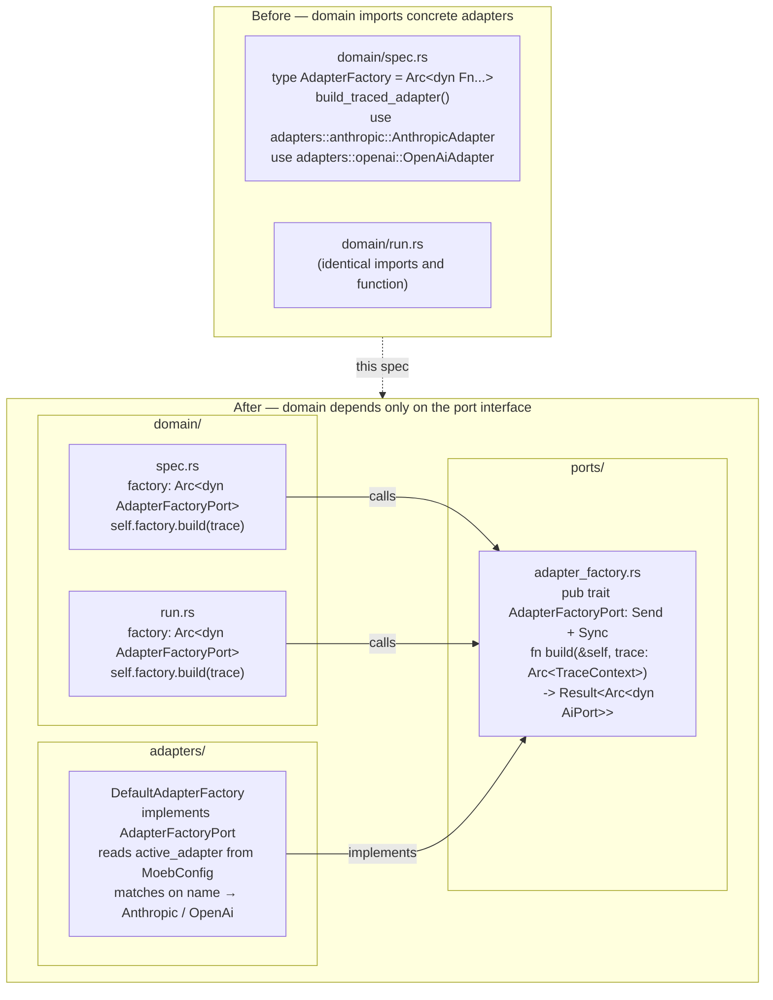

# Adapter Factory Port

## Raw Requirement

> The domain should remain as untouched by concrete adapters as possible, per hex
> architecture they should effectively be hot swappable.

## Description

`domain/spec.rs` and `domain/run.rs` both import `AnthropicAdapter` and `OpenAiAdapter`
by name via a local `build_traced_adapter` function. This is a direct dependency from
the domain layer to the adapters layer — an inversion of the hexagonal architecture
mandated by `moeb.hex-architecture.md`, which requires that the domain depend only on
port interfaces, never on concrete implementations.

The fix introduces an `AdapterFactoryPort` trait in `ports/`. The domain holds an
`Arc<dyn AdapterFactoryPort>` and calls `factory.build(trace)` to obtain an
`Arc<dyn AiPort>`. A `DefaultAdapterFactory` in `adapters/mod.rs` implements the trait,
reads the active adapter name from config, and instantiates the appropriate concrete
adapter. The domain has zero knowledge of `AnthropicAdapter`, `OpenAiAdapter`, or any
future adapter.

The `AdapterFactory` closure type alias introduced by `moeb.shared-constants.md` is
removed — it is superseded by the trait, which carries the same contract with better
testability and hex-arch alignment. The `MAX_TURNS` constant from that spec is unaffected.

## Diagram



## Backlinks

### Parents

| Label | Path | Purpose |
|-------|------|---------|
| Moeb Hexagonal Architecture | [specifications/moeb/moeb.hex-architecture.md](specifications/moeb/moeb.hex-architecture.md) | Mandates that the domain layer depends only on port interfaces; this spec corrects the existing violation |
| Shared Constants and Type Aliases | [specifications/moeb/moeb.shared-constants.md](specifications/moeb/moeb.shared-constants.md) | Introduced `AdapterFactory` type alias in `adapters/mod.rs`; this spec supersedes Decision 2 of that spec by replacing the closure type with a trait |
| Moeb Kernel | [specifications/moeb/moeb.kernel.md](specifications/moeb/moeb.kernel.md) | Established the core service structure (`SpecService`, `RunService`) whose adapter wiring this spec corrects |
| README | [README.md](../../README.md) | Root index |

### External

*(none)*

## Steps

### Step 1 — Create `ports/adapter_factory.rs`

Create the file `src/moeb/src/ports/adapter_factory.rs` with the following content:

```rust
use std::sync::Arc;
use anyhow::Result;

use crate::ports::AiPort;
use crate::trace::TraceContext;

/// Primary port — called by the domain to obtain a traced AI adapter.
/// Concrete implementations live in the adapters layer.
pub trait AdapterFactoryPort: Send + Sync {
    fn build(&self, trace: Arc<TraceContext>) -> Result<Arc<dyn AiPort>>;
}
```

### Step 2 — Export `AdapterFactoryPort` from `ports/mod.rs`

In `src/moeb/src/ports/mod.rs`, add:

```rust
pub mod adapter_factory;
pub use adapter_factory::AdapterFactoryPort;
```

### Step 3 — Create `DefaultAdapterFactory` in `adapters/mod.rs`

In `src/moeb/src/adapters/mod.rs`, add the following after the existing type and trait
definitions. This consolidates `build_traced_adapter` from both domain files into a
single canonical location:

```rust
use crate::ports::AdapterFactoryPort;
use crate::config::MoebConfig;

pub struct DefaultAdapterFactory;

impl AdapterFactoryPort for DefaultAdapterFactory {
    fn build(&self, trace: std::sync::Arc<crate::trace::TraceContext>)
        -> anyhow::Result<std::sync::Arc<dyn crate::ports::AiPort>>
    {
        let cfg = MoebConfig::load().unwrap_or_default();
        let name = cfg.active_adapter.clone().unwrap_or_default();
        match name.as_str() {
            "openai" => Ok(std::sync::Arc::new(
                crate::adapters::openai::OpenAiAdapter::from_secrets_and_config_with_trace(trace)?
            )),
            "anthropic" => Ok(std::sync::Arc::new(
                crate::adapters::anthropic::AnthropicAdapter::from_secrets_and_config_with_trace(trace)?
            )),
            "" => anyhow::bail!("No adapter configured. Run `moeb use <adapter>` first."),
            other => anyhow::bail!(
                "Adapter '{}' is not recognised. Run `moeb use <adapter>` to reconfigure.",
                other
            ),
        }
    }
}
```

Also remove the `pub type AdapterFactory = ...` definition that was added by
`moeb.shared-constants.md` — it is superseded by `AdapterFactoryPort`.

### Step 4 — Rewrite `domain/spec.rs` to use `AdapterFactoryPort`

In `src/moeb/src/domain/spec.rs`:

1. **Remove** the following imports:
   ```rust
   use crate::adapters::anthropic::AnthropicAdapter;
   use crate::adapters::openai::OpenAiAdapter;
   use crate::adapters::AdapterFactory;   // added by moeb.shared-constants.md
   ```

2. **Add** the import:
   ```rust
   use crate::ports::AdapterFactoryPort;
   ```

3. **Replace** the `SpecService` struct field:
   ```rust
   // Remove:
   pub struct SpecService {
       ai_factory: AdapterFactory,
   }

   // Replace with:
   pub struct SpecService {
       factory: Arc<dyn AdapterFactoryPort>,
   }
   ```

4. **Replace** `from_config()`:
   ```rust
   pub fn from_config() -> Self {
       Self {
           factory: Arc::new(crate::adapters::DefaultAdapterFactory),
       }
   }
   ```

5. **Replace** the test constructor `new(ai: Arc<dyn AiPort>)`. Define a private
   `FixedAdapterFactory` within the module to preserve the existing test API:
   ```rust
   struct FixedAdapterFactory(Arc<dyn AiPort>);

   impl AdapterFactoryPort for FixedAdapterFactory {
       fn build(&self, _trace: Arc<TraceContext>) -> Result<Arc<dyn AiPort>> {
           Ok(Arc::clone(&self.0))
       }
   }

   impl SpecService {
       pub fn new(ai: Arc<dyn AiPort>) -> Self {
           Self {
               factory: Arc::new(FixedAdapterFactory(ai)),
           }
       }
   }
   ```

6. **Replace** every call to `(self.ai_factory)(Arc::clone(&trace))` with:
   ```rust
   self.factory.build(Arc::clone(&trace))?
   ```
   This applies in both `run_in` and `link_readme`. In `link_readme`, the noop trace
   passed to `build` is unchanged; the factory still constructs a real adapter
   using its internal config read — the trace passed determines what trace the
   adapter uses, not which adapter is selected.

7. **Delete** the local `build_traced_adapter` function entirely.

### Step 5 — Rewrite `domain/run.rs` to use `AdapterFactoryPort`

Apply the same changes as Step 4 to `src/moeb/src/domain/run.rs`:

1. Remove `use crate::adapters::anthropic::AnthropicAdapter;`,
   `use crate::adapters::openai::OpenAiAdapter;`, and
   `use crate::adapters::AdapterFactory;`.
2. Add `use crate::ports::AdapterFactoryPort;`.
3. Replace the `RunService` struct field `ai_factory: AdapterFactory` with
   `factory: Arc<dyn AdapterFactoryPort>`.
4. Replace `from_config()` to use `DefaultAdapterFactory`.
5. Replace the test constructor `new(ai: Arc<dyn AiPort>)` using `FixedAdapterFactory`
   (same pattern as Step 4, defined locally in this module).
6. Replace `(self.ai_factory)(Arc::clone(&trace))` with
   `self.factory.build(Arc::clone(&trace))?` in `run`.
7. Delete the local `build_traced_adapter` function.

### Step 6 — Verify there are no remaining direct adapter imports in the domain layer

Run the following check to confirm the domain layer contains no references to concrete
adapter types:

```
grep -rn "AnthropicAdapter\|OpenAiAdapter\|build_traced_adapter" src/moeb/src/domain/
```

The result must be empty. Any match is a violation of the hexagonal architecture and
must be resolved before this specification is considered complete.

### Step 7 — Verify

Run `cargo build --release` and confirm zero compilation errors. Run `cargo test` and
confirm all existing tests pass without modification. The integration tests in
`domain/spec.rs` and unit tests in `domain/run.rs` use `SpecService::new(mock_ai)` and
`RunService::new(mock_ai)` respectively — both must continue to work via the
`FixedAdapterFactory` shim.

## Decisions

### Decision 1 — `AdapterFactoryPort` is a trait, not a closure type alias

**Rationale:** A trait is the idiomatic hexagonal architecture mechanism for a port
interface. It is named, discoverable, and independently testable. A closure type alias
(`Arc<dyn Fn(...)>`) provides the same runtime indirection but is anonymous, harder to
mock explicitly, and does not carry a name that conveys intent in documentation or
`grep` output. The trait also allows implementations to carry state (e.g. a custom
config source for integration tests) without capturing variables in a closure.

**Alternatives:**

| Option | Reason Rejected |
|--------|-----------------|
| Retain `AdapterFactory` closure alias, move `build_traced_adapter` to `adapters/mod.rs` | Keeps the closure anti-pattern; no named port interface; domain still uses an opaque function type |
| Factory function in `ports/` (free function, not a trait) | Not polymorphic; cannot be swapped for a test double without a function pointer |

**Consequences:** The `AdapterFactory` closure type alias introduced by
`moeb.shared-constants.md` is removed. Any code that stored or passed a raw
`AdapterFactory` closure must be updated to use `Arc<dyn AdapterFactoryPort>`. This
spec supersedes Decision 2 of `moeb.shared-constants.md`.

---

### Decision 2 — `DefaultAdapterFactory` reads active adapter from config internally

**Rationale:** The domain should not need to know which adapter is currently configured.
Passing the adapter name from the domain to the factory would require the domain to read
`MoebConfig`, coupling it to the configuration structure. The factory is the correct
place to resolve "which adapter is active" — it is adapter-layer knowledge, not domain
knowledge. The domain's contract is "give me an AI for this trace"; the factory's
contract is "I know how to provide one".

**Alternatives:**

| Option | Reason Rejected |
|--------|-----------------|
| Domain reads active adapter name and passes it as a `build(name, trace)` parameter | Domain would need to import `MoebConfig`; configuration reading is not a domain concern |
| Factory receives adapter name at construction time | Factory becomes single-adapter; cannot switch adapters between calls in a multi-run session without reconstruction |

**Consequences:** `DefaultAdapterFactory::build` calls `MoebConfig::load()` on every
invocation. This is the same behaviour as the previous closure, which also called
`MoebConfig::load()` on every call. No performance regression.

---

### Decision 3 — `FixedAdapterFactory` is used for test constructors; no public test helper is added

**Rationale:** `SpecService::new(ai)` and `RunService::new(ai)` are the established test
API in this codebase. Changing them would require updating many test call sites.
`FixedAdapterFactory` is a private shim that preserves the API without exposing a test
helper in production code. It is defined module-locally in each domain file, keeping it
close to its usage without polluting the public surface.

**Alternatives:**

| Option | Reason Rejected |
|--------|-----------------|
| Expose `FixedAdapterFactory` as a public test utility in a `#[cfg(test)]` module | Adds a named public type to the test surface for a trivial shim; module-local is sufficient |
| Change test call sites to `SpecService::new_with_factory(Arc::new(MockFactory))` | Breaks all existing integration tests; unnecessary churn for a refactor |

**Consequences:** Tests continue to call `SpecService::new(mock_ai)` unchanged.
`FixedAdapterFactory` must not be used in production code paths — it exists only to
satisfy the test constructor. A `#[cfg(test)]` guard may optionally be applied to the
struct definition.

---

### Decision 4 — `build_traced_adapter` is deleted, not moved to a shared utility

**Rationale:** The function's only purpose was to bridge the domain and the concrete
adapters. With `DefaultAdapterFactory` serving as the canonical bridge, the function
becomes redundant. Retaining it as a utility would create two code paths for the same
operation, both of which must be kept in sync.

**Alternatives:**

| Option | Reason Rejected |
|--------|-----------------|
| Move `build_traced_adapter` to `adapters/mod.rs` as a free function | `DefaultAdapterFactory::build` subsumes it entirely; a free function alongside the factory adds a redundant public API |
| Keep it private in each domain file as a local helper | The domain files no longer have adapter imports; the function cannot compile without them |

**Consequences:** `build_traced_adapter` disappears from the codebase. Any future need
to construct an adapter outside of `DefaultAdapterFactory` must be satisfied by
implementing a new `AdapterFactoryPort` or by calling `DefaultAdapterFactory::build`
directly.

## Rubric

### Structured

| Name | Description | Threshold | Pass Condition |
|------|-------------|-----------|----------------|
| `binary-builds` | `cargo build --release` exits 0 | Zero errors | CI build exits 0 |
| `all-tests-pass` | `cargo test` exits 0 | Zero failures | `cargo test` exits 0 |
| `no-test-regression` | All pre-existing tests pass without modification to test code | Zero failures | `cargo test` exits 0; no test file edited |
| No concrete adapter imports in domain | `domain/spec.rs` and `domain/run.rs` contain no references to `AnthropicAdapter`, `OpenAiAdapter`, or `build_traced_adapter` | Zero matches | `grep -rn "AnthropicAdapter\|OpenAiAdapter\|build_traced_adapter" src/moeb/src/domain/` returns empty |
| Single `build_traced_adapter` removal | The function does not exist anywhere in the codebase after this change | Zero occurrences | `grep -rn "build_traced_adapter" src/` returns empty |
| `AdapterFactoryPort` in ports layer | The trait is defined in `src/moeb/src/ports/adapter_factory.rs` and exported from `ports/mod.rs` | Trait present and exported | `grep -n "AdapterFactoryPort" src/moeb/src/ports/mod.rs` shows a `pub use` line |

### Qualitative

- **No semantic change:** The adapter selected and instantiated for a given `active_adapter` config value must be identical before and after this change. A `moeb run` session using the anthropic adapter must behave identically regardless of whether `build_traced_adapter` or `DefaultAdapterFactory::build` is used.
- **`adapter-structural-parity`:** Both `AnthropicAdapter` and `OpenAiAdapter` instantiation paths remain within `DefaultAdapterFactory::build`'s match arms. A developer reading the factory must see both adapters listed symmetrically.
- **Hex architecture boundary:** After this change, a developer must be able to add a new adapter (e.g. `GeminiAdapter`) by: (1) implementing `AiPort` and `Adapter` in `adapters/`, and (2) adding a match arm in `DefaultAdapterFactory::build`. No changes to `domain/` should be required. This must be verifiable by inspection.
