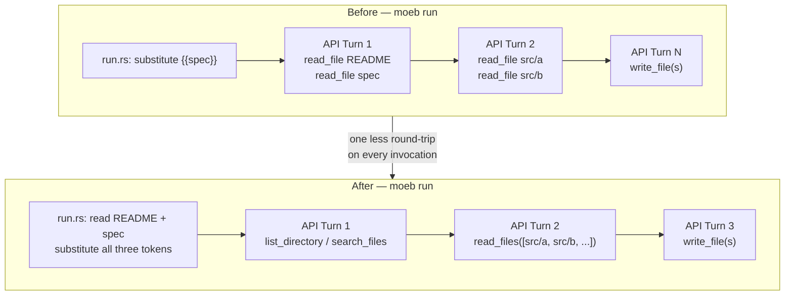

# Agent File-Read Optimization

## Raw Requirement

> When calling AI APIs it appears that there may be a performance issue, though this could also be
> due to the rates we are allowed. Is there a more performant way that we could have the necessary
> files read / studied by the APIs using tools? At present they request and read 2 files at a time.

## Description

The observed pattern of the agent reading 2 files per turn (`.moeb/README.md` and the target spec)
reflects the AI issuing two `read_file` tool calls in its first response. Each API round-trip has
significant latency (network + token generation). The file reads themselves complete in microseconds
on the kernel side; the bottleneck is the number of round-trips.

Two changes address this:

1. **Prompt context pre-loading.** `moeb run` reads `.moeb/README.md` and the target specification
   before starting the agent loop and injects their contents into the initial prompt via two new
   template tokens (`{{readme_content}}` and `{{spec_content}}`). The `run.prompt` template is
   updated to present these files as already-available context rather than instructing the model to
   call `read_file`. This eliminates the mandatory first tool-call turn — saving one full API
   round-trip on every `moeb run` execution.

2. **Batch `read_files` tool.** A new tool, `read_files`, is added to the agent alongside the
   existing `read_file`. It accepts an array of paths and returns all file contents in a single
   tool result, formatted as labelled sections. When the model already knows which source files it
   needs (after its initial discovery pass), it can request them all in one tool call rather than
   issuing individual `read_file` calls sequentially. This reduces both round-trip count and the
   cumulative token overhead of repeated tool results in the conversation history.

Neither existing tool is removed. Pre-loading for `spec.prompt` is out of scope for this
specification.

## Diagram



## Backlinks

### Parents

| Label | Path | Purpose |
|-------|------|---------|
| Moeb Kernel | [specifications/moeb/moeb.kernel.md](specifications/moeb/moeb.kernel.md) | Establishes the agent loop, `run.prompt` template, and the `read_file` tool surface |
| AI File Modification Detection | [specifications/moeb/moeb.ai-file-modification-detection.md](specifications/moeb/moeb.ai-file-modification-detection.md) | Precedent specification addressing data-volume reduction in `moeb run` |

### External

*(none)*

## Steps

### Step 1 — Update `src/prompts/run.prompt`

Replace the two mandatory `read_file` instructions at the top of `src/prompts/run.prompt` with
pre-filled sections. Introduce two new substitution tokens: `{{readme_content}}` and
`{{spec_content}}`. The file must have exactly this content after the change:

```
You are an implementation agent executing a declarative specification.

The following files have been provided to you as context — do not call read_file for them:

=== .moeb/README.md ===
{{readme_content}}

=== {{spec}} ===
{{spec_content}}

Discover the relevant files before modifying anything:
1. Call list_directory on "src/" to understand the top-level project layout.
2. Call search_files with path "src/" and an appropriate extension (e.g. "rs", "toml") to enumerate source files relevant to the specification.
3. Call grep_files to locate the specific functions, types, or modules that need to change.
4. Call read_files with the array of paths for files that actually require modification.

Harness constraints you must follow at all times:
- All implementation artifacts (source files, tests, configuration) must be placed under src/. Never create or modify files under .moeb/.
- The kernel must remain as dumb as possible — it is an interface to external services, not a place for decision-making logic.
- Do not introduce behaviour that contradicts decisions recorded in any parent or linked specification.

Then implement the next outstanding step using write_file to create or update files under src/. If a change is too complex to express as a complete file rewrite, produce a unified diff instead and save it with write_file to "moeb-changes.patch". After completing one step, continue to the next until all steps are done. When finished, respond with a concise summary of every file created or updated.
```

### Step 2 — Extend token substitution in `src/moeb/src/domain/run.rs`

1. Add three new constants alongside the existing `SPEC_TOKEN`:

```rust
const README_TOKEN: &str = "{{readme_content}}";
const SPEC_CONTENT_TOKEN: &str = "{{spec_content}}";
const README_PATH: &str = ".moeb/README.md";
```

2. In `RunService::run`, after `rel_path` is established and the template is loaded, read both
   files and substitute all three tokens:

```rust
let readme_content = fs::read_to_string(README_PATH)
    .with_context(|| format!(
        "Cannot read {}. Run `moeb init` first.",
        README_PATH
    ))?;

let spec_content = fs::read_to_string(&spec_path)
    .with_context(|| format!("Cannot read {}", spec_path.display()))?;

let prompt = template
    .replace(SPEC_TOKEN, &rel_path)
    .replace(README_TOKEN, &readme_content)
    .replace(SPEC_CONTENT_TOKEN, &spec_content);
```

The three `replace` calls replace the existing single `template.replace(SPEC_TOKEN, &rel_path)`
line.

### Step 3 — Add `read_files` tool definition in `src/moeb/src/agent.rs`

Add a new `ToolDef` to the list returned by `file_tools()`:

```rust
ToolDef {
    name: "read_files",
    description: "Read the full contents of multiple files in one call. Returns each file's path as a labelled header followed by its content. Paths are relative to the working directory.",
    parameters: json!({
        "type": "object",
        "properties": {
            "paths": {
                "type": "array",
                "items": { "type": "string" },
                "description": "File paths relative to the working directory"
            }
        },
        "required": ["paths"]
    }),
},
```

### Step 4 — Add `read_files` execution branch in `src/moeb/src/agent.rs`

In `execute_tool`, add a match arm before the `other =>` fallback:

```rust
"read_files" => {
    let paths = args["paths"]
        .as_array()
        .context("read_files: 'paths' must be an array")?;
    let mut out = String::new();
    for path_val in paths {
        let rel = path_val
            .as_str()
            .context("read_files: each path must be a string")?;
        let full = working_dir.join(rel);
        match fs::read_to_string(&full) {
            Ok(content) => {
                out.push_str(&format!("=== {} ===\n{}\n\n", rel, content));
            }
            Err(e) => {
                out.push_str(&format!("=== {} ===\nError: {}\n\n", rel, e));
            }
        }
    }
    Ok(out)
}
```

Update the error message in the `other =>` fallback arm to include `read_files` in the available
tool list.

### Step 5 — Add unit tests

**In `src/moeb/src/agent.rs` `#[cfg(test)]` module:**

- `read_files_returns_all_contents`: create two files in a temp dir; call
  `execute_tool("read_files", r#"{"paths":["a.txt","b.txt"]}"#, tmp.path())`; assert both
  filenames appear as section headers and both file contents appear in the output.

- `read_files_reports_error_inline_for_missing_path`: call `execute_tool("read_files", ...)` with
  one valid path and one non-existent path; assert the function returns `Ok`, the valid file's
  content is present, and an `Error:` line is present for the missing path.

**In `src/moeb/src/domain/run.rs` `#[cfg(test)]` module:**

- `run_substitutes_readme_and_spec_content`: set up a temp dir as CWD containing
  `.moeb/README.md` (content `"readme-body"`), a spec at
  `.moeb/specifications/moeb/myspec.md` (content `"spec-body"`), and a `run.prompt` (embedded via
  a test-only override or by writing the template to a temp file and reading it) containing all
  three tokens; use a stub adapter that captures the initial prompt and immediately returns
  `AgentResponse::Text(String::new())`; after `RunService::run("myspec")`, assert:
  - the captured prompt contains `"readme-body"`,
  - the captured prompt contains `"spec-body"`,
  - the captured prompt does not contain `"{{readme_content}}"`,
  - the captured prompt does not contain `"{{spec_content}}"`.

## Decisions

### Decision 1 — Pre-load README and spec only, not all source files

**Rationale:** `.moeb/README.md` and the target spec are read on every `moeb run` invocation
without exception — they are guaranteed round-trip overhead. Source files under `src/` are
variable and unknown until the agent performs discovery. Pre-loading them would require reading the
entire codebase upfront, growing the initial prompt unpredictably and risking token-limit errors on
large repositories.

**Alternatives:**

| Option | Reason Rejected |
|--------|-----------------|
| Pre-load all `src/` files | Unpredictable context size; risks token-limit errors on large codebases |
| Pre-load README only | Saves half a round-trip; spec still requires a read call; asymmetric without proportionate gain |
| Improve prompt to encourage larger batches without pre-loading | AI already batches 2 reads per turn; prompt changes alone cannot eliminate the round-trip |

**Consequences:** If `.moeb/README.md` is absent when `moeb run` is called, the command exits
before making any API call, with a message naming the missing file and suggesting `moeb init`. This
is an improvement over the current behaviour where the failure occurs mid-loop.

---

### Decision 2 — `read_files` embeds errors inline rather than returning `Err`

**Rationale:** A single missing or unreadable file in a batch should not abort the entire
multi-file fetch. The agent receives a full picture of what succeeded and what failed, and can
decide how to proceed — typically by correcting the path in a follow-up call. Returning `Err`
would force the agent to re-issue the whole batch with the problematic path removed, costing an
additional round-trip.

**Alternatives:**

| Option | Reason Rejected |
|--------|-----------------|
| Return `Err` if any path fails | Forces an extra round-trip; a mistyped path is recoverable |
| Silently skip unreadable files | Agent has no signal that a file was absent; may act on incomplete information |

**Consequences:** The agent must be able to recognise the `Error:` marker in the output and react
appropriately. This is consistent with how `grep_files` reports no matches — a non-error outcome
that the agent interprets.

---

### Decision 3 — Retain `read_file` alongside `read_files`

**Rationale:** `read_file` is an established tool already exercised by the model. Removing it
would invalidate existing agent behaviour and any prompt references to it by name. Both tools
remain useful — `read_file` for single-file lookups, `read_files` when the agent already knows a
set of paths.

**Alternatives:**

| Option | Reason Rejected |
|--------|-----------------|
| Remove `read_file` and require `read_files` for all reads | Breaking change to established agent behaviour; `read_files` with one path is verbosely equivalent |

**Consequences:** The agent tool surface grows by one entry. Future prompt revisions may steer the
model toward `read_files` as the default, but this specification does not mandate that.

## Rubric

### Structured

| Name | Description | Threshold | Pass Condition |
|------|-------------|-----------|----------------|
| Binary builds | `cargo build --release` completes without error | Zero errors | CI build exits 0 |
| All three tokens substituted | `RunService::run` replaces `{{spec}}`, `{{readme_content}}`, and `{{spec_content}}` before the first API call | No token literal remains in prompt | Unit test `run_substitutes_readme_and_spec_content` passes |
| `read_files` returns all contents | Calling `read_files` with N valid paths produces N labelled sections in the output | All N sections present | Unit test `read_files_returns_all_contents` passes |
| `read_files` survives missing path | A missing path does not cause the tool call to return `Err`; an inline error marker appears | `Ok` returned; `Error:` present for missing path | Unit test `read_files_reports_error_inline_for_missing_path` passes |
| Pre-load failure gives actionable error | Running `moeb run` when `.moeb/README.md` is absent exits non-zero with a message naming the file | Error message contains `.moeb/README.md` | Manual test or integration test in a directory without README |
| Round-trip count reduced | A live `moeb run` against any registered spec that previously showed a first turn reading README + spec now shows one fewer turn in stderr output | At least 1 fewer turn logged | Observed turn count in stderr |

### Qualitative

- **No regression on existing runs.** All registered specifications must produce equivalent file
  changes after this modification; only the turn count and prompt structure differ. The agent must
  not be confused by receiving file content in the initial prompt rather than via tool calls.
- **Prompt readability.** The updated `run.prompt` must remain legible to a human author. The
  injected content sections must be clearly delineated so a reader can distinguish template
  structure from pre-loaded content.
- **Error clarity for missing README.** If `.moeb/README.md` is absent, the error message must
  name the missing path and suggest `moeb init`. An agent or developer reading the error must
  understand the corrective action without consulting documentation.
