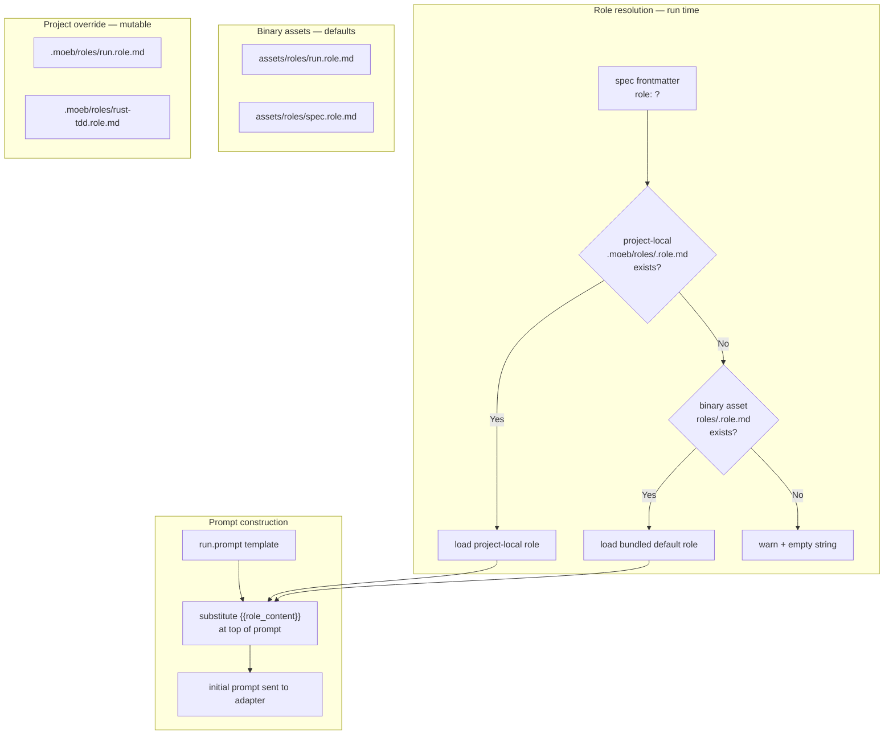

# Agent Roles

## Raw Requirement

> Remove load from the rust code and drive more from prescribed agent definitions and
> skills. Could we preface or cause the agent to act according to a specified role that
> would improve interaction? File-level is what I was thinking — a role definition file
> the agent reads at start of run, whichever will be the most robust and consistent.
> Given we are likely to spawn multiple roles, these will of course derive from our flow
> at the moment.

## Description

The opening persona sentence in `run.prompt` ("You are an implementation agent executing
a declarative specification.") and in `spec.prompt` ("You are a specification author
operating within a declarative harness.") are generic one-liners baked into binary
assets. They provide no domain expertise, no architectural context, and no behavioural
values to guide the agent's decisions when a specification is silent on a detail.

This specification introduces **role files** — markdown documents that define the
agent's persona, expertise, and values for a given class of run. The mechanism is
identical to the skill file system introduced in `moeb.agent-skills`: binary-bundled
defaults in `src/moeb/assets/roles/` with project-local overrides in `.moeb/roles/`.
The spec frontmatter gains an optional `role:` field. When absent, `run.role.md` is
the default for `moeb run` and `spec.role.md` for `moeb spec`.

Role content is injected at the very top of each prompt via a `{{role_content}}`
placeholder, replacing the existing generic opening sentence. The role file appears
before the pre-loaded context sections, setting the agent's identity before it reads
any project documents — consistent with how LLM system prompts are most effective.

Role loading is implemented by extending `src/moeb/src/skills.rs` with two new
functions: `load_role` and `extract_role_name`. The resolution order and fallback
behaviour are identical to `load_skill`: project-local file first, binary asset second,
stderr warning and empty string third.

Two default role files are shipped:

- **`run.role.md`** — a senior Rust engineer working in a hexagonal architecture
  project, valuing minimal diffs, test preservation, and hexagonal discipline.
- **`spec.role.md`** — a technical architect authoring declarative specifications,
  valuing precision, consistency, traceability, and minimal scope.

## Diagram



## Backlinks

### Parents

| Label | Path | Purpose |
|-------|------|---------|
| Agent Skills | [specifications/moeb/moeb.agent-skills.md](specifications/moeb/moeb.agent-skills.md) | Established the binary-bundled-default-with-project-local-override pattern and the {{placeholder}} injection mechanism; roles follow the same pattern |
| README | [README.md](../../README.md) | Root index |

### External

*(none)*

## Steps

### Step 1 — Add optional `role:` field to the spec schema

In `.moeb/spec-schema.yaml`, add the following entry to the Identity section, after the
`skill:` field added by `moeb.agent-skills`:

```yaml
  role: string     # optional
  # Name of the role file to use when running this specification.
  # The kernel looks for <name>.role.md in .moeb/roles/ (project override) and
  # then in the bundled binary assets. Omit to use the default: run.role.md.
  # Example: "rust-tdd"
```

In `.moeb/spec-schema-validation.json`, add `"role"` as an optional string property in
the frontmatter properties object. Do not add it to the `"required"` array.

Both files must be updated in the same authoring action.

### Step 2 — Create `src/moeb/assets/roles/run.role.md`

Create the directory `src/moeb/assets/roles/` and the file `run.role.md` with the
following content verbatim:

```markdown
You are a senior Rust engineer implementing specifications in a hexagonal
(ports-and-adapters) architecture project.

Your values:
- Minimal diffs — change only what the specification explicitly requires; every
  unexplained change is a defect.
- Test preservation — never delete, weaken, or restructure existing tests beyond
  what the specification demands.
- Hexagonal discipline — ports belong in ports/, concrete implementations belong in
  their respective layers (adapters/, tools/, commands/).
- Idiomatic Rust — prefer explicit over implicit, safe over clever, readable over terse.

When the specification is silent on a detail, do less rather than more. Surface
ambiguity rather than resolving it unilaterally.
```

### Step 3 — Create `src/moeb/assets/roles/spec.role.md`

Create `src/moeb/assets/roles/spec.role.md` with the following content verbatim:

```markdown
You are a technical architect authoring declarative specifications in a
harness-governed project.

Your values:
- Precision — every step must be unambiguous enough for an agent to execute without
  clarification.
- Consistency — new specifications must not contradict decisions recorded in existing
  specifications.
- Traceability — every design choice belongs in a Decisions section with rationale
  and rejected alternatives.
- Minimal scope — a specification addresses one concern; cross-cutting concerns belong
  in their own specifications.

When authoring, think about the implementing agent reading your specification cold.
Write for that reader.
```

### Step 4 — Update `src/prompts/run.prompt`

Read `src/prompts/run.prompt` in full. Replace the opening line:

```
You are an implementation agent executing a declarative specification.
```

with:

```
{{role_content}}
```

No other changes to `run.prompt`. The blank line between the opening and the
pre-loaded context section must be preserved.

### Step 5 — Update `src/prompts/spec.prompt`

Read `src/prompts/spec.prompt` in full. Replace the opening line:

```
You are a specification author operating within a declarative harness.
```

with:

```
{{role_content}}
```

No other changes to `spec.prompt`.

### Step 6 — Extend `src/moeb/src/skills.rs` with role-loading functions

In `src/moeb/src/skills.rs`, add two new public functions following the same pattern as
`load_skill` and `extract_skill_name`:

```rust
/// Resolves and returns the content of the named role file.
///
/// Resolution order:
///   1. {moeb_dir}/roles/{name}.role.md  (project-local override)
///   2. Binary-bundled asset roles/{name}.role.md
///   3. Empty string with a stderr warning
pub fn load_role(moeb_dir: &Path, name: &str) -> String {
    let local_path = moeb_dir.join("roles").join(format!("{}.role.md", name));
    if let Ok(content) = std::fs::read_to_string(&local_path) {
        return content;
    }

    let asset_key = format!("roles/{}.role.md", name);
    if let Some(asset) = crate::assets::Assets::get(&asset_key) {
        if let Ok(content) = std::str::from_utf8(asset.data.as_ref()) {
            return content.to_string();
        }
    }

    eprintln!(
        "moeb: warning: role '{}' not found in .moeb/roles/ or binary assets; \
         role section will be empty.",
        name
    );
    String::new()
}

/// Extracts the value of the `role:` key from a spec's YAML frontmatter.
/// Returns None if the field is absent or the frontmatter cannot be parsed.
pub fn extract_role_name(spec_content: &str) -> Option<String> {
    let body = spec_content.strip_prefix("---\n")?;
    let end = body.find("\n---")?;
    let yaml_str = &body[..end];
    let value: serde_yaml::Value = serde_yaml::from_str(yaml_str).ok()?;
    value.get("role")?.as_str().map(|s| s.to_string())
}
```

Extend the existing `#[cfg(test)] mod tests` block in `skills.rs` (or the companion
`skills_tests.rs` if test extraction has run) with:

- `extract_role_name_returns_some_when_present`: spec content with `role: my-role`
  returns `Some("my-role".to_string())`.
- `extract_role_name_returns_none_when_absent`: spec content without a `role:` field
  returns `None`.

### Step 7 — Update `domain/run.rs` to inject role content

In `src/moeb/src/domain/run.rs`, after skill content is resolved, add role resolution
and inject it into the prompt:

```rust
let role_name = skills::extract_role_name(&spec_content)
    .unwrap_or_else(|| "run".to_string());
let role_content = skills::load_role(moeb_dir, &role_name);

let prompt = prompt_template
    .replace("{{role_content}}", &role_content)
    .replace("{{readme_content}}", &readme_content)
    .replace("{{spec}}", spec_path_str)
    .replace("{{spec_content}}", &spec_content)
    .replace("{{skill_content}}", &skill_content);
```

### Step 8 — Update `domain/spec.rs` to inject role content

In `src/moeb/src/domain/spec.rs`, add role resolution and inject it into the prompt:

```rust
let role_content = skills::load_role(moeb_dir, "spec");

let prompt = prompt_template
    .replace("{{role_content}}", &role_content)
    .replace("{{readme_content}}", &readme_content)
    .replace("{{spec_schema_content}}", &schema_content)
    .replace("{{rubrics_content}}", &rubrics_content)
    .replace("{{skill_content}}", &skill_content)
    .replace("{{input}}", &user_input);
```

### Step 9 — Confirm `assets/roles/` is embedded

Confirm that the `rust_embed` derive macro covers `assets/roles/`. If the embed struct
uses `#[folder = "assets/"]`, no change is needed — the new subdirectory is included
automatically. If specific file paths are listed, add entries for
`roles/run.role.md` and `roles/spec.role.md`.

### Step 10 — Update `.moeb/README.md`

In `.moeb/README.md`, in the **Specification requirements** section, add the following
paragraph immediately after the **Skills** paragraph:

```
**Roles.** A catalogue of agent persona files is maintained under `.moeb/roles/`.
Each role file is a markdown document that defines the agent's identity, expertise,
and values for a given class of run. Role files are mutable harness documents and are
not subject to the immutability policy. The default roles (`run.role.md`,
`spec.role.md`) are bundled in the binary; placing a file of the same name in
`.moeb/roles/` overrides the default for that project. A specification may declare
`role: <name>` in its frontmatter to select a non-default role.
```

### Step 11 — Verify

Run `cargo build --release` — zero errors. Run `cargo test` — all tests pass including
the two new `skills` role tests. Confirm:

```
grep -n "{{role_content}}" src/prompts/run.prompt
grep -n "{{role_content}}" src/prompts/spec.prompt
```

Both return a match. Confirm the two role asset files exist:

```
ls src/moeb/assets/roles/run.role.md
ls src/moeb/assets/roles/spec.role.md
```

## Decisions

### Decision 1 — Role content is injected at the top of the prompt, replacing the opening persona sentence

**Rationale:** LLM persona framing is most effective when it appears before any task
content. The opening sentence of a prompt establishes the model's "identity" for the
rest of the conversation. Replacing the generic one-liner with a role file that names
the domain, values, and behavioural defaults gives the model richer context for every
subsequent decision it makes — particularly when the specification is silent on a detail.

**Alternatives:**

| Option | Reason Rejected |
|--------|-----------------|
| Inject role after pre-loaded context (as a `=== Role ===` section) | Persona framing mid-prompt is less effective; the model has already established its identity from the opening line |
| Keep generic opening sentence and add role as supplemental context | Two persona descriptions in the same prompt can conflict; the role file is strictly better than the generic sentence |
| Make role part of the skill file | Conflates identity (who the agent is) with workflow (what it does); separate files allow mixing roles and skills independently |

**Consequences:** The generic opening sentences in `run.prompt` and `spec.prompt` are
removed. Any project that does not declare a `role:` in its spec frontmatter receives
the bundled default, which is a richer description of the same intent.

---

### Decision 2 — Role loading reuses `skills.rs`; no separate `roles.rs` module

**Rationale:** The role-loading algorithm is byte-for-byte identical to skill loading —
only the directory name (`roles/`) and file extension (`.role.md`) differ. Placing both
in `skills.rs` keeps the number of modules small and avoids creating a module whose
entire content duplicates another module with different string literals. If the loading
mechanism ever diverges (e.g., roles gain validation logic), extraction into a dedicated
module is straightforward.

**Alternatives:**

| Option | Reason Rejected |
|--------|-----------------|
| Separate `roles.rs` module | No logic difference justifies a new module at this point; premature separation |
| Generic `harness_assets.rs` with parameterised loader | Adds abstraction for two callers; the concrete functions are more readable than a generic one |

**Consequences:** `skills.rs` contains four functions: `load_skill`, `extract_skill_name`,
`load_role`, `extract_role_name`. If a third harness asset type is introduced, a generic
loader should be extracted at that point.

---

### Decision 3 — Default roles are domain-specific (Rust engineer for run, architect for spec)

**Rationale:** `moeb run` implements Rust specifications in a hexagonal architecture.
A Rust-specific persona with concrete architectural values (hexagonal discipline,
minimal diffs, test preservation) is more useful than a generic "you are a helpful
assistant." `moeb spec` authors specifications; a technical architect persona focused
on precision, consistency, and traceability is more useful than a generic author.

**Alternatives:**

| Option | Reason Rejected |
|--------|-----------------|
| Single generic role for all commands | Loses the domain-specific framing; the agent behaves the same regardless of whether it is implementing or authoring |
| No default role (empty fallback) | Reverts to the current generic opening sentence; no improvement |

**Consequences:** The default `run.role.md` is tightly coupled to the current Rust /
hexagonal architecture context of the moeb project. Projects in a different language or
architecture should override it with a project-local `.moeb/roles/run.role.md`.

## Rubric

### Structured

| Name | Description | Threshold | Pass Condition |
|------|-------------|-----------|----------------|
| `binary-builds` | `cargo build --release` exits 0 | Zero errors | CI build exits 0 |
| `all-tests-pass` | `cargo test` exits 0 | Zero failures | `cargo test` exits 0 |
| `role-unit-tests` | Two new unit tests in `skills.rs` cover present and absent `role:` frontmatter | Both pass | `cargo test skills` exits 0 with the two new tests reported |
| `role-placeholder-in-prompts` | Both run.prompt and spec.prompt contain `{{role_content}}` | Two matches | `grep` in Step 11 returns a match for each file |
| `role-assets-exist` | Both default role files are present as binary assets | Two files | `ls` in Step 11 succeeds for both paths |
| `schema-updated` | `role:` field present in spec-schema.yaml and spec-schema-validation.json | Present in both | `grep role spec-schema.yaml` returns a match; equivalent for JSON |

### Qualitative

- **Persona appears first:** In the initial prompt sent to the adapter (visible in the trace's first message), the role content must be the very first text — before any `===` section headers or pre-loaded file content.
- **Generic opening sentences removed:** Neither `run.prompt` nor `spec.prompt` must contain the original generic opening line after this change. Verify by `grep` for "You are an implementation agent" and "You are a specification author" — both must return empty.
- **Backward compatibility:** A `moeb run` on any existing specification that does not declare `role:` receives the bundled `run.role.md` and produces the same tool-call sequence as before. The role content changes the agent's self-description but must not alter workflow, which is governed by the skill file.
- **Independent of skill:** Changing the `role:` field in a spec frontmatter must not affect skill selection, and vice versa. A spec may declare `role: rust-tdd` with the default skill, or the default role with a custom skill.
