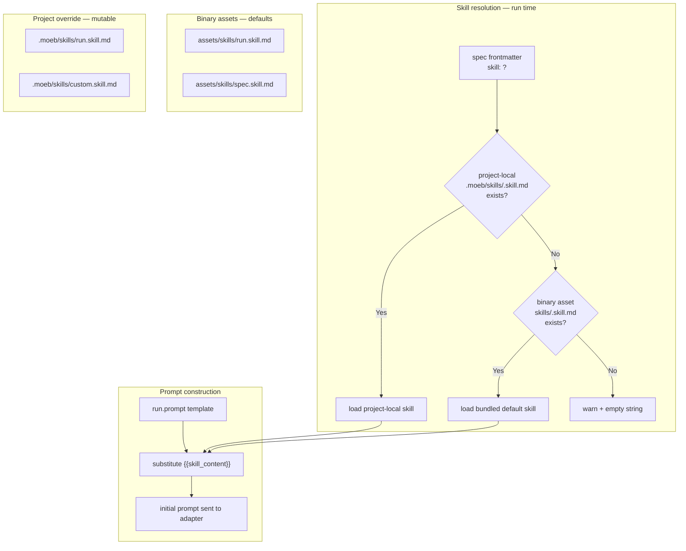

# Agent Skills

## Raw Requirement

> Drive more from prescribed agent definitions and skills. We should be able to determine
> a workflow for spec and run that would suit AI best. Effective workflows exist in Claude
> Code — reading files, creating todos, executing each todo and marking completion. We are
> purely prompting raw agents with requirements; we could preface or cause the agent to
> act according to a specified role that would improve interaction. Skills should be
> file-level (a role definition file the agent reads at start of run), whichever is most
> robust and consistent.

## Description

Currently the workflow for `moeb run` is embedded in `run.prompt`, a binary-baked
template. Improving it requires recompiling the binary. There is no mechanism for a
project to customise or extend the workflow for a specific domain or specification type.

This specification introduces a **skill file** system. A skill file is a markdown
document in `src/moeb/assets/skills/` (embedded in the binary as a default) that defines
the workflow phases the agent follows during a run or spec invocation. Projects can
override any skill by placing a file of the same name in `.moeb/skills/`; the kernel
prefers the project-local file over the bundled default.

The spec frontmatter gains an optional `skill:` field. When present, the named skill
file is loaded (`<name>.skill.md`). When absent, `run.skill.md` is the default for
`moeb run` and `spec.skill.md` for `moeb spec`.

The kernel injects skill content into the prompt via a new `{{skill_content}}`
placeholder in `run.prompt` and `spec.prompt`. `run.prompt` is restructured: the
workflow instructions currently embedded in it (the "DO NOT narrate" directive, discovery
steps, and implementation loop) move into `run.skill.md`, and the prompt retains only
the pre-loaded context headers, the cache-hit hint, the harness constraints, and the
HARD RULES. `spec.prompt` receives the `{{skill_content}}` placeholder additively
(between the pre-loaded context section and the no-re-read instruction); its existing
format requirements are unchanged.

The `run.skill.md` default skill incorporates the task-list tool workflow from
`moeb.task-list-tools` (create_task_list → scoped reads → write_file + update_task →
verify_rubrics), superseding the additive prompt changes made by Step 8 of that
specification. Those run.prompt changes are removed by this spec; the equivalent
content moves into the skill file.

Skill loading lives in a new `src/moeb/src/skills.rs` module used by both
`domain/run.rs` and `domain/spec.rs`. Skills are mutable harness documents — they are
not subject to the spec immutability policy and can be improved by editing the file,
consistent with the precedent established for `rubrics/rubrics.index.md`.

## Diagram



## Backlinks

### Parents

| Label | Path | Purpose |
|-------|------|---------|
| Task-List Tools | [specifications/moeb/moeb.task-list-tools.md](specifications/moeb/moeb.task-list-tools.md) | Introduced create_task_list, update_task, and verify_rubrics tools and added their usage to run.prompt (Step 8); this spec supersedes that prompt change by moving the workflow into run.skill.md |
| Spec Prompt: Static File Pre-load and Redundant-Read Prevention | [specifications/moeb/moeb.spec-prompt-preload.md](specifications/moeb/moeb.spec-prompt-preload.md) | Established the pattern of injecting pre-loaded file content into prompts via template placeholders; {{skill_content}} follows the same pattern |
| Rubrics Index | [specifications/moeb/moeb.rubrics-index.md](specifications/moeb/moeb.rubrics-index.md) | Established the mutable harness document pattern (.moeb/rubrics/ not subject to immutability policy); .moeb/skills/ follows the same precedent |
| README | [README.md](../../README.md) | Root index |

### External

*(none)*

## Steps

### Step 1 — Add optional `skill:` field to the spec schema

In `.moeb/spec-schema.yaml`, add the following entry to the Identity section, after the
`supersedes` block:

```yaml
  skill: string    # optional
  # Name of the skill file to use when running this specification.
  # The kernel looks for <name>.skill.md in .moeb/skills/ (project override) and
  # then in the bundled binary assets. Omit to use the default: run.skill.md.
  # Example: "rust-implementation"
```

In `.moeb/spec-schema-validation.json`, add `"skill"` as an optional string property in
the properties object of the frontmatter schema. Do not add it to the `"required"` array.

Both files must be updated in the same authoring action per the schema-split spec.

### Step 2 — Create `src/moeb/assets/skills/run.skill.md`

Create the directory `src/moeb/assets/skills/` and the file `run.skill.md` with the
following content verbatim:

```markdown
IMPORTANT — DO NOT narrate, plan, or summarise before calling tools. Your FIRST action
must be a tool call. Do not write "let me start", "I will now", "here is my plan", or
any equivalent preamble. Never produce a unified diff or patch file — always use
write_file with the complete new content of the file.

## Phase 1 — Plan

Call `create_task_list` as your very first tool call. Derive one task per numbered Step
in the specification's `## Steps` section. Each task entry must state which file(s) it
touches and what change is required.

## Phase 2 — Scope

Before modifying anything, locate all relevant code:

1. Call `list_directory` on `src/` to understand the top-level project layout.
2. Call `search_files` with path `src/` and an appropriate extension (e.g. `rs`, `toml`)
   to enumerate source files relevant to the specification.
3. Call `grep_files` to locate the specific functions, types, or modules that need to
   change. Note the file path and line number in each result.
4. Call `read_file_range` with the file path, a start line a few lines before the match,
   and an end line that covers the complete function or block. Prefer `read_file_range`
   over `read_files` — only read a full file when you cannot determine the relevant range
   from grep results or when writing a complete file replacement.

## Phase 3 — Implement

For each task in your task list, in order:

1. State the exact items you will modify in the target file and which specification step
   requires each change (pre-write declaration — HARD RULE 4).
2. Read the current file content. Use `read_file_range` for targeted sections; use
   `read_file` only when writing a complete file replacement.
3. Write the file using `write_file` with the complete new content.
4. Call `update_task` with `status: "done"`.

Continue until all tasks are marked done.

## Phase 4 — Verify

Call `verify_rubrics` with a pass, fail, or na verdict for each structured rubric
criterion in the specification's `## Rubric` section.

## Phase 5 — Complete

Respond with a concise summary of every file created or updated.
```

### Step 3 — Create `src/moeb/assets/skills/spec.skill.md`

Create `src/moeb/assets/skills/spec.skill.md` with the following content verbatim:

```markdown
The harness README, specification schema, and rubrics catalogue are already in your
context. Do not re-read any of them.

## Phase 1 — Contradiction check

Before authoring, verify that the proposed specification does not contradict any active
decision recorded in an existing specification visible in the README index. If a
contradiction exists, stop and surface it explicitly rather than proceeding.

## Phase 2 — Author

Write the complete specification document conforming to the schema:

- Begin with YAML frontmatter between `---` markers containing at minimum: `domain`,
  `slug`, `status`. Include `supersedes` if this spec overrides a named decision.
- Include all required sections in this order: title (H1), Raw Requirement, Description,
  Diagram (fenced Mermaid block), Backlinks, Steps, Decisions, Rubric.
- For rubric criteria, copy any applicable standard criterion from `rubrics.index.md`
  verbatim (id as the Name value). Add spec-specific criteria as additional rows.
- Backlinks must include at minimum one Parents entry pointing to `README.md`.

## Phase 3 — Validate before output

Before producing output, verify:
- All required frontmatter fields are present.
- All required sections exist and are non-empty.
- The Mermaid diagram block is syntactically plausible.
- The Rubric section contains at least one structured criterion.

## Phase 4 — Output

Your response must be the complete specification document and nothing else — no preamble,
no explanation, no trailing text. Begin with exactly `---`.
```

### Step 4 — Restructure `src/prompts/run.prompt`

Read `src/prompts/run.prompt` in full. Replace its entire content with the following.
The workflow instructions (discovery steps, implementation loop, rubric prose check)
are removed — they now live in `run.skill.md`. The task-list tool instructions added
by `moeb.task-list-tools` Step 8 are also removed for the same reason. The HARD RULES,
harness constraints, and cache-hit hint remain.

```
You are an implementation agent executing a declarative specification.

The following files have been provided to you as context — do not call read_file for them:

=== .moeb/README.md ===
{{readme_content}}

=== {{spec}} ===
{{spec_content}}

=== Workflow ===
{{skill_content}}

If a `read_file` result begins with `[CACHE HIT:`, the file has not changed since it was sent; locate the content in your context from the indicated turn and use it directly — do not re-read the file.

Harness constraints you must follow at all times:
- Your working directory is the repository root. `src/` and `.moeb/` are both immediate children of that root.
- All implementation artifacts (source files, tests, configuration) must be placed under src/. Never create or modify files under .moeb/.
- The kernel must remain as dumb as possible — it is an interface to external services, not a place for decision-making logic.
- Do not introduce behaviour that contradicts decisions recorded in any parent or linked specification.
- Never delete, remove, or omit existing tests, functions, types, constants, or other code that is not explicitly required to change by the specification. When writing a complete file replacement, read the current file in full first with read_file and carry forward every item that the specification does not explicitly target.

HARD RULES — any violation is a critical failure and the run must not be considered successful:

1. Test preservation: `#[cfg(test)]` modules and every function inside them must be preserved in every file you write. You may not delete or remove any test. If a specification step directly modifies a function, type, or constant that an existing test exercises, that test may be updated only to the minimum extent needed to compile and pass against the new implementation. No rewrites, simplifications, or restructuring of test logic are permitted beyond what compilation requires.

2. Minimum diff: Before writing any file, read the current version in full. Then mentally produce a diff containing only the lines required by the specification. Your write_file call must match that diff — nothing more. Any change not traceable to a numbered step in the specification is a violation.

3. Function scope: If a function, type, constant, or comment is not named or directly implied by the specification, its body must be copied byte-for-byte from the source. Do not simplify, reformat, rename, or restructure it.

4. Pre-write declaration: Before your first write_file call on any file, output a short list of the exact items you will modify in that file and which specification step requires each change. Do not write the file until that list is complete.
```

### Step 5 — Update `src/prompts/spec.prompt` additively

Read `src/prompts/spec.prompt` in full. Insert the following block between the closing
of the `=== rubrics/rubrics.index.md ===` section and the existing "Do not re-read any
file..." line:

```
=== Workflow ===
{{skill_content}}

```

No other changes to `spec.prompt`. The existing format requirements, frontmatter
instructions, and section-order rules are unchanged.

### Step 6 — Create `src/moeb/src/skills.rs`

Create a new file with a single public function for skill resolution:

```rust
use std::path::Path;

/// Resolves and returns the content of the named skill file.
///
/// Resolution order:
///   1. {moeb_dir}/skills/{name}.skill.md  (project-local override)
///   2. Binary-bundled asset skills/{name}.skill.md
///   3. Empty string with a stderr warning
pub fn load_skill(moeb_dir: &Path, name: &str) -> String {
    // 1. Project-local override
    let local_path = moeb_dir.join("skills").join(format!("{}.skill.md", name));
    if let Ok(content) = std::fs::read_to_string(&local_path) {
        return content;
    }

    // 2. Bundled binary asset
    let asset_key = format!("skills/{}.skill.md", name);
    if let Some(asset) = crate::assets::Assets::get(&asset_key) {
        if let Ok(content) = std::str::from_utf8(asset.data.as_ref()) {
            return content.to_string();
        }
    }

    // 3. Fallback
    eprintln!(
        "moeb: warning: skill '{}' not found in .moeb/skills/ or binary assets; \
         workflow section will be empty.",
        name
    );
    String::new()
}

/// Extracts the value of the `skill:` key from a spec's YAML frontmatter.
/// Returns None if the field is absent or the frontmatter cannot be parsed.
pub fn extract_skill_name(spec_content: &str) -> Option<String> {
    let body = spec_content.strip_prefix("---\n")?;
    let end = body.find("\n---")?;
    let yaml_str = &body[..end];
    let value: serde_yaml::Value = serde_yaml::from_str(yaml_str).ok()?;
    value.get("skill")?.as_str().map(|s| s.to_string())
}
```

Include a `#[cfg(test)] mod tests` block with:
- `extract_skill_name_returns_some_when_present`: spec content with `skill: my-skill`
  returns `Some("my-skill".to_string())`.
- `extract_skill_name_returns_none_when_absent`: spec content without `skill:` field
  returns `None`.
- `extract_skill_name_returns_none_on_invalid_yaml`: malformed frontmatter returns `None`.

### Step 7 — Update `domain/run.rs` to inject skill content

In `src/moeb/src/domain/run.rs`, after the spec content is read and the prompt template
is loaded, add skill resolution and substitution:

```rust
use crate::skills;

// After reading spec_content and loading the run.prompt template:
let skill_name = skills::extract_skill_name(&spec_content)
    .unwrap_or_else(|| "run".to_string());
let skill_content = skills::load_skill(moeb_dir, &skill_name);

let prompt = prompt_template
    .replace("{{readme_content}}", &readme_content)
    .replace("{{spec}}", spec_path_str)
    .replace("{{spec_content}}", &spec_content)
    .replace("{{skill_content}}", &skill_content);
```

Where `moeb_dir` is the path to the `.moeb/` directory already used in this function
to read `README.md` and the spec file.

### Step 8 — Update `domain/spec.rs` to inject skill content

In `src/moeb/src/domain/spec.rs`, after the spec.prompt template is loaded and the
pre-loaded sections are assembled, add the spec skill:

```rust
use crate::skills;

let skill_content = skills::load_skill(moeb_dir, "spec");

let prompt = prompt_template
    .replace("{{readme_content}}", &readme_content)
    .replace("{{spec_schema_content}}", &schema_content)
    .replace("{{rubrics_content}}", &rubrics_content)
    .replace("{{skill_content}}", &skill_content)
    .replace("{{input}}", &user_input);
```

### Step 9 — Register `skills` module and embed `assets/skills/`

In `src/moeb/src/main.rs`, add:

```rust
mod skills;
```

Confirm that the `rust_embed` derive macro on the `Assets` struct (or equivalent embed
type) uses `#[folder = "assets/"]` or similar — adding `assets/skills/` as a
subdirectory should be picked up automatically. If the embed macro targets only specific
files, add entries for `skills/run.skill.md` and `skills/spec.skill.md`.

### Step 10 — Update `.moeb/README.md` to document the skills directory

In `.moeb/README.md`, in the **Specification requirements** section (after the Rubrics
paragraph), add:

```
**Skills.** A catalogue of workflow skill files is maintained under `.moeb/skills/`.
Each skill file is a markdown document that defines the phases an agent follows during
a `moeb run` or `moeb spec` invocation. Skill files are mutable harness documents and
are not subject to the immutability policy. The default skills (`run.skill.md`,
`spec.skill.md`) are bundled in the binary; placing a file of the same name in
`.moeb/skills/` overrides the default for that project. A specification may declare
`skill: <name>` in its frontmatter to select a non-default skill.
```

### Step 11 — Verify

Run `cargo build --release` — zero errors. Run `cargo test` — all tests pass including
the three new `skills` unit tests. Confirm:

```
grep -n "{{skill_content}}" src/prompts/run.prompt
grep -n "{{skill_content}}" src/prompts/spec.prompt
```

Both return a match. Confirm the two skill asset files exist:

```
ls src/moeb/assets/skills/run.skill.md
ls src/moeb/assets/skills/spec.skill.md
```

Perform a `moeb run` against any active specification and confirm the trace's first
`ToolCallEvent` is `create_task_list` (the skill's Phase 1 instruction).

## Decisions

### Decision 1 — Binary-bundled defaults with project-local override, not prompt-embedded workflow

**Rationale:** The current workflow is embedded in `run.prompt`, a binary asset that
requires recompilation to change. Moving workflow to a skill file that is also bundled in
the binary does not remove the recompilation requirement for the bundled default, but it
makes the format visible and overridable: placing `.moeb/skills/run.skill.md` in a
project immediately takes effect without any binary change. Projects with specialist
domains (e.g., a spec requiring a different discovery strategy) can customise their skill
without forking the kernel.

**Alternatives:**

| Option | Reason Rejected |
|--------|-----------------|
| Workflow stays in run.prompt | Cannot be customised per-project; changes require binary release |
| Skill files only in .moeb/skills/ (no binary default) | Fresh projects have no workflow until they manually create skill files; breaks out-of-the-box experience |
| Skill files only in the binary (no project override) | Removes per-project customisation, which is the primary value proposition |

**Consequences:** Two sources of truth for skill content exist (binary asset and
project-local file). The project-local file always wins. Projects that need the default
behaviour need not create any skill files.

---

### Decision 2 — `run.prompt` retains HARD RULES and harness constraints; workflow moves entirely to skill

**Rationale:** HARD RULES (test preservation, minimum diff, function scope, pre-write
declaration) and harness constraints (src/ boundary, no .moeb/ writes) are invariants
that apply to every run regardless of skill. Keeping them in `run.prompt` ensures they
cannot be accidentally omitted by a custom skill file. The workflow (what phases to
follow, which tools to call) is skill-specific and belongs in the skill file.

**Alternatives:**

| Option | Reason Rejected |
|--------|-----------------|
| Move HARD RULES to the skill file | A skill file that omits or weakens HARD RULES would silently remove critical guardrails |
| Keep both workflow and HARD RULES in run.prompt and use skill as supplemental guidance | Skill and prompt instructions would duplicate or conflict; the agent receives contradictory instructions |

**Consequences:** Custom skill files can define any workflow they like, but cannot
override or remove HARD RULES or harness constraints. Those remain unconditionally in
the prompt.

---

### Decision 3 — `spec.prompt` receives `{{skill_content}}` additively; existing format instructions are unchanged

**Rationale:** `spec.prompt` contains detailed, schema-driven output format requirements
(frontmatter fields, section order, `---` prefix). These are schema enforcement, not
workflow. Replacing them with a skill file would risk omission of critical format
constraints. The spec skill file adds authoring quality guidance (contradiction check,
rubric criterion selection) without touching output format rules.

**Alternatives:**

| Option | Reason Rejected |
|--------|-----------------|
| Move all spec.prompt instructions to spec.skill.md | Format requirements could be omitted from a custom skill, producing invalid specs |
| Do not update spec.prompt in this spec | spec.prompt has no workflow injection point; the spec skill would never be loaded |

**Consequences:** `spec.prompt` grows by the `{{skill_content}}` block and the spec
skill content. Existing spec authoring behaviour is unchanged; the skill adds a
pre-authoring checklist layer.

---

### Decision 4 — `run.skill.md` incorporates the task-list tool workflow from `moeb.task-list-tools`

**Rationale:** `moeb.task-list-tools` Step 8 added `create_task_list`, `update_task`,
and `verify_rubrics` instructions to `run.prompt`. This spec moves workflow out of
`run.prompt` and into `run.skill.md`. The task-list tool instructions move with it.
Leaving them in `run.prompt` after workflow is extracted would produce duplicate
instructions — once in the prompt and once in the skill.

**Alternatives:**

| Option | Reason Rejected |
|--------|-----------------|
| Keep task-list instructions in run.prompt and add them again in the skill | Agent receives duplicate workflow instructions; risk of instruction conflict |
| Omit task-list instructions from skill file | Agents using the skill would never call create_task_list; the task-list tools would be unused |

**Consequences:** The additive run.prompt changes from `moeb.task-list-tools` Step 8
are removed by this spec. The equivalent content is present in `run.skill.md`. Any
future task-list tool changes must update the skill file, not `run.prompt`.

## Rubric

### Structured

| Name | Description | Threshold | Pass Condition |
|------|-------------|-----------|----------------|
| `binary-builds` | `cargo build --release` exits 0 | Zero errors | CI build exits 0 |
| `all-tests-pass` | `cargo test` exits 0 | Zero failures | `cargo test` exits 0 |
| `skills-unit-tests` | Three unit tests in `skills.rs` cover present, absent, and invalid-yaml frontmatter cases | All three pass | `cargo test skills` exits 0 with 3 tests reported |
| `skill-placeholder-in-prompts` | Both run.prompt and spec.prompt contain `{{skill_content}}` | Two matches | `grep` in Step 11 returns a match for each file |
| `skill-assets-exist` | Both default skill files are present as binary assets | Two files | `ls` in Step 11 succeeds for both paths |
| `schema-updated` | `skill:` field present in spec-schema.yaml and spec-schema-validation.json | Present in both | `grep skill spec-schema.yaml` and equivalent for JSON return matches |

### Qualitative

- **Out-of-the-box behaviour preserved:** A `moeb run` on any existing specification (that does not declare `skill:`) must produce the same tool-call sequence as before this spec, because `run.skill.md` contains the same workflow instructions previously in `run.prompt`. The trace's first tool call must be `create_task_list`.
- **Custom skill takes effect without recompilation:** Placing `.moeb/skills/run.skill.md` in a project directory and running `moeb run` must cause the project-local skill content to appear in the `=== Workflow ===` section of the initial prompt (verifiable from the trace's initial message content).
- **HARD RULES survive the restructure:** The four HARD RULES must appear verbatim in `run.prompt` after this change. They must not appear in `run.skill.md` (to avoid duplication).
- **No regression in spec authoring:** `moeb spec` must continue to produce valid specifications that pass schema validation. The `spec.skill.md` content is additive guidance and must not conflict with any existing format instruction in `spec.prompt`.
