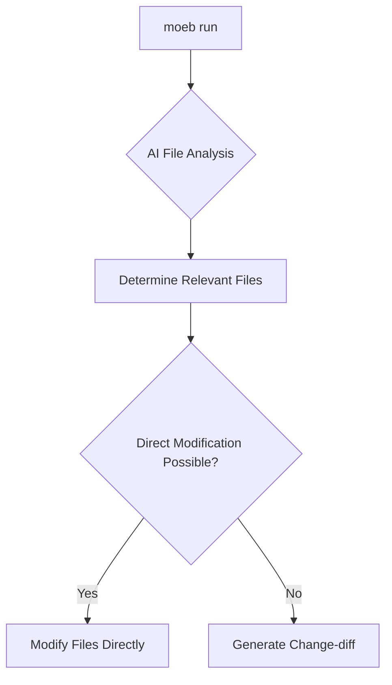

# AI File Modification Detection

## Raw Requirement

At present moeb run is just returning suggestions for what to do, this is based on our connection to openai, we need a way for the AI to determine the files needed to modify without submitting the entire repository src every time, this may be a cause to implement some AI tools for it to use and supply them as available tools in the run.prompt. This should ideally lead to a change-diff to be provided in the instances where files cannot be modified directly.

## Description

This specification outlines the implementation of an AI-based mechanism for determining necessary file modifications without requiring the entire repository to be processed. This involves integrating specific AI tools capable of analyzing file relevance based on provided requirements. The process should generate a change-diff when files cannot be directly modified, optimizing efficiency in file handling within the `moeb run` process.



## Backlinks

- label: Moeb Kernel
  path: specifications/moeb/moeb.kernel.md
  purpose: Parent spec

## Steps

1. **Integrate AI Tools for File Analysis**
   - Identify and integrate AI tools capable of determining file importance based on provided specifications or requirements.
   - Ensure these tools are efficiently accessible within the `moeb run` framework.

2. **Implement File Selection Mechanism**
   - Develop a mechanism within `moeb run` that utilizes integrated AI tools to identify necessary files for modification.
   - This mechanism should minimize data sent to OpenAI by analyzing only relevant file changes.

3. **Develop Change-diff Generation Process**
   - Create a process that generates a change-diff document when direct file modification is unfeasible, ensuring that the development process can continue seamlessly.

4. **Validate and Test Integration**
   - Test the implemented AI tools and processes to validate efficiency and correctness in detecting and handling file changes.
   - Iteratively refine the system based on testing feedback.

## Decisions

1. **AI Tool Selection**
   - Adopted: Use existing AI tools with proven efficiency in file analysis.
   - Rationale: Reduces development time by leveraging existing solutions.
   - Alternatives: Develop custom AI models, which was rejected due to higher resource requirements.
   - Consequences: Reliance on third-party tools means updates or changes in service may impact functionality.

2. **Change-diff Over Manual Review**
   - Adopted: Automatically generating change-diffs instead of requiring manual inspection.
   - Rationale: Increases workflow efficiency and ensures consistency.
   - Alternatives: Manual review by developers, rejected for its inefficiency.
   - Consequences: Requires robust diff generation logic to ensure reliability.

## Rubric

### Structured

- **Efficiency**
  - Description: Reduction in repository data processed by AI.
  - Threshold: 50% decrease from baseline processing.
  - Pass Condition: Analysis reports confirm the reduction in data processed compared to initial implementations.

- **Accuracy**
  - Description: Precision of file modification suggestions.
  - Threshold: >90% accuracy in test scenarios.
  - Pass Condition: Verification against benchmark tests showing compliance with accuracy threshold.

### Qualitative

- **Integration Quality**
  - Description: The integration should have minimal impact on existing processes and should be seamlessly incorporated within the `moeb run` operation.
```