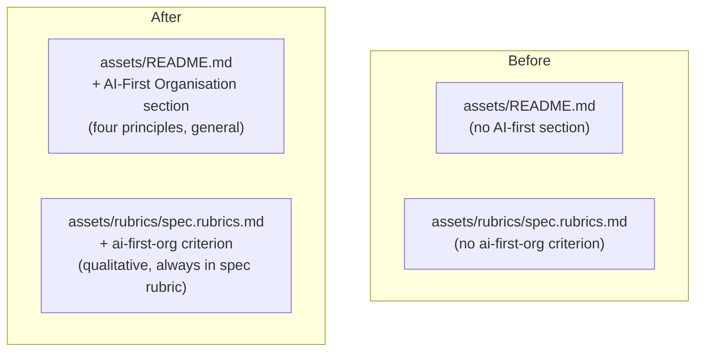

# AI-First Organisation Principles

## Raw Requirement

> AI-first principles (one concern per file, context locality, grep-discoverable names,
> no cross-cutting helpers) should get their own specification. Run outputs should have
> a context-budget rubric that triggers refactoring rather than rejection. Common rubrics
> maintained in binary.

## Description

AI-driven development requires different file-organisation principles than human-driven
development. A human navigating a 600-line file with a table of contents and an IDE
outline view pays a small ergonomic cost; an AI agent receiving that file as a context
block pays in tokens and loses precision. These are not stylistic preferences — they are
load-bearing constraints on agent performance.

This specification formalises four AI-first organisation principles as a general harness
policy in `src/moeb/assets/README.md` and makes compliance a mandatory qualitative
criterion in the spec baseline rubric (`src/moeb/assets/rubrics/spec.rubrics.md`):

1. **One concern per file.** Each source file implements exactly one identifiable
   concern. When a file's concerns are described with "and" (serialisation *and* parsing,
   orchestration *and* schema loading), it must be split.

2. **Context locality.** Code that is read or modified together lives in the same file.
   An agent should be able to understand and implement a change to one feature without
   opening more than two files.

3. **Grep-discoverable names.** Every identifier — function, type, module, constant —
   is specific enough that searching for it by name returns fewer than ten matches across
   the codebase. Generic names (`process`, `handle`, `util`, `helper`, `common`) are
   prohibited unless they are module-scoped and genuinely universal.

4. **No cross-cutting helpers.** A utility function lives in the same file as its only
   caller. If a helper grows to serve three or more callers in different modules, it is
   promoted to a dedicated module with a precise name describing its purpose — never to
   a generic `utils.rs` or `helpers.rs`.

These principles are additive to the context budget (300/400-line thresholds from
`moeb.context-budget-policy`). A file can be within budget and still violate principle 1
if it mixes two unrelated concerns in 200 lines.

No kernel changes. No public API changes. The additions are documentation and rubric
table entries only.

## Diagram



## Backlinks

### Parents

| Label | Path | Purpose |
|-------|------|---------|
| Context Budget Policy | [specifications/moeb/moeb.context-budget-policy.md](specifications/moeb/moeb.context-budget-policy.md) | Established the 300/400-line thresholds in assets/README.md; AI-first principles extend the same document as companion policy |
| Rubric Context Layers | [specifications/moeb/moeb.rubric-context-layers.md](specifications/moeb/moeb.rubric-context-layers.md) | Established assets/rubrics/spec.rubrics.md as the spec baseline rubric file; ai-first-org is added there |
| README | [README.md](../../README.md) | Root index |

### External

*(none)*

## Steps

### Step 1 — Update `src/moeb/assets/README.md`

Read `src/moeb/assets/README.md` in full. Add a new **AI-First Organisation** section
immediately after the **Context Budget** section (which was added by
`moeb.context-budget-policy`). If the Context Budget section does not yet exist, insert
the AI-First Organisation section immediately after the `## Specification requirements`
section. Insert the following content verbatim:

```markdown
---

## AI-First Organisation

AI agents process source files as linear text blocks. Unlike human developers, agents
cannot use outline views, jump-to-definition, or collapsible sections to skip over
irrelevant code. Every line in a file the agent opens is a line of context consumed.
The following four principles minimise that cost.

**One concern per file.** Each source file implements exactly one identifiable concern.
When a file's responsibilities can be described with "and" — serialisation *and* parsing,
orchestration *and* schema loading, HTTP transport *and* response mapping — the file must
be split. The test for this principle: can the file's purpose be stated as a single
noun phrase without a conjunction? If not, split it.

**Context locality.** Code that is read or modified together lives in the same file.
If implementing a change to one feature requires opening more than two files, the code
is mis-organised. Refactor so that each feature's definition, usage, and supporting
helpers are co-located.

**Grep-discoverable names.** Every identifier — function, type, module, constant — is
specific enough that searching for it by name returns fewer than ten results across the
codebase. Generic names such as `process`, `handle`, `util`, `helper`, `common`, and
`base` are prohibited unless they are module-scoped and genuinely universal. The test:
if `grep <name> src/` returns more than ten hits, the name is too generic.

**No cross-cutting helpers.** A utility function lives in the same file as its only
caller. If a helper serves three or more callers in different modules, it is promoted to
a dedicated module with a precise name describing its purpose (e.g. `retry.rs`,
`auth_strip.rs`) — never to a generic `utils.rs`, `helpers.rs`, or `common.rs`.

These principles are enforced by the `ai-first-org` rubric criterion, which appears in
the spec baseline rubric and is verified by the spec agent at authoring time.
```

### Step 2 — Add `ai-first-org` to `src/moeb/assets/rubrics/spec.rubrics.md`

Read `src/moeb/assets/rubrics/spec.rubrics.md` in full. Add the following row to the
criteria table. If the table already contains `no-drift` and `spec-schema-compliance`
rows (added by `moeb.rubric-context-layers` or `moeb.context-budget-policy`), add the
new row after them:

```
| `ai-first-org` | The specification's Steps prescribe file layouts, naming, and helper placement that satisfy the four AI-first organisation principles: one concern per file, context locality, grep-discoverable names, no cross-cutting helpers. | All four principles followed | Manual review: no step produces a file that mixes concerns, no name is generic across the codebase, all helpers are co-located with their callers or promoted to a precisely named module |
```

### Step 3 — Verify

Confirm the AI-first section is present in the binary-bundled README:

```
grep -c "AI-First Organisation" src/moeb/assets/README.md
```

Must return `1`.

Confirm each principle heading appears:

```
grep -c "One concern per file\|Context locality\|Grep-discoverable\|cross-cutting helpers" src/moeb/assets/README.md
```

Must return `4`.

Confirm the criterion is present in the spec baseline rubric:

```
grep -c "ai-first-org" src/moeb/assets/rubrics/spec.rubrics.md
```

Must return `1`.

Run `cargo build --release` — zero errors. Run `cargo test` — all tests pass.

## Decisions

### Decision 1 — Four principles, not more

**Rationale:** Four principles covers the complete set of file-organisation concerns
that affect agent performance: file size (covered by `moeb.context-budget-policy`),
concern purity (one concern per file), reading locality (context locality), naming
searchability (grep-discoverable names), and helper placement (no cross-cutting helpers).
Additional principles — code style, comment density, test coverage — are either already
governed by other specifications or are not meaningfully affected by AI-first concerns.
More principles would dilute the policy and make compliance harder to verify.

**Alternatives:**

| Option | Reason Rejected |
|--------|-----------------|
| Include style and formatting rules | Already enforced by language formatters; not AI-specific |
| Include test coverage thresholds | Coverage is a different quality dimension; covered by `all-tests-pass` and `no-test-regression` |
| Include dependency management rules | Too project-specific; not appropriate for a general harness policy |

**Consequences:** The four principles are stable. New file-organisation concerns
introduced by future specifications must either fit within these four or supersede this
spec with a fifth principle and a rationale.

---

### Decision 2 — `ai-first-org` is a spec-time qualitative criterion, not a run-time criterion

**Rationale:** The AI-first principles govern how a specification *designs* the
implementation — which files it prescribes, how it names them, where it places helpers.
By the time a run agent executes a well-designed specification, the principles are
already embedded in the steps. Making `ai-first-org` a run-time criterion would ask the
run agent to second-guess the specification it is executing. The correct point of
enforcement is the spec agent, which can verify compliance before the design is locked
in.

**Alternatives:**

| Option | Reason Rejected |
|--------|-----------------|
| Run-time rubric criterion | Run agent cannot redesign the spec it is executing; verification would always be retrospective |
| Both spec-time and run-time | Doubles the criterion with no additional enforcement value |
| No rubric criterion; policy only | No audit trail; spec agents may ignore the principles without consequence |

**Consequences:** `ai-first-org` appears in `spec.rubrics.md` and is verified by the
spec agent at authoring time. Run agents do not verify it; they benefit from it because
the spec they execute was designed to comply.

---

### Decision 3 — Policy recorded in `assets/README.md`, not in a separate principles file

**Rationale:** `assets/README.md` is the binary-bundled harness template injected into
every `moeb run` and `moeb spec` initial prompt. Any principle recorded there is
automatically visible to agents without a separate read. A dedicated `principles.md`
file would require an explicit read step, and agents could miss it. The policy belongs
alongside the other harness policies (no drift, context budget) that agents already rely
on from the README.

**Alternatives:**

| Option | Reason Rejected |
|--------|-----------------|
| Separate `assets/ai-first-principles.md` file | Requires explicit read; agents may miss it |
| In `run.skill.md` only | Skill files govern workflow steps, not persistent policy; principles would be invisible during spec authoring |
| In `.moeb/README.md` only | Project-specific; does not propagate to other projects using moeb |

**Consequences:** The AI-first Organisation section in `assets/README.md` is visible
to every agent that receives the binary-bundled README as part of its initial prompt,
across all projects using moeb.

## Rubric

### Structured

| Name | Description | Threshold | Pass Condition |
|------|-------------|-----------|----------------|
| `no-drift` | The specification does not violate any decision recorded in a linked parent specification | Zero contradictions | Manual review of every decision in every parent spec listed in Backlinks |
| `spec-schema-compliance` | All required frontmatter fields and body sections are present and correctly ordered | 100% of required fields and sections | Validation in `domain/spec.rs` exits 0 during `moeb spec` |
| `binary-builds` | `cargo build --release` exits 0 | Zero errors | CI build exits 0 |
| `all-tests-pass` | `cargo test` exits 0 | Zero failures | `cargo test` exits 0 |
| `ai-first-section-present` | `assets/README.md` contains the AI-First Organisation section with all four principles | Section and four principles present | grep checks in Step 3 return 1 and 4 respectively |
| `spec-baseline-criterion-present` | `ai-first-org` row appears in `assets/rubrics/spec.rubrics.md` | Row present | grep in Step 3 returns 1 |

### Qualitative

- **Project-agnostic language:** The AI-First Organisation section added to `assets/README.md` must contain no references to Rust, cargo, `src/moeb/`, or any project-specific path. All examples and descriptions must be stated in language that applies to any codebase.
- **ai-first-org criterion is qualitative by nature:** The pass condition for `ai-first-org` requires manual review of the specification's Steps section. It is not machine-checkable. The spec agent verifies it by reading its own output and confirming no step prescribes a file that mixes concerns, uses generic names, or places helpers in the wrong location.
- **No duplication with context-budget-policy:** This spec adds the AI-first section; it does not repeat or modify the Context Budget section. If both specs are executed in sequence, `assets/README.md` gains two separate sections with no overlap.
