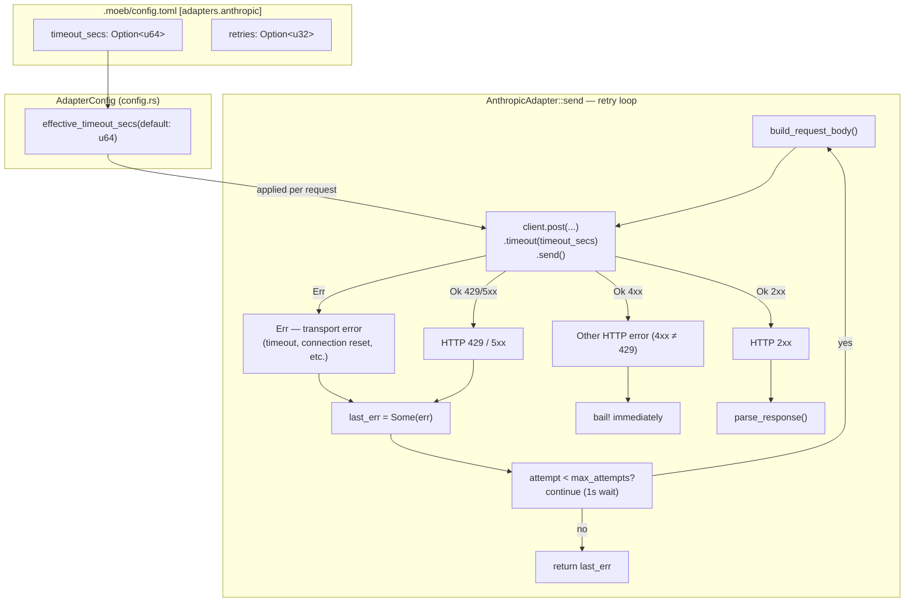

# Anthropic Adapter Timeout and Transport Error Retry

## Raw Requirement

> Error: AI adapter call failed on turn 2
>
> Caused by:
>     0: Failed to reach Anthropic API
>     1: error sending request for url (https://api.anthropic.com/v1/messages)
>     2: operation timed out

## Description

The `AnthropicAdapter` constructs its `reqwest::blocking::Client` with no explicit request timeout,
leaving it dependent on OS-level TCP timeouts for any request that stalls or takes longer than the
system's socket timeout. On long AI turns (turn 2 and beyond) where the model processes substantial
context, this produces the observed "operation timed out" error.

A second structural problem compounds this: the retry loop calls `.send().context("Failed to reach
Anthropic API")?`, which immediately propagates any transport-level error (including timeouts,
connection resets, and DNS failures) out of the retry loop via `?`. Even with `retries > 0`, the
user gets no retries on transport errors — only HTTP 429 and 5xx responses are retried.

This specification fixes both issues:

1. **Per-request timeout.** A `TIMEOUT` key is added to the Anthropic adapter's configurable keys
   (stored as `timeout_secs: Option<u64>` in `AdapterConfig`). The default is 600 seconds. The
   timeout is applied via `reqwest::RequestBuilder::timeout()` on each attempt in the retry loop.

2. **Transport error retry.** The retry loop is restructured so that `.send()` results are matched
   rather than immediately unwrapped. A transport error is treated the same as a 429 or 5xx
   response: it is recorded in `last_err` and the loop continues. Users who configure `retries > 0`
   will now see automatic retry on timeout and other transient network failures.

The `TIMEOUT` key is added only to the Anthropic adapter. The OpenAI adapter retains its existing
valid key set (MODEL, RETRIES) as established by Decision 2 in
`moeb.adapter-config-and-listing.md`. Key validation in `configure()` is restructured to a
pre-match guard so that adapter-specific keys are rejected cleanly for adapters that do not
support them.

## Diagram



## Backlinks

### Parents

| Label | Path | Purpose |
|-------|------|---------|
| Anthropic Claude Adapter | [specifications/moeb/moeb.anthropic-adapter.md](specifications/moeb/moeb.anthropic-adapter.md) | Establishes AnthropicAdapter structure, retry loop, and configurable keys; this spec extends all three |
| Adapter Configuration, Release, and Listing | [specifications/moeb/moeb.adapter-config-and-listing.md](specifications/moeb/moeb.adapter-config-and-listing.md) | Establishes AdapterConfig, valid_keys_for, and Decision 5 (retries only on 429/5xx); this spec supersedes Decision 5 for the AnthropicAdapter and adds TIMEOUT as a new valid key |

### External

*(none)*

## Steps

### Step 1 — Add `timeout_secs` to `AdapterConfig` in `config.rs`

In `src/moeb/src/config.rs`, extend `AdapterConfig` with a new optional field:

```rust
#[derive(Debug, Default, Clone, Serialize, Deserialize)]
pub struct AdapterConfig {
    pub model: Option<String>,
    pub retries: Option<u32>,
    pub timeout_secs: Option<u64>,
}
```

Add a helper method to the existing `AdapterConfig` impl block:

```rust
pub fn effective_timeout_secs(&self, default: u64) -> u64 {
    self.timeout_secs.unwrap_or(default)
}
```

Add a unit test in the `#[cfg(test)]` block of `config.rs`:

- **`adapter_config_timeout_defaults_and_round_trips`**: construct a `MoebConfig` with
  `adapters["anthropic"].timeout_secs = Some(300)`, save, reload, and assert
  `effective_timeout_secs(600) == 300`. Also construct `AdapterConfig::default()` and assert
  `effective_timeout_secs(600) == 600`.

### Step 2 — Add `timeout_secs` to `AnthropicAdapter` and apply timeout per request

In `src/moeb/src/adapters/anthropic.rs`:

1. Change the `DEFAULT_TIMEOUT_SECS` constant from `const` to `pub const`:

```rust
pub const DEFAULT_TIMEOUT_SECS: u64 = 600;
```

2. Add `pub timeout_secs: u64` to `AnthropicAdapter`:

```rust
pub struct AnthropicAdapter {
    api_key: String,
    pub model: String,
    pub retries: u32,
    pub timeout_secs: u64,
    client: reqwest::blocking::Client,
}
```

3. In `from_secrets_and_config()`, populate the new field:

```rust
Ok(Self {
    api_key,
    model: adapter_cfg.effective_model(DEFAULT_MODEL),
    retries: adapter_cfg.effective_retries(),
    timeout_secs: adapter_cfg.effective_timeout_secs(DEFAULT_TIMEOUT_SECS),
    client: reqwest::blocking::Client::new(),
})
```

4. In `Adapter::send`, restructure the HTTP call so that transport errors feed into `last_err`
   and continue the retry loop rather than immediately propagating via `?`. Apply `.timeout()` on
   every attempt. Replace this block:

```rust
let response = self
    .client
    .post(API_URL)
    .header("x-api-key", &self.api_key)
    .header("anthropic-version", ANTHROPIC_VERSION)
    .header("content-type", "application/json")
    .json(&body)
    .send()
    .context("Failed to reach Anthropic API")?;
```

with:

```rust
let response = match self
    .client
    .post(API_URL)
    .header("x-api-key", &self.api_key)
    .header("anthropic-version", ANTHROPIC_VERSION)
    .header("content-type", "application/json")
    .timeout(std::time::Duration::from_secs(self.timeout_secs))
    .json(&body)
    .send()
{
    Err(e) => {
        last_err = Some(anyhow::anyhow!("Failed to reach Anthropic API: {}", e));
        continue;
    }
    Ok(r) => r,
};
```

The remainder of the loop body (status read, `text()` read, JSON parse, `parse_response` call) is
unchanged.

5. Add unit tests in the `#[cfg(test)]` block:

- **`anthropic_adapter_uses_configured_timeout`**: construct
  `AnthropicAdapter::from_secrets_and_config()` in a temp dir with `timeout_secs = Some(120)` in
  `[adapters.anthropic]` and a dummy `ANTHROPIC_API_KEY`; assert `adapter.timeout_secs == 120`.

- **`anthropic_adapter_uses_default_timeout_when_absent`**: construct with no adapter config
  entry; assert `adapter.timeout_secs == 600`.

### Step 3 — Add `TIMEOUT` as a valid key for `anthropic` in `adapter_management.rs`

In `src/moeb/src/commands/adapter_management.rs`:

1. Split the `valid_keys_for` match arm to give `anthropic` its own set:

```rust
fn valid_keys_for(adapter: &str) -> &'static [&'static str] {
    match adapter {
        "openai" => &["MODEL", "RETRIES"],
        "anthropic" => &["MODEL", "RETRIES", "TIMEOUT"],
        _ => &[],
    }
}
```

2. Restructure `configure` to validate the key against `valid_keys_for` **before** the match, then
   add a `"TIMEOUT"` arm. Replace the existing match block:

```rust
match key_upper.as_str() {
    "MODEL" => { ... }
    "RETRIES" => { ... }
    _ => anyhow::bail!("Unknown key '{}'. Valid keys for {}: {}", key, adapter, valid_keys.join(", "))
}
```

with:

```rust
if !valid_keys.iter().any(|k| k.eq_ignore_ascii_case(key)) {
    anyhow::bail!(
        "Unknown key '{}'. Valid keys for {}: {}",
        key,
        adapter,
        valid_keys.join(", ")
    );
}

match key_upper.as_str() {
    "MODEL" => {
        if value.trim().is_empty() {
            anyhow::bail!("MODEL value must not be empty.");
        }
        entry.model = Some(value.to_string());
        config.save()?;
        println!("{} MODEL set to {}.", adapter, value);
    }
    "RETRIES" => {
        let count: u32 = value.trim().parse().map_err(|_| {
            anyhow::anyhow!(
                "RETRIES requires a non-negative integer, got '{}'. Example: moeb adapter {} config RETRIES 3",
                value, adapter
            )
        })?;
        entry.retries = Some(count);
        config.save()?;
        println!("{} RETRIES set to {}.", adapter, count);
    }
    "TIMEOUT" => {
        let secs: u64 = value.trim().parse().map_err(|_| {
            anyhow::anyhow!(
                "TIMEOUT requires a positive integer (seconds), got '{}'. Example: moeb adapter {} config TIMEOUT 600",
                value, adapter
            )
        })?;
        entry.timeout_secs = Some(secs);
        config.save()?;
        println!("{} TIMEOUT set to {} seconds.", adapter, secs);
    }
    _ => unreachable!("all valid keys are handled above"),
}
```

The existing test `configure_rejects_unknown_key` calls `configure("openai", "TIMEOUT", "30")` and
asserts an error. After this change, `valid_keys_for("openai")` returns `&["MODEL", "RETRIES"]`,
the pre-match guard fires, and the error message still contains both "TIMEOUT" and at least one of
"MODEL" / "RETRIES" — the test passes unchanged.

3. Add unit tests:

- **`configure_anthropic_timeout_updates_config`**: call `configure("anthropic", "TIMEOUT", "300")`
  in a temp dir; assert `config.adapter_config("anthropic").timeout_secs == Some(300)`.

- **`configure_anthropic_timeout_rejects_invalid_value`**: call
  `configure("anthropic", "TIMEOUT", "fast")`; assert the error message contains "seconds".

### Step 4 — Update `print_anthropic_config_summary` in `use_cmd.rs` to show `TIMEOUT`

In `src/moeb/src/commands/use_cmd.rs`:

1. Import the published constant from `anthropic.rs`:

```rust
use crate::adapters::anthropic::DEFAULT_TIMEOUT_SECS as ANTHROPIC_DEFAULT_TIMEOUT_SECS;
```

2. Replace the body of `print_anthropic_config_summary`:

```rust
pub fn print_anthropic_config_summary(config: &MoebConfig) {
    let ac = config.adapter_config("anthropic");
    let model = ac.effective_model(ANTHROPIC_DEFAULT_MODEL);
    let retries = ac.effective_retries();
    let timeout = ac.effective_timeout_secs(ANTHROPIC_DEFAULT_TIMEOUT_SECS);

    println!();
    println!("Configuration options (current effective values):");
    println!(
        "  {:<8} {:<16} moeb adapter anthropic config MODEL <value>",
        "MODEL", model
    );
    println!(
        "  {:<8} {:<16} moeb adapter anthropic config RETRIES <count>",
        "RETRIES", retries
    );
    println!(
        "  {:<8} {:<16} moeb adapter anthropic config TIMEOUT <seconds>",
        "TIMEOUT", timeout
    );
    println!();
    println!("To remove credentials: moeb adapter anthropic release");
}
```

## Decisions

### Decision 1 — Transport-level errors are now retried in the AnthropicAdapter

**Rationale:** Decision 5 in `moeb.adapter-config-and-listing.md` states that retries apply only
to HTTP 429 and 5xx responses. That decision was made for the OpenAI adapter and adopted by the
Anthropic adapter without examining transport errors specifically. Transport errors (timeouts,
connection resets, DNS failures) are equally transient and equally amenable to retry. A user who
sets `retries = 3` reasonably expects three attempts regardless of whether the failure is an HTTP
status or a dropped connection. The root error report confirms that transport errors are the actual
failure mode in practice.

This decision supersedes Decision 5 from `moeb.adapter-config-and-listing.md` for the
`AnthropicAdapter` only. The `OpenAiAdapter` is unchanged.

**Alternatives:**

| Option | Reason Rejected |
|--------|-----------------|
| Retry only specific transport error kinds (e.g. `reqwest::Error::is_timeout()`) | Partial matching misses other transient conditions (connection reset, DNS timeout); safer to retry all transport errors |
| Increase OS socket timeout via platform-specific socket options | Not portable; not a user-facing configuration option |

**Consequences:** Users with `retries = 0` (the default) still receive no retries on transport
errors, matching existing behavior. Users who set `retries > 0` benefit from automatic recovery
from transient network failures including timeouts.

---

### Decision 2 — Default timeout of 600 seconds

**Rationale:** Claude model responses for `moeb run` and `moeb spec` include full file
implementations and multi-file diffs that can require several minutes to generate. 600 seconds (10
minutes) provides headroom for long responses while bounding worst-case hang time. The previous
`Client::new()` had no application-level timeout, leaving behaviour dependent on OS socket
settings that vary by platform and are not visible to the user.

**Alternatives:**

| Option | Reason Rejected |
|--------|-----------------|
| No default timeout (keep `Client::new()`) | Allows indefinite hangs; the reported error shows uncontrolled OS timeouts are occurring already |
| Short default (e.g. 30 seconds) | Causes spurious failures on legitimate long-running turns |
| Very long default (e.g. 3600 seconds) | Delays user feedback on truly stalled connections by up to an hour |

**Consequences:** A request that receives no response within 600 seconds will time out. If
`retries > 0`, the adapter will retry. Users on very slow networks or with very long prompts may
need to raise `TIMEOUT` via `moeb adapter anthropic config TIMEOUT <seconds>`.

---

### Decision 3 — `TIMEOUT` added only to the Anthropic adapter, not OpenAI

**Rationale:** The raw requirement is a failure observed in the Anthropic adapter. Decision 2 from
`moeb.adapter-config-and-listing.md` explicitly establishes `MODEL` and `RETRIES` as the only
valid keys for the OpenAI adapter. Extending OpenAI's valid keys would supersede that settled
decision, which is outside the scope of this bug fix.

**Alternatives:**

| Option | Reason Rejected |
|--------|-----------------|
| Add TIMEOUT to both adapters symmetrically | Supersedes a settled OpenAI decision with no immediate user-reported need; a future spec can address OpenAI if needed |

**Consequences:** `valid_keys_for` returns different slices for `"openai"` and `"anthropic"`. The
existing test `configure_rejects_unknown_key` (which asserts TIMEOUT is rejected for openai)
continues to pass unchanged.

---

### Decision 4 — Key validation moved to a pre-match guard in `configure`

**Rationale:** The original `configure` match had a catch-all `_` arm that produced the
"Unknown key" error. Adding a `"TIMEOUT"` arm would cause it to execute for openai as well, since
the match does not currently check the adapter name. A pre-match guard that consults `valid_keys`
is cleaner: it rejects invalid keys for all adapters before the match, and the match itself becomes
exhaustive over valid keys with an `unreachable!()` fallthrough. This is a smaller structural
change than duplicating the match per adapter.

**Alternatives:**

| Option | Reason Rejected |
|--------|-----------------|
| Check adapter name inside the `"TIMEOUT"` match arm | Works but scatters adapter-specific logic inside a match that should be key-centric |
| Duplicate the entire match block per adapter | Code duplication for MODEL and RETRIES arms that are identical across all current adapters |

**Consequences:** Any future configurable key can be added with two edits: add it to
`valid_keys_for` for the relevant adapter(s), then add a match arm. The guard prevents accidental
execution on adapters that do not list the key.

---

### Decision 5 — `DEFAULT_TIMEOUT_SECS` published as `pub const` from `anthropic.rs`

**Rationale:** `print_anthropic_config_summary` in `use_cmd.rs` must display the effective timeout
to the user and must use the same default value that `AnthropicAdapter` applies internally.
Publishing the constant avoids duplicating the magic number `600` across two files.

**Alternatives:**

| Option | Reason Rejected |
|--------|-----------------|
| Hardcode `600` in `use_cmd.rs` | Creates a maintenance hazard: if the default changes, the printed summary may silently display a stale value |
| Move the constant to `config.rs` | The constant is specific to the Anthropic adapter; placing it in the config layer inverts the dependency direction |

**Consequences:** Changing the Anthropic adapter's default timeout requires updating only
`DEFAULT_TIMEOUT_SECS` in `anthropic.rs`; the printed summary automatically reflects the new
value.

## Rubric

### Structured

| Name | Description | Threshold | Pass Condition |
|------|-------------|-----------|----------------|
| Binary builds | `cargo build --release` completes without error | Zero errors | CI build exits 0 |
| `timeout_secs` stored in struct | `AnthropicAdapter::from_secrets_and_config()` stores the configured value | Correct value in struct field | Unit test `anthropic_adapter_uses_configured_timeout` |
| Default timeout applied | Adapter uses 600 s when no config entry is set | `timeout_secs == 600` | Unit test `anthropic_adapter_uses_default_timeout_when_absent` |
| TIMEOUT config key accepted | `moeb adapter anthropic config TIMEOUT 300` writes `timeout_secs = 300` under `[adapters.anthropic]` | Value present and correct | Unit test `configure_anthropic_timeout_updates_config` |
| Invalid TIMEOUT rejected | Non-integer TIMEOUT exits with an error mentioning "seconds" | Error message correct | Unit test `configure_anthropic_timeout_rejects_invalid_value` |
| TIMEOUT not valid for OpenAI | `moeb adapter openai config TIMEOUT 30` exits with an error | Non-zero exit, key and valid alternatives in message | Existing test `configure_rejects_unknown_key` passes unchanged |
| TIMEOUT in config summary | `moeb use anthropic` output includes a TIMEOUT row showing the default value and the change command | Row present with correct values | Manual inspection or stdout capture |
| `AdapterConfig` round-trip | `timeout_secs` survives a save/load cycle through `config.toml` | Value preserved | Unit test `adapter_config_timeout_defaults_and_round_trips` |

### Qualitative

- **Actionable error on final failure:** After exhausting all retry attempts, the error propagated
  to the caller must include the last observed transport or HTTP error so the user can diagnose the
  root cause without re-running in verbose mode.
- **No regression in existing tests:** All existing unit tests for `AnthropicAdapter`,
  `OpenAiAdapter`, and `adapter_management` must pass without modification; the only test that
  changes behavior is `configure_rejects_unknown_key`, which must continue to produce the same
  error message content.
- **Consistent field naming:** The new `timeout_secs` field and `effective_timeout_secs` accessor
  follow the same naming pattern as the existing `retries` / `effective_retries()` pair.
