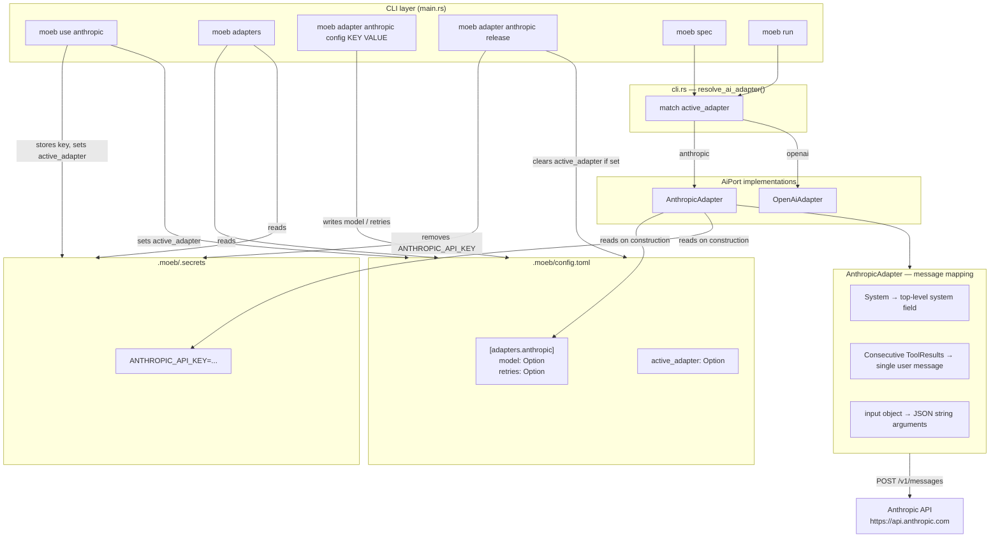

# Anthropic Claude Adapter

## Raw Requirement

> We have an openai adapter allowing us to use openai's api, we now need to be able to connect to
> anthropic's claude api also.

## Description

A new `AnthropicAdapter` is added that implements the existing `AiPort` and `Adapter` traits using
Anthropic's Messages API (`https://api.anthropic.com/v1/messages`). It is structurally parallel to
`OpenAiAdapter` and integrates with all existing adapter-management infrastructure without altering
the shared port definitions or domain services.

The adapter authenticates with `ANTHROPIC_API_KEY` stored in `.moeb/.secrets`. It reads its model
and per-call retry count from `[adapters.anthropic]` in `.moeb/config.toml`, falling back to
`claude-opus-4-7` and `0` retries respectively when those fields are absent.

Because the Anthropic Messages API differs structurally from OpenAI's Chat Completions API, the
adapter handles three mapping concerns internally:

- **System messages**: Anthropic places the system prompt in a top-level `"system"` string field
  rather than in the messages array. The adapter extracts the first `Message::System` from the
  slice and places it there; any subsequent system messages are discarded with a debug note.

- **Tool-result batching**: When the agent produces multiple tool calls in one turn, the existing
  message loop appends one `Message::ToolResult` per call. Anthropic requires all tool results from
  a single assistant turn to arrive in a single user-role message as an array of
  `tool_result` content blocks. The adapter collapses consecutive `Message::ToolResult` entries
  into a single user message before serialising.

- **Tool call arguments**: Anthropic returns tool call inputs as a JSON object under `"input"`.
  The adapter serialises this object to a JSON string to match the `ToolCall.arguments` field
  format expected by the rest of the system.

`moeb use anthropic` prompts for the API key, stores it, sets `active_adapter = "anthropic"`, and
prints a configuration summary identical in structure to the one produced by `moeb use openai`. The
adapter is registered in all `KNOWN_ADAPTERS` lists and all `secret_key_for` / `valid_keys_for`
match arms throughout the command modules.

## Diagram



## Backlinks

### Parents

| Label | Path | Purpose |
|-------|------|---------|
| Moeb Kernel | [specifications/moeb/moeb.kernel.md](specifications/moeb/moeb.kernel.md) | Establishes the Adapter trait, `.moeb/.secrets` storage, and `moeb use` command |
| Moeb Hexagonal Architecture | [specifications/moeb/moeb.hex-architecture.md](specifications/moeb/moeb.hex-architecture.md) | Mandates ports-and-adapters structure; new adapter must follow the same pattern |
| Adapter Configuration, Release, and Listing | [specifications/moeb/moeb.adapter-config-and-listing.md](specifications/moeb/moeb.adapter-config-and-listing.md) | Establishes `KNOWN_ADAPTERS` registration, `AdapterConfig`, `moeb adapters`, and `moeb adapter <name> config/release`; the new adapter must integrate with all of these |

### External

*(none)*

## Steps

### Step 1 — Create `AnthropicAdapter` in `src/moeb/src/adapters/anthropic.rs`

Define the following constants:

```rust
const API_URL: &str = "https://api.anthropic.com/v1/messages";
const ANTHROPIC_VERSION: &str = "2023-06-01";
const DEFAULT_MODEL: &str = "claude-opus-4-7";
const MAX_TOKENS: u32 = 8192;
```

Define the struct:

```rust
pub struct AnthropicAdapter {
    api_key: String,
    pub model: String,
    pub retries: u32,
    client: reqwest::blocking::Client,
}
```

Implement the constructor:

```rust
impl AnthropicAdapter {
    pub fn from_secrets_and_config() -> Result<Self> {
        let secrets = Secrets::load()?;
        let api_key = secrets
            .get("ANTHROPIC_API_KEY")
            .context("ANTHROPIC_API_KEY not set. Run `moeb use anthropic` first.")?
            .to_string();
        let cfg = MoebConfig::load().unwrap_or_default();
        let adapter_cfg = cfg.adapter_config("anthropic");
        Ok(Self {
            api_key,
            model: adapter_cfg.effective_model(DEFAULT_MODEL),
            retries: adapter_cfg.effective_retries(),
            client: reqwest::blocking::Client::new(),
        })
    }
}
```

Implement `AiPort` by delegating to the internal `Adapter::send`:

```rust
impl AiPort for AnthropicAdapter {
    fn send(&self, messages: &[Message], tools: &[ToolDef]) -> Result<AgentResponse> {
        Adapter::send(self, messages, tools)
    }
}
```

Implement `Adapter::send` with:

1. **Message pre-processing.** Before serialisation, scan `messages` once to:
   - Collect the first `Message::System` content into a `system_prompt: Option<String>`. Remaining
     system messages are skipped.
   - Build a `Vec<&Message>` that contains every non-system message, preserving order.

2. **Tool-result batching.** Iterate the non-system message slice; when a run of one or more
   consecutive `Message::ToolResult` entries is encountered, emit a single Anthropic user-role
   message whose `content` is an array of `tool_result` blocks, one per `ToolResult`. All other
   message types are emitted one-to-one.

3. **Anthropic request body.** Construct:

   ```json
   {
     "model": "<self.model>",
     "max_tokens": 8192,
     "system": "<system_prompt or omitted if None>",
     "messages": [ ... ],
     "tools": [ ... ]
   }
   ```

   Omit the `"system"` key entirely when no system message is present (use
   `serde_json::Value::Object` and insert only when `Some`).

4. **Message serialisation helpers:**
   - `Message::User(content)` → `{"role": "user", "content": content}`
   - `Message::Assistant(content)` → `{"role": "assistant", "content": [{"type": "text", "text": content}]}`
   - `Message::AssistantToolCalls(calls)` → `{"role": "assistant", "content": [{"type": "tool_use", "id": call.id, "name": call.name, "input": serde_json::from_str(&call.arguments)?}]}`
   - `Message::ToolResult { call_id, content }` (batched) → one element of the `tool_result` array: `{"type": "tool_result", "tool_use_id": call_id, "content": content}`

5. **Tool serialisation.** Each `ToolDef` maps to:

   ```json
   {
     "name": def.name,
     "description": def.description,
     "input_schema": def.parameters
   }
   ```

6. **HTTP call.** Use the following headers:
   - `x-api-key: <api_key>`
   - `anthropic-version: 2023-06-01`
   - `content-type: application/json`

7. **Retry loop** identical in structure to `OpenAiAdapter`: `retries + 1` attempts, one-second
   wait between attempts, retry only on status 429 or 5xx, exit immediately on success or any
   other error status.

8. **Response parsing.** Parse the JSON response:
   - If `stop_reason == "tool_use"`, collect all content blocks of `type == "tool_use"` and
     return `AgentResponse::ToolCalls`. For each block:
     - `id` = block `"id"` string
     - `name` = block `"name"` string
     - `arguments` = `serde_json::to_string(&block["input"])` (serialise the object back to a
       string to match the `ToolCall.arguments` convention)
   - Otherwise, find the first content block of `type == "text"`, return its `"text"` field as
     `AgentResponse::Text`. If no text block exists, return `AgentResponse::Text(String::new())`.

### Step 2 — Expose `anthropic` module from `src/moeb/src/adapters/mod.rs`

Add:

```rust
pub mod anthropic;
```

### Step 3 — Register `anthropic` in all `KNOWN_ADAPTERS` lists and match arms

Three files each contain a `KNOWN_ADAPTERS` constant and associated match functions. Update all
three consistently:

**`src/moeb/src/commands/use_cmd.rs`**

```rust
const KNOWN_ADAPTERS: &[&str] = &["openai", "anthropic"];
```

In `run()`, add a match arm:

```rust
"anthropic" => configure_anthropic(),
```

Add `configure_anthropic()`:

```rust
fn configure_anthropic() -> Result<()> {
    let key = prompt_password("Enter Anthropic API key: ").context("Failed to read API key")?;
    if key.trim().is_empty() {
        anyhow::bail!("API key must not be empty.");
    }
    let mut secrets = Secrets::load()?;
    secrets.set("ANTHROPIC_API_KEY", key.trim())?;
    let mut config = MoebConfig::load()?;
    config.active_adapter = Some("anthropic".to_string());
    config.save()?;
    println!("Anthropic adapter configured.");
    print_anthropic_config_summary(&config);
    Ok(())
}
```

Add `print_anthropic_config_summary()`:

```rust
pub fn print_anthropic_config_summary(config: &MoebConfig) {
    let ac = config.adapter_config("anthropic");
    let model = ac.effective_model(ANTHROPIC_DEFAULT_MODEL);
    let retries = ac.effective_retries();
    println!();
    println!("Configuration options (current effective values):");
    println!(
        "  {:<8} {:<16} moeb adapter anthropic config MODEL <value>",
        "MODEL", model
    );
    println!(
        "  {:<8} {:<16} moeb adapter anthropic config RETRIES <count>",
        "RETRIES", retries
    );
    println!();
    println!("To remove credentials: moeb adapter anthropic release");
}
```

Add the constant (alongside the existing `OPENAI_DEFAULT_MODEL`):

```rust
const ANTHROPIC_DEFAULT_MODEL: &str = "claude-opus-4-7";
```

**`src/moeb/src/commands/adapters.rs`**

```rust
const KNOWN_ADAPTERS: &[&str] = &["openai", "anthropic"];
```

Extend `secret_key_for`:

```rust
fn secret_key_for(adapter: &str) -> Option<&'static str> {
    match adapter {
        "openai" => Some("OPENAI_API_KEY"),
        "anthropic" => Some("ANTHROPIC_API_KEY"),
        _ => None,
    }
}
```

**`src/moeb/src/commands/adapter_management.rs`**

```rust
const KNOWN_ADAPTERS: &[&str] = &["openai", "anthropic"];
```

Extend `secret_key_for`:

```rust
fn secret_key_for(adapter: &str) -> Option<&'static str> {
    match adapter {
        "openai" => Some("OPENAI_API_KEY"),
        "anthropic" => Some("ANTHROPIC_API_KEY"),
        _ => None,
    }
}
```

Extend `valid_keys_for`:

```rust
fn valid_keys_for(adapter: &str) -> &'static [&'static str] {
    match adapter {
        "openai" | "anthropic" => &["MODEL", "RETRIES"],
        _ => &[],
    }
}
```

### Step 4 — Wire `AnthropicAdapter` into `cli.rs` adapter resolution

In `src/moeb/src/adapters/cli.rs`, add the import:

```rust
use crate::adapters::anthropic::AnthropicAdapter;
```

In `resolve_ai_adapter()`, add the match arm:

```rust
"anthropic" => Ok(Arc::new(AnthropicAdapter::from_secrets_and_config()?)),
```

### Step 5 — Add tests

In `src/moeb/src/adapters/anthropic.rs`, add a `#[cfg(test)] mod tests` block:

- **`anthropic_adapter_uses_configured_model`**: construct `AnthropicAdapter::from_secrets_and_config()`
  in a temp dir with `model = "claude-haiku-4-5"` in `[adapters.anthropic]` and a dummy
  `ANTHROPIC_API_KEY`; assert `adapter.model == "claude-haiku-4-5"`.

- **`anthropic_adapter_uses_default_model_when_absent`**: construct with no adapter config entry;
  assert `adapter.model == "claude-opus-4-7"`.

- **`system_message_extracted_to_top_level`**: call the serialisation helper directly (or expose an
  internal function for testing) with a messages slice beginning with `Message::System("sys")`
  followed by `Message::User("hi")`; assert that the resulting JSON body has a top-level
  `"system": "sys"` key and that the `"messages"` array does not contain any entry with
  `"role": "system"`.

- **`consecutive_tool_results_are_batched`**: build a message slice containing
  `[Message::ToolResult { call_id: "c1", content: "r1" }, Message::ToolResult { call_id: "c2", content: "r2" }]`
  and pass it through the batching logic; assert the resulting Anthropic messages array contains
  exactly one entry with `"role": "user"` whose `"content"` array has two `tool_result` blocks
  with the correct `tool_use_id` values.

All tests in `anthropic.rs` must use the shared `crate::config::tests::CWD_LOCK` and the
`in_temp_dir()` pattern established in `adapter_management.rs` to avoid CWD races.

In `src/moeb/src/commands/adapter_management.rs` tests, add:

- **`configure_anthropic_model_updates_config`**: call `configure("anthropic", "MODEL", "claude-haiku-4-5")`
  in a temp dir; assert `config.toml` reads back `model = "claude-haiku-4-5"` under
  `[adapters.anthropic]`.

- **`release_anthropic_removes_secret`**: seed `.moeb/.secrets` with `ANTHROPIC_API_KEY=sk-ant-test`,
  set `active_adapter = "anthropic"` in config, call `release("anthropic")`; assert the secret key
  is absent and `active_adapter` is `None`.

## Decisions

### Decision 1 — Default model `claude-opus-4-7`

**Rationale:** `claude-opus-4-7` is the most capable model in the Claude 4 family at the time of
writing. Moeb uses the adapter for specification generation and implementation — tasks where output
quality matters more than latency or cost. Users can override with `moeb adapter anthropic config
MODEL <value>` if they prefer a faster or cheaper model.

**Alternatives:**

| Option | Reason Rejected |
|--------|-----------------|
| `claude-sonnet-4-6` | Capable but less suited to complex multi-step reasoning than Opus |
| No default — require explicit configuration | Degrades first-run experience; the spec and run commands would fail until the user sets a model |

**Consequences:** Users on tight budgets should override to `claude-sonnet-4-6` or
`claude-haiku-4-5` via the config command. The default is recorded in `DEFAULT_MODEL` inside
`anthropic.rs` so a single constant change updates the behaviour.

---

### Decision 2 — System messages mapped to Anthropic's top-level `system` field

**Rationale:** Anthropic's Messages API does not accept `{"role": "system", ...}` entries in the
`messages` array. The system prompt must be a top-level field. Since the existing `Message::System`
variant is used only for the agent's preamble (always the first message), extracting the first
occurrence and discarding subsequent ones is correct for all current call sites.

**Alternatives:**

| Option | Reason Rejected |
|--------|-----------------|
| Concatenate all system messages | No call site produces more than one; concatenation adds complexity for no current benefit |
| Inject system content as a leading user message | Non-standard; degrades model behaviour compared to the native `system` field |

**Consequences:** If a future agent loop sends multiple system messages, only the first takes
effect. A future specification must explicitly handle that case.

---

### Decision 3 — Batch consecutive `ToolResult` messages into one user turn

**Rationale:** Anthropic requires all tool results from a single assistant tool-use turn to be
delivered in a single user message. The existing `Message` enum represents each result as a
separate entry. Batching at the adapter layer keeps the domain model and agent loop unchanged while
producing a valid Anthropic request.

**Alternatives:**

| Option | Reason Rejected |
|--------|-----------------|
| Change the `Message` enum to carry batched results | Breaks the OpenAI adapter and all existing tests; a cross-cutting change for a single adapter concern |
| Change the agent loop to batch before appending | Couples the loop to adapter-specific constraints; violates hexagonal separation |

**Consequences:** The batching logic lives entirely inside `anthropic.rs`. Any other adapter
implementation that targets an API with the same constraint can copy the pattern without touching
shared code.

---

### Decision 4 — `MAX_TOKENS` fixed at 8192

**Rationale:** Anthropic's API requires `max_tokens` in every request. 8192 covers the longest
outputs produced by `moeb spec` and `moeb run` (full specification files and multi-file diffs)
without approaching context limits on any Claude model. Making it configurable adds surface area
for no practical user need at this stage.

**Alternatives:**

| Option | Reason Rejected |
|--------|-----------------|
| Expose `MAX_TOKENS` as a configurable key | The `MODEL` and `RETRIES` keys already meet the stated requirement; token limits are an implementation detail |
| Use a lower value (e.g. 4096) | Risks truncating long specification or implementation outputs |

**Consequences:** Adding `MAX_TOKENS` as a configurable key requires a new spec that extends the
`AdapterConfig` struct or the per-adapter config validation logic. Until then the value is a
compile-time constant.

---

### Decision 5 — Tool call `arguments` field serialised from Anthropic's `input` object

**Rationale:** The rest of the system (domain services, agent loop, tool dispatch) expects
`ToolCall.arguments` to be a JSON string representing the arguments object — the same convention
established by the OpenAI adapter. Anthropic returns tool inputs as a native JSON object under
`"input"`. Serialising that object to a string at parse time keeps every consumer unchanged.

**Alternatives:**

| Option | Reason Rejected |
|--------|-----------------|
| Change `ToolCall.arguments` to `serde_json::Value` | Requires updating every call site that parses arguments; a larger refactor than this spec warrants |
| Leave `input` as-is and fix consumers | Same problem; touches domain and agent code |

**Consequences:** The `arguments` field for Anthropic-originated tool calls will always be a
well-formed JSON string, consistent with the OpenAI adapter's behaviour.

## Rubric

### Structured

| Name | Description | Threshold | Pass Condition |
|------|-------------|-----------|----------------|
| Binary builds | `cargo build --release` completes without error | Zero errors | CI build exits 0 |
| `moeb adapters` lists anthropic | `moeb adapters` output contains `"anthropic"` | Row present | Automated test capturing stdout |
| `moeb use anthropic` stores key | `ANTHROPIC_API_KEY` present in `.moeb/.secrets` after `moeb use anthropic` | Key present | File content assertion |
| `moeb use anthropic` prints summary | Success message followed by MODEL, RETRIES, effective values, and change commands | All four items in stdout | Automated test capturing stdout |
| `moeb adapter anthropic config MODEL` | Writes `model` under `[adapters.anthropic]` | Value present and correct | Unit test `configure_anthropic_model_updates_config` |
| `moeb adapter anthropic release` | Secret absent and `active_adapter` cleared | Both conditions met | Unit test `release_anthropic_removes_secret` |
| Adapter uses configured model | `AnthropicAdapter::from_secrets_and_config()` uses `model` from config when present | Correct model in struct | Unit test `anthropic_adapter_uses_configured_model` |
| Default model applied | Adapter uses `claude-opus-4-7` when no config entry is set | Correct default | Unit test `anthropic_adapter_uses_default_model_when_absent` |
| System message placement | Serialised request body has top-level `"system"` field; `"messages"` array has no system-role entry | Both assertions pass | Unit test `system_message_extracted_to_top_level` |
| Tool-result batching | Two consecutive `ToolResult` messages produce one user message with two `tool_result` blocks | Single message with two blocks | Unit test `consecutive_tool_results_are_batched` |

### Qualitative

- **Structural consistency with OpenAI adapter:** `AnthropicAdapter` must mirror `OpenAiAdapter` in
  structure — same constructor naming convention (`from_secrets_and_config`), same retry loop
  pattern, same field names (`model`, `retries`). A developer reading both files in parallel should
  see the same skeleton with only API-specific serialisation code differing.
- **No shared-code modification for API differences:** All Anthropic-specific logic (system field,
  batching, `input_schema`, `input` serialisation) must be self-contained within `anthropic.rs`.
  No changes to `adapters/mod.rs` wire types (`Message`, `ToolCall`, `ToolDef`, `AgentResponse`),
  ports, or domain services are permitted by this specification.
- **Actionable first-run experience:** After `moeb use anthropic`, the printed summary must be
  sufficient for a user to immediately understand which model will be used and how to change it,
  without consulting `--help` or external documentation.
