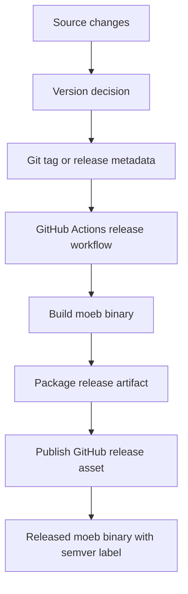

# Binary Release and Semantic Versioning

## Raw Requirement

> We need to provide the moeb binary as a released artifact, this will be done using a github workflow, we will also need to semantically version the released binary

## Description

This specification defines how the moeb project produces and publishes release artifacts for the binary, and how each released binary is versioned using semantic versioning. The implementation must add a GitHub Actions workflow that builds the distributable moeb executable, packages it as a release artifact, and publishes it as part of a tagged release. The binary version must be derived from semver-compatible release metadata so that each published artifact can be identified unambiguously and tracked across releases.

## Diagram

## Backlinks

### Parents

| Label | Path | Purpose |
|-------|------|---------|
| README | [README.md](../../README.md) | Root harness policy document and specification index |
| Moeb Kernel | [specifications/moeb/moeb.kernel.md](specifications/moeb/moeb.kernel.md) | Establishes the moeb binary as the distributable CLI being released |

### External

*(none)*

## Steps

1. **Define the release version source**  
   Determine the canonical source of the moeb binary version, using semantic versioning in the form `MAJOR.MINOR.PATCH` with optional pre-release and build metadata where required. The release process must derive the published binary label from this source rather than from ad hoc workflow values.

2. **Add a GitHub Actions release workflow**  
   Create a workflow under `.github/workflows/` that runs on release publication or version tag pushes, checks out the repository, installs the Rust toolchain, builds the moeb binary in release mode, and uploads the compiled artifact to the GitHub release.

3. **Embed the version in the binary**  
   Update the build or application entrypoint so the binary can report its own version at runtime. The reported version must match the semver value used for the published artifact.

4. **Package the released artifact consistently**  
   Ensure the workflow produces a release asset with a stable name that includes the version string. The artifact must be suitable for distribution and must correspond exactly to the built binary from that workflow run.

5. **Expose version verification in release output**  
   Make the workflow or release process surface the binary version in logs or release metadata so maintainers can verify the asset matches the intended semantic version before and after publication.

6. **Add tests for release metadata and version reporting**  
   Add automated checks that confirm the binary reports the expected semantic version and that the release workflow references the correct build and upload steps.

## Decisions

### Decision 1 — Use GitHub Actions as the release mechanism

**Rationale:** The requirement explicitly calls for a GitHub workflow. GitHub Actions integrates directly with repository tags and release assets, making it the most direct mechanism for building and publishing moeb binaries.

**Alternatives:**

| Option | Reason Rejected |
|--------|-----------------|
| Manual release scripts run locally | Not automated and not a GitHub workflow |
| External CI/CD system | Adds unnecessary infrastructure beyond the requested GitHub-based release path |

**Consequences:** Release automation will live in version-controlled workflow files. Publishing a binary requires the workflow to succeed on GitHub infrastructure.

### Decision 2 — Use semantic versioning for released binaries

**Rationale:** The requirement explicitly asks for semantic versioning. Semver provides a widely understood scheme for communicating compatibility and release order, and it is suitable for release artifact names and binary version reporting.

**Alternatives:**

| Option | Reason Rejected |
|--------|-----------------|
| Date-based versions | Less meaningful for compatibility and change tracking |
| Git commit hashes only | Not human-friendly as a primary release identifier |

**Consequences:** Release artifacts and runtime version reporting must align with semver values. Changes that alter the binary in a user-visible way should be reflected through semver increments.

### Decision 3 — Publish the compiled binary as the release artifact

**Rationale:** The requirement asks for the moeb binary itself to be provided as a released artifact. Publishing the compiled executable directly is the clearest and most useful distribution format.

**Alternatives:**

| Option | Reason Rejected |
|--------|-----------------|
| Source archive only | Does not satisfy the requirement to provide the binary artifact |
| Container image only | Adds an unnecessary packaging layer for a CLI binary |

**Consequences:** The workflow must build the executable in release mode and upload that output in a form users can download and run.

## Rubric

### Structured

| Name | Description | Threshold | Pass Condition |
|------|-------------|-----------|----------------|
| binary-builds | `cargo build --release` completes without error | Zero errors | CI build exits 0 |
| no-drift | The implementation does not violate any decision recorded in a linked parent specification | Zero contradictions | Manual review of every decision in every parent spec listed in Backlinks |
| spec-schema-compliance | All required frontmatter fields and body sections are present and correctly ordered | 100% of required fields and sections | Validation in `domain/spec.rs` exits 0 during `moeb spec` |

### Qualitative

- **Release artifact usability:** The published binary should be straightforward for a user to download and execute without extra packaging steps.
- **Version clarity:** Maintainers and users should be able to tell which semantic version a downloaded binary represents from the release name, asset name, or runtime version output.
- **Workflow maintainability:** The release workflow should be simple enough that updating build steps or release channels does not require rethinking the overall release model.