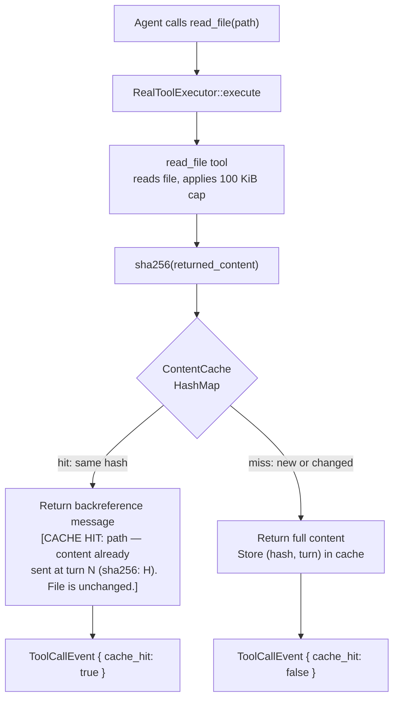

# Content Deduplication for File Reads

## Raw Requirement

> Some more considerations should be given to improving the usability of the system by
> AIs, are there better means of transferring file contents e.g. alternate serialization
> or compression methods that would compress the reads up to the api.

## Description

During a `moeb run` session the AI agent frequently re-reads files it has already
received in full. Each repeat read uses token budget identically to the first, growing
context and increasing cost without providing new information.

A per-run in-memory content cache on `RealToolExecutor` detects unchanged files and
returns a short backreference message instead of re-sending the full content. The
backreference tells the AI which turn the content was sent, so it can locate the earlier
turn in its own context window. The cache is keyed by file path; the value is the sha256
hex digest of the content sent and the turn number it was sent on. sha2 and hex are
already Cargo dependencies; no new crate is required.

Deduplication scope is limited to `read_file`. Applying it to `read_files` requires
partial-batch hit tracking that adds significant complexity; `read_file_range` requires
range-vs-full-file cache reconciliation. Both are deferred.

A `cache_hit: bool` field is added to `ToolCallEvent` in `trace.rs` to make cache
behaviour observable in traces and replay.

## Diagram



## Backlinks

### Parents

| Label | Path | Purpose |
|-------|------|---------|
| Moeb Kernel | [specifications/moeb/moeb.kernel.md](specifications/moeb/moeb.kernel.md) | Established the moeb run command and AI agent loop context |
| Agent File-Read Optimization | [specifications/moeb/moeb.agent-read-optimization.md](specifications/moeb/moeb.agent-read-optimization.md) | Introduced the multi-turn read-heavy agent loop that makes deduplication valuable |
| Trace Capture, Replay, and Kernel Configuration | [specifications/moeb/moeb.trace-and-replay.md](specifications/moeb/moeb.trace-and-replay.md) | Introduced ToolCallEvent and the trace infrastructure extended by this spec |
| Run Stability: Trace Finalize Visibility and File Read Truncation | [specifications/moeb/moeb.trace-finalize-and-read-cap.md](specifications/moeb/moeb.trace-finalize-and-read-cap.md) | Added 100 KiB per-file cap; deduplication hashes content after the cap is applied |
| Tool Executor Extraction | [specifications/moeb/moeb.tool-executor-extraction.md](specifications/moeb/moeb.tool-executor-extraction.md) | Defines RealToolExecutor in tools/mod.rs; ContentCache is added to that struct |
| README | [README.md](../../README.md) | Root index |

### External

*(none)*

## Steps

### Step 1 — Add `cache_hit` field to `ToolCallEvent` in `trace.rs`

In `src/moeb/src/trace.rs`, add `cache_hit: bool` to `ToolCallEvent`:

```rust
#[derive(Debug, Clone, Serialize, Deserialize)]
pub struct ToolCallEvent {
    pub attempt: u32,
    pub turn: u32,
    pub call_id: String,
    pub tool: String,
    pub args: serde_json::Value,
    #[serde(skip_serializing_if = "Option::is_none")]
    pub result: Option<String>,
    #[serde(skip_serializing_if = "Option::is_none")]
    pub content_hash: Option<String>,
    pub chars: u64,
    pub success: bool,
    pub duration_ms: u64,
    #[serde(default)]
    pub cache_hit: bool,
}
```

The `#[serde(default)]` attribute ensures existing trace files serialised before this
change can still be deserialised; absent fields default to `false`.

Every site in the codebase that constructs a `ToolCallEvent` literal must be updated to
include `cache_hit: false` (or `cache_hit: <computed>` for the `read_file` path
introduced in Step 3).

### Step 2 — Add `ContentCache` to `RealToolExecutor` in `tools/mod.rs`

In `src/moeb/src/tools/mod.rs`, add a type alias and extend `RealToolExecutor`:

```rust
use std::collections::HashMap;
use std::sync::Mutex;

/// Per-run in-memory deduplication cache.
/// Key: file path string as provided by the agent.
/// Value: (sha256_hex of content returned, turn number on which it was first sent).
type ContentCache = Mutex<HashMap<String, (String, u32)>>;

pub struct RealToolExecutor {
    registry: ToolRegistry,
    cache: ContentCache,
}

impl RealToolExecutor {
    pub fn new() -> Self {
        Self {
            registry: ToolRegistry::standard(),
            cache: Mutex::new(HashMap::new()),
        }
    }
}
```

The cache is scoped to the `RealToolExecutor` instance, which is created once per
`moeb run` invocation and dropped when the run ends. No persistence across runs.

### Step 3 — Extend `ToolExecutorPort::execute` signature and implement cache interception

**Trait change.** In `src/moeb/src/ports/tool_executor.rs`, change the return type and
add `current_turn`:

```rust
pub trait ToolExecutorPort: Send + Sync {
    fn execute(
        &self,
        name: &str,
        call_id: &str,
        args: &serde_json::Value,
        working_dir: &Path,
        current_turn: u32,
    ) -> anyhow::Result<(String, bool)>;  // (result_text, cache_hit)
}
```

**Implementation.** In the `ToolExecutorPort` implementation for `RealToolExecutor`,
intercept `read_file` calls after the tool produces its result:

```rust
impl ToolExecutorPort for RealToolExecutor {
    fn execute(
        &self,
        name: &str,
        call_id: &str,
        args: &serde_json::Value,
        working_dir: &Path,
        current_turn: u32,
    ) -> anyhow::Result<(String, bool)> {
        let tool_result = self.registry.execute(name, args, working_dir);

        if name == "read_file" {
            if let Ok(ref content) = tool_result {
                let path_key = args["path"]
                    .as_str()
                    .unwrap_or("")
                    .to_string();
                let digest = hex::encode(sha2::Sha256::digest(content.as_bytes()));

                let mut cache = self.cache.lock().unwrap();
                if let Some((cached_hash, first_turn)) = cache.get(&path_key) {
                    if *cached_hash == digest {
                        let msg = format!(
                            "[CACHE HIT: {} — content already sent at turn {} \
                             (sha256: {}). File is unchanged. \
                             Use the content from that turn.]",
                            path_key, first_turn, cached_hash
                        );
                        return Ok((msg, true));
                    }
                }
                cache.insert(path_key, (digest, current_turn));
            }
        }

        Ok((tool_result?, false))
    }
}
```

All other `ToolExecutorPort` implementations (test doubles, mock executors) must be
updated to accept `current_turn: u32` and return `(String, bool)`. Test doubles may
ignore `current_turn` and return `false` for `cache_hit`.

### Step 4 — Propagate `cache_hit` to `ToolCallEvent` in the agent loop

In `src/moeb/src/agent.rs`, update every call to `executor.execute` to pass
`current_turn` and destructure the result:

```rust
let (result_text, cache_hit) = executor.execute(
    name, call_id, args, working_dir, current_turn
)?;

// ... apply_content_policy operates on result_text ...

trace.push(TraceEvent::ToolCall(ToolCallEvent {
    attempt: current_attempt,
    turn: current_turn,
    call_id: call_id.to_string(),
    tool: name.to_string(),
    args: args.clone(),
    result: stored,
    content_hash: hash,
    chars,
    success: true,
    duration_ms: elapsed.as_millis() as u64,
    cache_hit,
}));
```

Error paths that construct `ToolCallEvent { success: false, ... }` must include
`cache_hit: false`.

### Step 5 — Update `run.prompt` with one sentence about cache hits

In `src/prompts/run.prompt`, add the following sentence to the section describing tool
behaviour near the `read_file` description:

> If a `read_file` result begins with `[CACHE HIT:`, the file has not changed since it
> was sent; locate the content in your context from the indicated turn and use it
> directly — do not re-read the file.

### Step 6 — Verify

Run `cargo build --release` and confirm zero compilation errors. Run `cargo test` and
confirm all existing tests pass.

Confirm by inspection or test:

1. `ToolCallEvent` has `cache_hit: bool` with `#[serde(default)]`.
2. A second `read_file` call for the same unchanged file returns the backreference
   message and records `cache_hit: true` in the trace.
3. A `read_file` call after the file content changes returns the new full content and
   records `cache_hit: false`.
4. `read_files` and `read_file_range` are unaffected and always yield `cache_hit: false`.

## Decisions

### Decision 1 — Deduplication is scoped to `read_file` only

**Rationale:** `read_files` processes multiple paths in one call; a partial cache hit
requires either splitting the response (breaking the tool contract) or returning a mixed
payload that is complex for the agent to parse. `read_file_range` adds the additional
complication that a cache keyed on path cannot distinguish a full-file send from a range
send at the same path. Scoping to `read_file` delivers the most common case with zero
cross-tool complexity. Both deferred cases can be addressed in a later specification.

**Alternatives:**

| Option | Reason Rejected |
|--------|-----------------|
| Cache `read_files` with per-path hit tracking | Requires splitting result or annotating individual file blocks within the batch response; breaks tool contract simplicity |
| Cache `read_file_range` with `(path, start, end)` key | A range cache hit does not rule out a changed full-file; full-file cache cannot serve a range hit without returning excess content |
| No deduplication | Every repeated read burns full token budget; high-turn runs accumulate linearly growing context |

**Consequences:** The agent may re-receive range results unnecessarily. The prompt
instruction directs the agent not to re-read unchanged files, which combined with
`grep_files`/`read_file_range` guidance in `run.prompt` mitigates most redundant reads.

---

### Decision 2 — Cache key is the path string as provided by the agent

**Rationale:** Normalising paths (resolving to absolute, canonicalising symlinks) adds
filesystem I/O to every cache check. The agent consistently passes the same path string
for the same logical file within a run; path normalisation provides minimal benefit
against its cost. If the agent uses both `./src/foo.rs` and `src/foo.rs` for the same
file within one run, both will miss and both will store independently — an acceptable
false-negative edge case.

**Alternatives:**

| Option | Reason Rejected |
|--------|-----------------|
| Normalise path to absolute before keying | Extra filesystem I/O on every read_file call; unnecessary for most runs |
| Key on content hash alone | Two different files with identical content would collide; path must be part of the key |

**Consequences:** Rare false negatives when the agent uses inconsistent path strings for
the same file. No false positives — a changed file always has a different hash.

---

### Decision 3 — Turn number is passed as a parameter to `ToolExecutorPort::execute`

**Rationale:** Storing an `Arc<TraceContext>` on `RealToolExecutor` couples the executor
to the trace infrastructure, making it harder to test in isolation. Passing
`current_turn: u32` as a parameter keeps `ToolExecutorPort` a pure port — it receives
all inputs it needs from the caller, with no hidden dependencies. The caller (agent loop)
already tracks the turn number.

**Alternatives:**

| Option | Reason Rejected |
|--------|-----------------|
| Store `Arc<TraceContext>` on `RealToolExecutor` | Creates an indirect dependency on the trace infrastructure from the tool layer; harder to test |
| Use turn 0 always | The backreference message becomes less useful; the agent cannot locate the content in its context window without the turn number |

**Consequences:** `ToolExecutorPort::execute` gains a `current_turn: u32` parameter.
All implementations including test doubles must be updated. The mock can ignore the
parameter.

---

### Decision 4 — Cache is reset per run, not persisted

**Rationale:** File content between runs may differ. A persistent cache would need
invalidation logic keyed on modification time or inode, adding complexity for a case
that is already handled correctly by the hash comparison on the next call. The cache's
purpose is to save tokens within a single run's context window — once the run ends, the
context window is gone and a new run starts fresh.

**Alternatives:**

| Option | Reason Rejected |
|--------|-----------------|
| Persist cache to `.moeb/cache/` between runs | Requires invalidation; inter-run savings are negligible compared to per-run savings |
| Share cache across concurrent runs | moeb run is inherently sequential; no concurrency benefit |

**Consequences:** Each `moeb run` invocation starts with an empty cache. The first read
of any file always returns full content.

---

### Decision 5 — `ToolExecutorPort::execute` return type changes to `Result<(String, bool)>`

**Rationale:** The `cache_hit` boolean needs to travel from `execute` to the trace
event. A side-channel field on the executor would require mutable shared state or a
second lock acquisition. A tuple return keeps the information in the call stack without
shared state.

**Alternatives:**

| Option | Reason Rejected |
|--------|-----------------|
| Separate `last_cache_hit()` method on `ToolExecutorPort` | Requires mutable interior state; not thread-safe without a Mutex |
| Pass a `&mut bool` out-parameter | Idiomatic in C but unusual in Rust; tuple return is cleaner |
| Always set `cache_hit: false` in the trace, inspect result string | Fragile; couples trace logic to the backreference message format |

**Consequences:** All `ToolExecutorPort` implementations and all call sites in `agent.rs`
must be updated. Test doubles return `false` for `cache_hit`.

## Rubric

### Structured

| Name | Description | Threshold | Pass Condition |
|------|-------------|-----------|----------------|
| `binary-builds` | `cargo build --release` exits 0 | Zero errors | CI build exits 0 |
| `all-tests-pass` | `cargo test` exits 0 | Zero failures | `cargo test` exits 0 |
| `no-test-regression` | All pre-existing tests pass without modification to test code | Zero failures | `cargo test` exits 0; no test file edited |
| `no-drift` | No contradiction with parent specs | Implementation does not violate any decision in a linked parent spec | Manual review of every decision in every parent spec listed in Backlinks |
| Cache hit returns backreference | A second `read_file` call for the same unchanged path returns the `[CACHE HIT: ...]` message | 100% hit rate for unchanged files | Unit test: call `read_file` twice for the same file; assert second result starts with `[CACHE HIT:` |
| Cache miss on change | A `read_file` call after the file content changes returns full content, not backreference | 100% fresh on change | Unit test: write file, read it, modify file, read again; assert full content returned |
| `cache_hit` field in trace | `ToolCallEvent.cache_hit` is `true` for cache hits and `false` for misses and all non-`read_file` tools | Correct value on every event | Unit test: inspect trace events after two reads of same unchanged file |
| `read_files` unaffected | `read_files` never returns a backreference message and always yields `cache_hit: false` | Zero false positives | Code review confirms `read_files` path bypasses the cache |
| No new Cargo dependencies | sha2 and hex are already present; Cargo.toml is not modified | Zero new entries | `git diff Cargo.toml` is empty |

### Qualitative

- **Backreference message is actionable:** The format `[CACHE HIT: {path} — content already sent at turn {N} (sha256: {H}). File is unchanged. Use the content from that turn.]` must include path, turn number, and hash so the agent can unambiguously locate the prior content in its context window and verify its integrity.
- **No false positives:** A changed file must never return a backreference. The sha256 comparison is the sole authority; the cache must not be bypassed or short-circuited under any code path.
- **Transparent to replay:** A replay of a traced run must replay backreference messages faithfully. No special handling of `cache_hit: true` events is required in `moeb replay`; the backreference text is the recorded result and is played back as-is.
