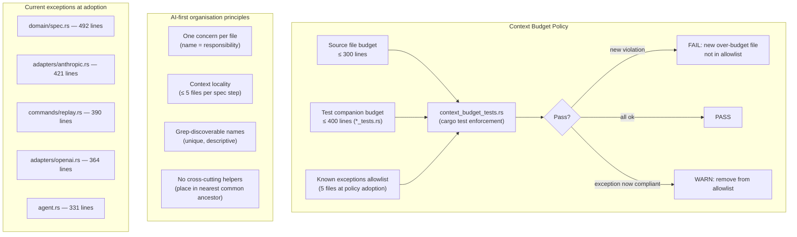

# Context Budget Design

## Raw Requirement

> There are a few avenues that I want to explore for improving moeb's interactions
> with AI. When reading files we are reading e.g. read_file_range: 5578 chars in the
> context — that means the AI accumulates context quickly. AI-first code organisation
> — can we think about how this can be improved?

## Description

Every token sent to the AI adapter in a `moeb run` costs time and money. The dominant
cost driver is not individual file reads but the cumulative conversation history: each
`adapter.send()` call replays the entire message thread. When source files are large,
a single `read_file` call can add 10–15 KB to the history; multiple reads of large
files exhaust the context budget before the agent finishes even a moderately complex
specification.

This specification establishes the **Context Budget Policy** — a set of measurable
limits and AI-first organisation principles that keep individual source files small
enough for targeted access via `read_file_range` and `grep_files`, reduce the number
of files an agent must read to implement a typical specification step, and provide a
self-enforcing cargo test that prevents regressions.

The policy has three components:

1. **Line-count budgets** — hard limits on the size of implementation files and their
   test companions. Enforced by a new `context_budget_tests.rs` cargo test module.
2. **AI-first organisation principles** — guidance on code structure that minimises
   per-run context consumption.
3. **Current-violations allowlist** — the five files that already exceed the budget
   before this spec is executed, recorded as named exceptions. Future splitting specs
   must remove entries from this list; new entries are policy violations.

The enforcement test uses a ratchet pattern: it fails if any file outside the
allowlist exceeds the budget, and it prints a prompt to remove entries whose files
have been brought into compliance. Adding a new entry to the allowlist is a policy
violation that requires human approval via a new specification.

## Diagram



## Backlinks

### Parents

| Label | Path | Purpose |
|-------|------|---------|
| Test File Separation | [specifications/moeb/moeb.test-file-separation.md](specifications/moeb/moeb.test-file-separation.md) | Established the companion-test-file pattern that extracts test code; prerequisite for keeping non-test source files within the line budget |
| README | [README.md](../../README.md) | Root index |

### External

*(none)*

## Steps

### Step 1 — Add Context Budget Policy to `.moeb/README.md`

Read `.moeb/README.md` in full. In the **Specification requirements** section, add
the following paragraph immediately after the **Roles** paragraph:

```
**Context Budget Policy.** Source files under `src/moeb/src/` must not exceed 300
lines. Test companion files (`*_tests.rs`) must not exceed 400 lines. These limits
keep individual files within the targeted-read range of `read_file_range` and reduce
the number of tokens a `moeb run` agent accumulates per specification step. A
self-enforcing cargo test in `src/moeb/src/context_budget_tests.rs` audits all source
files on every `cargo test` run. Files that exceed their limit at the time this policy
is adopted are recorded in a known-exceptions allowlist inside the test; adding a new
entry to that list requires human approval via a new specification. Splitting an
over-budget file into submodules is the standard remediation; once a file complies,
its entry must be removed from the allowlist.
```

### Step 2 — Create `src/moeb/src/context_budget_tests.rs`

Create the file with the following content verbatim:

```rust
/// Context Budget Policy enforcement.
///
/// Every non-test source file under src/ must not exceed SOURCE_BUDGET lines.
/// Test companion files (*_tests.rs) must not exceed TEST_BUDGET lines.
///
/// Files listed in KNOWN_EXCEPTIONS were over-budget when this policy was adopted.
/// To remediate: split the file into submodules, then remove its entry here.
/// Adding a new entry to KNOWN_EXCEPTIONS requires a new specification and human approval.

#[cfg(test)]
mod tests {
    const SOURCE_BUDGET: usize = 300;
    const TEST_BUDGET: usize = 400;

    /// (relative path from crate root, line count at adoption)
    const KNOWN_EXCEPTIONS: &[(&str, usize)] = &[
        ("src/domain/spec.rs",        492),
        ("src/adapters/anthropic.rs", 421),
        ("src/commands/replay.rs",    390),
        ("src/adapters/openai.rs",    364),
        ("src/agent.rs",              331),
    ];

    #[test]
    fn source_files_within_context_budget() {
        let src_root = std::path::Path::new(env!("CARGO_MANIFEST_DIR")).join("src");
        let violations = collect_violations(&src_root);

        let mut new_violations: Vec<String> = Vec::new();
        let mut newly_compliant: Vec<String> = Vec::new();

        for (rel_path, line_count, budget) in &violations {
            let is_exception = KNOWN_EXCEPTIONS.iter().any(|(exc, _)| exc == rel_path);
            if !is_exception {
                new_violations.push(format!(
                    "  {} — {} lines (budget: {})",
                    rel_path, line_count, budget
                ));
            }
        }

        let compliant_paths: std::collections::HashSet<String> = violations
            .iter()
            .map(|(p, _, _)| p.clone())
            .collect();
        for (exc_path, _) in KNOWN_EXCEPTIONS {
            if !compliant_paths.contains(*exc_path) {
                newly_compliant.push(format!("  {} is now within budget — remove from KNOWN_EXCEPTIONS", exc_path));
            }
        }

        if !newly_compliant.is_empty() {
            eprintln!(
                "\n[context-budget] The following exceptions are now compliant and should be removed from KNOWN_EXCEPTIONS:\n{}",
                newly_compliant.join("\n")
            );
        }

        assert!(
            new_violations.is_empty(),
            "\n[context-budget] New files exceed their context budget.\n\
             Split them into submodules or add a specification to adopt them as exceptions.\n\
             Violations:\n{}",
            new_violations.join("\n")
        );
    }

    fn collect_violations(src: &std::path::Path) -> Vec<(String, usize, usize)> {
        let mut out = Vec::new();
        if let Ok(entries) = walkdir(src) {
            for (rel, full) in entries {
                if full.extension().and_then(|e| e.to_str()) != Some("rs") {
                    continue;
                }
                let budget = if rel.ends_with("_tests.rs") {
                    TEST_BUDGET
                } else {
                    SOURCE_BUDGET
                };
                let lines = count_lines(&full);
                if lines > budget {
                    out.push((rel, lines, budget));
                }
            }
        }
        out
    }

    fn walkdir(root: &std::path::Path) -> std::io::Result<Vec<(String, std::path::PathBuf)>> {
        let mut result = Vec::new();
        let mut stack = vec![root.to_path_buf()];
        while let Some(dir) = stack.pop() {
            for entry in std::fs::read_dir(&dir)? {
                let entry = entry?;
                let path = entry.path();
                if path.is_dir() {
                    stack.push(path);
                } else {
                    let rel = path
                        .strip_prefix(root)
                        .map(|p| p.to_string_lossy().replace('\\', "/"))
                        .unwrap_or_default();
                    result.push((rel, path));
                }
            }
        }
        Ok(result)
    }

    fn count_lines(path: &std::path::Path) -> usize {
        std::fs::read_to_string(path)
            .map(|s| s.lines().count())
            .unwrap_or(0)
    }
}
```

### Step 3 — Register the test module in `src/moeb/src/main.rs`

Read `src/moeb/src/main.rs` in full. Add the following line to the list of `pub mod`
declarations, after `pub mod version_tests;`, preserving alphabetical ordering of the
module list:

```rust
pub mod context_budget_tests;
```

The full module block after this change will include both `version_tests` and
`context_budget_tests`.

### Step 4 — Verify

Run `cargo test context_budget` from `src/moeb/`. The test must:
- Pass (exit 0)
- Print no new-violation assertion failures
- Optionally print newly-compliant notices for any exceptions now within budget

Run `cargo build --release` — zero errors.

Confirm the policy text appears in the harness README:

```
grep -n "Context Budget Policy" .moeb/README.md
```

## Decisions

### Decision 1 — 300-line budget for source files, 400 for test companions

**Rationale:** `read_file_range` with a 300-line cap returns up to ~9 KB of Rust
source — enough to capture any single function or `impl` block in a well-structured
file. A file that fits within 300 lines can be sent as a complete `read_file` payload
(≈ 9 KB at average 30 chars/line) without approaching the 100 KB per-file truncation
limit, and with low impact on the conversation history per turn. Test companion files
are given a looser 400-line budget because tests are typically read as context only
when diagnosing failures, not as part of the initial discovery phase.

**Alternatives:**

| Option | Reason Rejected |
|--------|-----------------|
| 200-line budget | Too strict for adapter implementations (OpenAI, Anthropic) which have inherent breadth; would require excessive splitting with little context benefit |
| 500-line budget | Permits files that already require full reads and significant context; defeats the purpose of targeted access |
| No numeric limit; qualitative only | Unenforceable without tooling; prior experience shows qualitative rules drift silently |

**Consequences:** Five existing files require future splitting specifications to comply.
The `run_agent_loop_inner` function in `agent.rs` is ~213 lines by itself; bringing
`agent.rs` under budget requires extracting helper functions or splitting the module.

---

### Decision 2 — Ratchet enforcement via known-exceptions allowlist in the test

**Rationale:** A hard-fail test that lists all current violations would fail CI
immediately. Removing the list entirely (soft enforcement) provides no protection
against regressions. The ratchet pattern threads the needle: existing violations are
recorded with their line counts at adoption, the test fails only on *new* violations,
and the test prints a prompt when a known exception drops below budget so the allowlist
stays accurate. The allowlist is the canonical record of technical debt and is visible
in every `cargo test` run.

**Alternatives:**

| Option | Reason Rejected |
|--------|-----------------|
| Hard-fail on all violations (no allowlist) | Breaks CI on day one; prevents adoption |
| Soft enforcement (print only, no fail) | Does not protect against regressions; new over-budget files are silently ignored |
| External tool (clippy lint, custom binary) | Adds a dependency; a cargo test is zero-overhead and always runs with the test suite |

**Consequences:** The allowlist must shrink over time. A specification that proposes
adding a new entry to `KNOWN_EXCEPTIONS` rather than splitting the file must justify
the exception with a Decisions section.

---

### Decision 3 — AI-first organisation principles are policy, not enforcement

**Rationale:** Line counts are mechanical and trivially checkable. Code organisation
principles (context locality, grep-discoverability, one-concern-per-file) require
human or agent judgement and cannot be reliably automated without false positives.
They are documented as harness policy in `.moeb/README.md` so that agents and authors
have a shared reference when making structural decisions.

**Alternatives:**

| Option | Reason Rejected |
|--------|-----------------|
| Encode principles as additional cargo tests (e.g., maximum `pub use` re-exports) | High false-positive rate; rules would need frequent tuning; line count is the useful proxy |
| Omit principles entirely; only enforce line counts | Loses the rationale; authors won't know *why* the limit exists or how to structure new modules |

**Consequences:** Adherence to the organisational principles is reviewed at
specification-authoring time, not at CI time. The `moeb spec` role file
(`spec.role.md`) is the appropriate place to reinforce these principles for the
authoring agent.

---

### Decision 4 — Five files adopted as exceptions at policy adoption

**Rationale:** At the time this specification was authored, five files exceeded the
300-line source budget: `domain/spec.rs` (492 lines), `adapters/anthropic.rs` (421),
`commands/replay.rs` (390), `adapters/openai.rs` (364), and `agent.rs` (331). Each
requires a dedicated splitting specification because the changes are non-trivial and
affect public APIs. Adopting them as exceptions preserves CI green while the splitting
work is scheduled.

**Alternatives:**

| Option | Reason Rejected |
|--------|-----------------|
| Split all five in this specification | Scope is too large; each split is a separate concern; mixing context budget policy with file refactoring makes the spec hard to execute atomically |
| Raise the budget to exclude them | Undermines the policy goal; 400-line budget eliminates the targeted-read benefit for adapter files |

**Consequences:** `domain/spec.rs`, `adapters/anthropic.rs`, `commands/replay.rs`,
`adapters/openai.rs`, and `agent.rs` are acknowledged technical-debt items tracked in
the test allowlist. Each future splitting spec must remove the relevant entry from
`KNOWN_EXCEPTIONS` as part of its rubric.

## Rubric

### Structured

| Name | Description | Threshold | Pass Condition |
|------|-------------|-----------|----------------|
| `binary-builds` | `cargo build --release` exits 0 | Zero errors | CI build exits 0 |
| `all-tests-pass` | `cargo test` exits 0 | Zero failures | `cargo test` exits 0 |
| `context-budget-test-exists` | `context_budget_tests.rs` is present and registered in `main.rs` | File present, `pub mod context_budget_tests;` in main.rs | `grep context_budget_tests src/moeb/src/main.rs` returns a match |
| `policy-in-readme` | Context Budget Policy paragraph is present in `.moeb/README.md` | Paragraph present | `grep "Context Budget Policy" .moeb/README.md` returns a match |
| `no-new-violations` | `cargo test context_budget` passes with no new-violation assertion | Zero new violations | Test exits 0 with no assertion failure message |

### Qualitative

- **Allowlist accuracy:** The five entries in `KNOWN_EXCEPTIONS` must match the actual line counts of the named files (±5 lines to account for minor edits). If any entry names a file that does not exist or is already compliant, it must be corrected or removed.
- **No new exceptions:** No file outside the five named exceptions may exceed 300 lines (or 400 for `*_tests.rs`). The test enforces this; verify by reading the test output.
- **Policy paragraph placement:** The Context Budget Policy paragraph must appear in the Specification requirements section, after the Roles paragraph, before the horizontal rule.
