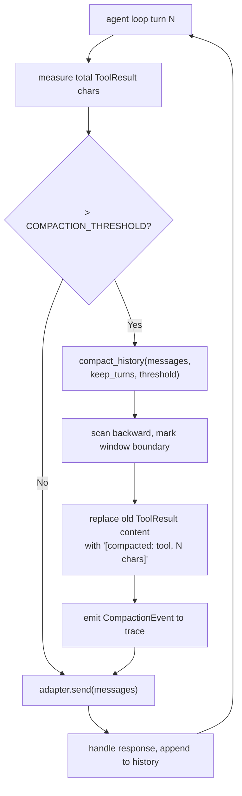

# Conversation History Compaction

## Raw Requirement

> Anthropic becomes increasingly delayed as runs get longer. The full conversation
> history — all accumulated tool call results — is sent on every API call. As history
> grows, token count per request grows, Anthropic per-minute token rate limits fire,
> and the exponential backoff compounds the delay with each additional turn.
> An attempt was made to read and send only required small chunks, but the whole
> accumulated history still inflates each subsequent request.

## Description

The agent loop appends every tool result to the message history and sends the full
history on every API call. With no upper bound on history size, a long run accumulates
tens of thousands of characters of tool results that the model has already acted on and
no longer needs verbatim.

This specification introduces a compaction step that fires before every `adapter.send()`
call. When the total character count of all ToolResult message contents exceeds a
configurable threshold, the oldest ToolResult messages — those outside a configurable
recency window — have their content replaced with a one-line summary:
`[compacted: {tool_name}, {N} chars]`. The initial user message (the spec prompt), all
AssistantText messages, and all AssistantToolCalls messages are never modified.

Compaction is implemented in a new `src/moeb/src/compaction.rs` module and called from
`agent.rs` immediately before each `adapter.send()`. Three new kernel configuration keys
are added via the existing `moeb configure` system: `COMPACTION_ENABLED` (bool, default
`true`), `COMPACTION_THRESHOLD` (character count, default `80000`), and
`COMPACTION_KEEP_TURNS` (integer, default `3`). A new `CompactionEvent` is added to the
trace so compaction is visible in replays and trace analysis.

The initial user message is always the first message in the history and is
never included in compaction candidates. The recency window is measured by scanning
backward from the end of the history and counting complete tool-call turns (one
AssistantToolCalls message plus all immediately following ToolResult messages counts as
one turn). ToolResults within the most recent `COMPACTION_KEEP_TURNS` turns are kept
verbatim; any ToolResult outside that window whose content contributes to the total
exceeding the threshold is compacted.

## Diagram



## Backlinks

### Parents

| Label | Path | Purpose |
|-------|------|---------|
| Run Stability: Trace Finalize Visibility and File Read Truncation | [specifications/moeb/moeb.trace-finalize-and-read-cap.md](specifications/moeb/moeb.trace-finalize-and-read-cap.md) | Established the pattern of capping content at the boundary rather than at the adapter layer; compaction applies the same principle to accumulated history |
| Content Deduplication for File Reads | [specifications/moeb/moeb.content-deduplication.md](specifications/moeb/moeb.content-deduplication.md) | Reduces repeated identical content in history; compaction is the complementary mechanism for reducing accumulated distinct content |
| Trace Capture, Replay, and Kernel Configuration | [specifications/moeb/moeb.trace-and-replay.md](specifications/moeb/moeb.trace-and-replay.md) | Defines `moeb configure` and the trace event model; new config keys and trace event follow those patterns |
| README | [README.md](../../README.md) | Root index |

### External

*(none)*

## Steps

### Step 1 — Add three configuration keys to `KernelConfig`

In `src/moeb/src/config.rs`, add three new keys to the `KernelConfig` struct and their
corresponding `DEFAULT_*` constants and parsing logic, following the existing pattern for
`LOG_FILE_CONTENT` and `RUN_RETENTION`:

```rust
pub const DEFAULT_COMPACTION_ENABLED: bool = true;
pub const DEFAULT_COMPACTION_THRESHOLD: usize = 80_000;
pub const DEFAULT_COMPACTION_KEEP_TURNS: u32 = 3;
```

Add fields to `KernelConfig`:

```rust
pub compaction_enabled: bool,
pub compaction_threshold: usize,
pub compaction_keep_turns: u32,
```

Parse them from the config map using the same `get_bool` / `get_usize` / `get_u32`
helper pattern already used for other keys. Keys are `"COMPACTION_ENABLED"`,
`"COMPACTION_THRESHOLD"`, and `"COMPACTION_KEEP_TURNS"`.

Expose the keys in the `moeb configure` output (the listing command) with a one-line
description for each key alongside the existing keys.

### Step 2 — Add `CompactionEvent` to the trace model

In `src/moeb/src/trace.rs`, add a new variant to `TraceEvent`:

```rust
TraceEvent::Compaction(CompactionEvent)
```

And define `CompactionEvent`:

```rust
#[derive(Debug, Clone, serde::Serialize, serde::Deserialize)]
pub struct CompactionEvent {
    pub attempt: u32,
    pub turn: u32,
    pub chars_before: usize,
    pub chars_after: usize,
    pub messages_compacted: usize,
}
```

Ensure the variant is handled in all existing `match TraceEvent` arms (replay, trace
serialisation). Use `_ => {}` or an explicit no-op arm where a compaction event requires
no special replay behaviour.

### Step 3 — Create `src/moeb/src/compaction.rs`

Create a new file implementing the compaction logic. The public interface is a single
function:

```rust
/// Mutates `messages` in place, replacing old ToolResult contents with summary
/// lines when total ToolResult char count exceeds `threshold`.
///
/// The initial user message (index 0) and all non-ToolResult messages are
/// never modified. The most recent `keep_turns` complete tool-call turns
/// are kept verbatim regardless of size.
///
/// Returns compaction stats if any compaction was performed, or `None`
/// if the threshold was not exceeded.
pub fn compact_history(
    messages: &mut Vec<Message>,
    threshold: usize,
    keep_turns: u32,
) -> Option<CompactionStats>
```

Where `CompactionStats` carries `chars_before`, `chars_after`, and `messages_compacted`.

**Algorithm:**

1. Count total chars across all `ToolResult` message contents. If `<= threshold`,
   return `None` immediately.
2. Scan backward through `messages` to identify the window boundary. A "turn" boundary
   is each `AssistantToolCalls` message encountered from the end. Stop scanning when
   `keep_turns` such boundaries have been passed. All `ToolResult` messages before that
   boundary are candidates for compaction.
3. For each candidate `ToolResult` whose content is not already a compaction placeholder
   (does not start with `[compacted:`), replace its content with:
   `[compacted: {tool_name}, {N} chars]`
   where `tool_name` is extracted from the result metadata (call ID or tool name field,
   whichever is available on the `ToolResult` variant) and `N` is the original content
   length.
4. Return `Some(CompactionStats { chars_before, chars_after, messages_compacted })`.

Include unit tests in a `#[cfg(test)] mod tests` block within `compaction.rs` covering:

- History below threshold: no compaction fires
- History above threshold, all old results compacted
- Keep window respected: most recent `keep_turns` turns untouched
- Already-compacted messages are not double-compacted
- Single-turn history: nothing to compact outside window

### Step 4 — Wire compaction into the agent loop

In `src/moeb/src/agent.rs`, declare the module:

```rust
mod compaction;
```

At the top of `run_agent_loop_inner`, accept `compaction_enabled`, `compaction_threshold`,
and `compaction_keep_turns` from the caller via the existing config struct passed in.
Alternatively, if `run_agent_loop_inner` does not currently accept a config struct,
add a `CompactionConfig` parameter:

```rust
pub struct CompactionConfig {
    pub enabled: bool,
    pub threshold: usize,
    pub keep_turns: u32,
}
```

Immediately before every `adapter.send(&messages, tools)` call, insert:

```rust
if compaction_config.enabled {
    if let Some(stats) = compaction::compact_history(
        &mut messages,
        compaction_config.threshold,
        compaction_config.keep_turns,
    ) {
        if let Err(e) = trace.push(TraceEvent::Compaction(CompactionEvent {
            attempt,
            turn: current_turn,
            chars_before: stats.chars_before,
            chars_after: stats.chars_after,
            messages_compacted: stats.messages_compacted,
        })) {
            eprintln!("moeb: warning: failed to record compaction event: {e}");
        }
    }
}
```

Update all callers of the agent loop functions in `domain/run.rs` and `domain/spec.rs`
to pass the `CompactionConfig` derived from `KernelConfig`.

### Step 5 — Register `compaction` module in `main.rs`

In `src/moeb/src/main.rs` (or wherever module declarations live), add:

```rust
mod compaction;
```

### Step 6 — Verify

Run `cargo build --release` — zero errors. Run `cargo test` — all tests pass including
the new compaction unit tests. Perform a manual `moeb run` against a specification that
produces more than 10 tool call turns and confirm via the trace file that
`CompactionEvent` entries appear once the history exceeds 80,000 chars. Confirm that the
run completes correctly and that the final output is correct despite compacted history.

## Decisions

### Decision 1 — Character count as the compaction trigger, not token count

**Rationale:** Accurate token counting requires access to the model's tokeniser, which
varies by adapter and model version. Character count is adapter-agnostic, deterministic,
and close enough in practice (roughly 4 chars per token for English prose). Calibrating
the threshold in characters allows users to reason about it without understanding
tokenisation.

**Alternatives:**

| Option | Reason Rejected |
|--------|-----------------|
| Token count via tokeniser library | Adds a per-adapter dependency; tokeniser must be updated when models change; not adapter-agnostic |
| Fixed turn count (always compact after N turns) | Ignores actual payload size; a run with small results would compact unnecessarily, a run with large results might compact too late |

**Consequences:** The threshold is approximate. Users calibrating `COMPACTION_THRESHOLD`
should account for the ~4× chars-to-tokens ratio when reasoning about Anthropic rate
limits (tokens per minute).

---

### Decision 2 — Only ToolResult content is compacted; AssistantText and AssistantToolCalls are never modified

**Rationale:** AssistantText messages contain reasoning and planning the model has
produced; removing them would break the narrative continuity of the conversation and
could cause the model to repeat work or contradict itself. AssistantToolCalls messages
contain the function call structures that ToolResult messages are logically paired with;
compacting them independently would create orphaned pairs. ToolResult content is the
dominant source of context bloat (file read results, grep output, directory listings) and
is the safest target for compaction because the model has already acted on the
information.

**Alternatives:**

| Option | Reason Rejected |
|--------|-----------------|
| Compact AssistantToolCalls as well | Removes the paired call record; the model loses the link between what it asked and what it received |
| Summarise via a second AI call | Adds cost and latency on every compaction; non-deterministic; can fail |
| Truncate from the oldest message regardless of type | Removes the initial prompt and system context, breaking subsequent turns |

**Consequences:** If AssistantText messages are unusually verbose (model producing long
planning narrations), they are not compacted. The prompt hard-rules already discourage
such narration; this is an acceptable limitation.

---

### Decision 3 — Recency window is measured in tool-call turns, not in message count

**Rationale:** A single tool-call turn consists of one `AssistantToolCalls` message plus
one or more `ToolResult` messages. Treating the turn as the atomic unit is more intuitive
than a raw message count (which varies depending on how many parallel tool calls the
model makes per turn). `COMPACTION_KEEP_TURNS = 3` means "keep the last three rounds of
tool calls verbatim," which is a meaningful unit for the user to reason about.

**Alternatives:**

| Option | Reason Rejected |
|--------|-----------------|
| Keep last N ToolResult messages by count | A turn with 5 parallel reads and a turn with 1 read would have unequal "recency" by this measure |
| Keep all messages from the last M minutes | Requires wall-clock timestamps on messages; not currently stored |

**Consequences:** The `COMPACTION_KEEP_TURNS` default of 3 keeps the model's three most
recent tool-interaction rounds fully available. Increase it to retain more context at the
cost of slower compaction.

---

### Decision 4 — Compaction is implemented in a standalone `compaction.rs` module

**Rationale:** The compaction algorithm is independently testable logic that operates on
a `Vec<Message>` slice. Keeping it in a dedicated module allows unit tests to run without
constructing a full agent loop, and keeps `agent.rs` focused on orchestration.

**Alternatives:**

| Option | Reason Rejected |
|--------|-----------------|
| Inline in `agent.rs` | Bloats the agent loop file with a non-orchestration concern and makes the algorithm harder to unit test in isolation |
| In `trace.rs` | Trace is a recording concern; compaction is a message-management concern |

**Consequences:** `agent.rs` acquires one additional `mod compaction;` declaration.
All compaction logic and its tests live in `compaction.rs`.

## Rubric

### Structured

| Name | Description | Threshold | Pass Condition |
|------|-------------|-----------|----------------|
| `binary-builds` | `cargo build --release` exits 0 | Zero errors | CI build exits 0 |
| `all-tests-pass` | `cargo test` exits 0 | Zero failures | `cargo test` exits 0 |
| `compaction-unit-tests` | Five compaction unit tests cover: no-op below threshold, full compaction above threshold, window respected, no double-compact, single-turn no-op | All five pass | `cargo test compaction` exits 0 with 5 tests reported |
| `trace-event-present` | `CompactionEvent` appears in trace output for runs exceeding the threshold | At least one entry | Trace file from a long run contains `"type":"Compaction"` JSON entry |
| `config-keys-listed` | Three new keys appear in `moeb configure` listing | Three entries | `moeb configure` output contains `COMPACTION_ENABLED`, `COMPACTION_THRESHOLD`, `COMPACTION_KEEP_TURNS` |

### Qualitative

- **Correctness under compaction:** A `moeb run` that triggers compaction must complete successfully and produce the same file changes as a run without compaction on the same specification. The model must not repeat tool calls for files whose results were compacted, because the compaction placeholder makes clear those files were already read.
- **No modification of the initial prompt:** The first message in the history (the spec prompt pre-loaded with README and spec content) must never appear in a compacted state in any trace.
- **Adapter-agnostic:** Compaction must fire identically for the Anthropic, OpenAI, and Ollama adapters. The `CompactionConfig` is passed at the agent loop level, above the adapter boundary.
