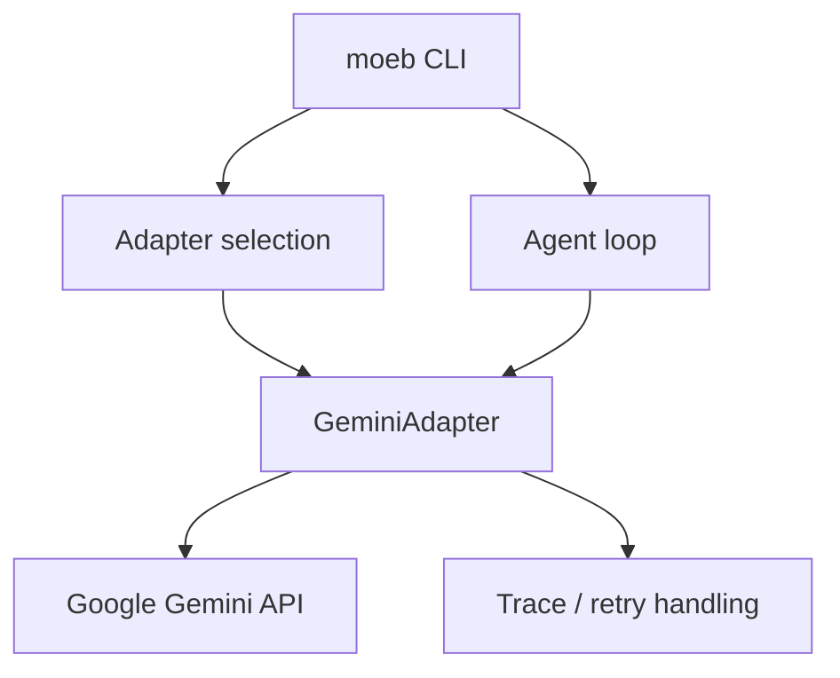

# Gemini Adapter

## Raw Requirement

We need an adapter variant for connecting to Gemini

## Description

Add a new Gemini adapter implementation to the moeb kernel so the existing adapter selection, configuration, listing, and execution flow can route requests to Google Gemini through the same adapter abstractions used by the current providers. The change must preserve the current hexagonal architecture boundaries: the adapter lives in the adapter layer, the domain layer remains unchanged except for wiring through existing ports and factories, and the new adapter participates in retry, tracing, tool-loop, and credential persistence behaviour already established for other providers.

## Diagram

## Backlinks

### Parents

| Label | Path | Purpose |
|-------|------|---------|
| README | README.md | root index |
| Moeb Kernel | specifications/moeb/moeb.kernel.md | establishes the adapter layer, adapter selection, and command flows that this spec extends |
| Moeb Hexagonal Architecture | specifications/moeb/moeb.hex-architecture.md | constrains the implementation to ports-and-adapters boundaries |
| Adapter Configuration, Release, and Listing | specifications/moeb/moeb.adapter-config-and-listing.md | governs adapter registration, configuration, listing, and release flows that Gemini must join |
| Anthropic Claude Adapter | specifications/moeb/moeb.anthropic-adapter.md | reference for provider adapter structure and parity expectations |
| Ollama Adapter | specifications/moeb/moeb.ollama-adapter.md | reference for a newer provider adapter integrated through the same kernel abstractions |

### External

| Label | URL | Purpose |
|-------|-----|---------|
| Gemini API documentation | https://ai.google.dev/gemini-api/docs | provider API reference |

## Steps

1. Define the Gemini adapter integration surface in the adapter layer.
   - Add a concrete adapter type that implements the existing adapter traits and can translate kernel chat messages, tool calls, and tool results into Gemini-compatible API requests and responses.
   - Keep all Gemini-specific request serialization, response parsing, and error interpretation inside the adapter module so the domain layer does not gain provider-specific branching.
   - Reuse the existing adapter factory and selection path so the new adapter is discoverable through current command flows rather than a separate command family.

2. Add Gemini configuration and credential handling through the existing adapter persistence model.
   - Introduce Gemini-specific configuration keys only where the established adapter configuration model already supports provider-scoped settings.
   - Store and release any required Gemini secret material using the same secret-file and release commands as other adapters.
   - Ensure adapter listing and configuration summaries can show Gemini as configured, unconfigured, or active using the same reporting format used by existing providers.

3. Implement Gemini request and response translation.
   - Map the kernel message model into the Gemini API request format, preserving user, assistant, system, tool call, and tool result semantics as far as the provider API permits.
   - Parse Gemini responses back into the kernel’s existing response types without changing the agent loop or tool executor contract.
   - Preserve established retry, transport-error handling, and trace-emission behaviour so Gemini runs are operationally consistent with other adapters.

4. Add tests that prove registration, wiring, and round-trip behaviour.
   - Verify Gemini appears in the adapter registry and is reachable through adapter resolution paths.
   - Verify configuration and release commands can manage Gemini-specific settings and credentials using the established persistence model.
   - Verify at least one representative request/response path round-trips through the Gemini adapter without losing required fields, and verify one provider-error path is handled according to the shared retry rules.

## Decisions

1. **Gemini is introduced as another adapter behind the existing adapter factory and ports.**
   - Rationale: The kernel already has a provider-neutral adapter model. Adding Gemini to the same abstraction keeps domain orchestration stable and avoids spreading provider-specific logic into command or agent code.
   - Alternatives:
     - Add Gemini branching directly in the domain layer; rejected because it would violate the adapter boundary and create provider-specific coupling in core workflow code.
     - Create a separate Gemini command path; rejected because it would fragment selection, configuration, and listing behaviour across multiple flows.
   - Consequences: Future providers should continue to be added as adapter implementations selected through the shared factory and command surfaces.

2. **Gemini must reuse the existing configuration, listing, and release lifecycle.**
   - Rationale: Users should manage Gemini the same way they manage other adapters, and the kernel already has persistence and discovery mechanisms for adapter-scoped settings.
   - Alternatives:
     - Hard-code Gemini settings or rely only on environment lookup; rejected because it would bypass the established adapter lifecycle and make the provider harder to manage consistently.
     - Create Gemini-specific configuration files; rejected because it would duplicate existing persistence logic and increase maintenance cost.
   - Consequences: Gemini-specific keys, if needed, must live inside the current adapter config structures and secret management flow.

3. **Gemini must preserve the shared runtime semantics for retries, tracing, and tool loops.**
   - Rationale: A new provider adapter must behave like the existing ones from the perspective of the agent loop, including retry policy and trace capture.
   - Alternatives:
     - Special-case Gemini with different retry or loop termination rules; rejected because it would create behavioural drift between adapters.
     - Disable tools for Gemini; rejected because the adapter must remain a first-class provider in the kernel.
   - Consequences: Any Gemini-specific transport or payload constraints must be handled inside the adapter implementation without changing shared orchestration logic.

4. **Gemini support is scoped to the adapter layer and the existing adapter-management commands.**
   - Rationale: The request is for a new adapter variant, not a broader provider-agnostic rewrite. Keeping the scope narrow minimizes the chance of accidental cross-cutting changes.
   - Alternatives:
     - Refactor the domain model to introduce a new provider abstraction; rejected because it is broader than required and would risk drift in unrelated workflows.
     - Add new top-level Gemini commands; rejected because the current command model already supports adapter selection and management.
   - Consequences: This specification commits the project to Gemini being reachable through existing adapter surfaces, not through a separate workflow.

## Rubric

### Structured

| Name | Description | Threshold | Pass Condition |
|------|-------------|-----------|----------------|
| `binary-builds` | Binary builds cleanly | `cargo build --release` completes without error | Zero errors | CI build exits 0 |
| `all-tests-pass` | All unit tests pass | `cargo test` completes without failure | Zero failures | `cargo test` exits 0 |
| `no-test-regression` | No existing test regression | All tests present before this change pass without modification to test code | Zero failures | `cargo test` exits 0; no test file edited |
| `no-drift` | No contradiction with parent specs | The implementation does not violate any decision recorded in a linked parent specification | Zero contradictions | Manual review of every decision in every parent spec listed in Backlinks |
| `spec-schema-compliance` | Spec conforms to schema | All required frontmatter fields and body sections are present and correctly ordered | 100% of required fields and sections | Validation in `domain/spec.rs` exits 0 during `moeb spec` |
| `adapter-structural-parity` | Adapter implementations are structurally identical | `AnthropicAdapter::send` and `OpenAiAdapter::send` follow the same retry loop skeleton; only API-specific serialisation differs | Identical structure | Code review of both adapter files side-by-side finds no structural asymmetry |
| `gemini-registration` | Gemini appears in adapter selection, listing, and configuration flows | Gemini is visible and selectable through the existing adapter management commands | Gemini present in all documented surfaces | Manual inspection of adapter registry and command output confirms Gemini is selectable and visible |
| `gemini-round-trip-translation` | Gemini request and response translation is correct | Kernel messages, tool calls, and tool results are translated without losing required information | No missing required fields | Tests demonstrate a full round-trip for at least one representative tool-call conversation |

### Qualitative

- The Gemini adapter should be discoverable and configurable through the same user-facing workflows as the existing adapters.
- Error messages should clearly distinguish provider connectivity failures, authentication failures, and missing-model or invalid-configuration conditions.
- Implementation details specific to Gemini should remain isolated to the adapter boundary rather than spreading into unrelated kernel logic.
