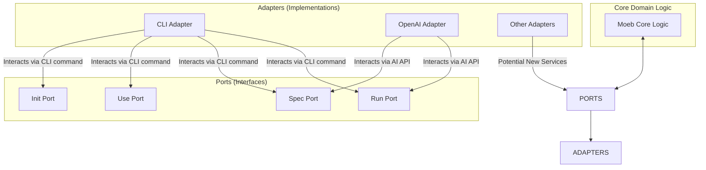

# Moeb Hexagonal Architecture

**Domain:** moeb

---

## Raw Requirement

> The Moeb kernel must be restructured using hexagonal (also known as ports and adapters) architecture. This architecture should allow for the seamless addition of new input and output ports and adapters, supporting future expandability and modular interaction with multiple external services or interfaces.

---

## Description

The Hexagonal Architecture, or Ports and Adapters pattern, will be applied to the Moeb Kernel to separate core business logic from external services and user interactions. This restructuring will ensure the kernel is organized into distinct layers that include the core domain logic, application services, and adapters for interaction with external systems. The architecture facilitates testability and maintainability by isolating dependencies through interfaces (ports).

---

## Diagram

---

## Steps

1. **Define Ports as Interfaces in Rust**
   - Create interfaces (traits) for each command (init, use, spec, run) under `src/moeb/src/ports/`. Each trait should define the necessary operations that need implementations.

2. **Create Adapter Implementations**
   - Implement existing command logic in separate adapter modules (`src/moeb/src/adapters/cli.rs`, `src/moeb/src/adapters/openai.rs`).
   - Adapt openai interactions and other unique functionalities directly.

3. **Refactor Core Kernel Logic**
   - Isolate core business logic into a domain layer (`src/moeb/src/domain/`) that uses only port interfaces, eliminating direct dependencies on external adapters.

4. **Ensure Configurability and Expansion**
   - Implement a configuration handler in `src/moeb/src/config.rs` allowing dynamic loading and switching of adapters via configuration files.
   - Ensure that new adapters can be added easily by adhering to the established ports interfaces, enabling customization without core changes.

5. **Integrate Dependency Injection**
   - Implement a simple dependency injection mechanism or use an existing crate to manage adapter instances — ensuring core logic interacts with ports, not concrete implementations.

6. **Testing and Validation**
   - Write extensive tests for each interface and adapter, ensuring that adding new adapters doesn't break existing functionality.
   - Confirm that the kernel behaves correctly with various combinations of adapters via automated tests.

---

## Backlinks

### Parents

| Label | Path | Purpose |
|-------|------|---------|
| Moeb Kernel | [specifications/moeb/moeb.kernel.md](specifications/moeb/moeb.kernel.md) | Original specification detailing CLI command kernels and adapter-based AI interactions |

---

## Decisions

- **Hexagonal Architecture Adoption:** 
  - **Rationale:** Enables clear separation of concerns, making the system easily extendable and maintainable by defining clear interfaces for ports that are easy to implement and replace.
  - **Consequences:** Initially increases complexity and abstraction but greatly improves modularity and scalability.

- **Rust for Implementation:**
  - Consistent with the Moeb kernel's existing codebase, ensuring high performance and reliability.

---

## Rubric

### Structured

| Name | Description | Threshold | Pass Condition |
|------|-------------|-----------|----------------|
| Ports Defined | Interfaces for core operations are defined and implemented | All core functionalities | Verified via code review |
| Adapters Implemented | CLI and OpenAI adapters implemented and functional | Implement all functionality | Pass unit and integration tests |
| Dependency Injection | Proper dependency management for interchangeable adapters | Functional across all interactions | Confirm via tests and reviews |

### Qualitative

- **Seamless Adapter Integration:** Adding a new adapter requires minimal code changes and no changes to core logic.
- **Extensive Documentation:** Clear documentation provided for each module and interface, aiding future developments and onboarding efforts.
- **Modularity and Scalability:** Architecture supports easy scaling of features and integration of multiple services.