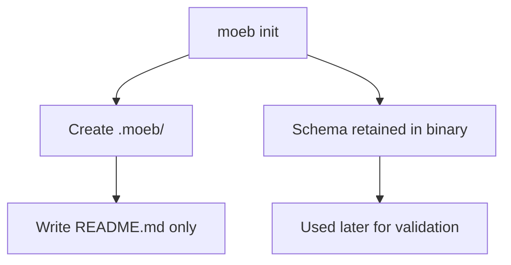

# Moeb Init Retains Schema in Binary and Copies Only README

## Raw Requirement

When moeb init is called we produce .moeb/ with README.md and spec-schema.yaml, we should retain the schema within the binary and only copy out the base level README at that stage

## Description

Update `moeb init` so it no longer materialises `spec-schema.yaml` into the generated `.moeb/` directory during initialisation. The kernel should keep the schema embedded or otherwise bundled within the binary for validation use, while `init` only writes the base-level `README.md` into `.moeb/` at creation time.

## Diagram

## Backlinks

### Parents

- label: README.md
  path: README.md
  purpose: repository policy and harness boundary
- label: Moeb Init Configuration File Issue
  path: specifications/moeb/moeb.init-config-file-issue.md
  purpose: parent specification for init behaviour

### External

- label: None
  url: https://example.invalid
  purpose: none

## Steps

1. Update the `moeb init` implementation so the directory bootstrap phase creates `.moeb/` and writes only the base README content required for the harness to orient new users.
2. Remove any code path that copies, writes, or synthesises `spec-schema.yaml` into `.moeb/` during init.
3. Ensure schema access for later validation remains available from the binary’s bundled resources or equivalent in-memory/static location, so commands that validate specs can still operate without reading a file from `.moeb/`.
4. Adjust any tests or fixtures that currently assert the presence of `.moeb/spec-schema.yaml` after init so they instead assert README-only initialisation.
5. Verify the init output remains consistent with the repository-layer policies in the harness README and does not introduce any new file placement outside the stated init behaviour.

## Decisions

### Decision 1 — `moeb init` writes README only

`moeb init` must create the `.moeb/` directory and materialise the base README, but it must not copy `spec-schema.yaml` into the generated tree.

Rationale: the schema is a kernel-owned validation asset and should not be duplicated into every initialized repository when the binary can retain and serve it directly.

Alternatives:
- Copy both README and schema into `.moeb/`: rejected because it duplicates a binary-owned validation artefact unnecessarily.
- Write neither README nor schema: rejected because init must still provide the harness orientation file.

Consequences: any later command that needs schema information must load it from the binary rather than from a generated `.moeb/spec-schema.yaml` file.

### Decision 2 — Schema remains bundled with the binary

The schema used for validation is retained within the moeb binary or its embedded resources and is not treated as an init-generated file.

Rationale: this keeps init lightweight and ensures schema availability is not dependent on a file that may be absent or stale in a newly initialized workspace.

Alternatives:
- Require users to keep a copied schema file in `.moeb/`: rejected because it contradicts the requested init behaviour.
- Fetch the schema from disk at runtime: rejected because init would then have to persist it or rely on an external path.

Consequences: validation commands must be implemented against the bundled schema source of truth, and changes to the schema require a binary update rather than an init-time file copy.

## Rubric

### Structured

| Name | Description | Threshold | Pass Condition |
|------|-------------|-----------|----------------|
| no-drift | No contradiction with parent specs | The implementation does not violate any decision recorded in a linked parent specification | Zero contradictions | Manual review of every decision in every parent spec listed in Backlinks |
| spec-schema-compliance | Spec conforms to schema | All required frontmatter fields and body sections are present and correctly ordered | 100% of required fields and sections | Validation in `domain/spec.rs` exits 0 during `moeb spec` |

### Qualitative

- Init behaviour is minimal and matches the requirement exactly.
- Schema availability for later validation remains reliable without adding init-time file output.
