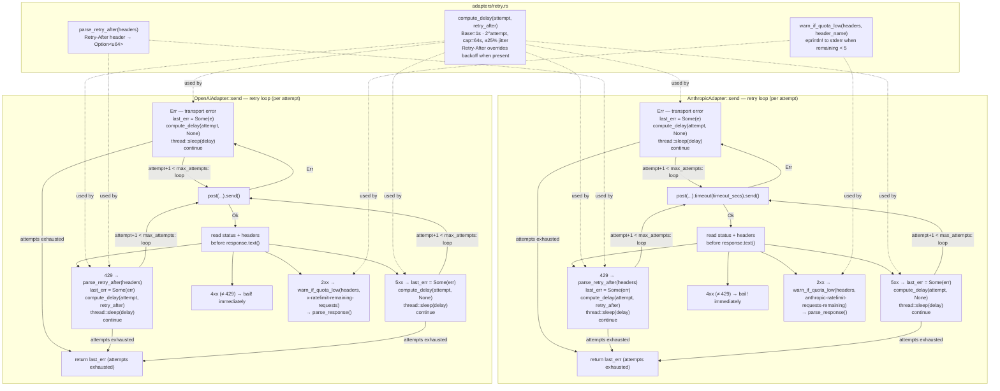

# Kernel Adapter Rate Limiting with Exponential Backoff

## Raw Requirement

> Currently our adapters are hitting issues with rate limits when making requests to AI APIs, we should apply best practices for all communication with these APIs, primarily rate limiting must be applied within the kernel's calls to allow for our kernel commands to complete successfully, a page detailing this is https://fast.io/resources/ai-agent-rate-limiting/

## Description

Introduces proper rate-limiting resilience into both the `AnthropicAdapter` and `OpenAiAdapter` through three coordinated changes:

1. **Exponential backoff with jitter.** The fixed one-second inter-retry delay in both adapters is replaced with a progressive delay: `min(1s × 2^attempt, 64s) ± 25% jitter`. This prevents synchronized retry storms and avoids wasting quota on rapid successive failures after a rate-limit response.

2. **`Retry-After` header respect.** When a 429 response includes a `Retry-After` header, that value (integer seconds) is used as the delay instead of the backoff formula, honoring the provider's explicit guidance on when to retry.

3. **Quota-remaining warning.** On every successful (2xx) response, an adapter-specific rate-limit header is inspected. If the provider reports fewer than 5 requests remaining, a warning is emitted to stderr so the user can act before the next run hits a hard limit.

All shared retry-delay logic is extracted into a new `src/moeb/src/adapters/retry.rs` module, keeping both adapters consistent without duplication. The sleep is moved from the top of the retry loop (before each non-first attempt) to inside each failure branch (after recording `last_err`), so the delay for a 429 response can incorporate the parsed `Retry-After` value.

The OpenAI adapter also gains a fix to transport error handling: the current `.send().context(...)? ` pattern immediately propagates network errors out of the retry loop. This is restructured to match the corrected pattern already in place in `AnthropicAdapter` (established by `moeb.anthropic-adapter-timeout-retry.md`), so transport failures are retried when `retries > 0`.

## Diagram



## Backlinks

### Parents

| Label | Path | Purpose |
|-------|------|---------|
| Adapter Configuration, Release, and Listing | [specifications/moeb/moeb.adapter-config-and-listing.md](specifications/moeb/moeb.adapter-config-and-listing.md) | Establishes the retry loop and Decision 5 (fixed 1-second backoff, 429/5xx only); this spec supersedes Decision 5 for both adapters |
| Anthropic Adapter Timeout and Transport Error Retry | [specifications/moeb/moeb.anthropic-adapter-timeout-retry.md](specifications/moeb/moeb.anthropic-adapter-timeout-retry.md) | Restructured the Anthropic retry loop to handle transport errors and apply per-request timeouts; this spec adds exponential backoff and Retry-After to that loop and extends the transport-error fix to OpenAiAdapter |
| Moeb Hexagonal Architecture | [specifications/moeb/moeb.hex-architecture.md](specifications/moeb/moeb.hex-architecture.md) | Mandates ports-and-adapters structure; retry.rs is placed in the adapters layer as shared adapter infrastructure |

### External

| Label | URL | Purpose |
|-------|-----|---------|
| AI Agent Rate Limiting — fast.io | https://fast.io/resources/ai-agent-rate-limiting/ | Rubric source: exponential backoff with jitter, Retry-After header respect, and quota-remaining monitoring |

## Steps

### Step 1 — Create `src/moeb/src/adapters/retry.rs`

Create the file with three public functions and a private jitter helper:

```rust
/// Compute the delay before the next retry attempt.
///
/// If `retry_after_secs` is Some (from a provider Retry-After header), that value is used
/// directly. Otherwise exponential backoff with ±25% jitter is applied:
///   delay = min(1s × 2^attempt, 64s) × jitter_factor
/// Jitter is derived from subsecond system-time nanoseconds — no external crate required.
pub fn compute_delay(attempt: u32, retry_after_secs: Option<u64>) -> std::time::Duration {
    const BASE_SECS: f64 = 1.0;
    const MAX_SECS: f64 = 64.0;
    const JITTER_AMPLITUDE: f64 = 0.25;

    let secs = if let Some(ra) = retry_after_secs {
        ra as f64
    } else {
        let exp = BASE_SECS * (1u64 << attempt.min(30)) as f64;
        let capped = exp.min(MAX_SECS);
        let nanos = std::time::SystemTime::now()
            .duration_since(std::time::UNIX_EPOCH)
            .unwrap_or_default()
            .subsec_nanos();
        let rand_unit = (nanos % 10_000) as f64 / 10_000.0; // 0.0 .. 1.0
        let jitter = 1.0 - JITTER_AMPLITUDE + 2.0 * JITTER_AMPLITUDE * rand_unit;
        capped * jitter
    };

    std::time::Duration::from_secs_f64(secs.max(0.1))
}

/// Parse the `Retry-After` response header as integer seconds.
/// Returns `None` if the header is absent or not a valid non-negative integer.
/// HTTP-date format is not supported; only integer seconds are parsed.
pub fn parse_retry_after(headers: &reqwest::header::HeaderMap) -> Option<u64> {
    headers
        .get("retry-after")?
        .to_str()
        .ok()?
        .trim()
        .parse::<u64>()
        .ok()
}

/// Emit a stderr warning if the named rate-limit header reports fewer than 5 requests remaining.
///
/// Pass the provider-specific header name:
///   Anthropic: "anthropic-ratelimit-requests-remaining"
///   OpenAI:    "x-ratelimit-remaining-requests"
///
/// Silently does nothing when the header is absent or unparseable.
pub fn warn_if_quota_low(headers: &reqwest::header::HeaderMap, remaining_header: &str) {
    if let Some(remaining) = headers
        .get(remaining_header)
        .and_then(|v| v.to_str().ok())
        .and_then(|s| s.parse::<u64>().ok())
    {
        if remaining < 5 {
            eprintln!(
                "Warning: AI API rate limit nearly exhausted ({} requests remaining). \
                 Consider waiting before the next run or reducing concurrent usage.",
                remaining
            );
        }
    }
}
```

Add a `#[cfg(test)] mod tests` block within this file containing:

- **`compute_delay_first_attempt_within_jitter_bounds`**: call `compute_delay(0, None)` and assert the result is between `Duration::from_millis(750)` and `Duration::from_millis(1250)` (1 second ± 25%).

- **`compute_delay_grows_with_attempt`**: call `compute_delay(6, None)` (midpoint ≈ 64s) and `compute_delay(0, None)` (midpoint ≈ 1s). Assert the result for attempt 6 is at least 8× the result for attempt 0 — confirming meaningful growth even with jitter applied across the range.

- **`compute_delay_caps_at_64_seconds`**: call `compute_delay(20, None)` — `2^20` far exceeds 64. Assert the result is at most `Duration::from_secs_f64(64.0 * 1.25 + 0.01)` (cap of 64s × jitter ceiling plus epsilon).

- **`compute_delay_retry_after_overrides_backoff`**: call `compute_delay(10, Some(5))` and assert the result equals `Duration::from_secs(5)` exactly.

- **`parse_retry_after_returns_none_when_absent`**: construct an empty `reqwest::header::HeaderMap` and assert `parse_retry_after` returns `None`.

- **`parse_retry_after_parses_integer_seconds`**: insert header `"retry-after": "30"` and assert the function returns `Some(30)`.

- **`parse_retry_after_rejects_http_date`**: insert header `"retry-after": "Wed, 21 Oct 2025 07:28:00 GMT"` and assert the function returns `None`.

- **`warn_if_quota_low_does_not_panic`**: call `warn_if_quota_low` with a map containing `"x-ratelimit-remaining-requests": "3"` and assert the call completes without panic (stderr side-effects are not captured; this confirms the function runs without error for values below and at/above the threshold).

### Step 2 — Expose `retry` from `src/moeb/src/adapters/mod.rs`

In the adapters module file, add:

```rust
pub mod retry;
```

### Step 3 — Update `AnthropicAdapter::send` to use shared retry helpers

In `src/moeb/src/adapters/anthropic.rs`:

1. Add the import at the top of the file:

```rust
use super::retry;
```

2. **Remove** the `if attempt > 0 { std::thread::sleep(std::time::Duration::from_secs(1)); }` block that appears at the top of the retry loop. The sleep now lives inside each failure branch.

3. Restructure the inner body of the loop so headers are read before the response body is consumed:

```rust
// After the match on .send() that already exists (from moeb.anthropic-adapter-timeout-retry.md),
// the transport error arm becomes:
Err(e) => {
    last_err = Some(anyhow::anyhow!("Failed to reach Anthropic API: {}", e));
    if attempt + 1 < max_attempts {
        std::thread::sleep(retry::compute_delay(attempt, None));
    }
    continue;
}
```

4. After `let response = match ... { Ok(r) => r, ... };`, read status and headers before consuming the body:

```rust
let status = response.status();
let retry_after = if status.as_u16() == 429 {
    retry::parse_retry_after(response.headers())
} else {
    None
};
if status.is_success() {
    retry::warn_if_quota_low(response.headers(), "anthropic-ratelimit-requests-remaining");
}
let text = response.text().context("Failed to read Anthropic response body")?;
```

5. Replace the existing 429/5xx retry arm:

```rust
if status.as_u16() == 429 || status.is_server_error() {
    last_err = Some(anyhow::anyhow!("Anthropic API error {}: {}", status, text));
    if attempt + 1 < max_attempts {
        std::thread::sleep(retry::compute_delay(attempt, retry_after));
    }
    continue;
}
```

The remainder of the loop (4xx bail, 2xx parse) is unchanged.

6. Add a unit test confirming the helper is wired:

- **`anthropic_retry_delay_first_attempt_within_bounds`**: call `retry::compute_delay(0, None)` directly and assert the result is between `Duration::from_millis(750)` and `Duration::from_millis(1250)`. This confirms the helper is importable and returns a sane value from within the adapter's test suite.

### Step 4 — Update `OpenAiAdapter::send` to fix transport retry and use shared helpers

In `src/moeb/src/adapters/openai.rs`:

1. Add the import:

```rust
use super::retry;
```

2. **Remove** the `if attempt > 0 { std::thread::sleep(std::time::Duration::from_secs(1)); }` block at the top of the retry loop.

3. Replace the immediate-propagation send call:

```rust
// Remove:
let response = self
    .client
    .post(API_URL)
    .bearer_auth(&self.api_key)
    .json(&body)
    .send()
    .context("Failed to reach OpenAI API")?;
```

with a match that feeds transport errors into `last_err` and retries:

```rust
let response = match self
    .client
    .post(API_URL)
    .bearer_auth(&self.api_key)
    .json(&body)
    .send()
{
    Err(e) => {
        last_err = Some(anyhow::anyhow!("Failed to reach OpenAI API: {}", e));
        if attempt + 1 < max_attempts {
            std::thread::sleep(retry::compute_delay(attempt, None));
        }
        continue;
    }
    Ok(r) => r,
};
```

4. After `let response = match ... { Ok(r) => r, ... };`, insert header reads before body consumption:

```rust
let status = response.status();
let retry_after = if status.as_u16() == 429 {
    retry::parse_retry_after(response.headers())
} else {
    None
};
if status.is_success() {
    retry::warn_if_quota_low(response.headers(), "x-ratelimit-remaining-requests");
}
let text = response.text().context("Failed to read OpenAI response body")?;
```

5. Replace the existing 429/5xx arm:

```rust
// Remove:
if status.as_u16() == 429 || status.is_server_error() {
    last_err = Some(anyhow::anyhow!("OpenAI API error {}: {}", status, text));
    continue;
}
```

with:

```rust
if status.as_u16() == 429 || status.is_server_error() {
    last_err = Some(anyhow::anyhow!("OpenAI API error {}: {}", status, text));
    if attempt + 1 < max_attempts {
        std::thread::sleep(retry::compute_delay(attempt, retry_after));
    }
    continue;
}
```

The non-success bail and success parse branches are unchanged.

6. Add unit tests:

- **`openai_adapter_uses_configured_retries`**: construct `OpenAiAdapter::from_secrets_and_config()` in a temp dir with `retries = Some(2)` in `[adapters.openai]` and a dummy `OPENAI_API_KEY`; assert `adapter.retries == 2`.

- **`openai_adapter_uses_default_retries_when_absent`**: construct with no adapter config entry; assert `adapter.retries == 0`.

Both tests must use the `CWD_LOCK` and `in_temp_dir()` pattern established in `adapter_management.rs` to avoid CWD races.

## Decisions

### Decision 1 — Exponential backoff with jitter supersedes the fixed 1-second delay for both adapters

**Rationale:** Decision 5 in `moeb.adapter-config-and-listing.md` established a fixed one-second back-off and explicitly deferred exponential back-off to a future specification. The observed rate-limit failures confirm that one second is consistently shorter than provider reset windows; the user's `RETRIES` count is consumed with no chance of the request succeeding. Exponential backoff with a 64-second cap gives each retry a realistic chance of landing after the rate-limit window has reset. Jitter prevents multiple concurrent or rapidly-restarted `moeb run` processes from colliding at the same retry instants and re-triggering the limit.

**Alternatives:**

| Option | Reason Rejected |
|--------|-----------------|
| Longer fixed delay (e.g. 5 seconds) | Still does not adapt to the provider's actual reset window; wastes time when the limit clears sooner |
| Configurable backoff base and max via new config keys | Adds config surface for parameters users should not need to tune; RETRIES is the correct user-facing lever |

**Consequences:** This supersedes Decision 5 from `moeb.adapter-config-and-listing.md` for both adapters. With `RETRIES = 0` (the default), behavior is identical to before — the sleep is inside the failure branch guarded by `attempt + 1 < max_attempts`, so it never fires on the sole attempt. With `RETRIES > 0`, wait times grow per attempt rather than remaining fixed at 1 second.

---

### Decision 2 — `Retry-After` header is honored as an override to the backoff formula

**Rationale:** When a provider includes `Retry-After`, it is authoritative. Applying a shorter backoff risks triggering stricter throttling; the header is the provider's explicit statement of when the next request is safe. Using it directly rather than flooring or capping it against the backoff formula preserves that authority, including cases where the provider specifies a reset window longer than 64 seconds.

**Alternatives:**

| Option | Reason Rejected |
|--------|-----------------|
| Use Retry-After as a floor (take the larger of formula and header) | Adds complexity; the provider's guidance should be followed, not exceeded |
| Ignore Retry-After entirely | Disregards explicit provider guidance; may trigger escalating throttling beyond the standard 429 cycle |

**Consequences:** If a provider's `Retry-After` value exceeds 64 seconds, the delay will exceed the formula's cap. This is intentional: provider instructions take priority over internal defaults. HTTP-date format `Retry-After` values are not parsed; only integer seconds are recognized (both Anthropic and OpenAI use integer seconds in practice).

---

### Decision 3 — Backoff constants are fixed at compile time

**Rationale:** The cited resource recommends 1s base, 64s cap, and ±25% jitter as sensible defaults for AI agent rate limiting. The `RETRIES` key already gives users the primary control over retry behavior. Exposing backoff base, cap, and jitter amplitude as configurable keys would add documentation burden and config complexity for parameters that the vast majority of users should not need to change.

**Alternatives:**

| Option | Reason Rejected |
|--------|-----------------|
| `BACKOFF_BASE` and `BACKOFF_MAX` as new adapter config keys | No user-reported need for fine-tuning; adds schema surface with minimal practical benefit |

**Consequences:** Changing backoff parameters requires a code change and binary release. The three constants (`BASE_SECS`, `MAX_SECS`, `JITTER_AMPLITUDE`) are defined in `retry.rs` so any future change requires editing only one location.

---

### Decision 4 — Transport error retry extended to `OpenAiAdapter`

**Rationale:** `AnthropicAdapter` received this fix in `moeb.anthropic-adapter-timeout-retry.md` (Decision 1 of that spec). The OpenAI adapter contains the identical structural bug: `.send().context(...)?` propagates network errors immediately, bypassing the retry loop. Fixing this as part of the rate-limiting overhaul maintains consistency between adapters. Users expect `RETRIES = 3` to mean the same thing regardless of which adapter is active.

**Alternatives:**

| Option | Reason Rejected |
|--------|-----------------|
| Leave OpenAI transport error behavior unchanged | Creates an asymmetry where the same `RETRIES` setting covers different failure modes per adapter |
| Separate specification for OpenAI transport retry | Splitting one cohesive structural change across two specs adds harness overhead with no benefit |

**Consequences:** Users of the OpenAI adapter with `RETRIES > 0` will now see retries on transient network failures (timeouts, connection resets, DNS failures). This is a behavioral improvement with no user-facing configuration change required.

---

### Decision 5 — Jitter derived from subsecond system time; no new crate dependency

**Rationale:** Jitter between retries must vary per call to avoid synchronized collisions. Subsecond nanoseconds change fast enough between retry intervals to provide adequate spread for this purpose. The `rand` crate would provide higher-quality randomness but adds a dependency for a non-security-critical use case where the quality difference is negligible.

**Alternatives:**

| Option | Reason Rejected |
|--------|-----------------|
| Add the `rand` crate | Adds a dependency for marginal randomness improvement in retry jitter |
| No jitter (pure exponential) | Correlated retries from concurrent processes would collide at the same moments |
| Deterministic jitter based on attempt index | Fully predictable; provides no distribution benefit over a fixed delay |

**Consequences:** Jitter quality is sufficient to prevent retry storms in practice but is not cryptographically random. Any future use case requiring cryptographic randomness must use a dedicated source unrelated to this module.

---

### Decision 6 — Rate-limit quota warning emitted on successful responses; advisory only

**Rationale:** Quota headers are most useful on successful responses — they tell the user how much capacity remains before the next failure. Emitting the warning there, rather than after a 429, is preventive rather than reactive and gives the user a chance to pause between `moeb run` invocations. The warning goes to stderr (not stdout) so it does not contaminate any piped output. Blocking execution when quota is low would be too aggressive for a CLI tool where the user has already committed the current run.

**Alternatives:**

| Option | Reason Rejected |
|--------|-----------------|
| Warn on 429 responses instead | Reactive rather than preventive; the limit is already exceeded |
| Warn on every response regardless of status | Adds noise during retry sequences when quota headers may not be meaningful |
| Fail the command when quota is critically low | Too aggressive; the remaining capacity may be sufficient for the current operation |

**Consequences:** The warning appears in stderr after a successful API call. Users who pipe `moeb run` stdout to a file will see it in the terminal. Users with `RETRIES = 0` who hit a hard limit will see the 429 error without a preceding quota warning; the warning only fires on the successful responses that precede the limit.

## Rubric

### Structured

| Name | Description | Threshold | Pass Condition |
|------|-------------|-----------|----------------|
| Binary builds | `cargo build --release` completes without error | Zero errors | CI build exits 0 |
| `compute_delay` first-attempt bounds | `compute_delay(0, None)` returns a duration in [750ms, 1250ms] | 750ms ≤ result ≤ 1250ms | Unit test `compute_delay_first_attempt_within_jitter_bounds` |
| `compute_delay` cap | `compute_delay(20, None)` returns at most `64s × 1.25 + epsilon` | result ≤ 81s | Unit test `compute_delay_caps_at_64_seconds` |
| `compute_delay` Retry-After override | `compute_delay(10, Some(5))` returns exactly 5 seconds | result == 5s | Unit test `compute_delay_retry_after_overrides_backoff` |
| `parse_retry_after` integer | Header `"retry-after: 30"` parses to `Some(30)` | Some(30) returned | Unit test `parse_retry_after_parses_integer_seconds` |
| `parse_retry_after` HTTP-date rejected | HTTP-date Retry-After value returns `None` | None returned | Unit test `parse_retry_after_rejects_http_date` |
| No sleep with `RETRIES = 0` | With one attempt, `attempt + 1 < max_attempts` is never true | No sleep call ever fires | Code review: sleep is unconditionally guarded by the check |
| Transport errors retried in OpenAI adapter | `.send()` failure does not immediately propagate when `retries > 0` | `last_err` populated, loop continues | Code review of restructured send match |
| Headers read before body | Both adapters access `response.headers()` before calling `response.text()` | Compile-time guarantee (no move after borrow) | `cargo build` exits 0 |
| No existing test regression | All unit tests in `anthropic.rs`, `openai.rs`, and `adapter_management.rs` pass without modification | Zero failures | `cargo test` exits 0 |

### Qualitative

- **Consistent adapter structure:** After this change, both `AnthropicAdapter::send` and `OpenAiAdapter::send` must follow the same structural skeleton: match on `.send()` for transport errors, read status and headers, inspect headers before consuming the body, apply `compute_delay` inside each failure branch. A developer reading both files side-by-side should see the same pattern with only API-specific serialisation code differing.
- **No silent wait increase for zero retries:** Users with `RETRIES = 0` (the default for both adapters) must observe no change in behavior — no sleep is introduced on a single-attempt run. The guard `if attempt + 1 < max_attempts` must appear unconditionally around every `thread::sleep` call.
- **Actionable final error:** After exhausting all retry attempts, the error propagated to the caller must include the last observed failure (transport message or HTTP status + body) so the user can diagnose the root cause without re-running in verbose mode. This criterion is inherited from `moeb.anthropic-adapter-timeout-retry.md` and must continue to hold.
