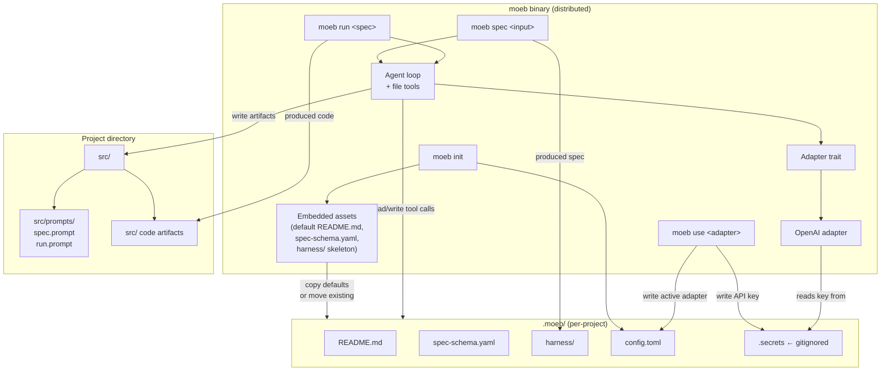

# Moeb Kernel

**Domain:** moeb

---

## Raw Requirement

> A distributable kernel application that can be installed and used in a similar way to git.
> The overall distributable should be named as moeb, any commands to cli will be called to moeb <command> <arguments>
> The kernel should be written in rust.
> The base structure README.md, spec-schema.yaml and harness should be stored as part of this source for later copy when running the command "moeb init" which should copy them out to a folder .moeb/
> Given the files/folder are already present in the directory where moeb init is called "moeb init" should create the .moeb/ folder and then cut the existing README.md, spec-schema.yaml and harness folder to leave the base directory as clean as possible.
> The kernel will need to connect to external ai providers, for now this could be openai api; as part of moeb init, the user should be supplied with a prompt to set up adapter(s) which could be called as "moeb use", so in this instance "moeb use openai", which should then prompt for an API key, storing that as a secret.
> moeb spec should accept raw input and produce a specification: this could be done with a prompt such as "Study README.md
> You are to produce a specification as detailed there for the following:" followed by the raw input, whatever the prompt is, this should be stored under the src/ harness as an artifact, as should any template prompts.
> The adapter chosen to be used should then have the prompt sent.
> "moeb run" should accept a string expected to be the name of a specification file, which should then take the template prompt:
> "study README.md
> study {{the prompt name input to moeb run}}
>
> Choose the next most important part to implement for the specification and execute it
> Once that is complete repeat this"

---

## Description

Moeb is a Rust binary distributed as a single executable, installed globally and invoked as `moeb <command>`. It manages a per-project harness directory (`.moeb/`) that holds harness infrastructure, configuration, and specification files. Four commands form the kernel surface: `moeb init` bootstraps a project's harness by moving or copying harness assets into `.moeb/`; `moeb use <adapter>` configures an AI provider and stores its credentials; `moeb spec <input>` drives an AI agent loop to produce a conformant specification and register it; `moeb run <spec>` drives an AI agent loop to implement the named specification's next steps, iterating until complete. Both `moeb spec` and `moeb run` expose file-system tools to the agent (read, write, list) and manage the turn-by-turn tool loop themselves. Template prompts are stored as versioned artifacts under `src/prompts/`.

---

## Diagram



---

## Backlinks

### Parents

| Label | Path | Purpose |
|-------|------|---------|
| README | [README.md](../../README.md) | Root index and policy document; defines the harness structure this application manages |

### External

*(none)*

---

## Steps

1. **Scaffold the Rust workspace at `src/moeb/`**
   Create a Cargo workspace at `src/moeb/` with a single binary crate (`moeb`). The `Cargo.toml` at workspace root must declare the binary. Add a top-level `src/moeb/src/main.rs` that dispatches subcommands using a CLI argument parser (e.g. `clap`). Create the following module files: `src/moeb/src/commands/init.rs`, `use_cmd.rs`, `spec.rs`, `run.rs`; `src/moeb/src/adapters/mod.rs`, `openai.rs`; `src/moeb/src/config.rs`; `src/moeb/src/agent.rs`. No logic in any module yet — stubs only.

2. **Embed default harness assets into the binary**
   Place the default harness files (`README.md`, `spec-schema.yaml`, and a minimal `harness/` skeleton) under `src/moeb/assets/`. Use `include_str!` and `include_bytes!` macros (or the `rust-embed` crate) to compile these files into the binary so `moeb init` can extract them without requiring a separate installation package. The embedded asset set must include at minimum: `assets/README.md`, `assets/spec-schema.yaml`.

3. **Implement the configuration and secrets layer**
   In `src/moeb/src/config.rs`, implement `MoebConfig` as a serialisable struct (using `serde` + `toml`) containing: `active_adapter: Option<String>`. Implement `MoebConfig::load()` which reads `.moeb/config.toml` in the current working directory, and `MoebConfig::save()` which writes it back. Implement a `Secrets` struct with `get(key)` and `set(key, value)` that reads and writes `.moeb/.secrets` as a simple `KEY=VALUE` line format. `.moeb/.secrets` must be excluded from git: `moeb init` must append `.moeb/.secrets` to `.gitignore` in the project root, creating `.gitignore` if absent.

4. **Implement `moeb init`**
   In `src/moeb/src/commands/init.rs`, implement the following sequence:
   - Create `.moeb/` in the current working directory if it does not exist. If `.moeb/` already exists, exit with a clear error: "Already initialised. Run moeb init --reinit to reinitialise."
   - For each of `README.md`, `spec-schema.yaml`, `harness/`: if the file or directory exists in the current working directory, move it into `.moeb/`; otherwise extract the embedded default asset into `.moeb/`.
   - Create an empty `.moeb/config.toml` using `MoebConfig::default()`.
   - Append `.moeb/.secrets` to `.gitignore`.
   - Print: "Moeb initialised. Run `moeb use <adapter>` to configure an AI provider."

5. **Define the adapter trait and implement the OpenAI adapter**
   In `src/moeb/src/adapters/mod.rs`, define:
   ```rust
   pub trait Adapter: Send + Sync {
       fn send(&self, messages: &[Message], tools: &[ToolDef]) -> Result<AgentResponse>;
   }
   ```
   where `Message` carries role and content, `ToolDef` carries name, description, and parameter schema, and `AgentResponse` is either a text response or a list of tool calls. In `src/moeb/src/adapters/openai.rs`, implement `Adapter` for `OpenAiAdapter` which reads the API key from `.moeb/.secrets` under key `OPENAI_API_KEY`, constructs an OpenAI chat-completions request (model: `gpt-4o`), and handles the response format including tool call payloads.

6. **Implement `moeb use <adapter>`**
   In `src/moeb/src/commands/use_cmd.rs`, implement:
   - Match the adapter argument against known adapters (`openai`). Unknown adapters print a clear error listing available adapters.
   - For `openai`: prompt the user interactively for their API key (suppress echo). Validate the key is non-empty. Write it to `.moeb/.secrets` under key `OPENAI_API_KEY`. Update `.moeb/config.toml` to set `active_adapter = "openai"`. Print: "OpenAI adapter configured."

7. **Create template prompt artifacts at `src/prompts/`**
   Create two plain-text template files. These are versioned artifacts owned by this specification:

   `src/prompts/spec.prompt`:
   ```
   Study README.md
   You are to produce a specification as detailed there for the following:

   {{input}}
   ```

   `src/prompts/run.prompt`:
   ```
   study README.md
   study {{spec}}

   Choose the next most important part to implement for the specification and execute it
   Once that is complete repeat this
   ```

   The `{{input}}` and `{{spec}}` tokens are substituted at runtime by the respective commands.

8. **Implement the agent loop**
   In `src/moeb/src/agent.rs`, implement `run_agent_loop(adapter, initial_prompt, working_dir)` which:
   - Sends the initial prompt as the first user message.
   - Exposes three tools to the model: `read_file(path: string)`, `write_file(path: string, content: string)`, `list_directory(path: string)`. All paths are resolved relative to `working_dir`.
   - On each response: if the model returns tool calls, execute each tool, append the tool results as a tool-role message, and send the next request. If the model returns a text response with no tool calls, the loop terminates.
   - Write all file writes to disk immediately when the tool is called.
   - The loop must not continue indefinitely: enforce a maximum of 50 turns, printing a warning and halting if reached.

9. **Implement `moeb spec <input>`**
   In `src/moeb/src/commands/spec.rs`, implement:
   - Load `src/prompts/spec.prompt` from the current working directory. Substitute `{{input}}` with the raw input string supplied as the CLI argument.
   - Load the active adapter from `.moeb/config.toml`. If no adapter is configured, exit with: "No adapter configured. Run `moeb use <adapter>` first."
   - Call `run_agent_loop` with `.moeb/` as the working directory. The agent is expected to read `.moeb/README.md`, produce a specification, and write it to the appropriate path under `.moeb/harness/` and register it in `.moeb/README.md`.
   - Print the final text response from the agent to stdout.

10. **Implement `moeb run <spec>`**
    In `src/moeb/src/commands/run.rs`, implement:
    - Accept a spec name as the CLI argument. Resolve the full path by searching `.moeb/harness/` recursively for a file whose name matches or contains the supplied string. If zero or more than one match is found, print all candidates and exit.
    - Load `src/prompts/run.prompt` from the current working directory. Substitute `{{spec}}` with the resolved relative path of the spec file (relative to `.moeb/`, e.g. `harness/moeb/moeb.kernel.md`).
    - Load the active adapter from `.moeb/config.toml`. Exit with the same error as `moeb spec` if unconfigured.
    - Call `run_agent_loop` with the project root as the working directory. The agent is expected to read `.moeb/README.md`, read the spec, implement steps, and write artifacts to `src/`.
    - Print the final text response to stdout.

---

## Decisions

### Rust as the implementation language

**Rationale:** Required by the brief. Rust produces a single statically-linked binary with no runtime dependency, ideal for a git-like globally-installed tool. Memory safety and strong typing reduce a class of runtime errors common in CLI tools.

**Alternatives:**

| Option | Reason Rejected |
|--------|----------------|
| Go | Equally viable for CLIs and also produces static binaries, but not required and not selected |
| Python | Requires runtime; installation is more complex for end users |

**Consequences:** The build toolchain is `cargo`. Distribution is a single binary per platform. Cross-compilation targets must be managed for release.

---

### `.moeb/` as the per-project harness directory

**Rationale:** Mirrors `.git/` — a hidden directory at the project root that contains all tool-managed state. Keeps the project root clean (consistent with the "leave the base directory as clean as possible" requirement) and makes the harness clearly owned by moeb rather than the project author.

**Alternatives:**

| Option | Reason Rejected |
|--------|----------------|
| `moeb/` (visible directory) | Clutters the project root; authors may accidentally edit harness files |
| `~/.moeb/<project-hash>/` (global per-user) | Loses per-project portability; cannot be committed or shared |

**Consequences:** All harness commands resolve `.moeb/` relative to the current working directory. `moeb` does not search parent directories (unlike git). `.moeb/.secrets` must always be gitignored.

---

### Harness defaults embedded in the binary at compile time

**Rationale:** A self-contained binary requires no installer, no separate data directory, and no post-install setup step. Embedding with `include_str!`/`rust-embed` keeps the assets versioned alongside the source and always consistent with the binary version.

**Alternatives:**

| Option | Reason Rejected |
|--------|----------------|
| Ship defaults as a separate archive alongside the binary | Requires installer logic; binary and assets can fall out of sync |
| Download defaults from a remote URL on first run | Requires network access at init time; creates a bootstrap failure mode |

**Consequences:** Default harness files are frozen at compile time. Updates to defaults require a new binary release. Projects that have already run `moeb init` retain their own copy of the harness files and are unaffected by default changes in later binary versions.

---

### Agent loop with file tools rather than prompt-only

**Rationale:** Both `moeb spec` and `moeb run` require the AI to read files (README.md, spec files) and write files (spec output, code artifacts). Without file tools the agent cannot act on the filesystem. Providing a minimal tool set (read, write, list) keeps the surface small while enabling the full harness workflow.

**Alternatives:**

| Option | Reason Rejected |
|--------|----------------|
| Include file contents in the prompt (no tools) | Works for small files; breaks for large harnesses; makes write-back impossible |
| Full shell execution tool | Unnecessary power; introduces security risk in an unsandboxed environment |

**Consequences:** The agent loop in `src/moeb/src/agent.rs` owns the tool dispatch. The tool surface is fixed at read, write, list. Expanding the tool set requires a code change and a new binary release.

---

### API keys stored in `.moeb/.secrets` as a `KEY=VALUE` file

**Rationale:** Simple, human-readable, and inspectable. Storing under `.moeb/` keeps credentials co-located with the project harness. Gitignoring the file prevents accidental commit. No keychain dependency keeps the implementation portable across platforms.

**Alternatives:**

| Option | Reason Rejected |
|--------|----------------|
| System keychain (OS-specific) | Platform coupling; complex to implement correctly on all three major OSes |
| Environment variables only | Not persisted; user must re-export on every shell session |
| Encrypted at rest | Adds key-management complexity that is out of scope for an initial kernel |

**Consequences:** `.moeb/.secrets` is a plaintext file on disk. Users on shared systems should be aware that the API key is readable by any process with filesystem access. The file must be excluded from version control and this must be enforced by `moeb init`.

---

### Template prompts stored as files in `src/prompts/`, not hardcoded strings

**Rationale:** The requirement explicitly states that prompts "should be stored under the src/ harness as an artifact". Storing them as files makes them versioned, auditable, and modifiable without recompiling the binary. They are artifacts produced by this specification, consistent with the harness's target-layer policy.

**Alternatives:**

| Option | Reason Rejected |
|--------|----------------|
| Hardcode prompts as Rust string constants | Not an artifact; not visible or modifiable without source access |
| Embed prompts in the binary alongside harness defaults | Would freeze prompt wording at compile time; prevents per-project prompt customisation |

**Consequences:** `moeb spec` and `moeb run` must read `src/prompts/spec.prompt` and `src/prompts/run.prompt` from the current working directory. If these files are absent, both commands must exit with a clear error. Projects can customise prompts by editing the files.

---

## Rubric

### Structured

| Name | Description | Threshold | Pass Condition |
|------|-------------|-----------|----------------|
| Binary builds | `cargo build --release` in `src/moeb/` completes without error | Zero build errors | CI build step exits 0 |
| `moeb init` — clean directory | Running `moeb init` in a directory with no pre-existing harness files creates `.moeb/` containing `README.md`, `spec-schema.yaml`, `harness/`, and `config.toml` | All four present | File system check after `moeb init` on empty directory |
| `moeb init` — existing files | Running `moeb init` in a directory containing `README.md`, `spec-schema.yaml`, and `harness/` moves all three into `.moeb/` and removes them from the project root | Files absent from root; present in `.moeb/` | File system check after `moeb init` on seeded directory |
| `moeb init` — gitignore | `.moeb/.secrets` is appended to `.gitignore` (creating it if absent) | Line present | `grep -F '.moeb/.secrets' .gitignore` returns a match |
| `moeb use openai` — stores key | Running `moeb use openai` and entering a key writes `OPENAI_API_KEY=<key>` to `.moeb/.secrets` and sets `active_adapter = "openai"` in `.moeb/config.toml` | Both conditions | File content checks on `.moeb/.secrets` and `.moeb/config.toml` |
| `moeb spec` — prompt file used | The prompt sent to the adapter matches the template in `src/prompts/spec.prompt` with `{{input}}` substituted | Exact template match | Inspect outbound API call payload |
| `moeb run` — prompt file used | The prompt sent to the adapter matches the template in `src/prompts/run.prompt` with `{{spec}}` substituted with the resolved spec path | Exact template match | Inspect outbound API call payload |
| Agent loop — 50-turn limit | The agent loop halts and prints a warning if 50 turns are reached | Halts at 50 | Automated test with a stubbed adapter that always returns tool calls |

### Qualitative

- **Single binary, no runtime dependencies:** Installing moeb must require only copying the binary to a directory on `$PATH`. No additional runtime, library, or data file installation must be required.
- **Error messages are actionable:** Every error exit must include a plain-English message telling the user what went wrong and what command to run next.
- **Prompt fidelity:** The prompts loaded from `src/prompts/` must be sent to the adapter verbatim (after substitution) — no additional wrapping, system messages, or modification that is not explicit in the template file.
- **Harness integrity on `moeb spec`:** Specifications produced by the agent via `moeb spec` must be registered in `.moeb/README.md` at the time they are written, consistent with the registration-at-creation policy. The agent is responsible for this; `moeb spec` must include this requirement in its prompt context.
