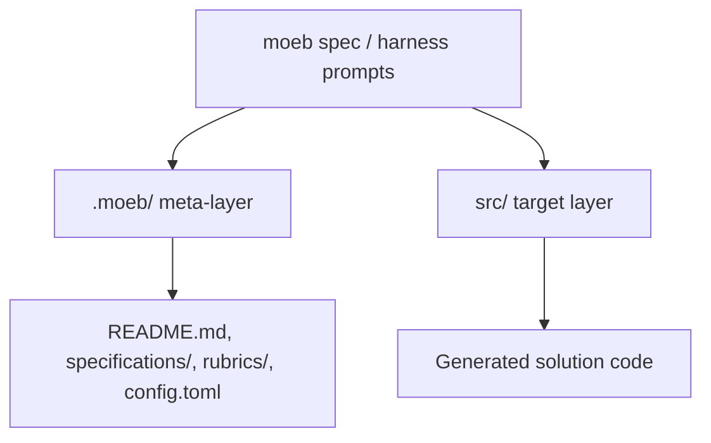

# Moeb Spec: .moeb Root Boundary and src/ Output Location

## Raw Requirement

moeb spec has the AI looking in .moeb/ for src, the only files in .moeb should be README.md, specifications/, rubrics/, config.toml, we do not need files or folders moved right now but to ensure that only specification, rubric or README reads should operate on .moeb/ and its contents, the source code produced by the harness exists under src/ which is a folder directly at root

## Description

This specification corrects the repository boundary model used by `moeb spec` and related harness reads.

The harness meta-layer is rooted at `.moeb/` and is limited to harness documents and configuration: `README.md`, `specifications/`, `rubrics/`, and `config.toml`. The code produced by specifications lives in the repository-root `src/` directory, not inside `.moeb/`.

The implementation will update the prompt and any path-resolution logic so the AI only reads specification, rubric, and README material from the `.moeb/` tree, while all generated or modified solution artifacts are addressed under `src/` at the repository root.

## Backlinks

- label: README.md
  path: README.md
  purpose: root policy and layer boundary source
- label: Declarative Specification Harness
  path: specifications/harness/harness.base-harness.md
  purpose: parent spec governing harness structure and repository layers
- label: README Scope Boundary Clarification
  path: specifications/harness/harness.readme-scope-boundary.md
  purpose: parent spec clarifying meta-layer versus target layer

## Steps

1. Audit the `moeb spec` and related prompt templates to identify every place where `.moeb/` is currently treated as if it contains solution source code or where file discovery starts from the wrong root.
2. Update path instructions so harness reads explicitly target only `.moeb/README.md`, `.moeb/specifications/`, `.moeb/rubrics/`, and `.moeb/config.toml` when accessing harness metadata.
3. Update any path resolution or file-selection logic so `src/` is treated as a repository-root directory, separate from `.moeb/`, and so generated artifacts are written only under `src/`.
4. Ensure no new move/rename behavior is introduced in this change; the spec must only correct read/write boundaries and root assumptions.
5. Validate that the resulting prompt and implementation language make the separation explicit enough that an agent will not infer `.moeb/src` or any other non-existent solution directory beneath `.moeb/`.

## Decisions

### Decision 1 — `.moeb/` is harness-only and does not contain solution source
The `.moeb/` directory is reserved for harness metadata and configuration. It must not be treated as the home of application source code.

Rationale: The harness needs a stable, isolated metadata root so that specification authoring and execution do not collide with generated project artifacts.

Alternatives:
- Treat `.moeb/` as the root for both harness and generated code.
  - reason_rejected: This blurs the meta-layer/target-layer boundary and invites incorrect path assumptions in prompts and tooling.
- Mirror `src/` inside `.moeb/`.
  - reason_rejected: This would duplicate the source tree and create drift between the harness and target layer.

Consequences: Path handling must always distinguish harness reads from solution writes, and instructions must never imply that source code lives under `.moeb/`.

### Decision 2 — `src/` is the repository-root target for generated code
All solution-layer artifacts produced from specifications must live under `src/` at the repository root.

Rationale: The repository already defines `src/` as the target layer, and keeping output there preserves a clear separation from the harness infrastructure.

Alternatives:
- Place generated code under `.moeb/src/`.
  - reason_rejected: That contradicts the repository-layer policy and creates an incorrect inferred destination.
- Leave artifact placement unspecified.
  - reason_rejected: Ambiguity would allow incompatible tool behavior and inconsistent output locations.

Consequences: Any agent implementing a specification must resolve output paths relative to the repository root and must not infer alternative destinations inside `.moeb/`.

### Decision 3 — Harness reads are limited to README, specifications, rubrics, and config within `.moeb/`
When the AI reads harness material, it may only operate on the harness documents and configuration explicitly permitted by the repository policy.

Rationale: Restricting reads to the documented harness contents prevents accidental traversal into the target layer and keeps the model focused on authoritative specification sources.

Alternatives:
- Allow broad reads anywhere under `.moeb/` without restriction.
  - reason_rejected: The requirement explicitly narrows the permitted content set and the broader rule would permit unintended reads.
- Allow reads from `.moeb/` and `src/` interchangeably.
  - reason_rejected: This would violate the meta-layer/target-layer boundary and confuse specification and implementation inputs.

Consequences: Prompting and tool instructions must direct the AI to use harness documents for specification context and `src/` only when working on the target implementation layer.

## Rubric

### Structured

| Name | Description | Threshold | Pass Condition |
|------|-------------|-----------|----------------|
| `no-drift` | No contradiction with parent specs | The implementation does not violate any decision recorded in a linked parent specification | Zero contradictions | Manual review of every decision in every parent spec listed in Backlinks |
| `spec-schema-compliance` | Spec conforms to schema | All required frontmatter fields and body sections are present and correctly ordered | 100% of required fields and sections | Validation in `domain/spec.rs` exits 0 during `moeb spec` |

### Qualitative

- **Boundary clarity**: The specification makes the `.moeb/` versus `src/` separation unambiguous in both prose and implementation steps.
- **Operational precision**: The harness instructions are specific enough that an agent can reliably avoid reading or writing solution artifacts in `.moeb/`.
- **Path discipline**: Any future prompt or tool update derived from this spec must preserve the repository-root `src/` destination and the harness-only scope of `.moeb/`.