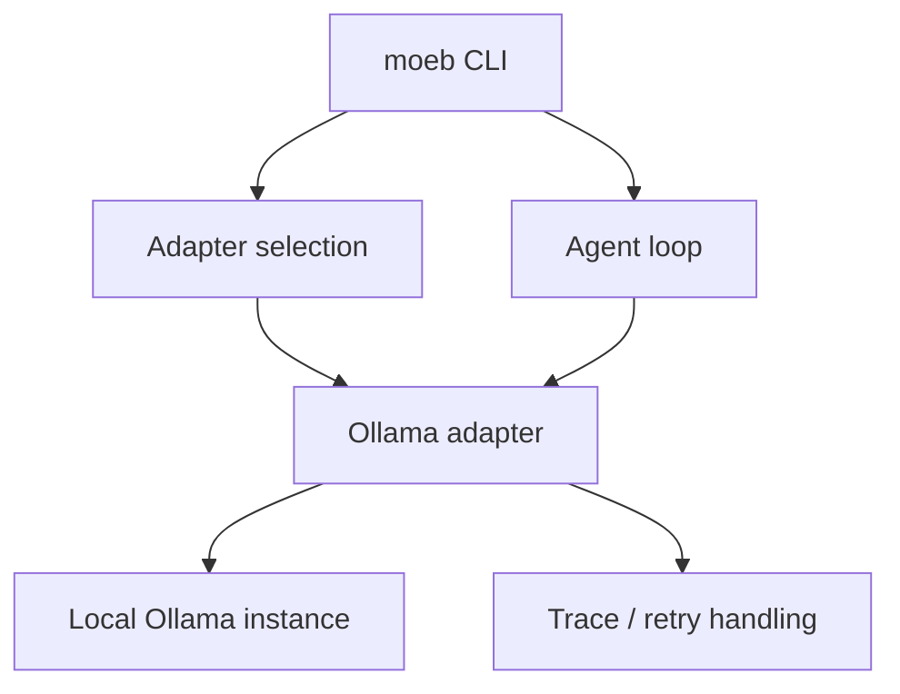

# Ollama Adapter

## Raw Requirement

We need to connect to ollama a local instance, which will require a new ai adapter akin to openai and anthropic

## Description

Add a new local-model AI adapter for Ollama that fits the existing adapter architecture used by the OpenAI and Anthropic providers. The implementation should support configuring and selecting Ollama as an adapter, route chat requests to a locally running Ollama instance, and preserve the existing retry, tracing, and tool-loop behavior expected by the kernel.

## Diagram

## Backlinks

- label: README
  path: README.md
  purpose: root index
- label: Moeb Kernel
  path: specifications/moeb/moeb.kernel.md
  purpose: parent spec
- label: Anthropic Claude Adapter
  path: specifications/moeb/moeb.anthropic-adapter.md
  purpose: architecture reference for provider adapters
- label: OpenAI Adapter: Direct File Writes and Specification Iteration
  path: specifications/moeb/moeb.openai-direct-file-writes.md
  purpose: architecture reference for provider adapters

## Steps

1. Define the Ollama adapter contract and configuration surface.
   - Add a new adapter implementation that conforms to the same AI-port interface used by existing provider adapters.
   - Decide on the minimal configuration required for local operation, including base URL and model name, and ensure defaults support a standard local Ollama deployment.
   - Register the adapter in the known-adapter selection path so it can be chosen through existing `moeb use` and adapter listing flows.

2. Implement request translation and response parsing.
   - Map kernel chat messages into Ollama’s local chat/completions API shape.
   - Parse assistant messages, tool-call intents, and any provider-specific response metadata into the existing internal response model.
   - Preserve the kernel’s expectations for streamed or non-streamed execution, retries, and error reporting.

3. Integrate the adapter with configuration, release, and diagnostics flows.
   - Ensure adapter configuration commands can set, inspect, and retain Ollama-specific settings.
   - Ensure adapter listing reflects whether Ollama is configured and usable.
   - Add any user-facing hints or error messages needed when the local Ollama service is unavailable or the requested model is missing.

4. Validate the full run/spec loop against the new adapter.
   - Confirm the adapter works with `moeb run` and `moeb spec` without changing the existing tool-execution contract.
   - Verify trace capture, retry behavior, and file-write safeguards continue to behave consistently when Ollama is active.
   - Add or update tests to cover adapter selection, request construction, response handling, and failure modes.

## Decisions

1. Use a dedicated Ollama adapter rather than reusing an existing provider adapter.
   - Rationale: Ollama has a local deployment model and API shape that should be isolated behind its own adapter to avoid provider-specific branching in unrelated code paths.
   - Alternatives:
     - Extend OpenAI adapter logic to cover Ollama-compatible endpoints, rejected because it would blur provider boundaries and complicate configuration.
     - Use a generic HTTP shim, rejected because it would not capture Ollama-specific request/response conventions cleanly.
   - Consequences: The kernel must treat Ollama as a first-class adapter with its own configuration and selection path.

2. Treat Ollama as a local, user-hosted dependency.
   - Rationale: The adapter should connect to an already running local Ollama instance instead of managing server lifecycle itself.
   - Alternatives:
     - Bundle or launch Ollama automatically, rejected because lifecycle management is outside the kernel’s responsibility.
     - Require a remote managed endpoint, rejected because it would conflict with the stated local-instance requirement.
   - Consequences: The adapter must surface clear connectivity and model-not-found errors without attempting installation or daemon control.

3. Preserve existing agent-loop semantics across adapters.
   - Rationale: Adding a new adapter must not change tool invocation, retry policy, or trace semantics already established for existing providers.
   - Alternatives:
     - Special-case Ollama with a simplified loop, rejected because it would create behavioral drift.
     - Skip retries for local providers, rejected because transport and model errors still need consistent handling.
   - Consequences: Any Ollama-specific implementation must fit the same AI-port and loop abstractions used elsewhere.

## Rubric

### Structured

| Name | Description | Threshold | Pass Condition |
|------|-------------|-----------|----------------|
| `adapter-structural-parity` | Adapter implementations are structurally identical | `AnthropicAdapter::send` and `OpenAiAdapter::send` follow the same retry loop skeleton; only API-specific serialisation differs | Identical structure |
| `no-drift` | No contradiction with parent specs | The implementation does not violate any decision recorded in a linked parent specification | Zero contradictions | Manual review of every decision in every parent spec listed in Backlinks |
| `all-tests-pass` | All unit tests pass | `cargo test` completes without failure | Zero failures | `cargo test` exits 0 |
| `binary-builds` | Binary builds cleanly | `cargo build --release` completes without error | Zero errors | CI build exits 0 |
| `no-test-regression` | No existing test regression | All tests present before this change pass without modification to test code | Zero failures | `cargo test` exits 0; no test file edited |

### Qualitative

- The new adapter should be discoverable and configurable through the same user-facing workflows as the existing adapters.
- Error messages should clearly distinguish connection failures, authentication-free local setup, and missing-model conditions.
- Implementation details specific to Ollama should remain isolated to the adapter boundary rather than spreading into unrelated kernel logic.