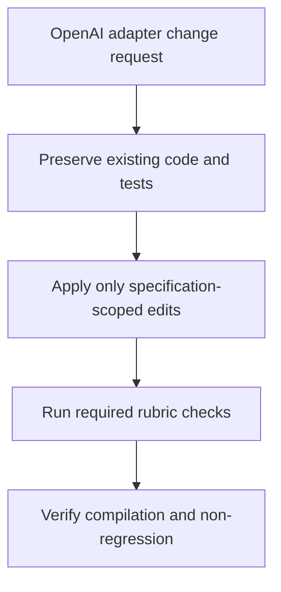

# OpenAI Adapter Rubrics and Non-Regression Preservation

## Raw Requirement

The openai adapter modified the required file in a previous failed run for only what was required of it and deleted code and tests that had to remain to enable compilation and functionality, while fast this lead to code that would not compile, it MUST also run rubrics for the specification, it MUST ensure that existing functionality aside from that which is specified in the specification is not impacted.

## Description

This specification restores the OpenAI adapter change process to a safe, compile-preserving, and regression-aware workflow. The implementation must retain all code and tests needed for successful compilation and runtime behaviour, limit edits strictly to the files and logic required by the OpenAI adapter specification, and execute the relevant rubric checks for the specification before considering the change complete. Existing behaviour outside the scope of the OpenAI adapter change must remain intact.

## Backlinks

- label: README.md
  path: README.md
  purpose: root index
- label: OpenAI Adapter: Direct File Writes and Specification Iteration
  path: specifications/moeb/moeb.openai-direct-file-writes.md
  purpose: parent spec

## Steps

1. Review the parent OpenAI adapter specification and identify the exact behaviour changes it requires, then list the minimum set of files and tests that are in scope.
2. Preserve all existing implementation code and test code that is necessary for compilation and for any unaffected functionality, and do not delete code merely because it appears redundant.
3. Apply only the edits required by the parent specification, keeping public interfaces, supporting modules, and unrelated tests unchanged unless a change is strictly necessary to support the specified adapter behaviour.
4. Add or retain tests that demonstrate the specified OpenAI adapter behaviour while also protecting unaffected functionality from accidental regression.
5. Execute the rubric criteria applicable to this specification, including specification compliance and regression checks, and record that the spec passed only if those checks succeed.
6. Verify the project still compiles and that the change does not alter behaviour outside the OpenAI adapter scope; if a regression is detected, restore the removed code or tests before completing the work.

## Decisions

- Decision 1 — Scope-limited OpenAI adapter editing
  - Rationale: The failed run demonstrated that removing supporting code and tests can break compilation and erase required behaviour. The implementation must therefore be conservative and preserve everything not explicitly targeted by the OpenAI adapter specification.
  - Alternatives:
    - Rebuild the adapter file from scratch: Rejected because it increases the risk of deleting required support code and introducing compile failures.
    - Allow broad refactoring while implementing the change: Rejected because it makes non-regression guarantees difficult to uphold.
  - Consequences: Future OpenAI adapter work must treat supporting code and tests as protected unless a later specification explicitly supersedes that protection.

- Decision 2 — Rubric execution is mandatory for spec completion
  - Rationale: The requirement explicitly states that the adapter work must also run rubrics for the specification, making rubric evaluation part of completion criteria rather than an optional verification step.
  - Alternatives:
    - Skip rubric execution in favour of manual review alone: Rejected because it does not satisfy the requirement and weakens validation discipline.
    - Run only compilation checks: Rejected because compilation alone does not confirm spec compliance or non-regression.
  - Consequences: Completion for this work requires rubric checks to be run and passed, alongside compilation and behaviour verification.

- Decision 3 — Existing functionality outside scope must remain unchanged
  - Rationale: The change request explicitly requires that functionality not described by the specification remain unaffected, so compatibility preservation is a core acceptance condition.
  - Alternatives:
    - Accept incidental changes to unrelated functionality: Rejected because it violates the non-regression requirement.
    - Prioritise minimal diff size over behavioural stability: Rejected because a small diff is not useful if it breaks unrelated features.
  - Consequences: Any implementation that changes unrelated behaviour must be corrected before the spec can be considered satisfied.

## Rubric

### Structured

| Name | Description | Threshold | Pass Condition |
|------|-------------|-----------|----------------|
| `spec-schema-compliance` | Spec conforms to schema | All required frontmatter fields and body sections are present and correctly ordered | Validation in `domain/spec.rs` exits 0 during `moeb spec` |
| `no-test-regression` | No existing test regression | All tests present before this change pass without modification to test code | Zero failures | `cargo test` exits 0; no test file edited |
| `no-drift` | No contradiction with parent specs | The implementation does not violate any decision recorded in a linked parent specification | Zero contradictions | Manual review of every decision in every parent spec listed in Backlinks |

### Qualitative

- Preserve all unaffected code paths, public APIs, and helper logic needed for successful compilation.
- Retain or restore tests that protect functionality outside the OpenAI adapter scope.
- Limit edits to the smallest set of files necessary to satisfy the parent OpenAI adapter specification.
- Demonstrate that rubric execution and non-regression verification were completed before marking the work done.