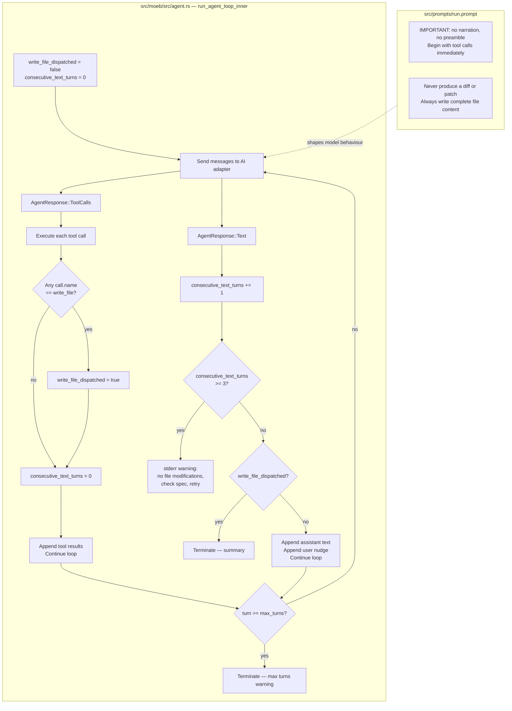

# OpenAI Adapter: Direct File Writes and Specification Iteration

## Raw Requirement

> The OpenAI Adapter appears to make a call out and only receive a patch file, which is written to
> the repository, it should directly modify files when it needs to write, it should also be
> iterating through the specification until it is satisfied as per the prompt

## Description

Two defects affect `moeb run` when the OpenAI adapter (GPT-4o) is active:

**Defect 1 — Patch file output instead of direct writes.**
The final paragraph of `src/prompts/run.prompt` contains an escape hatch:
_"If a change is too complex to express as a complete file rewrite, produce a unified diff instead
and save it with write_file to 'moeb-changes.patch'."_
GPT-4o exercises this escape hatch when it encounters large or structurally complex files,
producing a unified diff written to `moeb-changes.patch` rather than using `write_file` with
complete file content. The `write_file` tool already accepts an arbitrary-length string and creates
parent directories automatically — there is no technical barrier to writing a full file replacement.
The escape hatch must be removed and replaced with an explicit instruction to always write complete
file content.

**Defect 2 — Premature loop termination before all steps are complete.**
The agent loop in `src/moeb/src/agent.rs` terminates unconditionally when it receives
`AgentResponse::Text`, regardless of whether any `write_file` calls have been dispatched during
the run. GPT-4o may produce a text response mid-task — a planning preamble, an intermediate
reasoning step, or a partial summary — which causes the loop to exit before the agent has finished
implementing the specification. The loop must be made aware of whether file modifications have
occurred before it treats a text response as a completion signal.

The specification `moeb.run-anthropic-no-file-writes.md` already records the design for fixing
Defect 2 (Decisions 1–4, Steps 1–2 and 5), but those changes were never applied to `agent.rs`.
This specification implements that design and co-locates the run.prompt patch-escape-hatch fix in
the same change, since both defects share `run.prompt` as a contributing factor.

The coordinated fix consists of:

1. **`src/prompts/run.prompt`** — remove the patch escape hatch sentence; add an explicit
   prohibition against producing diffs or patches; add the IMPORTANT direct-execution instruction
   that was specified but not implemented by `moeb.run-anthropic-no-file-writes.md`.

2. **`src/moeb/src/agent.rs`** — add `write_file_dispatched: bool` and
   `consecutive_text_turns: u32` tracking variables to `run_agent_loop_inner`. The loop exits on
   `AgentResponse::Text` only when at least one `write_file` has been dispatched, or when three
   consecutive text turns with no tool calls are observed. In all other cases the text is appended
   to the conversation as an assistant message and a user nudge is appended so the model resumes
   tool execution.

## Diagram



## Backlinks

### Parents

| Label | Path | Purpose |
|-------|------|---------|
| Moeb Kernel | [specifications/moeb/moeb.kernel.md](specifications/moeb/moeb.kernel.md) | Establishes the agent loop, `run.prompt` template, `write_file` tool, and the 50-turn limit |
| Agent File-Read Optimization | [specifications/moeb/moeb.agent-read-optimization.md](specifications/moeb/moeb.agent-read-optimization.md) | Introduced the patch escape hatch in `run.prompt`; this spec removes it |
| Moeb Run Produces No File Writes When Using the Anthropic Adapter | [specifications/moeb/moeb.run-anthropic-no-file-writes.md](specifications/moeb/moeb.run-anthropic-no-file-writes.md) | Records Decisions 1–4 and the loop continuation design that this spec implements |
| Targeted File Reads: Line-Range Access Tool | [specifications/moeb/moeb.read-file-range.md](specifications/moeb/moeb.read-file-range.md) | Most recent modification to `run.prompt` discovery steps; must be preserved |
| Content Deduplication for File Reads | [specifications/moeb/moeb.content-deduplication.md](specifications/moeb/moeb.content-deduplication.md) | Added the CACHE HIT instruction in `run.prompt`; must be preserved |
| README | [.moeb/README.md](../../README.md) | Root index |

### External

*(none)*

## Steps

### Step 1 — Replace `src/prompts/run.prompt` with the corrected content

The file `src/prompts/run.prompt` must be overwritten with the following content verbatim.
Changes from the current version: the IMPORTANT paragraph is added after the spec content block;
the patch escape hatch sentence is removed from the final paragraph; the final paragraph is
reworded to require complete file content at all times.

```
You are an implementation agent executing a declarative specification.

The following files have been provided to you as context — do not call read_file for them:

=== .moeb/README.md ===
{{readme_content}}

=== {{spec}} ===
{{spec_content}}

IMPORTANT — DO NOT narrate, plan, or summarise before calling tools. Your FIRST action must be a tool call. Do not write "let me start", "I will now", "here is my plan", or any equivalent preamble. Begin executing immediately by calling tools. Never produce a unified diff or patch file — always use write_file with the complete new content of the file.

Discover the relevant code before modifying anything:
1. Call list_directory on "src/" to understand the top-level project layout.
2. Call search_files with path "src/" and an appropriate extension (e.g. "rs", "toml") to enumerate source files relevant to the specification.
3. Call grep_files to locate the specific functions, types, or modules that need to change. Note the file path and line number in each result.
4. Call read_file_range with the file path, a start_line a few lines before the match, and an end_line that covers the complete function or block. Prefer read_file_range over read_files — only read a full file when you cannot determine the relevant range from grep results or when writing a complete file replacement.

If a `read_file` result begins with `[CACHE HIT:`, the file has not changed since it was sent; locate the content in your context from the indicated turn and use it directly — do not re-read the file.

Harness constraints you must follow at all times:
- Your working directory is the repository root. `src/` and `.moeb/` are both immediate children of that root.
- All implementation artifacts (source files, tests, configuration) must be placed under src/. Never create or modify files under .moeb/.
- The kernel must remain as dumb as possible — it is an interface to external services, not a place for decision-making logic.
- Do not introduce behaviour that contradicts decisions recorded in any parent or linked specification.

Then implement each outstanding step using write_file to create or update files under src/. Always provide the complete new content of every file you write — never produce a unified diff, patch, or partial snippet. If a file is large, read it in full first with read_file, then write a complete replacement. After completing one step, continue to the next until all steps are done. When finished, respond with a concise summary of every file created or updated.
```

### Step 2 — Add `write_file_dispatched` and `consecutive_text_turns` tracking to `run_agent_loop_inner` in `src/moeb/src/agent.rs`

Introduce two tracking variables before the main loop begins inside `run_agent_loop_inner`:

```rust
let mut write_file_dispatched = false;
let mut consecutive_text_turns: u32 = 0;
```

**Inside the `AgentResponse::ToolCalls` branch**, after the existing `eprintln!` that logs tool call
names, add a pass over the current batch to detect `write_file` calls and reset the consecutive
text counter:

```rust
for call in calls {
    if call.name == "write_file" {
        write_file_dispatched = true;
    }
}
consecutive_text_turns = 0;
```

This block must execute before the per-call execution loop that follows. The `write_file_dispatched`
flag is monotonically set: once true it remains true for the remainder of the run.

**Replace the existing `AgentResponse::Text` arm** (which unconditionally returns `Ok(text.clone())`)
with the following multi-condition logic:

```rust
AgentResponse::Text(ref text) => {
    consecutive_text_turns += 1;

    if consecutive_text_turns >= 3 {
        eprintln!(
            "[moeb] warning: agent received {} consecutive text turns with no tool calls. \
             The model did not produce any file modifications. \
             Check that the specification path is correct, inspect the prompt, and retry.",
            consecutive_text_turns
        );
        eprintln!("[moeb] agent finished after {} turn(s)", turn_num);
        trace.push(TraceEvent::TurnEnd(TurnEndEvent {
            attempt,
            turn: turn_num,
            response_type: TurnResponseType::Text,
            response_content: serde_json::Value::String(text.clone()),
        }));
        trace.push(TraceEvent::AgentFinished(AgentFinishedEvent {
            attempt,
            turns: turn_num,
            reason: AgentFinishReason::MaxTurns,
        }));
        return Ok(text.clone());
    }

    if write_file_dispatched {
        eprintln!("[moeb] agent finished after {} turn(s)", turn_num);
        trace.push(TraceEvent::TurnEnd(TurnEndEvent {
            attempt,
            turn: turn_num,
            response_type: TurnResponseType::Text,
            response_content: serde_json::Value::String(text.clone()),
        }));
        trace.push(TraceEvent::AgentFinished(AgentFinishedEvent {
            attempt,
            turns: turn_num,
            reason: AgentFinishReason::Completion,
        }));
        return Ok(text.clone());
    }

    // Model produced a planning or preamble turn without calling tools.
    // Append it to the conversation and ask the model to proceed to tool calls.
    trace.push(TraceEvent::TurnEnd(TurnEndEvent {
        attempt,
        turn: turn_num,
        response_type: TurnResponseType::Text,
        response_content: serde_json::Value::String(text.clone()),
    }));
    messages.push(Message::Assistant(text.clone()));
    messages.push(Message::User(
        "Continue. Call write_file (or other tools) to implement the next step now.".to_string(),
    ));
    // do NOT break or return — fall through to the next iteration
}
```

The existing outer loop `for turn in 0..max_turns` continues naturally after this arm because
there is no `break` or `return` in the continuation path.

### Step 3 — Add unit tests in `src/moeb/src/agent.rs`

In the `#[cfg(test)] mod tests` block, add the following four tests using a stub adapter that
implements `AiPort` and returns a predefined sequence of `AgentResponse` values. Use the existing
`CWD_LOCK` and `in_temp_dir()` pattern from the codebase to avoid working-directory races.

**`text_turn_without_write_does_not_terminate_loop`**
Configure the stub to return: turn 1 → `AgentResponse::Text("let me start".into())`; turn 2 →
`AgentResponse::ToolCalls([write_file("src/x.rs", "content")])` (via a stub tool executor that
captures the call); turn 3 → `AgentResponse::Text("Done.".into())`. Assert that `write_file` was
dispatched (the stub records the call), the loop returns `Ok`, and the result string is `"Done."`.

**`three_consecutive_text_turns_terminates_with_warning`**
Configure the stub to return `AgentResponse::Text("thinking…".into())` on turns 1, 2, and 3.
Assert the loop returns `Ok` after turn 3 and that stderr (captured via a test helper or inspected
via the return value) contains `"consecutive text turns"` and `"did not produce any file
modifications"`.

**`text_turn_after_write_terminates_immediately`**
Configure the stub to return: turn 1 → `AgentResponse::ToolCalls([write_file("src/y.rs", "y")])`;
turn 2 → `AgentResponse::Text("Implementation complete.".into())`. Assert the loop returns `Ok`
after exactly two turns and does not request a third adapter call.

**`consecutive_text_counter_resets_on_tool_call`**
Configure the stub to return: turns 1 and 2 → `AgentResponse::Text("planning")` (counter reaches
2); turn 3 → `AgentResponse::ToolCalls([write_file(...)])` (counter resets to 0); turn 4 →
`AgentResponse::Text("planning again")` (counter becomes 1). Assert the loop does not emit the
three-consecutive-turn warning at turn 4 and does not terminate until turn 5 or later when
`write_file_dispatched` is true and another text turn fires the clean exit path.

## Decisions

### Decision 1 — Remove the patch escape hatch entirely; require complete file content at all times

**Rationale:** The `write_file` tool accepts an arbitrary-length string and overwrites the target
path completely. There is no technical constraint that prevents writing a full file replacement,
regardless of file size. The escape hatch was added as a convenience but it is counterproductive:
GPT-4o treats it as a preferred path for complex edits, producing diffs that the kernel cannot
apply and leaving the repository in a partially-modified state. Removing the escape hatch forces the
model to read the full file (using the existing `read_file` or `read_file_range` tools) and produce
a complete replacement — which is always correct and requires no additional tooling.

**Alternatives:**

| Option | Reason Rejected |
|--------|-----------------|
| Add a `patch_file` tool that applies unified diffs in the kernel | Adds significant complexity to the tool surface and requires a reliable patch-apply library; the `write_file` tool already solves the problem completely |
| Keep the escape hatch but add a post-processing step that applies the patch | Defers the problem into the kernel rather than solving it at the model level; adds fragile imperative post-processing logic |
| Lower the escape-hatch threshold to only very large files | GPT-4o still uses it for files above whatever threshold is set; the only reliable fix is removal |

**Consequences:** The agent must read any file it intends to modify before writing a replacement.
For large files this may cost an additional `read_file` tool call turn. The `read_file_range` and
`grep_files` tools are already available to minimise the amount read before a targeted rewrite.

---

### Decision 2 — Implement the loop continuation logic from `moeb.run-anthropic-no-file-writes.md` without modification

**Rationale:** `moeb.run-anthropic-no-file-writes.md` records a complete and sound design for
loop continuation (Decisions 1–4): continue on text turns until `write_file_dispatched`, exit
cleanly when it is true, and use a three-consecutive-text-turn escape hatch. That design is correct
for both the Anthropic and OpenAI adapters. Re-specifying the design would create redundancy and
risk drift. This specification implements the recorded design as written and credits it as the
parent.

**Alternatives:**

| Option | Reason Rejected |
|--------|-----------------|
| Introduce a dedicated `complete` tool that the model must call to signal done | Adds a new tool, changes the tool surface, and requires prompt changes to instruct the model when to call it — more invasive than the continuation approach |
| Terminate on text only when the text contains a known completion phrase | Brittle; model phrasing varies across versions and temperature settings |
| Apply a different threshold for consecutive text turns | The three-turn threshold from `moeb.run-anthropic-no-file-writes.md` Decision 2 is already justified; repeating that analysis here adds nothing |

**Consequences:** All consequences recorded in `moeb.run-anthropic-no-file-writes.md` Decisions
1–4 apply here without modification. The loop may incur one to two extra turns when the model
produces a planning preamble; the updated prompt is designed to eliminate this in the common case.

---

### Decision 3 — Apply both fixes in a single specification and a single commit

**Rationale:** The two defects share a common cause: the run.prompt escape hatch encouraged the
model to produce non-tool output (a patch file) rather than using tool calls. Fixing the prompt
without fixing the loop leaves the model able to exit via a text response before completing all
steps. Fixing the loop without removing the escape hatch leaves a prompt instruction that actively
encourages patch output. The two changes are tightly coupled and must land together to be effective.

**Alternatives:**

| Option | Reason Rejected |
|--------|-----------------|
| Fix run.prompt only | Loop still exits on text turns before all steps are complete |
| Fix agent.rs loop only | Prompt still instructs the model to produce diffs for complex files |
| Two separate specifications | Creates an intermediate state where one fix is active but not the other; violates the "no drift" policy if the intermediate state is inconsistent |

**Consequences:** This specification modifies two files: `src/prompts/run.prompt` and
`src/moeb/src/agent.rs`. Both must be changed in the same implementation pass.

## Rubric

### Structured

| Name | Description | Threshold | Pass Condition |
|------|-------------|-----------|----------------|
| `binary-builds` | `cargo build --release` exits 0 after all changes | Zero errors | CI build exits 0 |
| `all-tests-pass` | `cargo test` exits 0 | Zero failures | `cargo test` exits 0 |
| `no-test-regression` | All pre-existing tests pass without modification to test code | Zero failures | `cargo test` exits 0; no test file edited except agent.rs to add new tests |
| `no-drift` | No contradiction with parent specs | Zero contradictions | Manual review of every decision in every parent spec listed in Backlinks |
| Patch escape hatch removed | The sentence "produce a unified diff instead" does not appear in `run.prompt` | String absent | `grep -F "produce a unified diff" src/prompts/run.prompt` returns no matches |
| IMPORTANT paragraph present | The IMPORTANT direct-execution instruction is present in `run.prompt` | String present | `grep -F "DO NOT narrate" src/prompts/run.prompt` returns a match |
| No-diff prohibition present | The phrase "Never produce a unified diff" (or equivalent) is present in `run.prompt` | String present | `grep -Fi "never produce" src/prompts/run.prompt` returns a match |
| Planning text turn continues loop | A text turn with no prior `write_file` does not terminate the loop | Loop continues | Unit test `text_turn_without_write_does_not_terminate_loop` passes |
| Three consecutive text turns halt with warning | Three consecutive text turns with no tool activity terminate with a stderr warning | Warning contains required phrases | Unit test `three_consecutive_text_turns_terminates_with_warning` passes |
| Text after write terminates cleanly | A text turn following a `write_file` call exits the loop without requesting a further turn | Loop terminates after text turn | Unit test `text_turn_after_write_terminates_immediately` passes |
| Consecutive counter resets on tool call | Two text turns + one tool call + one text turn does not reach the three-turn threshold | No warning emitted | Unit test `consecutive_text_counter_resets_on_tool_call` passes |

### Qualitative

- **No regression on either adapter.** The loop changes must not alter the observable behaviour for
  runs that already work correctly. When GPT-4o calls tools from the first turn (the common path),
  `consecutive_text_turns` remains 0 and `write_file_dispatched` is set before any text turn is
  received; the loop exits cleanly as before.
- **Actionable warning message.** When the three-consecutive-text-turn escape fires, the stderr
  warning must name what happened, state that no files were modified, and tell the user what
  corrective action to take (check spec path, inspect prompt, retry). A user reading only the
  warning must understand the remediation without consulting documentation.
- **Prompt retains all prior constraints.** The updated `run.prompt` must preserve every instruction
  from the current version except the patch escape hatch sentence. The IMPORTANT paragraph and the
  no-diff prohibition are additive; no existing instruction is removed or weakened.
- **Nudge message specificity.** The continuation message appended to the conversation ("Continue.
  Call write_file (or other tools) to implement the next step now.") must name a specific tool and
  include the word "now" to prevent the model from interpreting it as permission to produce another
  planning text turn.
