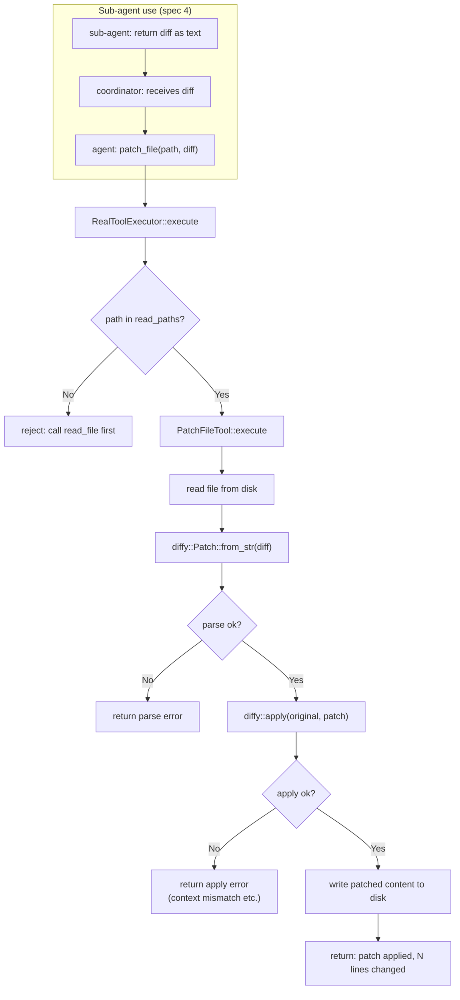

# Patch File Tool

## Raw Requirement

> An alternative to write_file would be applying patches which MUST NOT directly
> overwrite the full file. Given we cannot apply anything novel from AI-first principles,
> look to implement tools that reduce the amount of data sent — a patch_file tool
> accepting a unified diff allows agents to send minimal diffs instead of full file
> rewrites. This is also a prerequisite for the sub-agent spawning model where
> sub-agents propose diffs and the coordinator applies them.

## Description

`write_file` requires the agent to hold and retransmit the complete content of every
modified file. For a 600-line source file, a one-line change still produces a 600-line
write payload — bloating the conversation history, consuming context budget on the
write-result turn, and putting pressure on rate limits.

This specification adds a `patch_file` tool that accepts a unified diff (the format
produced by `git diff` or `diff -u`) and applies it to an existing file. Only the
changed lines travel in the tool call; the kernel reconstructs the full new content by
applying the patch to the file already on disk. For targeted changes — adding a field
to a struct, changing a constant, updating a single function — `patch_file` is strictly
more efficient than `write_file`.

The `diffy` crate handles diff parsing and application. It is added as a production
dependency in `src/moeb/Cargo.toml`. The tool is implemented in
`src/moeb/src/tools/patch_file.rs` as a `PatchFileTool` struct implementing
`ToolHandler`, following the one-file-per-tool pattern established by
`moeb.tool-executor-extraction`.

`patch_file` on an existing file is subject to the same read-before-write scope
enforcement as `write_file` (from `moeb.run-file-scope-enforcement`): the file path
must have been read via `read_file` or `read_files` during the current run, or the
call is rejected. This is consistent with Decision 3 of the scope enforcement spec,
which explicitly excludes `read_file_range` from satisfying the read requirement.
The diff application itself provides a second layer of natural enforcement — a patch
whose context lines do not match the file on disk will fail at the `diffy::apply` step
regardless of scope tracking.

`ToolRegistry::standard()` grows from 10 to 11 handlers. The unit test asserting
`definitions().len() == 10` is updated to `== 11`. The default `run.skill.md` binary
asset is updated to add `patch_file` guidance to Phase 3.

## Diagram



## Backlinks

### Parents

| Label | Path | Purpose |
|-------|------|---------|
| Tool Executor Extraction | [specifications/moeb/moeb.tool-executor-extraction.md](specifications/moeb/moeb.tool-executor-extraction.md) | Established the ToolHandler trait, ToolRegistry, and one-file-per-tool pattern that PatchFileTool follows |
| Run-Time File Scope Enforcement | [specifications/moeb/moeb.run-file-scope-enforcement.md](specifications/moeb/moeb.run-file-scope-enforcement.md) | Established the read-before-write enforcement in RealToolExecutor::execute; patch_file is added to the same enforcement check |
| Agent Skills | [specifications/moeb/moeb.agent-skills.md](specifications/moeb/moeb.agent-skills.md) | Owns run.skill.md binary asset; Phase 3 of that file is updated in this spec to add patch_file guidance |
| README | [README.md](../../README.md) | Root index |

### External

*(none)*

## Steps

### Step 1 — Add `diffy` to `src/moeb/Cargo.toml`

Read `src/moeb/Cargo.toml` in full. Add `diffy` to the `[dependencies]` section:

```toml
diffy = "0.3"
```

Place it in alphabetical order with the existing dependencies.

### Step 2 — Create `src/moeb/src/tools/patch_file.rs`

Create the file implementing `PatchFileTool`:

```rust
use std::path::Path;
use anyhow::{Context, Result};
use crate::adapters::ToolDef;
use crate::tools::ToolHandler;

pub struct PatchFileTool;

impl ToolHandler for PatchFileTool {
    fn name(&self) -> &'static str {
        "patch_file"
    }

    fn definition(&self) -> ToolDef {
        serde_json::from_value(serde_json::json!({
            "name": "patch_file",
            "description": "Apply a unified diff to an existing file. Use this instead \
                of write_file when making targeted changes to a small number of lines in \
                a large file — only the changed lines are transmitted rather than the \
                complete file content. The diff must be in unified format with @@ hunk \
                headers (as produced by `git diff` or `diff -u`). The file must have \
                been read via read_file or read_files earlier in this run.",
            "parameters": {
                "type": "object",
                "properties": {
                    "path": {
                        "type": "string",
                        "description": "Path to the file to patch, relative to the \
                            working directory."
                    },
                    "diff": {
                        "type": "string",
                        "description": "The unified diff to apply. Must include @@ hunk \
                            headers and context lines. Example:\n\
                            @@ -10,6 +10,7 @@\n \
                             context\n-old line\n+new line\n context"
                    }
                },
                "required": ["path", "diff"]
            }
        })).expect("patch_file tool definition is valid JSON")
    }

    fn execute(&self, args: &serde_json::Value, working_dir: &Path) -> Result<String> {
        let path = args["path"]
            .as_str()
            .ok_or_else(|| anyhow::anyhow!("patch_file: missing required argument 'path'"))?;
        let diff = args["diff"]
            .as_str()
            .ok_or_else(|| anyhow::anyhow!("patch_file: missing required argument 'diff'"))?;

        let abs_path = working_dir.join(path);
        let original = std::fs::read_to_string(&abs_path)
            .with_context(|| format!("patch_file: could not read '{}'", path))?;

        let patch = diffy::Patch::from_str(diff)
            .map_err(|e| anyhow::anyhow!(
                "patch_file: failed to parse diff for '{}': {}. \
                 Ensure the diff uses @@ hunk headers with context lines.",
                path, e
            ))?;

        let patched = diffy::apply(&original, &patch)
            .map_err(|e| anyhow::anyhow!(
                "patch_file: failed to apply diff to '{}': {}. \
                 The diff context lines may not match the current file content — \
                 re-read the file and regenerate the diff.",
                path, e
            ))?;

        let lines_before = original.lines().count();
        let lines_after = patched.lines().count();
        std::fs::write(&abs_path, patched)
            .with_context(|| format!("patch_file: could not write '{}'", path))?;

        Ok(format!(
            "patch_file: applied to '{}' ({} → {} lines).",
            path, lines_before, lines_after
        ))
    }
}

#[cfg(test)]
mod tests {
    use super::*;
    use std::path::Path;
    use tempfile::TempDir;

    fn temp_dir() -> TempDir {
        tempfile::tempdir().unwrap()
    }

    #[test]
    fn patch_file_applies_single_hunk() {
        let dir = temp_dir();
        let file = dir.path().join("target.rs");
        std::fs::write(&file, "fn foo() {\n    let x = 1;\n    x\n}\n").unwrap();

        let tool = PatchFileTool;
        let diff = "@@ -2,2 +2,2 @@\n-    let x = 1;\n+    let x = 42;\n     x\n";
        let args = serde_json::json!({"path": "target.rs", "diff": diff});
        let result = tool.execute(&args, dir.path()).unwrap();

        assert!(result.contains("applied"), "expected success: {}", result);
        let content = std::fs::read_to_string(&file).unwrap();
        assert!(content.contains("let x = 42;"), "patch must be applied");
        assert!(!content.contains("let x = 1;"), "old line must be removed");
    }

    #[test]
    fn patch_file_returns_error_on_context_mismatch() {
        let dir = temp_dir();
        let file = dir.path().join("target.rs");
        std::fs::write(&file, "fn foo() {}\n").unwrap();

        let tool = PatchFileTool;
        // Diff whose context lines do not match the file
        let diff = "@@ -1,3 +1,3 @@\n fn bar() {}\n-fn old() {}\n+fn new() {}\n";
        let args = serde_json::json!({"path": "target.rs", "diff": diff});
        let err = tool.execute(&args, dir.path()).unwrap_err();
        let msg = err.to_string();
        assert!(msg.contains("failed to apply"), "expected apply error: {}", msg);
        // File must be unchanged
        assert_eq!(std::fs::read_to_string(&file).unwrap(), "fn foo() {}\n");
    }

    #[test]
    fn patch_file_returns_error_on_invalid_diff_format() {
        let dir = temp_dir();
        let file = dir.path().join("target.rs");
        std::fs::write(&file, "fn foo() {}\n").unwrap();

        let tool = PatchFileTool;
        let args = serde_json::json!({"path": "target.rs", "diff": "this is not a diff"});
        let err = tool.execute(&args, dir.path()).unwrap_err();
        assert!(err.to_string().contains("failed to parse"), "expected parse error: {}", err);
    }

    #[test]
    fn patch_file_returns_error_on_missing_file() {
        let dir = temp_dir();
        let tool = PatchFileTool;
        let diff = "@@ -1,1 +1,1 @@\n-old\n+new\n";
        let args = serde_json::json!({"path": "nonexistent.rs", "diff": diff});
        let err = tool.execute(&args, dir.path()).unwrap_err();
        assert!(err.to_string().contains("could not read"), "expected read error: {}", err);
    }
}
```

### Step 3 — Declare `patch_file` module in `tools/mod.rs`

In `src/moeb/src/tools/mod.rs`, add:

```rust
pub mod patch_file;
```

alongside the existing module declarations.

### Step 4 — Register `patch_file` in `ToolRegistry::standard()` and extend scope enforcement

In `src/moeb/src/tools/mod.rs`:

**4a — Register the new tool.** In `ToolRegistry::standard()`, add after the existing
`write_file` registration:

```rust
r.register(Box::new(patch_file::PatchFileTool));
```

**4b — Extend scope enforcement in `RealToolExecutor::execute`.** Locate the existing
`write_file` scope enforcement block:

```rust
if name == "write_file" {
```

Replace the opening condition with:

```rust
if name == "write_file" || name == "patch_file" {
```

No other change to the enforcement block. This ensures `patch_file` on an unread
existing file is rejected with the same message as `write_file`.

**4c — Update the `definitions()` order array** to include `"patch_file"` immediately
after `"write_file"`:

```rust
let order = [
    "read_file", "write_file", "patch_file", "list_directory",
    "search_files", "grep_files", "read_files", "read_file_range",
    "create_task_list", "update_task", "verify_rubrics",
];
```

**4d — Update the unit test** asserting `definitions().len() == 10` to assert
`== 11`.

### Step 5 — Update `src/moeb/assets/skills/run.skill.md`

Read `src/moeb/assets/skills/run.skill.md` in full. In **Phase 3 — Implement**, replace:

```
3. Write the file using `write_file` with the complete new content.
```

with:

```
3. Write the change:
   - If changing fewer than ~20 lines in a file already read in full, use `patch_file`
     with a unified diff — only the changed lines are transmitted.
   - Otherwise use `write_file` with the complete new content.
   Never use `patch_file` on a file you have not read via `read_file` or `read_files`
   in this run.
```

### Step 6 — Verify

Run `cargo build --release` — zero errors. Run `cargo test` — all tests pass including
the four new tests in `tools/patch_file.rs`. Confirm:

```
grep -n "patch_file" src/moeb/src/tools/mod.rs
```

Returns matches for the module declaration, the `register` call, and the scope
enforcement condition. Confirm `diffy` appears in `Cargo.toml`:

```
grep diffy src/moeb/Cargo.toml
```

## Decisions

### Decision 1 — `diffy` crate for diff parsing and application

**Rationale:** `diffy` is a pure-Rust unified diff implementation with no system
dependencies. It works identically on Linux and Windows (unlike shelling out to the
system `patch` binary). It handles multi-hunk diffs, context-line matching, and offset
fuzzing. Rolling a custom parser would introduce edge cases that `diffy` has already
addressed.

**Alternatives:**

| Option | Reason Rejected |
|--------|-----------------|
| Shell out to system `patch` | Not available on all platforms (notably Windows); adds process-spawning complexity |
| Custom unified diff parser | Significant implementation effort; edge cases in hunk offset arithmetic; not the concern of this spec |
| `similar` crate | Focused on generating diffs, not applying them; would require complementary patching logic |

**Consequences:** `diffy` is added as a production dependency. Its version is `"0.3"`;
upgrading to future versions is a routine maintenance task and does not require a spec.

---

### Decision 2 — `patch_file` is subject to the same read-before-write scope enforcement as `write_file`

**Rationale:** The scope enforcement spec Decision 3 explicitly excludes `read_file_range`
from satisfying the read requirement, on the grounds that partial reads do not guarantee
the agent has seen tests and other unchanged sections. This rationale applies equally to
`patch_file`: an agent that patches a file it has never read in full may corrupt tests,
imports, or other sections outside the patched hunk. Applying scope enforcement to
`patch_file` is additive — the diff application itself provides a second layer (context
mismatch causes `diffy::apply` to fail), but the kernel-level check surfaces the error
earlier with a clearer corrective message.

**Alternatives:**

| Option | Reason Rejected |
|--------|-----------------|
| Exempt `patch_file` from scope enforcement (rely only on diffy's context matching) | Context matching is not foolproof if the agent constructs a diff with no or minimal context lines; the scope check is a stronger guarantee |
| Allow `read_file_range` to satisfy the requirement for `patch_file` | Contradicts Decision 3 of moeb.run-file-scope-enforcement, which is a named decision in an active spec |

**Consequences:** Agents must call `read_file` (or `read_files`) on any existing file
before calling `patch_file` on it. The optimisation from `patch_file` is on the write
side: the read payload is unchanged; the write payload is the diff (small) rather than
the full new content (large).

---

### Decision 3 — `patch_file` is positioned after `write_file` in the tool definitions order

**Rationale:** `patch_file` is a complement to `write_file` — same write concern,
different format. Placing it immediately after `write_file` in the definitions list
groups the two mutation tools together, making the relationship explicit when the model
scans the available tools.

**Alternatives:**

| Option | Reason Rejected |
|--------|-----------------|
| Append `patch_file` after all existing tools | Separates it from `write_file`; the conceptual grouping is lost |
| Place before `write_file` | No reason to prefer `patch_file` as the primary write tool in the ordering |

**Consequences:** The definitions order array in `ToolRegistry::definitions()` must
include `"patch_file"` at index 2 (after `"read_file"` and `"write_file"`). The count
assertion in the unit test becomes `== 11`.

---

### Decision 4 — Phase 3 of `run.skill.md` is updated to guide `patch_file` vs `write_file` selection

**Rationale:** Without prompt guidance, agents default to `write_file` because it is
the mutation tool they were trained to use most frequently. Explicitly stating the
selection heuristic (fewer than ~20 lines → `patch_file`; otherwise → `write_file`)
gives the agent a concrete rule without requiring it to reason about the tradeoff from
first principles on every run.

**Alternatives:**

| Option | Reason Rejected |
|--------|-----------------|
| Leave skill unchanged; rely on tool description alone | The tool description is visible in a JSON schema dump; the skill file is the primary workflow guide an agent reads at the start of a run |
| Add `patch_file` guidance to the HARD RULES | HARD RULES cover critical-failure conditions; tool selection preference is a workflow concern, not a hard rule |

**Consequences:** The `run.skill.md` binary asset is modified. Projects with a
project-local `.moeb/skills/run.skill.md` override are unaffected — their local file
takes precedence and is not touched by this spec.

## Rubric

### Structured

| Name | Description | Threshold | Pass Condition |
|------|-------------|-----------|----------------|
| `binary-builds` | `cargo build --release` exits 0 | Zero errors | CI build exits 0 |
| `all-tests-pass` | `cargo test` exits 0 | Zero failures | `cargo test` exits 0 |
| `patch-tool-unit-tests` | Four unit tests in `tools/patch_file.rs` covering: successful apply, context mismatch, invalid format, missing file | All four pass | `cargo test tools::patch_file` exits 0 with 4 tests reported |
| `eleven-tools-registered` | `ToolRegistry::standard()` registers exactly 11 handlers | 11 handlers | Unit test asserting `definitions().len() == 11` passes |
| `scope-enforcement-covers-patch` | `patch_file` on an unread existing file is rejected with the same error as `write_file` | Rejection returned | Manual verify: call `patch_file` on a file not in `read_paths` → response contains "rejected" |
| `diffy-in-cargo` | `diffy` appears in `src/moeb/Cargo.toml` dependencies | Present | `grep diffy src/moeb/Cargo.toml` returns a match |

### Qualitative

- **Behaviour under apply failure:** When `diffy::apply` fails (context mismatch, offset error), the tool returns an error string that names the file and instructs the agent to re-read the file and regenerate the diff. The file on disk must remain unchanged.
- **Sub-agent readiness:** The tool's design — path + diff string — is suitable for the sub-agent coordinator pattern: a coordinator that has read a file, received a diff from a sub-agent, and calls `patch_file` with that diff. No architectural changes are required for that workflow; `patch_file` works the same whether called by a standalone agent or a coordinator.
- **`write_file` remains available:** `patch_file` is an alternative, not a replacement. `write_file` must continue to function identically to before this spec. Both tools appear in `ToolRegistry::standard()`.
