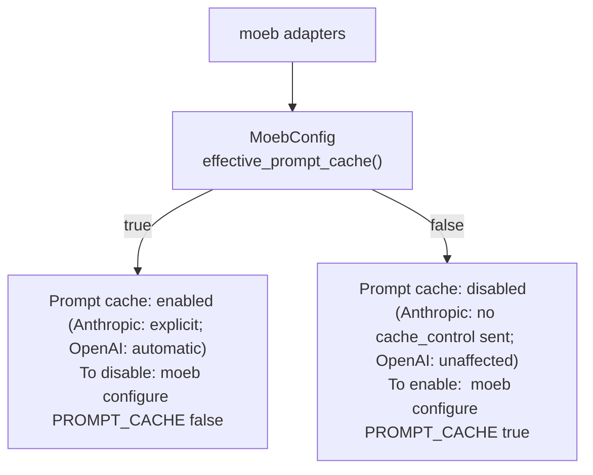

# Prompt Cache Status Hint in Adapters Output

## Raw Requirement

> Prompt caching, firstly is marked as enabled, for Anthropic adapter it is stated as
> explicit, previously I had specified that it should be a config option, I would prefer
> to have to explicitly disable it when needed. Users would need to be informed of the
> command to do so as part of the return in moeb adapters.

## Description

Prompt caching is always-on by default (`PROMPT_CACHE` defaults to `true`). The intent
is that users never need to opt in — they must explicitly disable it only in the rare
case where it causes problems (e.g. plan incompatibility, debugging token costs). The
previous `moeb adapters` status line stated the enabled/disabled state and the
Anthropic/OpenAI parenthetical but gave no guidance on *how* to change the state.

This specification updates the `moeb adapters` prompt-cache status line to append a
one-line hint:

- When enabled: `  To disable: moeb configure PROMPT_CACHE false`
- When disabled: `  To enable:  moeb configure PROMPT_CACHE true`

The hint is always printed on the line immediately following the status line, regardless
of which adapter is active.

No logic changes are required in `config.rs`, `anthropic.rs`, or `openai.rs`. The only
change is in the `moeb adapters` command handler in `commands/adapters.rs`.

## Diagram



## Backlinks

### Parents

| Label | Path | Purpose |
|-------|------|---------|
| Prompt Caching | [specifications/moeb/moeb.prompt-caching.md](specifications/moeb/moeb.prompt-caching.md) | Defined the PROMPT_CACHE config key and the moeb adapters status line that this spec extends |
| Adapter Configuration, Release, and Listing | [specifications/moeb/moeb.adapter-config-and-listing.md](specifications/moeb/moeb.adapter-config-and-listing.md) | Defined the moeb adapters command and its output format |
| README | [README.md](../../README.md) | Root index |

### External

*(none)*

## Steps

### Step 1 — Update the `moeb adapters` prompt-cache status block

In `src/moeb/src/commands/adapters.rs`, replace the existing prompt-cache status block:

```rust
if config.effective_prompt_cache() {
    println!("Prompt cache: enabled   (Anthropic: explicit; OpenAI: automatic)");
} else {
    println!("Prompt cache: disabled  (Anthropic: no cache_control sent; OpenAI: unaffected)");
}
```

with:

```rust
if config.effective_prompt_cache() {
    println!("Prompt cache: enabled   (Anthropic: explicit; OpenAI: automatic)");
    println!("  To disable: moeb configure PROMPT_CACHE false");
} else {
    println!("Prompt cache: disabled  (Anthropic: no cache_control sent; OpenAI: unaffected)");
    println!("  To enable:  moeb configure PROMPT_CACHE true");
}
```

### Step 2 — Verify

Run `cargo build --release` and confirm zero compilation errors. Run `cargo test` and
confirm all existing tests pass.

Confirm by inspection:

1. `moeb adapters` when `effective_prompt_cache()` is `true` prints both the status line
   and `  To disable: moeb configure PROMPT_CACHE false` on the line immediately below.
2. After running `moeb configure PROMPT_CACHE false`, `moeb adapters` prints the
   disabled status line and `  To enable:  moeb configure PROMPT_CACHE true`.

## Decisions

### Decision 1 — Hint is always printed; it is not conditional on config being absent

**Rationale:** The hint informs users regardless of whether `prompt_cache` has ever been
set in `config.toml`. Prompt caching is enabled by default even with no explicit config
entry, so a user who has never touched `PROMPT_CACHE` is just as likely to want to know
how to disable it as one who has set it to `true`. Omitting the hint for "implicit true"
(no key in config) would leave the most common case uninformed.

**Alternatives:**

| Option | Reason Rejected |
|--------|-----------------|
| Print hint only when `prompt_cache` is explicitly set in config | Omits the hint for the common default case; defeats the purpose |
| Print hint as part of help text only | Users would need to run a separate help command; `moeb adapters` is the natural discovery point |

**Consequences:** Every `moeb adapters` invocation always shows a one-line hint. The
output grows by exactly one line over the previous spec.

---

### Decision 2 — Hint uses `moeb configure` syntax, not environment variables or flags

**Rationale:** `moeb configure` is the established mechanism for persistent kernel
config changes (RUN_RETENTION, LOG_FILE_CONTENT). Using the same command for PROMPT_CACHE
is consistent, and the hint should demonstrate the canonical form rather than a one-off
syntax.

**Alternatives:**

| Option | Reason Rejected |
|--------|-----------------|
| Hint a temporary env-var or flag | No such mechanism exists; inventing one in a hint would be misleading |
| Hint a URL to documentation | Requires network access and assumes documentation exists at a stable URL |

**Consequences:** The hint couples to the `moeb configure` command name. If `configure`
is ever renamed, the hint string must be updated in the same change.

---

### Decision 3 — Both enabled and disabled states print a hint

**Rationale:** Although the primary goal is informing users how to *disable* caching,
printing the re-enable command when disabled is symmetric and costs nothing. A user who
disabled caching for debugging may want to re-enable it and the hint removes any need
to look up the syntax.

**Alternatives:**

| Option | Reason Rejected |
|--------|-----------------|
| Hint only when enabled | Asymmetric; a user who disabled caching must still look up how to re-enable |
| No hint when disabled | Inconsistent; the output line length differs between states for no benefit |

**Consequences:** Both branches of the if/else block produce exactly two println! lines.
Output height is consistent regardless of cache state.

## Rubric

### Structured

| Name | Description | Threshold | Pass Condition |
|------|-------------|-----------|----------------|
| `binary-builds` | `cargo build --release` exits 0 | Zero errors | CI build exits 0 |
| `all-tests-pass` | `cargo test` exits 0 | Zero failures | `cargo test` exits 0 |
| `no-test-regression` | All pre-existing tests pass without modification to test code | Zero failures | `cargo test` exits 0; no test file edited |
| `no-drift` | No contradiction with parent specs | Implementation does not violate any decision in a linked parent spec | Manual review of every decision in every parent spec listed in Backlinks |
| Hint present when enabled | `moeb adapters` output contains `moeb configure PROMPT_CACHE false` when caching is enabled | String present | Manual invocation or stdout capture asserts substring |
| Hint present when disabled | `moeb adapters` output contains `moeb configure PROMPT_CACHE true` when caching is disabled | String present | Manual invocation after `moeb configure PROMPT_CACHE false` asserts substring |
| No other files changed | Only `commands/adapters.rs` is modified | One file changed | `git diff --name-only` lists only `adapters.rs` |

### Qualitative

- **Minimal footprint:** The change is confined to a single `println!` insertion in `adapters.rs`. No new structs, traits, or modules are introduced.
- **Consistent indentation:** The hint line is indented with two spaces to visually subordinate it to the status line above, matching the style of informational sub-lines used elsewhere in CLI output.
