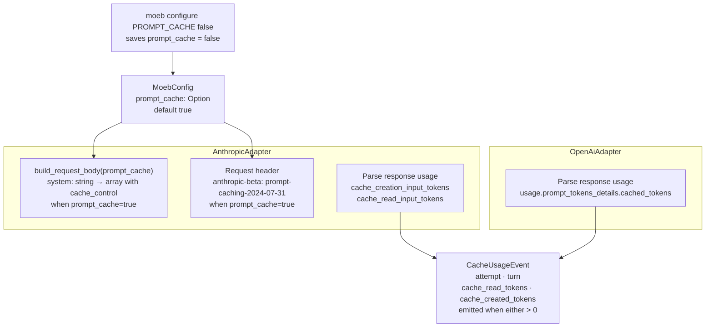

# Prompt Caching

## Raw Requirement

> Some more considerations should be given to improving the usability of the system by
> AIs, are there better means of transferring file contents e.g. alternate serialization
> or compression methods that would compress the reads up to the api.

## Description

Each `moeb run` turn re-sends the system prompt (run.prompt) in full. For Anthropic
models, this is the largest stable token block in every request and is charged at full
input-token cost on every turn. Prompt caching eliminates this repeated cost by marking
the system prompt with an `ephemeral` cache_control breakpoint; subsequent turns that
share the same prefix pay cache-read rates (roughly 10 % of the creation cost) instead
of full input rates.

OpenAI gpt-4o and gpt-4o-mini apply automatic prefix caching with no client-side
changes; the response already reports `usage.prompt_tokens_details.cached_tokens`.

This specification adds:

1. A kernel-level `PROMPT_CACHE` configuration key (default `true`), settable via
   `moeb configure PROMPT_CACHE false`.
2. Anthropic adapter changes: add the `anthropic-beta: prompt-caching-2024-07-31`
   header and wrap the system field in a single-element content-block array carrying
   `"cache_control": {"type": "ephemeral"}` when PROMPT_CACHE is enabled.
3. Both adapters parse cache token counts from the response `usage` object and emit a
   new `CacheUsageEvent` to the trace when either count is non-zero.
4. `moeb adapters` output shows whether prompt caching is enabled globally.

Caching the initial preloaded user message (README + spec content from
moeb.agent-read-optimization) is intentionally deferred — it requires marking the first
message in the conversation as a cache breakpoint, which interacts with the message
history structure in non-trivial ways. System-prompt caching alone covers the largest
stable block and delivers immediate cost reduction.

## Diagram



## Backlinks

### Parents

| Label | Path | Purpose |
|-------|------|---------|
| Moeb Kernel | [specifications/moeb/moeb.kernel.md](specifications/moeb/moeb.kernel.md) | Established moeb run and the adapter send loop |
| Anthropic Claude Adapter | [specifications/moeb/moeb.anthropic-adapter.md](specifications/moeb/moeb.anthropic-adapter.md) | Defined AnthropicAdapter and build_request_body; this spec extends both |
| Trace Capture, Replay, and Kernel Configuration | [specifications/moeb/moeb.trace-and-replay.md](specifications/moeb/moeb.trace-and-replay.md) | Introduced TraceEvent and the moeb configure command; CacheUsageEvent is added to both |
| Adapter Configuration, Release, and Listing | [specifications/moeb/moeb.adapter-config-and-listing.md](specifications/moeb/moeb.adapter-config-and-listing.md) | Defined moeb adapters output format; this spec adds a cache status line |
| README | [README.md](../../README.md) | Root index |

### External

*(none)*

## Steps

### Step 1 — Add `prompt_cache` to `MoebConfig` and the configure command

In `src/moeb/src/config.rs`, add a field to `MoebConfig`:

```rust
#[derive(Debug, Default, Serialize, Deserialize)]
pub struct MoebConfig {
    pub active_adapter: Option<String>,
    pub spec_retry_limit: Option<u32>,
    #[serde(skip_serializing_if = "Option::is_none")]
    pub run_retention: Option<i32>,
    #[serde(skip_serializing_if = "Option::is_none")]
    pub log_file_content: Option<bool>,
    #[serde(skip_serializing_if = "Option::is_none")]
    pub prompt_cache: Option<bool>,
    #[serde(default, skip_serializing_if = "HashMap::is_empty")]
    pub adapters: HashMap<String, AdapterConfig>,
}

impl MoebConfig {
    // ... existing methods ...
    pub fn effective_prompt_cache(&self) -> bool {
        self.prompt_cache.unwrap_or(true)
    }
}
```

In the `moeb configure` command handler (wherever `RUN_RETENTION` and
`LOG_FILE_CONTENT` are matched), add a branch for `PROMPT_CACHE`:

```rust
"PROMPT_CACHE" => {
    let v = value.to_lowercase();
    config.prompt_cache = match v.as_str() {
        "true" | "1" | "yes" => Some(true),
        "false" | "0" | "no" => Some(false),
        _ => anyhow::bail!(
            "Invalid value '{}' for PROMPT_CACHE. Use true or false.",
            value
        ),
    };
    config.save()?;
    println!("PROMPT_CACHE set to {}", config.effective_prompt_cache());
}
```

### Step 2 — Add `CacheUsageEvent` to `trace.rs`

In `src/moeb/src/trace.rs`, add the new event struct and register it in the tagged
union:

```rust
#[derive(Debug, Clone, Serialize, Deserialize)]
pub struct CacheUsageEvent {
    pub attempt: u32,
    pub turn: u32,
    /// Tokens served from cache (saves full input-token cost).
    pub cache_read_tokens: u64,
    /// Tokens written to cache (Anthropic only; 0 for OpenAI automatic caching).
    pub cache_created_tokens: u64,
}
```

Add to `TraceEvent`:

```rust
#[derive(Debug, Clone, Serialize, Deserialize)]
#[serde(tag = "type", rename_all = "snake_case")]
pub enum TraceEvent {
    TurnStart(TurnStartEvent),
    HttpRequest(HttpRequestEvent),
    HttpRetry(HttpRetryEvent),
    QuotaWarning(QuotaWarningEvent),
    ToolCall(ToolCallEvent),
    TurnEnd(TurnEndEvent),
    AgentFinished(AgentFinishedEvent),
    CacheUsage(CacheUsageEvent),   // ← new
}
```

### Step 3 — Extend `AnthropicAdapter` with prompt cache support

**Store the flag on the adapter.** In `src/moeb/src/adapters/anthropic.rs`, add
`prompt_cache: bool` to the `AnthropicAdapter` struct and populate it from
`MoebConfig::effective_prompt_cache()` in `from_secrets_and_config_with_trace`:

```rust
pub struct AnthropicAdapter {
    api_key: String,
    pub model: String,
    pub retries: u32,
    pub timeout_secs: u64,
    pub prompt_cache: bool,
    client: reqwest::blocking::Client,
    trace: Arc<TraceContext>,
}

// In from_secrets_and_config_with_trace:
let cfg = MoebConfig::load().unwrap_or_default();
let adapter_cfg = cfg.adapter_config("anthropic");
Ok(Self {
    api_key,
    model: adapter_cfg.effective_model(DEFAULT_MODEL),
    retries: adapter_cfg.effective_retries(),
    timeout_secs: adapter_cfg.effective_timeout_secs(DEFAULT_TIMEOUT_SECS),
    prompt_cache: cfg.effective_prompt_cache(),
    client: reqwest::blocking::Client::new(),
    trace,
})
```

**Update `build_request_body` signature.** Add a `prompt_cache: bool` parameter:

```rust
pub(crate) fn build_request_body(
    model: &str,
    messages: &[Message],
    tools: &[ToolDef],
    prompt_cache: bool,
) -> Result<Value> {
    // ...
    if let Some(sys) = system_prompt {
        if prompt_cache {
            body.insert("system".into(), json!([{
                "type": "text",
                "text": sys,
                "cache_control": {"type": "ephemeral"}
            }]));
        } else {
            body.insert("system".into(), json!(sys));
        }
    }
    // ... rest unchanged
}
```

All call sites — including tests — must be updated to pass the new `prompt_cache`
argument. Existing tests should pass `false` to preserve their original behaviour.

**Add the beta header and parse cache usage.** In `Adapter::send` for
`AnthropicAdapter`:

```rust
let body = build_request_body(&self.model, messages, tools, self.prompt_cache)?;

// In the request builder:
let mut req = self
    .client
    .post(API_URL)
    .header("x-api-key", &self.api_key)
    .header("anthropic-version", ANTHROPIC_VERSION)
    .header("content-type", "application/json")
    .timeout(std::time::Duration::from_secs(self.timeout_secs));

if self.prompt_cache {
    req = req.header("anthropic-beta", "prompt-caching-2024-07-31");
}

let response = match req.json(&body).send() { ... };
```

After parsing a successful response body, extract and emit cache usage:

```rust
let cache_read = response_body
    .pointer("/usage/cache_read_input_tokens")
    .and_then(|v| v.as_u64())
    .unwrap_or(0);
let cache_created = response_body
    .pointer("/usage/cache_creation_input_tokens")
    .and_then(|v| v.as_u64())
    .unwrap_or(0);
if cache_read > 0 || cache_created > 0 {
    self.trace.push(TraceEvent::CacheUsage(CacheUsageEvent {
        attempt,
        turn,
        cache_read_tokens: cache_read,
        cache_created_tokens: cache_created,
    }));
}
```

This must be emitted after `HttpRequestEvent` is pushed and before `parse_response` is
called, so the event ordering in the trace is: `HttpRequest` → `CacheUsage` →
(tool or text processing).

### Step 4 — Parse cache usage in `OpenAiAdapter`

In `src/moeb/src/adapters/openai.rs`, after a successful response is received and the
response body is parsed, extract and emit cache usage:

```rust
let cache_read = response_body
    .pointer("/usage/prompt_tokens_details/cached_tokens")
    .and_then(|v| v.as_u64())
    .unwrap_or(0);
if cache_read > 0 {
    self.trace.push(TraceEvent::CacheUsage(CacheUsageEvent {
        attempt,
        turn,
        cache_read_tokens: cache_read,
        cache_created_tokens: 0,
    }));
}
```

OpenAI automatic caching requires no request-side changes. `PROMPT_CACHE` does not
gate the OpenAI event — the response field is always read and the event is emitted
whenever the value is non-zero. `PROMPT_CACHE=false` suppresses the Anthropic beta
header and system cache_control but has no effect on OpenAI.

Import `CacheUsageEvent` and `TraceEvent` in `openai.rs` alongside the existing
`HttpRequestEvent`, `HttpRetryEvent`, and `QuotaWarningEvent` imports.

### Step 5 — Show cache status in `moeb adapters` output

In the `moeb adapters` command handler, after printing the adapter table, append a
summary line reflecting the kernel-level PROMPT_CACHE setting:

```
Prompt cache: enabled   (Anthropic: explicit; OpenAI: automatic)
```

or

```
Prompt cache: disabled  (Anthropic: no cache_control sent; OpenAI: unaffected)
```

Read the value from `MoebConfig::effective_prompt_cache()`. The parenthetical note is
fixed text; it does not change based on which adapter is active.

### Step 6 — Verify

Run `cargo build --release` and confirm zero compilation errors. Run `cargo test` and
confirm all existing tests pass.

Confirm by inspection or test:

1. `MoebConfig::effective_prompt_cache()` returns `true` when `prompt_cache` is absent
   from config.
2. `moeb configure PROMPT_CACHE false` sets `prompt_cache = false` in `config.toml`.
3. When `prompt_cache = true`, `build_request_body` produces a `system` field that is
   a JSON array containing a text block with `"cache_control": {"type": "ephemeral"}`.
4. When `prompt_cache = false`, `build_request_body` produces a `system` field that is
   a plain JSON string (existing behaviour).
5. `CacheUsageEvent` is present in `TraceEvent` and serialises correctly.
6. Existing `build_request_body` tests pass when updated to supply `false` for the new
   `prompt_cache` parameter.

## Decisions

### Decision 1 — Cache breakpoint is placed on the system message only

**Rationale:** The system message (run.prompt) is identical across every turn of a run
— it is the largest, most stable token block in each request and benefits most from
caching. The initial preloaded user message (README + spec, from
moeb.agent-read-optimization) changes per run and requires marking the first
`Message::User` in the history, which interacts with the batched tool-result logic in
`build_messages`. Deferring the preload message to a future spec keeps this change
contained to `build_request_body` without touching the message history assembly.

**Alternatives:**

| Option | Reason Rejected |
|--------|-----------------|
| Cache system + first user preload message | Requires identifying and marking the first user message in build_messages; interacts with ToolResult batching; deferred to a follow-on spec |
| Cache tool definitions | Tool definitions are small and identical per turn; caching them adds negligible savings relative to the system prompt |
| Cache last user message (most recent turn) | The last user message changes every turn by definition; caching it provides no benefit |

**Consequences:** Only the system prompt is cached on Anthropic. Turns 2+ of a run will
see cache hits on the system prompt. The preloaded README + spec re-tokenise on every
turn until a follow-on spec adds a second breakpoint.

---

### Decision 2 — PROMPT_CACHE defaults to `true`

**Rationale:** Prompt caching is strictly cost-reducing and has no visible behavioural
effect on the AI's output. There is no reason for a user to disable it unless they are
debugging token usage or working with an Anthropic account plan that does not support
caching. The default should reflect the optimal production setting.

**Alternatives:**

| Option | Reason Rejected |
|--------|-----------------|
| Default `false`, user must opt in | Forces every user to run a configure command before capturing savings; the common case is penalised |
| No config key; always enabled | Prevents debugging and blocks users whose plans lack caching support from working around it |

**Consequences:** All new and existing installations default to caching enabled. Users
who need to disable it run `moeb configure PROMPT_CACHE false`.

---

### Decision 3 — PROMPT_CACHE does not gate OpenAI cache event emission

**Rationale:** OpenAI automatic caching is always active regardless of client
configuration. The `CacheUsageEvent` for OpenAI records what the API actually did; it
is an observation, not a control signal. Suppressing the observation when
`PROMPT_CACHE=false` would hide cache activity from the trace and make replay behave
differently depending on the config key, which is misleading.

**Alternatives:**

| Option | Reason Rejected |
|--------|-----------------|
| Gate OpenAI event on PROMPT_CACHE | Hides real API behaviour from the trace; misleading during debugging |
| Separate OPENAI_PROMPT_CACHE key | Adds a config key that controls nothing; PROMPT_CACHE already documents it is Anthropic-specific for the send-side |

**Consequences:** `PROMPT_CACHE=false` disables Anthropic cache_control and the beta
header but does not suppress the OpenAI `CacheUsageEvent`. This asymmetry is documented
in the `moeb adapters` output parenthetical note.

---

### Decision 4 — `build_request_body` receives `prompt_cache: bool` as a parameter

**Rationale:** `build_request_body` is a pure function with no access to adapter state.
Passing the flag as a parameter keeps it testable and avoids introducing a hidden
dependency on `MoebConfig` inside a request-construction function. The adapter already
reads the config at construction time and stores the result; passing the stored value
through is idiomatic.

**Alternatives:**

| Option | Reason Rejected |
|--------|-----------------|
| Call `MoebConfig::load()` inside `build_request_body` | Adds filesystem I/O to a function called in a hot path; complicates testing |
| Separate `build_cached_request_body` function | Duplicates the entire function body for a single conditional; DRY violation |

**Consequences:** All call sites of `build_request_body`, including tests, gain a
`prompt_cache` parameter. Test call sites pass `false` to preserve existing behaviour.

---

### Decision 5 — `CacheUsageEvent` is emitted only when at least one token count is non-zero

**Rationale:** On the first turn of a run, Anthropic creates the cache entry
(`cache_creation_input_tokens > 0`) but reads nothing. On subsequent turns, the cache
is read. An event with both values at zero would indicate neither creation nor a hit —
it carries no information and adds noise to the trace. Emitting only when something
happened keeps the trace readable.

**Alternatives:**

| Option | Reason Rejected |
|--------|-----------------|
| Always emit CacheUsageEvent | Adds a zero-value event on every non-cached turn; inflates trace size with no signal |
| Separate events for create vs. read | Adds two new event types for a distinction already captured by the field values |

**Consequences:** The absence of `CacheUsageEvent` in a trace means no cache activity
occurred for that turn. A single event may carry both `cache_created_tokens > 0` and
`cache_read_tokens > 0` (Anthropic turns that partially hit and partially extend the
cache).

## Rubric

### Structured

| Name | Description | Threshold | Pass Condition |
|------|-------------|-----------|----------------|
| `binary-builds` | `cargo build --release` exits 0 | Zero errors | CI build exits 0 |
| `all-tests-pass` | `cargo test` exits 0 | Zero failures | `cargo test` exits 0 |
| `no-test-regression` | All pre-existing tests pass without modification to test code | Zero failures | `cargo test` exits 0; no test file edited |
| `no-drift` | No contradiction with parent specs | Implementation does not violate any decision in a linked parent spec | Manual review of every decision in every parent spec listed in Backlinks |
| System field format when caching | `build_request_body` with `prompt_cache=true` produces `system` as a JSON array with a `cache_control` block | Array with `type: ephemeral` | Unit test: parse body, assert `system[0].cache_control.type == "ephemeral"` |
| System field format when not caching | `build_request_body` with `prompt_cache=false` produces `system` as a plain JSON string | String value | Unit test: existing tests with `prompt_cache=false` pass unchanged |
| Beta header present when caching | When `prompt_cache=true`, request includes `anthropic-beta: prompt-caching-2024-07-31` | Header present | Code review of request builder; no live API call required |
| `CacheUsageEvent` in TraceEvent | `CacheUsageEvent` is a variant of `TraceEvent` and serialises/deserialises correctly | Serde round-trip succeeds | Unit test: construct event, serialise to JSON, deserialise back, assert field values |
| Config default is true | `MoebConfig::default().effective_prompt_cache()` returns `true` | true | Unit test confirms default |
| Configure command round-trips | `moeb configure PROMPT_CACHE false` writes `prompt_cache = false` to config.toml | Written and re-read correctly | Unit test: write via configure handler, read via MoebConfig::load, assert false |
| No new Cargo dependencies | No new crate added | Zero new entries | `git diff Cargo.toml` is empty |

### Qualitative

- **No behavioural change when disabled:** With `PROMPT_CACHE=false`, the Anthropic request body and headers must be byte-for-byte identical to what the adapter sent before this spec was implemented. The only difference is the presence of the `prompt_cache` parameter in `build_request_body`.
- **Trace event ordering:** `CacheUsageEvent` must appear immediately after the corresponding `HttpRequest` event in the trace. A reviewer reading the trace must be able to pair each cache event with its request without ambiguity.
- **`adapter-structural-parity`:** Both adapters continue to follow the same retry loop skeleton. The Anthropic adapter gains a header and a response-parsing step; the OpenAI adapter gains a response-parsing step. The control flow — send, check status, retry or parse — remains structurally identical.
