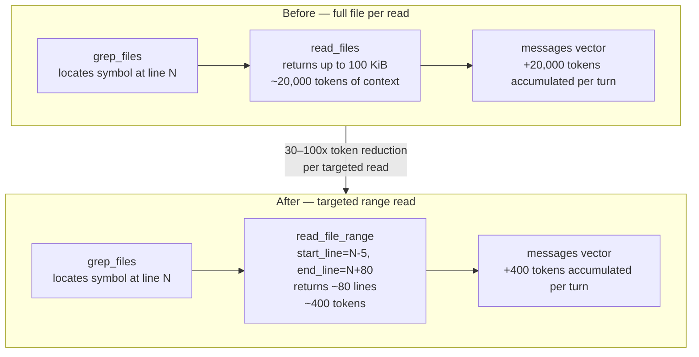

# Targeted File Reads: Line-Range Access Tool

## Raw Requirement

> Performance of read_files still appears to be impacted by the amount of data transferred, with
> apparently the full files being sent.
>
> We need to improve this by limiting the data sent to only what is required.

## Description

`read_file` and `read_files` return up to 100 KiB per file even when the agent only needs a small
section — a single function, a struct definition, a config block. The typical agent workflow is:

1. `grep_files` → locate a symbol at line N
2. `read_files` → read the entire file (up to 100 KiB), receiving mostly irrelevant content

The bottleneck is not local file I/O; it is the token count accumulated in the `messages` vector and
re-sent on every subsequent turn. A 3,000-line file delivers roughly 15,000–25,000 tokens to the
API when only 40–80 lines are relevant. That overhead grows with every additional turn.

The fix is a `read_file_range` tool that accepts a file path, a `start_line`, and an `end_line`,
and returns only those lines. The agent's workflow becomes:

1. `grep_files` → locate symbol at line N
2. `read_file_range` with `start_line = N - 5`, `end_line = N + 80` → read only the function body

This reduces per-read token usage from ~15,000–25,000 tokens to ~200–500 tokens — a 30–100× reduction
for typical source files. A server-side cap of `MAX_RANGE_LINES = 300` prevents the agent from
inadvertently requesting an equivalent-to-full-file range.

The `run.prompt` discovery workflow is updated: steps 3 and 4 are rewritten to direct the agent to
use `grep_files` to find a line number and then call `read_file_range` rather than `read_files`.
`read_file` and `read_files` are retained for cases where the agent genuinely needs a full file
(e.g., an initial structural survey of a small file or when writing a replacement).



## Backlinks

### Parents

| Label | Path | Purpose |
|-------|------|---------|
| Run Stability: Trace Finalize Visibility and File Read Truncation | [specifications/moeb/moeb.trace-finalize-and-read-cap.md](specifications/moeb/moeb.trace-finalize-and-read-cap.md) | Introduced the 100 KiB per-file cap that bounds full-file reads; this spec provides a targeted alternative that avoids sending the cap's worth of data in the first place |
| Agent File-Read Optimization | [specifications/moeb/moeb.agent-read-optimization.md](specifications/moeb/moeb.agent-read-optimization.md) | Added `read_files` batch tool and established the file-read workflow this spec extends with a range-read primitive |
| Moeb Kernel | [specifications/moeb/moeb.kernel.md](specifications/moeb/moeb.kernel.md) | Defines `execute_tool_inner` and the agent loop whose message accumulation is the root cause of the latency being addressed |

### External

*(none)*

## Steps

### Step 1 — Add `MAX_RANGE_LINES` constant in `src/moeb/src/agent.rs`

At line 15, alongside the existing `MAX_TURNS` (line 14) and `MAX_READ_BYTES` (line 15) constants,
add a third constant immediately after `MAX_READ_BYTES`:

```rust
const MAX_RANGE_LINES: usize = 300;
```

### Step 2 — Add `read_file_range` tool definition in `src/moeb/src/agent.rs`

In `file_tools()` (currently line 245), the last `ToolDef` in the `vec!` is `read_files` at lines
305–319. Append a new entry after `read_files` and before the closing bracket of the `vec!`:

```rust
ToolDef {
    name: "read_file_range",
    description: "Read a specific range of lines from a file. Use this after grep_files identifies \
                  the relevant line number — request only the lines that contain the symbol or block \
                  you need. Lines are 1-based. Returns at most 300 lines regardless of the range \
                  requested. Paths are relative to the working directory.",
    parameters: json!({
        "type": "object",
        "properties": {
            "path": {
                "type": "string",
                "description": "File path relative to the working directory"
            },
            "start_line": {
                "type": "integer",
                "description": "1-based line number to start reading from (inclusive)"
            },
            "end_line": {
                "type": "integer",
                "description": "1-based line number to stop reading at (inclusive)"
            }
        },
        "required": ["path", "start_line", "end_line"]
    }),
},
```

### Step 3 — Add `read_file_range` execution branch in `execute_tool_inner`

In `execute_tool_inner`, the `read_files` arm ends at approximately line 415. Add a new match arm
immediately after the closing brace of the `read_files` arm, before the `other =>` fallback:

```rust
"read_file_range" => {
    let rel = args["path"]
        .as_str()
        .context("read_file_range: missing 'path'")?;
    let start = args["start_line"]
        .as_u64()
        .context("read_file_range: 'start_line' must be a non-negative integer")? as usize;
    let end = args["end_line"]
        .as_u64()
        .context("read_file_range: 'end_line' must be a non-negative integer")? as usize;

    if start < 1 {
        anyhow::bail!("read_file_range: 'start_line' must be >= 1 (lines are 1-based)");
    }
    if end < start {
        anyhow::bail!(
            "read_file_range: 'end_line' ({}) must be >= 'start_line' ({})",
            end,
            start
        );
    }

    let full = working_dir.join(rel);
    let raw = fs::read_to_string(&full)
        .with_context(|| format!("read_file_range: cannot read {}", full.display()))?;

    let total_lines = raw.lines().count();
    let requested_end = end;
    // Cap the requested end at start + MAX_RANGE_LINES - 1, then further cap at EOF.
    let capped_end = end.min(start.saturating_add(MAX_RANGE_LINES - 1));
    let actual_end = capped_end.min(total_lines);

    let take_count = if actual_end >= start { actual_end - start + 1 } else { 0 };
    let selected: Vec<&str> = raw
        .lines()
        .skip(start - 1)
        .take(take_count)
        .collect();

    // Build the header line: reports the actual range served plus any notices.
    let served_end = if selected.is_empty() {
        start
    } else {
        start + selected.len() - 1
    };
    let mut header = format!("// {}: lines {}-{}", rel, start, served_end);
    if capped_end < requested_end {
        header.push_str(&format!(
            " [capped at {} lines; requested end={}]",
            MAX_RANGE_LINES, requested_end
        ));
    } else if actual_end < requested_end {
        header.push_str(&format!(" [file has only {} lines]", total_lines));
    }

    Ok(format!("{}\n{}", header, selected.join("\n")))
}
```

Also update the error message in the `other =>` fallback arm so it lists `read_file_range` among
the available tools.

### Step 4 — Update `src/prompts/run.prompt` to prefer `read_file_range`

Replace the entire content of `src/prompts/run.prompt` with the following. The only changes are to
discovery steps 3 and 4 — everything else is preserved verbatim:

```
You are an implementation agent executing a declarative specification.

The following files have been provided to you as context — do not call read_file for them:

=== .moeb/README.md ===
{{readme_content}}

=== {{spec}} ===
{{spec_content}}

Discover the relevant code before modifying anything:
1. Call list_directory on "src/" to understand the top-level project layout.
2. Call search_files with path "src/" and an appropriate extension (e.g. "rs", "toml") to enumerate source files relevant to the specification.
3. Call grep_files to locate the specific functions, types, or modules that need to change. Note the file path and line number in each result.
4. Call read_file_range with the file path, a start_line a few lines before the match, and an end_line that covers the complete function or block. Prefer read_file_range over read_files — only read a full file when you cannot determine the relevant range from grep results or when writing a complete file replacement.

Harness constraints you must follow at all times:
- All implementation artifacts (source files, tests, configuration) must be placed under src/. Never create or modify files under .moeb/.
- The kernel must remain as dumb as possible — it is an interface to external services, not a place for decision-making logic.
- Do not introduce behaviour that contradicts decisions recorded in any parent or linked specification.

Then implement the next outstanding step using write_file to create or update files under src/. If a change is too complex to express as a complete file rewrite, produce a unified diff instead and save it with write_file to "moeb-changes.patch". After completing one step, continue to the next until all steps are done. When finished, respond with a concise summary of every file created or updated.
```

### Step 5 — Add unit tests in `src/moeb/src/agent.rs`

Add the following tests to the existing `#[cfg(test)]` module in `src/moeb/src/agent.rs`:

**`read_file_range_returns_correct_lines`**: Write a file with 20 lines where line N contains the
text `"line N"` (e.g. `"line 01"` through `"line 20"`). Call
`execute_tool_inner("read_file_range", &json!({"path": "f.txt", "start_line": 5, "end_line": 10}), tmp.path())`.
Assert:
- Result is `Ok`.
- Output contains `"line 05"` through `"line 10"`.
- Output does not contain `"line 04"` or `"line 11"`.
- Output header contains `"lines 5-10"`.

**`read_file_range_clamps_to_max_range_lines`**: Write a file with 500 lines. Request
`start_line = 1`, `end_line = 500`. Assert:
- Result is `Ok`.
- The number of non-header lines in the output equals `MAX_RANGE_LINES` (300).
- The header contains `"[capped at 300 lines"`.

**`read_file_range_clamps_to_file_end`**: Write a file with 15 lines. Request `start_line = 10`,
`end_line = 50`. Assert:
- Result is `Ok`.
- Lines 10 through 15 are present; no content beyond line 15 appears.
- The header contains `"[file has only 15 lines]"`.

**`read_file_range_rejects_end_before_start`**: Request `start_line = 10`, `end_line = 5`. Assert
the result is `Err` with a message that contains both `"end_line"` and `"start_line"`.

**`read_file_range_rejects_zero_start`**: Request `start_line = 0`, `end_line = 10`. Assert the
result is `Err` with a message containing `"1-based"`.

**`read_file_range_exact_cap_boundary`**: Write a file with `MAX_RANGE_LINES` lines. Request
`start_line = 1`, `end_line = MAX_RANGE_LINES`. Assert:
- Result is `Ok`.
- No cap notice appears in the output.
- All `MAX_RANGE_LINES` content lines are present.

## Decisions

### Decision 1 — Line-range access rather than byte-range or symbol-name access

**Rationale:** `grep_files` already returns file paths and line numbers. A line-based API lets the
agent translate a grep result directly into a `read_file_range` call without any additional
computation. Byte-range access would require byte offset arithmetic that grep does not expose.
Symbol-name access (e.g. `read_symbol("fn execute_tool_inner")`) would require a Rust AST parser
dependency (tree-sitter or syn) which is significant additional complexity.

**Alternatives:**

| Option | Reason Rejected |
|--------|-----------------|
| Byte-range access (`start_byte`, `length`) | grep_files returns line numbers, not byte offsets; agent cannot derive byte positions without reading the file first |
| AST-based symbol extraction (`read_symbol("fn foo")`) | Requires tree-sitter or syn dependency; high implementation cost; deferred to a future spec if justified |
| Embeddings + vector retrieval | Substantial infrastructure (embedding model, vector store); high value long-term but out of scope for this iteration |

**Consequences:** The agent must identify line numbers via `grep_files` before calling
`read_file_range`. Future specifications may layer AST-aware symbol retrieval on top of this
primitive without replacing it.

---

### Decision 2 — Cap at 300 lines, applied silently with a header notice

**Rationale:** 300 lines covers any realistic function, impl block, or configuration section in
this codebase. Applying the cap silently with a header notice (rather than returning an error)
allows the agent to proceed with the available lines and issue a follow-up `read_file_range` call
if it needs additional context — without wasting a round-trip on an error recovery cycle.

**Alternatives:**

| Option | Reason Rejected |
|--------|-----------------|
| No cap; trust the agent to request reasonable ranges | Agent prompts are imprecise; a `start=1, end=99999` call would negate the entire benefit |
| Return `Err` when range exceeds cap | Forces an extra round-trip for the agent to retry with a smaller range; unnecessary friction |
| Configurable via `moeb configure` | Adds complexity; 300 lines covers all realistic use cases; can be made configurable in a later spec if evidence requires |

**Consequences:** `MAX_RANGE_LINES = 300` in `agent.rs` is the single source of truth. The cap
notice `[capped at 300 lines; requested end=N]` is part of the observable contract between
`execute_tool_inner` and the agent; tests assert on it.

---

### Decision 3 — Retain `read_file` and `read_files`; add `read_file_range` as the preferred alternative

**Rationale:** Removing `read_file` or `read_files` would invalidate existing trace replay (which
records tool names verbatim) and confuse the model which has learned their signatures. Both tools
remain useful: `read_files` is appropriate when the agent writes a complete file replacement and
needs the current content as a baseline. `read_file_range` is preferred for all targeted lookups.
The prompt steers the agent toward the right tool without forbidding the others.

**Alternatives:**

| Option | Reason Rejected |
|--------|-----------------|
| Remove `read_files` and require `read_file_range` for all reads | Breaks trace replay; `read_files` remains the correct tool for full-file baseline reads before write_file |
| Make `read_file` internally dispatch to `read_file_range` when a line hint is available | Requires the kernel to infer intent from context — violates the dumb-kernel principle |

**Consequences:** The tool surface grows to four file-read primitives. The `run.prompt` ranks them:
`read_file_range` for targeted lookups; `read_file` / `read_files` for full-file reads when
necessary.

## Rubric

### Structured

| Name | Description | Threshold | Pass Condition |
|------|-------------|-----------|----------------|
| Binary builds | `cargo build --release` completes without errors | Zero errors | CI build exits 0 |
| Correct line range returned | `read_file_range(5, 10)` on a 20-line file returns exactly lines 5–10 | Lines 5–10 present; lines 4 and 11 absent | Unit test `read_file_range_returns_correct_lines` passes |
| Range cap enforced | Requesting 500 lines returns exactly 300 with a cap notice | 300 content lines present; notice `[capped at 300 lines` in header | Unit test `read_file_range_clamps_to_max_range_lines` passes |
| EOF clamping | Requesting beyond EOF returns available lines with file-end notice | Lines up to EOF present; `[file has only N lines]` in header | Unit test `read_file_range_clamps_to_file_end` passes |
| Invalid range rejected | `end_line < start_line` returns `Err` | `Err` returned; message references both parameters | Unit test `read_file_range_rejects_end_before_start` passes |
| Zero start rejected | `start_line = 0` returns `Err` | `Err` returned; message contains `1-based` | Unit test `read_file_range_rejects_zero_start` passes |
| Exact cap boundary passes without notice | A request for exactly `MAX_RANGE_LINES` lines returns all lines with no cap notice | No `[capped` text in output | Unit test `read_file_range_exact_cap_boundary` passes |

### Qualitative

- **Agent-legible header.** Every `read_file_range` result must begin with a comment line that
  identifies the file path and the actual line range served, so the agent knows which portion of the
  file it has seen without calling any further tool.
- **Prompt preference is unambiguous.** The updated `run.prompt` must clearly rank `read_file_range`
  above `read_files` for targeted lookups and explain the grep → range-read workflow in enough
  detail that the model can apply it without additional instruction.
- **No regression on existing tools.** `read_file` and `read_files` must behave identically to
  their pre-specification behaviour. The only changes to existing code are the new constant, the new
  tool definition, and the new match arm.
- **Cap notice is machine-recognisable.** The exact format `[capped at N lines; requested end=M]`
  must appear in the header when the cap fires, so tests and future tooling can detect it reliably.
