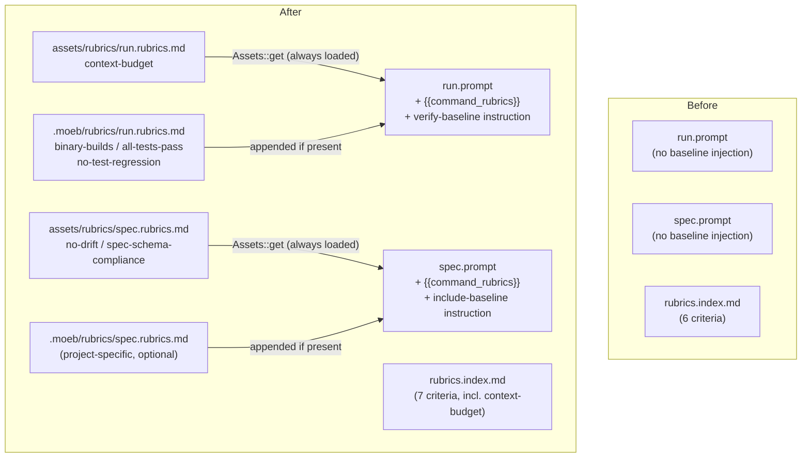

# Rubric Context Layers: Binary-Bundled Baseline Criteria per Command Context

## Raw Requirement

> The ratchet enforcement should be a rubric in the harness, not a Rust cargo test.
> Binary should bundle common baseline rubrics structured by command context (moeb spec
> vs moeb run). Common rubrics maintained in binary. Run outputs should have a
> context-budget rubric that triggers refactoring rather than rejection.

## Description

The moeb kernel currently has no mechanism to guarantee that certain rubric criteria
are verified on every execution regardless of what a specification's own `## Rubric`
section contains. Common criteria (`binary-builds`, `all-tests-pass`, `no-test-regression`)
are only verified when the spec author included them — and there is no enforcement of
the context-budget policy at run time at all.

This specification introduces per-command rubric files at two layers — a binary-bundled
baseline and an optional project-specific file — and injects their combined content into
the appropriate prompts so agents always see and act on them:

- **`assets/rubrics/run.rubrics.md`** — the binary-bundled baseline for `moeb run`.
  Contains only the `context-budget` criterion. Injected into `run.prompt` via
  `{{command_rubrics}}`, combined with any project-specific criteria from
  `.moeb/rubrics/run.rubrics.md`.
- **`assets/rubrics/spec.rubrics.md`** — the binary-bundled baseline for `moeb spec`.
  Contains `no-drift` and `spec-schema-compliance`. Injected into `spec.prompt` via
  `{{command_rubrics}}`, combined with any project-specific criteria from
  `.moeb/rubrics/spec.rubrics.md`.

**Two-layer combination:** For each command, the kernel loads the binary-bundled baseline
first, then appends the project-specific file (`.moeb/rubrics/<command>.rubrics.md`) if
present. Both layers are concatenated and injected together. Projects never replace the
baseline — they extend it.

**Project-specific criteria:** Criteria that vary per project (such as `binary-builds`,
`all-tests-pass`, and `no-test-regression` for Rust projects) belong in
`.moeb/rubrics/run.rubrics.md`. This file is committed to the project repository and
acts as the project's extension of the run baseline.

A new `context-budget` criterion is added to `rubrics.index.md` and to
`assets/rubrics/run.rubrics.md`. It instructs the run agent to check the line count of
every file it writes and refactor any over-budget file before marking the criterion as
pass — refactoring supersedes rejection. The implementation-specific
`adapter-structural-parity` criterion remains in the rubrics index but is not added to
any baseline.

No existing behaviour changes. No public API changes.

## Diagram



## Backlinks

### Parents

| Label | Path | Purpose |
|-------|------|---------|
| Rubrics Index | [specifications/harness/harness.rubrics-index.md](specifications/harness/harness.rubrics-index.md) | Introduced the rubrics index and the standard-criteria copy-verbatim pattern; this spec extends the index with `context-budget` |
| Agent Skills | [specifications/moeb/moeb.agent-skills.md](specifications/moeb/moeb.agent-skills.md) | Established the binary-bundled asset override pattern (assets/skills/ overridable via .moeb/skills/); baseline rubric files follow a similar loading pattern with combine semantics instead of override |
| Spec Prompt: Static File Pre-load | [specifications/moeb/moeb.spec-prompt-preload.md](specifications/moeb/moeb.spec-prompt-preload.md) | Established {{rubrics_content}} injection in spec.prompt; {{command_rubrics}} is additive |
| README | [README.md](../../README.md) | Root index |

### External

*(none)*

## Steps

### Step 1 — Add `context-budget` to `.moeb/rubrics/rubrics.index.md`

Read `.moeb/rubrics/rubrics.index.md` in full. Add the following row to the
`## Criteria` table, immediately after the `no-test-regression` row and before the
`no-drift` row:

```
| `context-budget` | Context budget compliance | All implementation files created or modified during this run are ≤ 300 lines; `*_tests.rs` companion files are ≤ 400 lines. If any file exceeds budget, refactor it before passing this criterion. | Zero over-budget files after any required refactoring | Agent checks line counts of every file written; refactors any over-budget file, then marks pass only after all files meet the budget | active |
```

No other changes to `rubrics.index.md`.

### Step 2 — Create `src/moeb/assets/rubrics/run.rubrics.md`

Create the file `src/moeb/assets/rubrics/run.rubrics.md` with the following content
verbatim. This is the binary-bundled baseline for `moeb run` — it contains only the
universal criterion that applies regardless of project type:

```markdown
## Baseline run rubric criteria

The following criterion applies to every `moeb run` execution. Include it in your
`verify_rubrics` call along with any criteria in the specification's own `## Rubric`
section and any criteria in the project rubric section below.

| Name | Description | Threshold | Pass Condition |
|------|-------------|-----------|----------------|
| `context-budget` | All implementation files created or modified during this run are ≤ 300 lines; `*_tests.rs` companion files are ≤ 400 lines. If any file exceeds budget, refactor it before passing this criterion. | Zero over-budget files after any required refactoring | Agent checks line counts of every file written; refactors any over-budget file, then marks pass only after all files meet the budget |
```

### Step 3 — Create `src/moeb/assets/rubrics/spec.rubrics.md`

Create the file `src/moeb/assets/rubrics/spec.rubrics.md` with the following content
verbatim. This is the binary-bundled baseline for `moeb spec`:

```markdown
## Baseline spec rubric criteria

The following criteria must appear in the `## Rubric / ### Structured` table of every
specification you create. Copy each row verbatim into the table.

| Name | Description | Threshold | Pass Condition |
|------|-------------|-----------|----------------|
| `no-drift` | The specification does not violate any decision recorded in a linked parent specification | Zero contradictions | Manual review of every decision in every parent spec listed in Backlinks |
| `spec-schema-compliance` | All required frontmatter fields and body sections are present and correctly ordered | 100% of required fields and sections | Validation in `domain/spec.rs` exits 0 during `moeb spec` |
```

### Step 4 — Create `.moeb/rubrics/run.rubrics.md`

Create the file `.moeb/rubrics/run.rubrics.md` with the following content verbatim.
This is the project-specific extension of the run baseline for this Rust project:

```markdown
## Project run rubric criteria

The following criteria apply to every `moeb run` execution in this project. Include them
in your `verify_rubrics` call along with the baseline criteria above and any criteria
in the specification's own `## Rubric` section.

| Name | Description | Threshold | Pass Condition |
|------|-------------|-----------|----------------|
| `binary-builds` | `cargo build --release` completes without error | Zero errors | CI build exits 0 |
| `all-tests-pass` | `cargo test` completes without failure | Zero failures | `cargo test` exits 0 |
| `no-test-regression` | All tests present before this change pass without modification to test code | Zero failures | `cargo test` exits 0; no test file edited |
```

### Step 5 — Update `src/moeb/src/domain/run.rs`

Read `src/moeb/src/domain/run.rs` in full.

**5a.** Add a new token constant alongside the existing token constants (e.g. after
`SKILL_CONTENT_TOKEN`):

```rust
const COMMAND_RUBRICS_TOKEN: &str = "{{command_rubrics}}";
```

**5b.** Add combined rubric loading before the prompt template substitution. Load the
binary-bundled baseline first, then append the project-specific file if present. Insert
this block immediately before the `.replace(...)` chain:

```rust
let command_rubrics = {
    let baseline = Assets::get("rubrics/run.rubrics.md")
        .and_then(|f| std::str::from_utf8(f.data.as_ref()).ok().map(str::to_owned))
        .unwrap_or_default();
    let project_path = working_dir.join(".moeb/rubrics/run.rubrics.md");
    let project = if project_path.exists() {
        std::fs::read_to_string(&project_path).unwrap_or_default()
    } else {
        String::new()
    };
    if project.is_empty() {
        baseline
    } else {
        format!("{}\n\n{}", baseline, project)
    }
};
```

**5c.** Add the replacement call at the end of the existing `.replace(...)` chain:

```rust
.replace(COMMAND_RUBRICS_TOKEN, &command_rubrics)
```

### Step 6 — Update `src/moeb/src/domain/spec.rs`

Read `src/moeb/src/domain/spec.rs` in full.

**6a.** Add a new token constant alongside the existing token constants for spec.prompt:

```rust
const COMMAND_RUBRICS_TOKEN: &str = "{{command_rubrics}}";
```

**6b.** Add combined rubric loading before the prompt template substitution. Use the
same baseline-then-project pattern as in Step 5b, but for the spec context:

```rust
let command_rubrics = {
    let baseline = Assets::get("rubrics/spec.rubrics.md")
        .and_then(|f| std::str::from_utf8(f.data.as_ref()).ok().map(str::to_owned))
        .unwrap_or_default();
    let project_path = working_dir.join(".moeb/rubrics/spec.rubrics.md");
    let project = if project_path.exists() {
        std::fs::read_to_string(&project_path).unwrap_or_default()
    } else {
        String::new()
    };
    if project.is_empty() {
        baseline
    } else {
        format!("{}\n\n{}", baseline, project)
    }
};
```

Note: `Assets` is already imported in `spec.rs` (it is used for other asset loading).
If it is not, add `use crate::assets::Assets;` to the import block.

**6c.** Add the replacement call at the end of the existing `.replace(...)` chain in
the prompt-building block:

```rust
.replace(COMMAND_RUBRICS_TOKEN, &command_rubrics)
```

### Step 7 — Update `src/prompts/run.prompt`

Read `src/prompts/run.prompt` in full. Make the following changes:

**7a.** Add a new pre-loaded section for the combined rubric criteria. Insert it
immediately after the `=== Workflow ===` / `{{skill_content}}` block and before the
`If a \`read_file\` result begins with \`[CACHE HIT:\`` line:

```
=== Rubric criteria (baseline + project) ===
{{command_rubrics}}

```

**7b.** Add a baseline verification instruction to the end of the file, immediately
before the final empty line (keep any existing trailing content intact):

At the end of the `HARD RULES` block — after the existing rule 4 — add rule 5:

```
5. Rubric verification: when calling verify_rubrics, you must include every criterion
   from the "Rubric criteria" section above in addition to any criteria listed in the
   specification's own ## Rubric section. The section contains both the binary-bundled
   baseline and any project-specific extensions — all are mandatory. For the
   `context-budget` criterion specifically: check the line count of every file you wrote
   during this run; if any implementation file exceeds 300 lines (or any *_tests.rs
   companion exceeds 400 lines), refactor it to meet the budget before calling
   verify_rubrics with status "pass" for that criterion. Do not mark `context-budget`
   as "na" — it always applies.
```

### Step 8 — Update `src/prompts/spec.prompt`

Read `src/prompts/spec.prompt` in full. Make the following changes:

**8a.** Add a new pre-loaded section for the combined rubric criteria. Insert it
immediately after the `=== rubrics/rubrics.index.md ===` / `{{rubrics_content}}` block
and before the `=== Workflow ===` line:

```
=== Rubric criteria (baseline + project, always required) ===
{{command_rubrics}}

```

**8b.** Update the rubric authoring instruction. Find the paragraph beginning with
`When authoring the \`## Rubric / ### Structured\` table:` and replace it with:

```
When authoring the `## Rubric / ### Structured` table: first copy every row from the
"Rubric criteria" section above verbatim — these are mandatory and must appear in every
specification. The section contains both the binary-bundled baseline and any
project-specific extensions. Then, for each additional criterion in the rubrics index
whose `status` is `active`, evaluate whether it applies to this specification. If it
does, copy the row verbatim from the index and use the criterion `id` (e.g.
`binary-builds`) as the Name column value. Add any spec-specific criteria as additional
rows beneath the standard ones. Do not omit a standard criterion that applies without
explicit justification.
```

### Step 9 — Verify

Run `cargo build --release` — zero errors. Run `cargo test` — all tests pass.

Confirm the new asset files are embedded:

```rust
// In a quick test or by grep:
Assets::get("rubrics/run.rubrics.md").is_some()   // must be true
Assets::get("rubrics/spec.rubrics.md").is_some()  // must be true
```

Verify the token appears in each prompt template:

```
grep -c "command_rubrics" src/prompts/run.prompt
grep -c "command_rubrics" src/prompts/spec.prompt
```

Both must return at least `1`.

Verify the token is handled in each domain file:

```
grep -c "COMMAND_RUBRICS_TOKEN" src/moeb/src/domain/run.rs
grep -c "COMMAND_RUBRICS_TOKEN" src/moeb/src/domain/spec.rs
```

Both must return at least `2` (constant definition + replace call).

Verify `context-budget` is present in the rubrics index:

```
grep -c "context-budget" .moeb/rubrics/rubrics.index.md
```

Must return `1`.

Verify the project-specific run rubrics file is present:

```
test -f .moeb/rubrics/run.rubrics.md && echo "present"
```

Must print `present`.

## Decisions

### Decision 1 — Combine baseline and project-specific rubrics; never override

**Rationale:** Allowing the project-specific file to fully replace the binary-bundled
baseline would let a project accidentally or intentionally suppress universal criteria
such as `context-budget`. The correct model is additive: the binary-bundled baseline
always applies, and the project file adds criteria on top. This mirrors how linting
rule sets work — the base ruleset cannot be removed, only extended. Loading both files
and concatenating their content is simple and leaves the combined result visible in the
injected prompt, so the agent always sees exactly what it must verify.

**Alternatives:**

| Option | Reason Rejected |
|--------|-----------------|
| Project file overrides the binary-bundled baseline entirely | Project could suppress universal criteria; harder to audit what is actually enforced |
| Hardcode all criteria in prompt text | Cannot be extended per project; changes require recompiling the binary |
| One combined file for all contexts in the binary | Run and spec have different baseline sets; one file forces agents to filter by context |

**Consequences:** The binary-bundled baseline is always enforced. Projects extend it
by committing `.moeb/rubrics/run.rubrics.md` or `.moeb/rubrics/spec.rubrics.md` to
their repository. The kernel loads both and concatenates them; agents see the full
combined list.

---

### Decision 2 — Binary-bundled `run.rubrics.md` contains only `context-budget`

**Rationale:** `binary-builds`, `all-tests-pass`, and `no-test-regression` are
project-type-specific: they assume a Rust cargo workspace. A non-Rust project using
moeb would have different build and test commands, or none at all. These criteria belong
in the project-specific `.moeb/rubrics/run.rubrics.md` where they can be adapted or
omitted per project. `context-budget` is genuinely universal — every moeb run produces
files, and every project benefits from keeping those files within budget.

**Alternatives:**

| Option | Reason Rejected |
|--------|-----------------|
| Include `binary-builds`, `all-tests-pass`, `no-test-regression` in the binary baseline | Assumes Rust; breaks or produces noise for non-Rust projects |
| No project-specific file; all criteria hardcoded in specs | Per-run criteria must be repeated in every spec; no single place to update them |

**Consequences:** New projects using moeb must commit `.moeb/rubrics/run.rubrics.md`
with their build and test criteria. The moeb project itself does this in Step 4.

---

### Decision 3 — `context-budget` is a refactor trigger, not a rejection criterion

**Rationale:** A binary-fail rubric on context-budget would stop runs mid-stream when
a file exceeds 300 lines — even during legitimate multi-step implementations where a
file temporarily grows before a planned split. The useful behaviour is that the agent
must resolve the violation before finishing: it reads the over-budget file, extracts
the appropriate concern to a companion module, and verifies the budget is met. Framing
this as "refactor before you mark pass" keeps the run moving toward completion rather
than halting it, while still ensuring no implementation ships over budget.

**Alternatives:**

| Option | Reason Rejected |
|--------|-----------------|
| Cargo test that fails the build if any file exceeds 300 lines | Prevents the build from completing; agents cannot fix the violation inside the same run |
| Reject the run with an error message | Loses all work done in the run; agent must start over rather than continue to fix |
| Qualitative-only criterion with no structured enforcement | No machine-checkable signal; agents may skip it |

**Consequences:** The run agent must check line counts of every file it writes as part
of the verify_rubrics step. An over-budget file blocks marking `context-budget` as
pass, so the agent must either split the file or shrink it before the run completes.
This enforcement is agent-side, not kernel-side, and depends on the agent following
the run.prompt hard rules.

---

### Decision 4 — Two separate baseline files (`run.rubrics.md`, `spec.rubrics.md`), not one

**Rationale:** Run criteria (`context-budget`) and spec criteria (`no-drift`,
`spec-schema-compliance`) are different in kind: run criteria are verified by the run
agent via `verify_rubrics`; spec criteria govern the structure of specification
documents and are verified by schema validation and the spec agent. Combining them in
one file would force both agents to filter by context, and would obscure which criteria
belong to which workflow.

**Alternatives:**

| Option | Reason Rejected |
|--------|-----------------|
| One combined `baseline.md` with a context column | Agents must filter; the injected content for run.prompt would include irrelevant spec criteria |

**Consequences:** Each command context (`run`, `spec`) has a self-contained baseline
document. The naming convention is `<command>.rubrics.md` at both layers. A future
`replay` baseline would be `replay.rubrics.md` (binary-bundled) with an optional
`.moeb/rubrics/replay.rubrics.md` project extension.

---

### Decision 5 — `adapter-structural-parity` is not added to any baseline

**Rationale:** `adapter-structural-parity` applies only to specifications that modify
adapter implementations (`anthropic.rs`, `openai.rs`, etc.). Adding it to the run
baseline or project run rubrics would force every run — including spec splits, domain
changes, and non-adapter work — to include an inapplicable criterion. It belongs in the
rubrics index as a catalogue entry that spec authors and the run agent include
explicitly when their spec touches adapters.

**Alternatives:**

| Option | Reason Rejected |
|--------|-----------------|
| Add `adapter-structural-parity` to `run.rubrics.md` | Forces every run to evaluate adapter parity regardless of whether adapters were touched |

**Consequences:** Adapter parity verification remains specification-scoped. Any spec
that touches adapter files must include `adapter-structural-parity` in its own rubric
table; the run agent will not include it automatically.

## Rubric

### Structured

| Name | Description | Threshold | Pass Condition |
|------|-------------|-----------|----------------|
| `no-drift` | The specification does not violate any decision recorded in a linked parent specification | Zero contradictions | Manual review of every decision in every parent spec listed in Backlinks |
| `spec-schema-compliance` | All required frontmatter fields and body sections are present and correctly ordered | 100% of required fields and sections | Validation in `domain/spec.rs` exits 0 during `moeb spec` |
| `binary-builds` | `cargo build --release` exits 0 | Zero errors | CI build exits 0 |
| `all-tests-pass` | `cargo test` exits 0 | Zero failures | `cargo test` exits 0 |
| `no-test-regression` | All existing tests pass without modification | Zero failures | `cargo test` exits 0; no test file edited |
| `baseline-files-embedded` | Both baseline rubric asset files are embedded in the binary | Both present | `Assets::get("rubrics/run.rubrics.md")` and `Assets::get("rubrics/spec.rubrics.md")` are `Some` |
| `tokens-injected-run` | `{{command_rubrics}}` appears in run.prompt and is substituted in domain/run.rs | Present | grep checks in Step 9 return ≥ 1 |
| `tokens-injected-spec` | `{{command_rubrics}}` appears in spec.prompt and is substituted in domain/spec.rs | Present | grep checks in Step 9 return ≥ 1 |
| `context-budget-in-index` | `context-budget` criterion row appears in rubrics.index.md | Present | grep check in Step 9 returns 1 |
| `project-run-rubrics-present` | `.moeb/rubrics/run.rubrics.md` exists with `binary-builds`, `all-tests-pass`, `no-test-regression` | Present | grep check returns 3 |

### Qualitative

- **No behaviour change to existing runs:** Existing run and spec workflows continue to work. The only change is that combined rubric content is injected into the prompts; agents that do not read or act on it produce the same output as before.
- **Combine semantics:** The kernel always loads the binary-bundled baseline. The project-specific file is appended if present; it cannot suppress or replace the baseline.
- **context-budget criterion is a refactor trigger:** The pass condition explicitly requires the agent to refactor over-budget files rather than simply recording a failure.
- **Project extensibility:** Any project using moeb can extend run or spec rubrics by placing the appropriate file in `.moeb/rubrics/`. The moeb project itself uses this mechanism for its Rust-specific build and test criteria.
