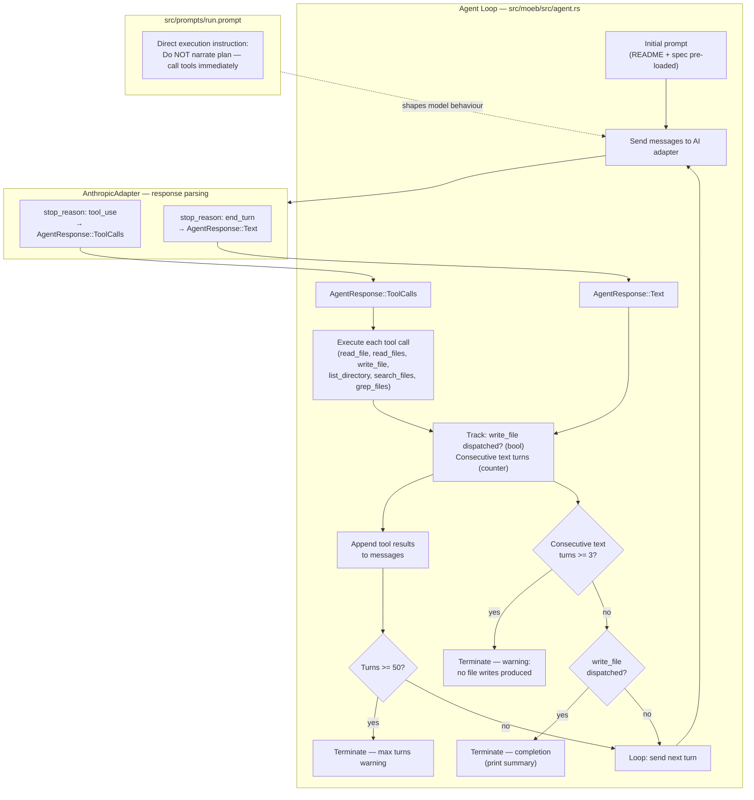

# Moeb Run Produces No File Writes When Using the Anthropic Adapter

## Raw Requirement

There appeared to be an issue with run when using anthropic's API, moeb run reviewed all files required and gave a review of the steps it would take and said let me start, but did nothing to the actual files

## Description

`moeb run` drives an agent loop that calls an AI adapter, dispatches tool calls, and writes
implementation artifacts via the `write_file` tool. The observed failure mode is specific to the
Anthropic adapter: the agent reads the required files, produces a verbose plan in a text turn
("let me start"), and then the loop terminates without any further tool calls — no `write_file`
calls are ever dispatched and no files are changed.

The root cause is a mismatch between the loop termination condition and the Anthropic adapter's
response format. The agent loop in `src/moeb/src/agent.rs` terminates when it receives an
`AgentResponse::Text` response with no tool calls. Anthropic's API is permitted to return a text
content block in the same turn as tool-use blocks (mixed content turns). Additionally, for turns
where the model has concluded its planning preamble and transitions to execution, it may return a
text turn ("let me start…") immediately followed — in the next logical step — by tool calls. If
the loop treats any `AgentResponse::Text` as a terminal signal rather than an intermediate
reasoning step, execution stops prematurely.

There is a second, related issue: the `run.prompt` template (as specified in
`moeb.agent-read-optimization.md`) ends with the instruction to use `write_file` to create or
update files, but it does not explicitly prohibit the model from emitting a planning preamble
before beginning tool calls. When using the Anthropic adapter, Claude tends to narrate its plan
before executing, producing an `AgentResponse::Text` that triggers the termination condition
before any files are written.

Two coordinated changes address this:

1. **Loop continuation on non-empty text turns from the Anthropic adapter.** The
   `AnthropicAdapter::parse_response` logic already distinguishes `stop_reason == "tool_use"` from
   other stop reasons. A third stop reason — `"end_turn"` — is returned when the model produces a
   text-only turn. Currently this falls through to `AgentResponse::Text`, which the loop treats as
   terminal. The fix is to distinguish an `AgentResponse::Text` that arrives mid-loop (i.e. the
   model has been speaking but has not yet written anything) from one that arrives after at least
   one `write_file` call has been dispatched. The agent loop must not terminate on a text turn
   unless the model has confirmed completion or the maximum turn limit is reached.

2. **Prompt reinforcement.** The `run.prompt` template must be updated to explicitly instruct the
   model to proceed directly to tool calls without a planning preamble. The instruction must make
   clear that narration without tool calls will be interpreted as a continuation request and the
   loop will keep running — which wastes API quota and adds latency. The model must begin
   executing steps immediately by calling tools rather than describing what it intends to do.

The loop termination condition after this fix is:
- The model returns `AgentResponse::Text` AND the agent loop has dispatched at least one
  `write_file` call during this run, OR
- The model explicitly returns a completion summary (text with no tool calls) after tool activity,
  OR
- The maximum turn limit (50) is reached.

A fall-back escape hatch is also added: if the model returns three consecutive `AgentResponse::Text`
turns with no tool calls between them, the loop terminates with a warning explaining that the
model did not produce any file modifications and instructs the user to retry or inspect the prompt.

## Diagram



## Backlinks

### Parents

| Label | Path | Purpose |
|-------|------|---------|
| Moeb Kernel | [specifications/moeb/moeb.kernel.md](specifications/moeb/moeb.kernel.md) | Establishes the agent loop, `run.prompt` template, `write_file` tool, and the 50-turn termination limit |
| Agent File-Read Optimization | [specifications/moeb/moeb.agent-read-optimization.md](specifications/moeb/moeb.agent-read-optimization.md) | Most recent specification of `run.prompt` content and the README/spec pre-loading pattern; this spec modifies that prompt further |
| Anthropic Claude Adapter | [specifications/moeb/moeb.anthropic-adapter.md](specifications/moeb/moeb.anthropic-adapter.md) | Establishes `AnthropicAdapter`, `AgentResponse` mapping, and `stop_reason` handling |
| Anthropic Adapter Timeout and Transport Error Retry | [specifications/moeb/moeb.anthropic-adapter-timeout-retry.md](specifications/moeb/moeb.anthropic-adapter-timeout-retry.md) | Extended the retry loop; no loop-termination logic changed — relevant for structural context |

### External

*(none)*

## Steps

### Step 1 — Add `write_file` dispatch tracking to the agent loop in `src/moeb/src/agent.rs`

In `run_agent_loop` (or the equivalent function name after the hexagonal-architecture refactor),
introduce two tracking variables before the loop begins:

```rust
let mut write_file_dispatched = false;
let mut consecutive_text_turns: u32 = 0;
```

Inside the loop, in the `AgentResponse::ToolCalls` branch, after each tool result is collected,
check whether any call in the current batch was `write_file` and set the flag:

```rust
for call in &tool_calls {
    if call.name == "write_file" {
        write_file_dispatched = true;
    }
    // ... execute tool and collect result as before ...
}
consecutive_text_turns = 0; // reset on any tool-call turn
```

### Step 2 — Update the `AgentResponse::Text` termination condition

Replace the existing unconditional loop-exit on `AgentResponse::Text` with the following logic:

```rust
AgentResponse::Text(ref text) => {
    consecutive_text_turns += 1;

    if consecutive_text_turns >= 3 {
        eprintln!(
            "Warning: moeb run received {} consecutive text turns with no tool calls. \
             The model did not produce any file modifications. \
             Check the specification path is correct, inspect the prompt, and retry.",
            consecutive_text_turns
        );
        println!("{}", text);
        break;
    }

    if write_file_dispatched {
        // Model has completed implementation and is providing a summary.
        println!("{}", text);
        break;
    }

    // Model produced a planning/preamble turn without calling tools.
    // Append the text as an assistant message and continue the loop
    // so the model proceeds to execution.
    messages.push(Message::Assistant(text.clone()));
    messages.push(Message::User(
        "Continue. Call write_file (or other tools) to implement the next step now.".to_string()
    ));
    // do NOT break — fall through to the next loop iteration
}
```

Remove the existing `AgentResponse::Text` arm that unconditionally `break`s or returns.

### Step 3 — Update `src/prompts/run.prompt`

The complete content of `src/prompts/run.prompt` must be replaced with the following. The content
builds on the version established by `moeb.agent-read-optimization.md` and adds a direct-execution
instruction block:

```
You are an implementation agent executing a declarative specification.

The following files have been provided to you as context — do not call read_file for them:

=== .moeb/README.md ===
{{readme_content}}

=== {{spec}} ===
{{spec_content}}

IMPORTANT — DO NOT narrate, plan, or summarise before calling tools. Your FIRST action must be a tool call. Do not write "let me start", "I will now", "here is my plan", or any equivalent preamble. Begin executing immediately by calling tools.

Discover the relevant files before modifying anything:
1. Call list_directory on "src/" to understand the top-level project layout.
2. Call search_files with path "src/" and an appropriate extension (e.g. "rs", "toml") to enumerate source files relevant to the specification.
3. Call grep_files to locate the specific functions, types, or modules that need to change.
4. Call read_files with the array of paths for files that actually require modification.

Harness constraints you must follow at all times:
- All implementation artifacts (source files, tests, configuration) must be placed under src/. Never create or modify files under .moeb/.
- The kernel must remain as dumb as possible — it is an interface to external services, not a place for decision-making logic.
- Do not introduce behaviour that contradicts decisions recorded in any parent or linked specification.

Then implement the next outstanding step using write_file to create or update files under src/. If a change is too complex to express as a complete file rewrite, produce a unified diff instead and save it with write_file to "moeb-changes.patch". After completing one step, continue to the next until all steps are done. When finished, respond with a concise summary of every file created or updated.
```

The only difference from the `moeb.agent-read-optimization.md` version is the addition of the
`IMPORTANT —` paragraph after the spec content block.

### Step 4 — Add a `consecutive_text_turns` reset in the tool-call branch

Confirm that `consecutive_text_turns` is reset to `0` at the start of every `AgentResponse::ToolCalls`
processing block, as stated in Step 1. This ensures that a model which alternates text and tool
turns does not accumulate toward the three-turn escape threshold across non-consecutive text turns.

### Step 5 — Add unit tests in `src/moeb/src/agent.rs`

In the `#[cfg(test)] mod tests` block, add the following tests using a stub adapter pattern
(a struct that implements `AiPort` and returns a predefined sequence of responses):

- **`text_turn_without_write_does_not_terminate_loop`**: configure a stub adapter to return
  `AgentResponse::Text("let me start".into())` on turn 1, then `AgentResponse::ToolCalls([write_file("src/x.rs", "content")])` on turn 2, then `AgentResponse::Text("Done.".into())` on turn 3. Assert that `write_file` is executed (i.e. `src/x.rs` exists in the temp working dir) and the loop terminates cleanly without error after turn 3.

- **`three_consecutive_text_turns_terminates_with_warning`**: configure a stub adapter to return
  `AgentResponse::Text("thinking…".into())` on turns 1, 2, and 3 with no tool calls. Assert the
  loop terminates after turn 3, the function returns `Ok`, and no files are created in the working
  dir. Capture stderr and assert it contains "consecutive text turns" and "did not produce any file
  modifications".

- **`text_turn_after_write_terminates_immediately`**: configure a stub adapter to return
  `AgentResponse::ToolCalls([write_file("src/y.rs", "y")])` on turn 1 and
  `AgentResponse::Text("Implementation complete.".into())` on turn 2. Assert the loop terminates
  after turn 2 (does not request a third turn) and `src/y.rs` exists.

- **`consecutive_text_counter_resets_on_tool_call`**: configure a stub adapter to return
  `AgentResponse::Text("planning")` on turns 1 and 2 (so `consecutive_text_turns` reaches 2),
  then `AgentResponse::ToolCalls([write_file(...)])` on turn 3 (which resets the counter to 0),
  then `AgentResponse::Text("planning again")` on turn 4 (counter becomes 1, not 3).
  Assert the loop does not emit the "consecutive text turns" warning after turn 4, and does not
  terminate until `write_file_dispatched` is true and the next text turn fires the clean exit path.

All tests must use the `CWD_LOCK` and `in_temp_dir()` pattern already established in the
codebase to avoid CWD races.

## Decisions

### Decision 1 — Continue the loop on text-only turns when no write_file has been dispatched

**Rationale:** The loop termination condition established in `moeb.kernel.md` (any text response
ends the loop) was designed for the OpenAI adapter, where the model reliably produces tool calls
before narrating completion. Anthropic's Claude consistently narrates intent in a text turn before
beginning execution. Treating that narration as a termination signal reliably reproduces the
reported bug. Continuing the loop — and appending a nudge message — brings the model back to tool
execution without requiring any change to the adapter's response mapping.

**Alternatives:**

| Option | Reason Rejected |
|--------|-----------------|
| Change the adapter to suppress text turns entirely | Anthropic's API does not provide a way to prevent text content in a response; any filtering would silently discard potentially useful diagnostic output |
| Set `max_tokens` low enough that the model cannot produce planning preamble | Risks truncating legitimate output on the same turn; fragile and model-version-dependent |
| Require the user to add "no preamble" to every prompt manually | Per-project workaround rather than a fix; degrades the `moeb run` user experience |

**Consequences:** The loop may run one to two extra turns when Claude produces planning text before
tool calls. This is a latency cost on the order of one API round-trip per `moeb run` invocation
when the model narrates. The prompt change in Step 3 is designed to reduce this to zero in the
common case.

---

### Decision 2 — Three consecutive text turns as the escape hatch threshold

**Rationale:** One or two planning text turns are plausible normal behaviour for Claude. Three
consecutive text turns with no tool calls is a reliable signal that the model is stuck in a
reasoning loop and will not produce file modifications without intervention. Using a low threshold
(1) would break legitimate single-planning-turn flows; a high threshold (10) would waste significant
quota before halting. Three is the smallest value that distinguishes a brief preamble from a stall.

**Alternatives:**

| Option | Reason Rejected |
|--------|-----------------|
| Escape after 1 consecutive text turn if no tools have been called | Too aggressive; breaks the single-planning-turn case that this spec is explicitly designed to support |
| Escape after 5 consecutive text turns | Wastes four extra API calls on a genuinely stalled session |
| No escape hatch — rely only on the 50-turn max limit | 50 turns of pure text output wastes significant API quota and provides no actionable error message |

**Consequences:** A model that produces exactly two planning turns followed by a tool call will
work correctly. A model that is genuinely stuck is halted after three turns with an actionable
error message.

---

### Decision 3 — Append a continuation nudge message rather than modifying the adapter

**Rationale:** The nudge message ("Continue. Call write_file…") is a user-role message appended
to the conversation history when the model produces a planning text turn. This keeps all
loop-continuation logic inside `agent.rs` and out of the adapter implementations, consistent with
the hexagonal architecture decision in `moeb.hex-architecture.md`. The adapter remains a pure
serialiser/deserialiser with no knowledge of loop state.

**Alternatives:**

| Option | Reason Rejected |
|--------|-----------------|
| Pass a `force_tool_use` flag through the adapter trait | Requires a change to `AiPort`/`Adapter` traits, touching the port definition and every adapter implementation |
| Use Anthropic's `tool_choice: { type: "any" }` field to force a tool call | Forces the model to always pick a tool even when it has legitimately finished; breaks clean completion after `write_file` |

**Consequences:** The nudge message is visible in the conversation history seen by the model.
Future adapter implementations must handle the `Message::User` variant correctly — this is already
a requirement of the existing `AiPort` contract.

---

### Decision 4 — `write_file_dispatched` is the sole criterion for clean text-turn termination

**Rationale:** The only user-observable side-effect of `moeb run` is the creation or modification
of files. If the model has called `write_file` at least once, a subsequent text turn is almost
certainly a completion summary. If the model has not called `write_file`, there is no evidence
that any work has been done regardless of what the text turn says.

**Alternatives:**

| Option | Reason Rejected |
|--------|-----------------|
| Inspect the text content for completion phrases ("done", "complete", etc.) | Brittle; model phrasing varies; false positives would terminate the loop prematurely |
| Track all tool calls (including `read_file`, `search_files`) as "progress" | A model that only reads files has still not produced the required artifacts; terminating then would also reproduce the bug |

**Consequences:** If a specification's implementation requires no new files (hypothetically, a
documentation-only change), `write_file_dispatched` would never be set and the loop would not
terminate cleanly on a text turn. Such specifications are considered out of scope for this fix; a
future specification may address non-file-modification runs if needed.

## Rubric

### Structured

| Name | Description | Threshold | Pass Condition |
|------|-------------|-----------|----------------|
| Binary builds | `cargo build --release` completes without error after all changes | Zero errors | CI build exits 0 |
| Planning text turn continues loop | A text turn with no prior `write_file` does not terminate the loop | Loop continues to next turn | Unit test `text_turn_without_write_does_not_terminate_loop` passes |
| Text-then-write flow succeeds | A planning text turn followed by a `write_file` tool call results in the file being written | File exists in working dir | Unit test `text_turn_without_write_does_not_terminate_loop` passes |
| Three consecutive text turns halt with warning | Three text turns with no tool calls produce a stderr warning and clean exit | Warning contains "consecutive text turns" and "did not produce any file modifications" | Unit test `three_consecutive_text_turns_terminates_with_warning` passes |
| Text after write terminates cleanly | A `write_file` tool call followed by a text turn exits the loop without requesting another turn | Loop terminates after turn 2 | Unit test `text_turn_after_write_terminates_immediately` passes |
| Consecutive counter resets on tool call | Two text turns + one tool call + one text turn does not reach the three-turn escape threshold | No warning emitted | Unit test `consecutive_text_counter_resets_on_tool_call` passes |
| `run.prompt` contains direct-execution instruction | The IMPORTANT paragraph is present in `src/prompts/run.prompt` | Phrase "DO NOT narrate" present | `grep -F "DO NOT narrate" src/prompts/run.prompt` returns a match |

### Qualitative

- **No regression on OpenAI adapter.** The loop change must not alter behaviour when the OpenAI
  adapter is active. OpenAI's `gpt-4o` does not produce planning text turns before tool calls in
  the current prompt context; the `write_file_dispatched` check and the consecutive-text-turn
  counter must remain inert for the normal OpenAI execution path.
- **Actionable warning message.** When the three-consecutive-text-turn escape fires, the warning
  printed to stderr must tell the user exactly what happened, that no files were modified, and
  what action to take (check specification path, inspect prompt, retry). A user reading only the
  warning must understand the corrective action without consulting documentation.
- **Prompt retains all prior constraints.** The updated `run.prompt` must preserve every
  instruction from the `moeb.agent-read-optimization.md` version unchanged. The new IMPORTANT
  paragraph is an additive insertion, not a replacement of any existing instruction.
- **Nudge message is unambiguous.** The continuation message appended to the conversation history
  ("Continue. Call write_file…") must be specific enough that Claude cannot interpret it as
  permission to produce another planning text turn. The word "now" and a specific tool name are
  required to achieve this.