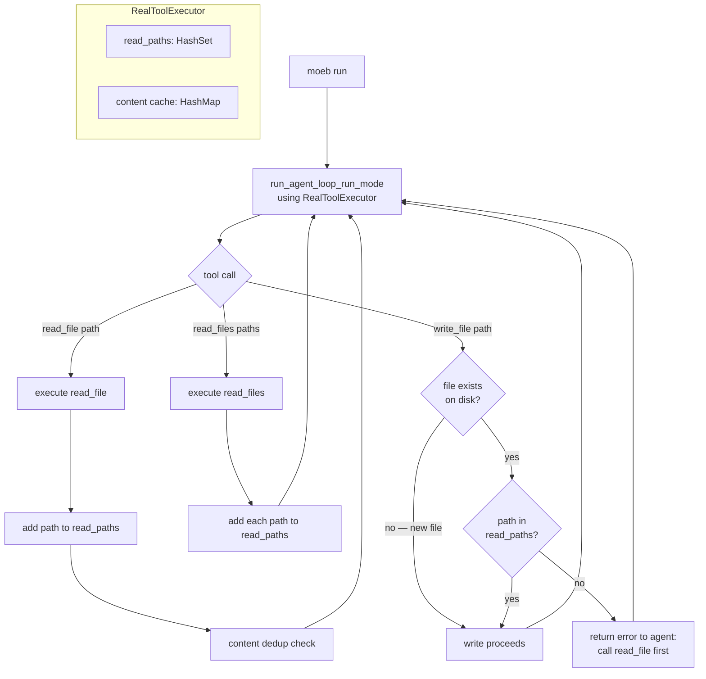

# Run-Time File Scope Enforcement

## Raw Requirement

Running `moeb run` with the OpenAI adapter against `moeb.init-retain-schema-in-binary-copy-readme-only.md` produced a destructive rewrite of `src/moeb/src/domain/spec.rs`. The agent wrote to the correct file path but: (1) removed all `#[cfg(test)]` modules, violating HARD RULES Rule 1; (2) rewrote the struct layout, imports, and agent loop from scratch with a different architecture; (3) used token names and import paths that do not match the existing codebase, indicating the agent wrote from imagination rather than from reading the current file. The `init.rs` changes were correct. The `spec.rs` changes would not compile. All prompt-level constraints (`HARD RULES`, non-regression bullet, rubric verification step) failed to prevent this.

## Description

The root cause is that the OpenAI agent wrote `spec.rs` without reading it first. Had it read the 826-line file, it would have encountered the correct import paths, token names, existing tests, and the hexagonal architecture — making a wholesale reinvention unlikely. The HARD RULES instruct agents to read before writing but provide no structural enforcement.

`RealToolExecutor` is extended to track which file paths have been successfully read via `read_file` or `read_files` during the current run. Before executing any `write_file` call on a file that already exists on disk, the executor checks whether that path was previously read. If it was not, the write is rejected and the agent receives an error message instructing it to call `read_file` first and carry forward all existing code not targeted by the specification.

New files (paths that do not exist on disk at write time) are exempt — a file being created from scratch does not need a prior read.

The enforcement lives entirely in `RealToolExecutor::execute` in `src/moeb/src/tools/mod.rs`. No other files are modified.

## Diagram



## Backlinks

### Parents

| Label | Path | Purpose |
|-------|------|---------|
| Tool Executor Extraction | [specifications/moeb/moeb.tool-executor-extraction.md](specifications/moeb/moeb.tool-executor-extraction.md) | Established `RealToolExecutor` and `ToolExecutorPort`; this spec adds tracking state to `RealToolExecutor` |
| Content Deduplication for File Reads | [specifications/moeb/moeb.content-deduplication.md](specifications/moeb/moeb.content-deduplication.md) | Added `cache: ContentCache` field and per-run state to `RealToolExecutor`; `read_paths` follows the same pattern |
| Run Prompt: Hard Rules for Minimal-Diff File Writes and Test Preservation | [specifications/moeb/moeb.run-prompt-hard-rules.md](specifications/moeb/moeb.run-prompt-hard-rules.md) | Established prompt-level HARD RULES that this spec structurally reinforces |
| README | [.moeb/README.md](../../README.md) | Root index |

### External

*(none)*

## Steps

### Step 1 — Add `read_paths` field to `RealToolExecutor` in `src/moeb/src/tools/mod.rs`

Read `src/moeb/src/tools/mod.rs` in full.

Locate the `pub struct RealToolExecutor` declaration:

```rust
pub struct RealToolExecutor {
    registry: ToolRegistry,
    cache: ContentCache,
}
```

Replace it with:

```rust
pub struct RealToolExecutor {
    registry: ToolRegistry,
    cache: ContentCache,
    read_paths: Mutex<std::collections::HashSet<String>>,
}
```

Locate the `impl RealToolExecutor` block containing `pub fn new()`:

```rust
impl RealToolExecutor {
    pub fn new() -> Self {
        Self {
            registry: ToolRegistry::standard(),
            cache: Mutex::new(HashMap::new()),
        }
    }
}
```

Replace it with:

```rust
impl RealToolExecutor {
    pub fn new() -> Self {
        Self {
            registry: ToolRegistry::standard(),
            cache: Mutex::new(HashMap::new()),
            read_paths: Mutex::new(std::collections::HashSet::new()),
        }
    }
}
```

No other change may be made to the struct or its `new()` constructor.

### Step 2 — Add read-path tracking and write enforcement to `RealToolExecutor::execute`

Within the existing `impl ToolExecutorPort for RealToolExecutor` block, locate the `fn execute` body. The current body begins with `let tool_result = self.registry.execute(...)`.

**2a — Insert write enforcement before the existing tool_result line.**

Immediately before `let tool_result = self.registry.execute(name, args, working_dir);`, insert:

```rust
if name == "write_file" {
    if let Some(path) = args["path"].as_str() {
        let normalized = path.replace('\\', "/");
        if working_dir.join(path).exists() {
            let read_paths = self.read_paths.lock().unwrap();
            if !read_paths.contains(&normalized) {
                return Ok((
                    format!(
                        "write_file rejected: '{}' exists on disk but has not been read \
                         during this run. Call read_file on '{}' to obtain the current \
                         content, then write a complete replacement that carries forward \
                         all existing code not targeted by the specification.",
                        path, path
                    ),
                    false,
                ));
            }
        }
    }
}
```

**2b — Insert read-path tracking inside the existing `if name == "read_file"` block.**

The existing block begins `if name == "read_file" { if let Ok(ref content) = tool_result {`. Immediately after the opening of `if let Ok(ref content) = tool_result {`, and before the `let path_key = ...` line, insert:

```rust
{
    let path_key = args["path"].as_str().unwrap_or("").to_string();
    self.read_paths.lock().unwrap().insert(path_key.replace('\\', "/"));
}
```

This releases the `read_paths` lock before the existing `cache` lock is acquired, preventing any possibility of lock ordering issues.

**2c — Add read-path tracking for `read_files`.**

After the closing brace of the `if name == "read_file" { ... }` block and before `Ok((tool_result?, false))`, insert:

```rust
if name == "read_files" {
    if let Some(paths) = args["paths"].as_array() {
        let mut rp = self.read_paths.lock().unwrap();
        for pv in paths {
            if let Some(p) = pv.as_str() {
                rp.insert(p.replace('\\', "/"));
            }
        }
    }
}
```

No other change may be made to the `execute` method.

### Step 3 — Add unit tests for the new behaviour in `src/moeb/src/tools/mod.rs`

Inside the existing `#[cfg(test)] mod tests` block, after the last existing test, add the following tests:

```rust
#[test]
fn write_file_rejected_for_existing_file_not_yet_read() {
    let (_dir, _guard) = in_temp_dir();
    std::fs::write("existing.rs", "fn old() {}").unwrap();

    let executor = RealToolExecutor::new();
    let args = serde_json::json!({"path": "existing.rs", "content": "fn new() {}"});
    let (msg, _) = executor.execute("write_file", "c1", &args, Path::new("."), 1).unwrap();
    assert!(msg.contains("rejected"), "must reject unread existing file; got: {}", msg);
    assert!(msg.contains("existing.rs"), "rejection must name the file; got: {}", msg);
    assert!(msg.contains("read_file"), "rejection must instruct to call read_file; got: {}", msg);
    let on_disk = std::fs::read_to_string("existing.rs").unwrap();
    assert_eq!(on_disk, "fn old() {}", "file must not be modified on rejection");
}

#[test]
fn write_file_allowed_after_read_file() {
    let (_dir, _guard) = in_temp_dir();
    std::fs::write("target.rs", "fn original() {}").unwrap();

    let executor = RealToolExecutor::new();
    let read_args = serde_json::json!({"path": "target.rs"});
    executor.execute("read_file", "c1", &read_args, Path::new("."), 1).unwrap();

    let write_args = serde_json::json!({"path": "target.rs", "content": "fn updated() {}"});
    let (msg, _) = executor.execute("write_file", "c2", &write_args, Path::new("."), 2).unwrap();
    assert!(!msg.contains("rejected"), "write after read must succeed; got: {}", msg);
    assert_eq!(std::fs::read_to_string("target.rs").unwrap(), "fn updated() {}");
}

#[test]
fn write_file_allowed_for_new_file_without_prior_read() {
    let (_dir, _guard) = in_temp_dir();

    let executor = RealToolExecutor::new();
    let args = serde_json::json!({"path": "brand_new.rs", "content": "fn fresh() {}"});
    let (msg, _) = executor.execute("write_file", "c1", &args, Path::new("."), 1).unwrap();
    assert!(!msg.contains("rejected"), "new file must not require prior read; got: {}", msg);
    assert!(std::path::Path::new("brand_new.rs").exists());
}

#[test]
fn write_file_allowed_after_read_files_batch() {
    let (_dir, _guard) = in_temp_dir();
    std::fs::write("a.rs", "fn a() {}").unwrap();
    std::fs::write("b.rs", "fn b() {}").unwrap();

    let executor = RealToolExecutor::new();
    let read_args = serde_json::json!({"paths": ["a.rs", "b.rs"]});
    executor.execute("read_files", "c1", &read_args, Path::new("."), 1).unwrap();

    let write_args = serde_json::json!({"path": "b.rs", "content": "fn b_updated() {}"});
    let (msg, _) = executor.execute("write_file", "c2", &write_args, Path::new("."), 2).unwrap();
    assert!(!msg.contains("rejected"), "write after read_files must succeed; got: {}", msg);
}
```

## Decisions

### Decision 1 — Enforce at the kernel level via `RealToolExecutor`, not via run.prompt

**Rationale:** Four layers of prompt instructions (harness constraints, non-regression bullet, rubric verification, HARD RULES) did not prevent the agent from rewriting `spec.rs` without reading it. Prompt instructions are advisory; different adapter models respect them differently under task pressure. A check inside `RealToolExecutor::execute` cannot be bypassed by the agent's text output regardless of which adapter is active.

**Alternatives:**

| Option | Reason Rejected |
|--------|-----------------|
| Add a fifth prompt rule | Continues the failing pattern; no structural guarantee |
| Post-run diff check that warns the user | After-the-fact; the destructive write has already occurred |
| Hash all source files before the run and compare after | Requires the kernel to enumerate the repository; violates the dumb-kernel principle |

**Consequences:** The structural check only addresses "imagination writes" — writes to files the agent never read. An agent that reads a file and then still rewrites it excessively is not caught by this mechanism; HARD RULES remain the constraint for that case. The combination of read-before-write enforcement and HARD RULES is stronger than either alone.

### Decision 2 — New files are exempt; only existing files require a prior read

**Rationale:** When a specification requires creating a new file, no prior content exists to read. Requiring a read on a non-existent path would cause the read to fail and block the legitimate creation. The distinction is simple: `working_dir.join(path).exists()` is the gate.

**Alternatives:**

| Option | Reason Rejected |
|--------|-----------------|
| Require agents to call a `new_file` tool instead of `write_file` for new files | Adds a new tool to the surface; changes agent prompting; the distinction is better handled in the executor |
| Always exempt `write_file` from the check | Removes all enforcement; defeats the purpose |

**Consequences:** Agents creating new files are not subject to the enforcement. This is the correct behaviour.

### Decision 3 — Both `read_file` and `read_files` satisfy the read requirement

**Rationale:** `read_files` reads multiple complete files in one call. If an agent uses it to read `spec.rs`, it has the full content and the enforcement goal is met. Counting only `read_file` would produce false rejections when agents legitimately use the batch read tool.

**Alternatives:**

| Option | Reason Rejected |
|--------|-----------------|
| Count only `read_file` | Agents using `read_files` would be blocked from writing files they did read |
| Count `read_file_range` as well | Partial reads do not guarantee the agent has seen tests and other unchanged sections; range reads do not satisfy the "read current version in full" requirement from HARD RULES Rule 2 |

**Consequences:** `read_file_range` does not satisfy the requirement. Agents must call `read_file` or `read_files` to record a path as read. This is consistent with HARD RULES Rule 2 which already instructs agents to read the full file before writing a replacement.

### Decision 4 — Rejection returns an informative string to the agent, not a hard kernel error

**Rationale:** A hard `bail!` would terminate the agent loop immediately. The agent cannot then correct itself by reading the file first. Returning a tool-result string lets the agent read the error, call `read_file`, and proceed correctly. The rejection appears in the trace like any other tool result and is visible for human review.

**Alternatives:**

| Option | Reason Rejected |
|--------|-----------------|
| Hard `bail!` on rejection | Agent loop terminates; agent cannot self-correct; run fails |
| Silent drop (no write, no error) | Agent believes the write succeeded; invisible failure |

**Consequences:** An agent that ignores the rejection and keeps attempting the write without reading will be rejected on every attempt and eventually exhaust `MAX_TURNS`. The rejection message explicitly instructs the corrective action.

### Decision 5 — `read_paths` lock is always released before `cache` lock is acquired

**Rationale:** Two Mutexes acquired in different orders across code paths create deadlock risk. `read_paths` tracking (Step 2b) releases its lock in a dedicated scope `{ ... }` before the `cache` lock is ever acquired in the same call. The write enforcement block (Step 2a) acquires `read_paths` only, not `cache`. No path in the code acquires both locks simultaneously.

**Alternatives:**

| Option | Reason Rejected |
|--------|-----------------|
| Merge `read_paths` and `cache` into one `Mutex<(HashSet, HashMap)>` | Coarser locking; couples unrelated state |
| Use a `RwLock` for `read_paths` | Unnecessary complexity; contention on this lock will be negligible |

**Consequences:** Lock order is always `read_paths` then `cache` (never `cache` then `read_paths`). Future changes that acquire both locks must respect this order.

## Rubric

### Structured

| Name | Description | Threshold | Pass Condition |
|------|-------------|-----------|----------------|
| `binary-builds` | `cargo build --release` exits 0 after all changes | Zero errors | CI build exits 0 |
| `all-tests-pass` | `cargo test` exits 0 | Zero failures | `cargo test` exits 0 |
| `no-drift` | No contradiction with parent specs | Zero contradictions | Manual review of every decision in every parent spec listed in Backlinks |
| Write rejected for unread existing file | `write_file` on an existing file not yet read returns a rejection message | Rejection returned; file unchanged | Unit test `write_file_rejected_for_existing_file_not_yet_read` passes |
| Write allowed after `read_file` | `write_file` succeeds after the same path was read via `read_file` | Write succeeds | Unit test `write_file_allowed_after_read_file` passes |
| New file write is unrestricted | `write_file` on a path that does not exist proceeds without requiring a prior read | Write succeeds | Unit test `write_file_allowed_for_new_file_without_prior_read` passes |
| Write allowed after `read_files` batch | `write_file` succeeds after the path was read via `read_files` | Write succeeds | Unit test `write_file_allowed_after_read_files_batch` passes |

### Qualitative

- The rejection message must name the rejected path, instruct the agent to call `read_file`, and explicitly say to carry forward all existing code not targeted by the specification. A reader of the trace must understand the corrective action without consulting documentation.
- No `ToolHandler` implementation may be modified. All new logic lives in `RealToolExecutor::execute`.
- The `read_paths` field follows the same per-run, per-instance pattern as the existing `cache` field. Its lock must never be held simultaneously with the `cache` lock.
