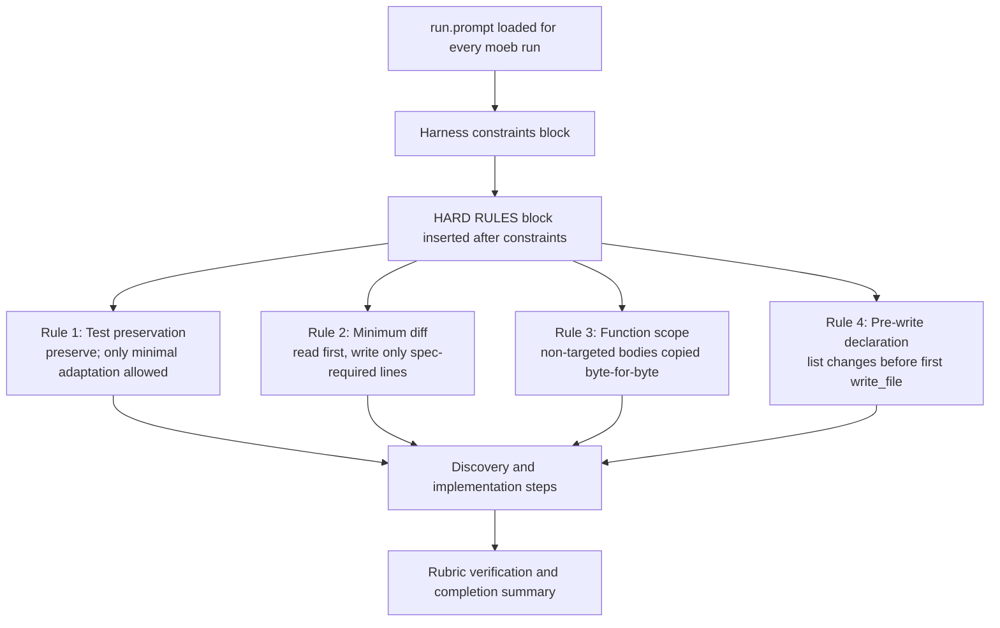

# Run Prompt: Hard Rules for Minimal-Diff File Writes and Test Preservation

## Raw Requirement

It has been suggested to add the following to run.prompt as HARD RULES — any violation is a critical failure and the run must not be considered successful:

1. Test preservation: #[cfg(test)] modules and every function inside them must be copied verbatim into every file you write. You may not delete, merge, simplify, or rewrite any test under any circumstances. If the specification does not mention a test by name, that test is untouched.

2. Minimum diff: Before writing any file, read the current version in full. Then mentally produce a diff containing only the lines required by the specification. Your write_file call must match that diff — nothing more. Any change not traceable to a numbered step in the specification is a violation.

3. Function scope: If a function, type, constant, or comment is not named or directly implied by the specification, its body must be copied byte-for-byte from the source. Do not simplify, reformat, rename, or restructure it.

4. Pre-write declaration: Before your first write_file call on any file, output a short list of the exact items you will modify in that file and which specification step requires each change. Do not write the file until that list is complete.

Rule 1 as originally stated is too extreme: tests may require modification to ensure compatibility with new functionality (e.g. changed function signatures, new constructor parameters). Rule 1 is softened so that tests may be updated only to the minimum extent needed to compile and pass, but may never be deleted.

## Description

`src/prompts/run.prompt` is the governing system instruction for every `moeb run` invocation. The existing harness constraints block prohibits deleting unrelated code, but does not establish a severity level, does not give agents a concrete diff-based discipline for limiting changes, and does not require a pre-write audit of intent. This specification introduces a **HARD RULES** block immediately after the harness constraints bullet list.

The four rules are:

1. **Test preservation (softened)** — `#[cfg(test)]` modules and every function inside them must be preserved in every file written. Tests may not be deleted. If a specification step directly modifies a function, type, or constant that an existing test exercises, that test may be updated only to the minimum extent needed to compile and pass against the new implementation. No rewrites, simplifications, or restructuring of test logic are permitted beyond what compilation requires.

2. **Minimum diff** — Before writing any file, the agent reads the current version in full, mentally produces a diff of only the lines required by the specification, and writes exactly that. Any change not traceable to a numbered specification step is a violation.

3. **Function scope** — Any function, type, constant, or comment not named or directly implied by the specification must be copied byte-for-byte from the source. No simplification, reformatting, renaming, or restructuring is permitted.

4. **Pre-write declaration** — Before the first `write_file` call on any file, the agent outputs a numbered list of the exact items it will modify and which specification step requires each change. The file must not be written until that list is complete.

All four rules are labeled as critical failures: a run that violates any of them is not considered successful regardless of other outcomes. No existing instruction is removed or weakened.



## Backlinks

### Parents

| Label | Path | Purpose |
|-------|------|---------|
| Run Prompt: Non-Regression and Rubric Verification Enforcement | [specifications/moeb/moeb.run-prompt-non-regression-and-rubric-verification.md](specifications/moeb/moeb.run-prompt-non-regression-and-rubric-verification.md) | Most recent modification to run.prompt; the new block is additive and must not alter those additions |
| OpenAI Adapter Rubrics and Non-Regression Preservation | [specifications/moeb/moeb.openai-adapter-rubrics-and-non-regression.md](specifications/moeb/moeb.openai-adapter-rubrics-and-non-regression.md) | Established the intent this specification extends |
| README | [README.md](../../README.md) | Root index |

### External

*(none)*

## Steps

### Step 1 — Add the HARD RULES block to `src/prompts/run.prompt`

Read `src/prompts/run.prompt` in full. Locate the end of the "Harness constraints you must follow at all times:" bullet list (the last bullet currently reads: "Never delete, remove, or omit existing tests…"). Insert the following block immediately after that bullet list, separated by a blank line, and before the blank line that precedes the discovery-steps paragraph:

```
HARD RULES — any violation is a critical failure and the run must not be considered successful:

1. Test preservation: `#[cfg(test)]` modules and every function inside them must be preserved in every file you write. You may not delete or remove any test. If a specification step directly modifies a function, type, or constant that an existing test exercises, that test may be updated only to the minimum extent needed to compile and pass against the new implementation. No rewrites, simplifications, or restructuring of test logic are permitted beyond what compilation requires.

2. Minimum diff: Before writing any file, read the current version in full. Then mentally produce a diff containing only the lines required by the specification. Your write_file call must match that diff — nothing more. Any change not traceable to a numbered step in the specification is a violation.

3. Function scope: If a function, type, constant, or comment is not named or directly implied by the specification, its body must be copied byte-for-byte from the source. Do not simplify, reformat, rename, or restructure it.

4. Pre-write declaration: Before your first write_file call on any file, output a short list of the exact items you will modify in that file and which specification step requires each change. Do not write the file until that list is complete.
```

No other change may be made to `src/prompts/run.prompt`.

## Decisions

### Decision 1 — Test preservation rule allows minimal compatibility adaptation

**Rationale:** The original proposed rule requires verbatim copying of all test code under all circumstances. This is too restrictive: when a specification changes a function signature, constructor, or type, existing tests that exercise that code must be updated to compile and pass. Prohibiting all test modification would make the rule impossible to satisfy on any non-trivial specification. The softened rule preserves the real intent — preventing agents from silently deleting tests — while permitting the minimum adaptation forced by the changed implementation.

**Alternatives:**

| Option | Reason Rejected |
|--------|-----------------|
| Verbatim copy rule (original wording) | Breaks on any spec that changes a signature or type exercised by a test; agents cannot comply without violating the rule or the spec |
| No test preservation rule | Agents have demonstrated a pattern of silently dropping tests during full-file rewrites; a rule is needed |
| Allow any test modification that passes `cargo test` | Too permissive; agents could rewrite test logic to trivially pass, defeating the purpose |

**Consequences:** Agents may update test code, but only when a spec-required change forces it and only to the minimum extent needed. A test that is deleted or structurally rewritten when no specification step targets it is a rule violation.

### Decision 2 — Four rules are grouped under a single HARD RULES label with a severity declaration

**Rationale:** The existing harness constraints use "must" language but do not state a severity level. By declaring violations as critical failures that prevent a run from being considered successful, the rules establish an explicit acceptance criterion visible to both agents and human reviewers. Grouping all four under one label makes their shared severity obvious and keeps the prompt scannable.

**Alternatives:**

| Option | Reason Rejected |
|--------|-----------------|
| Add each rule as a separate bullet in the harness constraints block | Dilutes severity; constraints block is already long and the new rules would not be visually distinguished |
| Add an advisory note without severity labeling | Does not change agent behavior; agents already ignore soft constraints under pressure |

**Consequences:** Any run that violates a HARD RULE is not considered successful. This is a stronger signal than the existing constraints and requires agents to self-report compliance.

### Decision 3 — Pre-write declaration is agent-produced text, not a kernel check

**Rationale:** The kernel cannot intercept agent text between tool calls. The pre-write declaration is enforced by the agent's own compliance and is visible in the run transcript for human review. This is consistent with Decision 3 from `moeb.run-prompt-non-regression-and-rubric-verification.md`, which established that rubric verification is an agent responsibility.

**Alternatives:**

| Option | Reason Rejected |
|--------|-----------------|
| Kernel parses agent output and blocks write_file if no declaration was emitted | Requires fragile text parsing in the kernel; violates the "kernel as dumb as possible" principle |
| Omit the pre-write declaration rule | Without it, agents may write files opportunistically without auditing scope; the declaration forces a scope-check step |

**Consequences:** Pre-write declarations appear in the run transcript. A run without a declaration before each write_file call is non-compliant by inspection.

### Decision 4 — HARD RULES block is placed between the harness constraints list and the discovery steps

**Rationale:** The agent reads `run.prompt` sequentially. Harness constraints orient the agent on boundaries; discovery steps begin execution. Placing HARD RULES between them gives maximum visibility — the agent encounters the rules before taking any file-writing action, after understanding the structural constraints. The discovery steps and implementation loop that follow are unchanged.

**Alternatives:**

| Option | Reason Rejected |
|--------|-----------------|
| Prepend HARD RULES before harness constraints | Agent has not been oriented on working directory and file boundaries yet; rules reference file writes |
| Append HARD RULES after discovery steps | Agent may begin writing before reading the rules |

**Consequences:** The block is the last thing the agent reads before it begins tool calls, making it the most salient instruction set in the prompt.

## Rubric

### Structured

| Name | Description | Threshold | Pass Condition |
|------|-------------|-----------|----------------|
| `binary-builds` | `cargo build --release` exits 0 after the run.prompt change | Zero errors | CI build exits 0 |
| `all-tests-pass` | `cargo test` exits 0 | Zero failures | `cargo test` exits 0 |
| `no-drift` | No contradiction with parent specs | Zero contradictions | Manual review of every decision in every parent spec listed in Backlinks |
| HARD RULES block present | The HARD RULES block is present in run.prompt with all four numbered rules | Block present | `grep -F "HARD RULES" src/prompts/run.prompt` returns a match |
| Test preservation rule present | Rule 1 (test preservation, softened) is present | String present | `grep -F "minimum extent needed to compile and pass" src/prompts/run.prompt` returns a match |
| Minimum diff rule present | Rule 2 (minimum diff) is present | String present | `grep -F "mentally produce a diff" src/prompts/run.prompt` returns a match |
| Function scope rule present | Rule 3 (function scope) is present | String present | `grep -F "copied byte-for-byte from the source" src/prompts/run.prompt` returns a match |
| Pre-write declaration rule present | Rule 4 (pre-write declaration) is present | String present | `grep -F "Pre-write declaration" src/prompts/run.prompt` returns a match |

### Qualitative

- All existing instructions in run.prompt must be preserved unchanged. The HARD RULES block is purely additive.
- The HARD RULES block must appear after the harness constraints bullet list and before the discovery steps paragraph.
- Rule 1 must not prohibit test updates that are forced by spec-required implementation changes; it must only prohibit deletion and gratuitous rewriting.
- The severity declaration ("any violation is a critical failure") must appear on the HARD RULES header line, not buried in a sub-rule.
