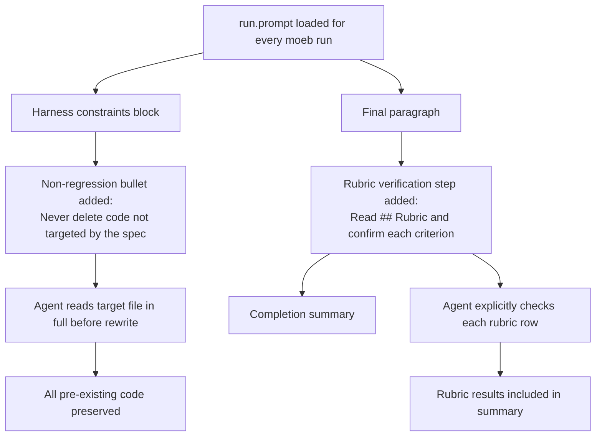

# Run Prompt: Non-Regression and Rubric Verification Enforcement

## Raw Requirement

The moeb.openai-adapter-rubrics-and-non-regression specification was created to ensure the OpenAI adapter preserves existing code and runs rubric checks, but it does not make any changes to run.prompt or agent.rs that would enforce this behaviour in future runs. The intent of that specification must be embedded in run.prompt so that every moeb run — regardless of which adapter executes it — is constrained against deleting unrelated code and is required to verify rubric criteria before concluding.

## Description

`moeb.openai-adapter-rubrics-and-non-regression.md` records the rule that agents must not delete existing code and must execute rubric checks, but those rules exist only as specification text. Because `run.prompt` is the system instruction read by the agent on every `moeb run` invocation, constraints must appear there to be reliably active. This specification adds two additive instructions to `src/prompts/run.prompt`:

1. **Non-regression rule** — a new harness constraint bullet that prohibits the agent from deleting, removing, or omitting existing tests, functions, types, constants, or any other code not explicitly targeted by the active specification. The rule also requires the agent to read a file in full before rewriting it, so it cannot accidentally drop unrelated code.

2. **Rubric verification step** — a new closing instruction that requires the agent to locate the `## Rubric` section of the active specification and confirm each structured criterion is satisfied before responding with a completion summary.

Neither addition removes or weakens any existing instruction. Both apply to every adapter.



## Backlinks

### Parents

| Label | Path | Purpose |
|-------|------|---------|
| OpenAI Adapter Rubrics and Non-Regression Preservation | [specifications/moeb/moeb.openai-adapter-rubrics-and-non-regression.md](specifications/moeb/moeb.openai-adapter-rubrics-and-non-regression.md) | Established the intent this specification enforces |
| OpenAI Adapter: Direct File Writes and Specification Iteration | [specifications/moeb/moeb.openai-direct-file-writes.md](specifications/moeb/moeb.openai-direct-file-writes.md) | Most recent modification to run.prompt; must be preserved |
| Content Deduplication for File Reads | [specifications/moeb/moeb.content-deduplication.md](specifications/moeb/moeb.content-deduplication.md) | Added the CACHE HIT instruction in run.prompt; must be preserved |
| Targeted File Reads: Line-Range Access Tool | [specifications/moeb/moeb.read-file-range.md](specifications/moeb/moeb.read-file-range.md) | Added discovery steps and read_file_range preference; must be preserved |
| README | [README.md](../../README.md) | Root index |

### External

*(none)*

## Steps

### Step 1 — Add non-regression constraint to the harness constraints block in `src/prompts/run.prompt`

Within the "Harness constraints you must follow at all times:" bullet list in `src/prompts/run.prompt`, append the following bullet as the last item in that list:

```
- Never delete, remove, or omit existing tests, functions, types, constants, or other code that is not explicitly required to change by the specification. When writing a complete file replacement, read the current file in full first with read_file and carry forward every item that the specification does not explicitly target.
```

### Step 2 — Add rubric verification instruction to the final paragraph of `src/prompts/run.prompt`

In `src/prompts/run.prompt`, replace the final sentence of the last paragraph:

```
When finished, respond with a concise summary of every file created or updated.
```

with:

```
When all steps are complete, locate the ## Rubric section of the specification (it is already in your context). For each row in the structured rubric table, state whether the criterion is satisfied by the changes you made. Then respond with a concise summary of every file created or updated, followed by the rubric verification results.
```

## Decisions

### Decision 1 — Embed non-regression and rubric enforcement in run.prompt, not in a separate spec or post-processing step

**Rationale:** `run.prompt` is loaded on every `moeb run` invocation and forms the agent's governing system instruction for that run. A constraint recorded only in a specification file is visible to the agent only if it happens to read that file — which is not guaranteed. Embedding the constraints in `run.prompt` makes them unconditional and adapter-agnostic.

**Alternatives:**

| Option | Reason Rejected |
|--------|-----------------|
| Rely on the agent reading and applying moeb.openai-adapter-rubrics-and-non-regression.md | The agent reads the active spec, not all ancestor specs; there is no guarantee the non-regression spec is in context |
| Add a post-run rubric-check pass in agent.rs | Rubric criteria are heterogeneous (build checks, grep checks, manual review); they cannot be mechanically executed by the kernel |
| Add a dedicated `rubric-check.prompt` as a second agent pass | Adds latency and complexity; embedding the check in the single existing completion instruction achieves the same result |

**Consequences:** Every future `moeb run` — regardless of adapter — will carry both constraints. Agents that comply will produce complete, regression-free code and include rubric results in their summary. Agents that do not comply will produce an incomplete summary, which is a visible signal of non-compliance.

### Decision 2 — Non-regression rule applies to all adapters, not only OpenAI

**Rationale:** Silently dropping code during a file rewrite is possible with any model that does not read the target file before replacing it. The constraint is correct universally. The kernel has no mechanism to apply adapter-conditional prompt fragments.

**Alternatives:**

| Option | Reason Rejected |
|--------|-----------------|
| Gate the non-regression rule on the active adapter name | Kernel cannot selectively modify run.prompt at runtime |
| Apply the rule only during OpenAI runs via a separate prompt template | Adds a second prompt file and a branching dispatch mechanism with no benefit |

**Consequences:** The Anthropic adapter and any future adapters also observe the non-regression constraint. This is correct: the failure mode (silently omitting code during a rewrite) is not adapter-specific.

### Decision 3 — Rubric verification is an agent responsibility, not a kernel check

**Rationale:** The structured rubric table in each specification mixes criteria that require tool calls (grep checks), compilation (build checks), and human judgement (manual review). No single automated mechanism can evaluate all of them. The agent is the only participant with access to all three: it can call tools, reason about code, and apply the structured criteria to its own output.

**Alternatives:**

| Option | Reason Rejected |
|--------|-----------------|
| Run cargo test and cargo build in agent.rs after the loop finishes | The kernel tool surface does not include a shell-execute tool and should not — that would violate the "kernel as dumb as possible" principle |
| Emit a post-run warning if write_file was never called | Already implemented; this spec adds the complementary rubric check |

**Consequences:** Rubric verification results appear in the agent's completion summary as self-reported text. This relies on the agent correctly applying the criteria, which is acceptable given that rubric checks are already a qualitative process.

## Rubric

### Structured

| Name | Description | Threshold | Pass Condition |
|------|-------------|-----------|----------------|
| `binary-builds` | `cargo build --release` exits 0 after the run.prompt change | Zero errors | CI build exits 0 |
| `all-tests-pass` | `cargo test` exits 0 | Zero failures | `cargo test` exits 0 |
| `no-drift` | No contradiction with parent specs | Zero contradictions | Manual review of every decision in every parent spec listed in Backlinks |
| Non-regression constraint present | The non-regression bullet is present in run.prompt | String present | `grep -F "Never delete, remove, or omit existing tests" src/prompts/run.prompt` returns a match |
| Rubric verification step present | The rubric verification instruction is present in run.prompt | String present | `grep -F "## Rubric section of the specification" src/prompts/run.prompt` returns a match |

### Qualitative

- All existing instructions in run.prompt must be preserved unchanged. The two new additions are purely additive — no existing sentence is removed or weakened.
- The rubric verification instruction must appear after the implementation paragraph so the agent encounters it only after all code changes are complete.
- The non-regression bullet must be specific enough that an agent understands it must read a target file in full before rewriting it.
- Completion summaries produced by compliant agents must include rubric results alongside the list of files changed.
