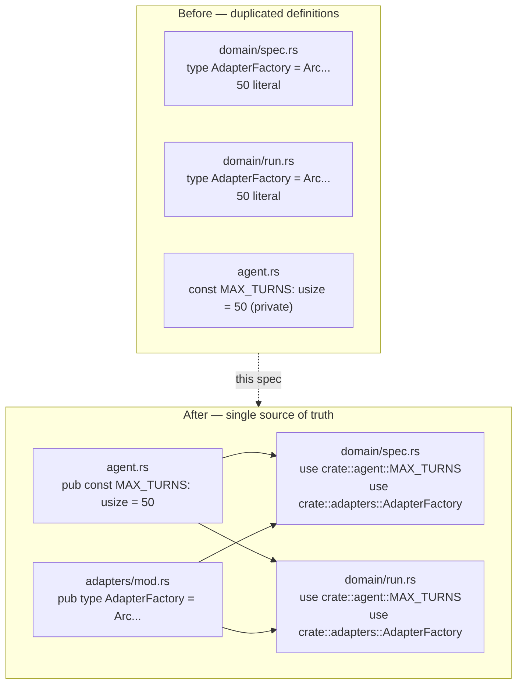

# Shared Constants and Type Aliases

## Raw Requirement

> `MAX_TURNS = 50` is defined in `agent.rs` as a private constant but the literal `50` is
> hardcoded again as a magic number in `domain/spec.rs` and `domain/run.rs`. The
> `AdapterFactory` type alias is duplicated verbatim in both domain files. Both violations
> break DRY and create a maintenance hazard where changing the turn limit or factory type
> requires editing multiple files.

## Description

Two values are defined once but used by string-copy in multiple places. `MAX_TURNS` (the
agent loop turn ceiling) is declared as a private `const` in `agent.rs` but the literal
`50` appears independently in `domain/spec.rs` and `domain/run.rs`. `AdapterFactory` (the
closure type for constructing a traced AI adapter) is a long generic type alias declared
in full in both domain files.

The fix is mechanical: publish `MAX_TURNS` from `agent.rs`, define `AdapterFactory` once
in `adapters/mod.rs`, and replace every duplicate with an import. No behaviour changes.

## Diagram



## Backlinks

### Parents

| Label | Path | Purpose |
|-------|------|---------|
| Moeb Hexagonal Architecture | [specifications/moeb/moeb.hex-architecture.md](specifications/moeb/moeb.hex-architecture.md) | Establishes the domain/adapters/ports layering that governs where shared definitions live |
| Moeb Run Produces No File Writes When Using the Anthropic Adapter | [specifications/moeb/moeb.run-anthropic-no-file-writes.md](specifications/moeb/moeb.run-anthropic-no-file-writes.md) | Most recent spec that references the agent loop constants and AdapterFactory pattern |
| README | [README.md](../../README.md) | Root index |

### External

*(none)*

## Steps

### Step 1 — Publish `MAX_TURNS` from `agent.rs`

In `src/moeb/src/agent.rs`, change:

```rust
const MAX_TURNS: usize = 50;
```

to:

```rust
pub const MAX_TURNS: usize = 50;
```

No other change to this file.

### Step 2 — Replace the literal `50` in `domain/spec.rs`

In `src/moeb/src/domain/spec.rs`:

1. Add `use crate::agent::MAX_TURNS;` to the imports at the top of the file.
2. Locate the call to `crate::agent::run_agent_loop_traced(...)` inside the retry loop. Replace the literal `50` argument (the `max_turns` parameter) with `MAX_TURNS`.

### Step 3 — Replace the literal `50` in `domain/run.rs`

In `src/moeb/src/domain/run.rs`:

1. Add `use crate::agent::MAX_TURNS;` to the imports at the top of the file.
2. Locate the call to `crate::agent::run_agent_loop_traced(...)`. Replace the literal `50` argument with `MAX_TURNS`.

### Step 4 — Define `AdapterFactory` in `adapters/mod.rs`

In `src/moeb/src/adapters/mod.rs`, add the following after the existing `pub mod` declarations and before the wire-type definitions:

```rust
use std::sync::Arc;
use anyhow::Result;
use crate::ports::AiPort;
use crate::trace::TraceContext;

pub type AdapterFactory =
    Arc<dyn Fn(Arc<TraceContext>) -> Result<Arc<dyn AiPort>> + Send + Sync>;
```

### Step 5 — Remove the duplicate `AdapterFactory` from `domain/spec.rs`

In `src/moeb/src/domain/spec.rs`:

1. Remove the line `type AdapterFactory = Arc<dyn Fn(Arc<TraceContext>) -> Result<Arc<dyn AiPort>> + Send + Sync>;` (or its equivalent).
2. Add `use crate::adapters::AdapterFactory;` to the imports.

### Step 6 — Remove the duplicate `AdapterFactory` from `domain/run.rs`

Apply the same change as Step 5 to `src/moeb/src/domain/run.rs`.

### Step 7 — Verify

Run `cargo build --release` and confirm zero compilation errors. Run `cargo test` and confirm all existing tests pass without modification.

## Decisions

### Decision 1 — `MAX_TURNS` stays in `agent.rs`

**Rationale:** The constant governs the agent loop ceiling. The agent loop is entirely defined in `agent.rs`. Placing the constant where the primary behaviour it controls lives is the right ownership boundary. Moving it to a shared constants file would couple the module layout further for no gain.

**Alternatives:**

| Option | Reason Rejected |
|--------|-----------------|
| New `src/moeb/src/constants.rs` module | Adds a file for two values with no natural home; `agent.rs` is the authoritative owner of `MAX_TURNS` |
| Keep it private and duplicate the literal | Maintenance hazard; the literal drifts between files |

**Consequences:** Any future change to the turn limit requires editing exactly one line in `agent.rs`. All callers see the updated value automatically.

---

### Decision 2 — `AdapterFactory` lives in `adapters/mod.rs`

**Rationale:** The type references `AiPort` (a port) and `TraceContext` (a trace type) and is used by the domain to construct adapters. Placing it in `adapters/mod.rs` co-locates it with the concrete adapter implementations that satisfy it, and keeps it out of the domain layer. The domain imports it from adapters, which is a permitted direction in the hexagonal architecture (domain → adapters via port interfaces).

**Alternatives:**

| Option | Reason Rejected |
|--------|-----------------|
| Define in `ports/ai.rs` | The type is a factory closure, not a port trait; placing a concrete closure type in ports conflates the interface with its construction mechanism |
| Define in `domain/mod.rs` | Domain should not own adapter construction types |

**Consequences:** Any future change to the factory signature requires editing `adapters/mod.rs` and updating all callers via Rust's type system. The factory type is importable from anywhere that can see `crate::adapters`.

## Rubric

### Structured

| Name | Description | Threshold | Pass Condition |
|------|-------------|-----------|----------------|
| `binary-builds` | `cargo build --release` exits 0 | Zero errors | CI build exits 0 |
| `all-tests-pass` | `cargo test` exits 0 | Zero failures | `cargo test` exits 0 |
| `no-test-regression` | All pre-existing tests pass without modification | Zero failures | `cargo test` exits 0 |
| No literal `50` in domain | The string `50` does not appear as a bare literal in `domain/spec.rs` or `domain/run.rs` | Zero occurrences | `grep -n "\b50\b" src/moeb/src/domain/spec.rs src/moeb/src/domain/run.rs` returns no matches |
| Single `AdapterFactory` definition | The type alias appears in exactly one file | One definition | `grep -rn "type AdapterFactory" src/` returns exactly one result |

### Qualitative

- **No behaviour change:** This is a pure refactor. The agent loop turn limit must remain 50. The adapter factory closure type must be identical in structure to the previously duplicated definitions. A reviewer comparing before and after must find zero semantic differences.
- **Import hygiene:** Each domain file must import `MAX_TURNS` and `AdapterFactory` explicitly rather than using `use crate::*` or re-exporting from an intermediate module.
