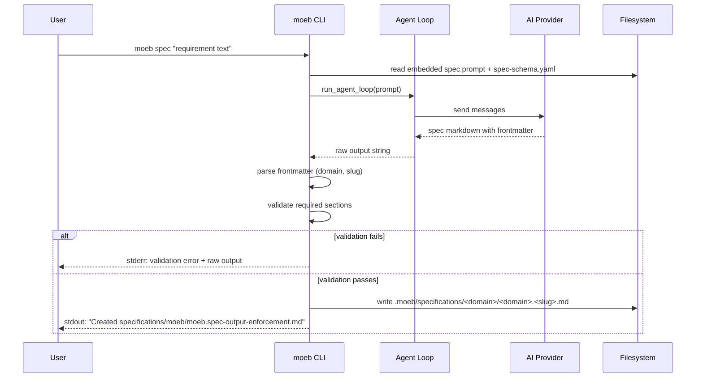

# Spec Command Output Enforcement and File Persistence

**Domain**: `moeb`  
**Slug**: `spec-output-enforcement`  
**Filename**: `moeb.spec-output-enforcement.md`  
**Path**: `specifications/moeb/moeb.spec-output-enforcement.md`

---

## Raw Requirement

The spec.prompt file needs some improvement — the response when running `moeb spec ...` is not always in the desired format as specified in `.moeb/spec-schema.yaml`. It must always be returned in that format with the desired headers, header order, and structure. Any given response to `moeb spec`, due to the prompt template, must adhere to `spec-schema.yaml`. We should have a means of validating this structure versus the spec-schema.yaml on return. The response appears to be getting written to terminal, which is fine for transparency at the moment, but the `moeb spec` response should be getting written to file as appropriate — given the README.md specifies a structure like `.moeb/specifications/<domain>/<domain>.<specification-name>.md`. The file created should be signalled in terminal to let the user know what has been created.

---

## Description

Three coordinated changes are required:

1. **Prompt enforcement** — `src/prompts/spec.prompt` must be updated to explicitly embed the full `spec-schema.yaml` content and instruct the model to produce a markdown document whose sections and ordering exactly match the schema. The model must also include a YAML frontmatter block at the top of its output containing `domain` and `slug` fields, which are used by the kernel to construct the output file path.

2. **Structural validation** — after the agent loop returns, `domain/spec.rs` must parse the frontmatter and check that all required sections defined in the schema are present in the correct order before the file is written. If validation fails, the raw output must be printed to stderr with a clear error message; no file is written.

3. **File persistence** — on successful validation, the spec content is written to `.moeb/specifications/<domain>/<domain>.<slug>.md`, creating any necessary parent directories. The absolute or working-directory-relative path of the created file is printed to stdout so the user can immediately open or inspect it.

---

## Diagram



---

## Backlinks

### Parents

| Label | Path | Purpose |
|-------|------|---------|
| Declarative Harness README | README.md | Root index; defines .moeb/specifications/<domain>/<domain>.<slug>.md path convention |
| Moeb Kernel | specifications/moeb/moeb.kernel.md | Parent spec defining moeb spec command and agent loop |
| Prompt Template Bundling | specifications/moeb/moeb.prompt-template-bundling.md | Established that spec.prompt is embedded in the binary |

### External

*(none)*

---

## Steps

### Step 1 — Update `spec.prompt` to enforce schema compliance

Rewrite `src/prompts/spec.prompt` to:

- Open by instructing the model to study `README.md` (via the agent's `read_file` tool call in the working dir).
- Embed or reference the full `spec-schema.yaml` content so the model sees the exact required structure.
- Require the model to begin its response with a YAML frontmatter block delimited by `---`, containing at minimum:
  ```yaml
  ---
  domain: <single lowercase word or hyphenated phrase>
  slug: <concise kebab-case description>
  ---
  ```
- After the frontmatter, require the model to produce a markdown document with sections in the exact order defined in `spec-schema.yaml`: title heading, Raw Requirement, Description, Diagram (mermaid block), Backlinks, Steps, Decisions, Rubric.
- End the prompt with `{{input}}` substitution as before.

The prompt must be unambiguous: the model's entire response is the spec file content, nothing more, nothing less.

### Step 2 — Embed `spec-schema.yaml` in the binary

Add a third embed path to `src/moeb/src/assets.rs` (or reuse the existing `Assets` embed that already covers `assets/`) so that `spec-schema.yaml` is accessible at runtime for inclusion in the prompt and for validation.

Since `spec-schema.yaml` is moved into `.moeb/` by `moeb init`, the kernel must read it from `.moeb/spec-schema.yaml` via the agent's `read_file` tool (already available) rather than embedding a second copy. The prompt template should instruct the model to call `read_file` on `spec-schema.yaml` as its first action.

### Step 3 — Parse frontmatter and validate required sections

In `domain/spec.rs`, after `run_agent_loop` returns the output string:

1. **Parse frontmatter**: extract the `---` delimited YAML block at the top of the output. Use `serde_yaml` (add as dependency) or a simple line-by-line parser to extract `domain` and `slug`. If frontmatter is absent or either field is missing, return a descriptive error.

2. **Validate sections**: check that the following headings appear in the output, in order:
   - A level-1 heading (the title)
   - `## Raw Requirement`
   - `## Description`
   - ` ```mermaid` block
   - `## Backlinks`
   - `## Steps`
   - `## Decisions`
   - `## Rubric`

   If any required section is missing or out of order, print the raw output to stderr and return an error naming the missing section.

### Step 4 — Write spec to file and signal the user

On successful validation:

1. Construct the output path: `.moeb/specifications/<domain>/<domain>.<slug>.md`
2. Call `fs::create_dir_all` for the parent directory.
3. Strip the frontmatter block from the content before writing (the frontmatter is kernel metadata, not part of the spec document itself).
4. Write the remaining markdown to the constructed path.
5. Print to stdout: `Created: .moeb/specifications/<domain>/<domain>.<slug>.md`

### Step 5 — Add tests

Add tests to `domain/spec.rs` or a dedicated `validation` module covering:

- Frontmatter parsing returns correct domain and slug.
- Validation passes for a well-formed spec.
- Validation rejects output missing a required section, naming the section.
- Validation rejects output with sections out of order.
- File is written to the correct path on a passing run (using a temp `.moeb/` directory).

---

## Decisions

### Decision 1 — Frontmatter as routing metadata

**Rationale**: The kernel needs domain and slug to construct the output path, but these cannot be reliably inferred from prose alone. A structured frontmatter block is the least ambiguous contract between the model and the kernel.

**Alternatives considered**:

| Option | Reason rejected |
|--------|----------------|
| Infer domain from the first heading | Headings are prose; extraction is fragile and locale-sensitive |
| Ask the user interactively for domain/slug | Breaks the single-command UX; adds friction |
| Use a separate tool call from the model to set metadata | Adds complexity to the agent loop for a one-shot command |

**Consequences**: The prompt must clearly specify the frontmatter contract. The model will occasionally omit it — the validation step (Step 3) catches this and returns a clear error so the user can retry.

### Decision 2 — Strip frontmatter before writing

**Rationale**: The frontmatter is kernel routing metadata. The written `.md` file should be a clean specification document that a human or agent can read without encountering YAML preamble that is irrelevant to the spec's content.

**Alternatives considered**:

| Option | Reason rejected |
|--------|----------------|
| Keep frontmatter in the file | Clutters the spec; not part of the spec-schema.yaml structure |
| Store frontmatter in a sidecar file | Unnecessary complexity for two fields |

**Consequences**: The kernel is responsible for stripping the block; validation must happen before stripping.

### Decision 3 — Validate section order, not just presence

**Rationale**: The schema defines a canonical order. Allowing sections in any order would undermine the consistency goal — specs must be scannable at a glance in the same structure every time.

**Alternatives considered**:

| Option | Reason rejected |
|--------|----------------|
| Validate presence only | Specs with shuffled sections are harder to read and diff |
| Full YAML/AST parse of the spec | Over-engineered for what is essentially a heading-order check |

**Consequences**: The validator must walk the output linearly, tracking which required heading was last seen.

---

## Rubric

### Structured

| Name | Description | Threshold | Pass condition |
|------|-------------|-----------|----------------|
| Schema compliance | Every spec produced by `moeb spec` contains all required sections in order | 100% | Manual and automated test runs produce no validation errors |
| File written | Running `moeb spec` in an initialised project produces a `.md` file at the correct path | 100% | File exists at `.moeb/specifications/<domain>/<domain>.<slug>.md` after command completes |

### Qualitative

| Name | Description |
|------|-------------|
| Prompt clarity | The updated `spec.prompt` leaves no ambiguity about the required output format; a model reading it produces a schema-compliant spec on the first attempt in the majority of runs |
| Error legibility | When validation fails, the terminal output tells the user exactly which section is missing or out of order, and includes the raw output so they can inspect the model's response |
