# Spec Prompt: Static File Pre-load and Redundant-Read Prevention

## Raw Requirement

> The following is an output from a moeb spec run, there are a few issues that need fixing:
> 1. `.moeb\.moeb/rubrics/rubrics.index.md` I am not sure where this is coming from, but
>    the path into the file is `.moeb/rubrics/rubrics.index.md` and we appear to be wasting
>    calls attempting to find it.
> 2. We also appear to be repeating calls for the same file content, we MUST be as efficient
>    as possible with our calls

## Description

Two complementary defects cause the excess tool calls observed in `moeb spec` runs.

**Defect 1 — Double `.moeb/` prefix on the rubrics path.** `spec.prompt` step 3 instructs
the agent to `read_file ".moeb/rubrics/rubrics.index.md"`. The `moeb spec` working directory
is already `.moeb/` (set in `domain/spec.rs`), so the tool resolves the path as
`.moeb/.moeb/rubrics/rubrics.index.md`. Three failed tool calls and two extra turns result
before the agent discovers `rubrics/rubrics.index.md` is the correct path.

**Defect 2 — No context-reuse directive in `spec.prompt`.** The agent repeatedly re-reads
file ranges it has already received — including identical `read_file_range` calls for the
same line ranges of the same specification file across multiple turns — because `spec.prompt`
does not instruct it to avoid redundant reads. `run.prompt` already carries this directive via
the `[CACHE HIT:]` guidance; `spec.prompt` carries nothing equivalent.

Both defects are addressed together by pre-loading the three mandatory static files
(`README.md`, `spec-schema.yaml`, and `rubrics/rubrics.index.md`) directly into the initial
prompt via template substitution, and by adding an explicit no-re-read directive for the
research phase. Pre-loading eliminates the rubrics path lookup entirely (the file content
arrives in the initial prompt; no tool call is needed) and saves at least three turns that
were previously spent on mandatory reads. The no-re-read directive curbs the repeated range
reads observed in the research phase.

`domain/spec.rs` is updated to read the three static files and substitute three new tokens
(`{{readme_content}}`, `{{spec_schema_content}}`, `{{rubrics_content}}`) before the agent
loop starts. `README.md` and `spec-schema.yaml` are required; an absent file is a
configuration error and the command exits with an actionable message. `rubrics/rubrics.index.md`
is treated as optional; if absent, a placeholder noting its absence is injected rather than
failing the command.

## Diagram

```mermaid
graph TD
  subgraph Before["Before — moeb spec (turns 1-5 wasted)"]
    B1["spec.prompt\n(template only)"] --> B2["Turn 1: read README + spec-schema\n+ .moeb/rubrics/rubrics.index.md → FAIL"]
    B2 --> B3["Turn 2: retry .moeb/rubrics/... → FAIL"]
    B3 --> B4["Turn 3: search_files .moeb/rubrics → FAIL"]
    B4 --> B5["Turn 4: list_directory → finds .moeb/"]
    B5 --> B6["Turn 5: read rubrics/rubrics.index.md → OK"]
    B6 --> B7["Turns 6-N: research + repeated re-reads"]
  end

  subgraph After["After — moeb spec (no wasted turns)"]
    A1["spec.rs reads README,\nspec-schema, rubrics"] --> A2["spec.prompt with\n{{readme_content}}\n{{spec_schema_content}}\n{{rubrics_content}}\nsubstituted"]
    A2 --> A3["Turn 1: research starts immediately\n(no mandatory file reads)"]
    A3 --> A4["Turns 2-N: research,\nno re-reads of context-present content"]
  end
```



## Backlinks

### Parents

| Label | Path | Purpose |
|-------|------|---------|
| Moeb Kernel | [specifications/moeb/moeb.kernel.md](specifications/moeb/moeb.kernel.md) | Establishes `moeb spec`, `spec.prompt`, and the agent loop context |
| Agent File-Read Optimization | [specifications/moeb/moeb.agent-read-optimization.md](specifications/moeb/moeb.agent-read-optimization.md) | Introduced the static pre-load pattern for `run.prompt`; this spec applies the same pattern to `spec.prompt` |
| Content Deduplication for File Reads | [specifications/moeb/moeb.content-deduplication.md](specifications/moeb/moeb.content-deduplication.md) | Introduced the `[CACHE HIT:]` backreference for `read_file`; this spec adds an equivalent directive to `spec.prompt` covering all read tools |
| Rubrics Index | [specifications/harness/harness.rubrics-index.md](specifications/harness/harness.rubrics-index.md) | Introduced `rubrics/rubrics.index.md`; the path used here must match its defined location |
| README | [README.md](../../README.md) | Root index |

### External

*(none)*

## Steps

### Step 1 — Update `src/prompts/spec.prompt`

Replace the entire content of `src/prompts/spec.prompt` with the pre-loading version below.
The three `read_file` instructions (old steps 1–3) are replaced by pre-loaded context sections.
A no-re-read directive is inserted after the static context block. All other content (schema
note, frontmatter guidance, section order requirements, rubric authoring rules, and the
`{{input}}` token) is preserved verbatim.

```
You are a specification author operating within a declarative harness.

The following files have been pre-loaded as context — do not call read_file for them:

=== README.md ===
{{readme_content}}

=== spec-schema.yaml ===
{{spec_schema_content}}

=== rubrics/rubrics.index.md ===
{{rubrics_content}}

Do not re-read any file already present in your context window. If you need to refer to
content from a pre-loaded section or from a tool result returned in an earlier turn, locate
it in your context directly rather than making another tool call. This applies to all read
tools: read_file, read_files, and read_file_range.

Note: The kernel validates your output against "spec-schema-validation.json". Do not attempt
to read or modify that file — it is a derived machine-readable artefact maintained by the
harness, not an authoring guide. When asked to update the schema (e.g. to add a new required
section or frontmatter field), update both "spec-schema.yaml" and "spec-schema-validation.json"
in the same run.

Your response must be the complete specification document and nothing else — no preamble, no
explanation, no trailing commentary.

Begin your response with a YAML frontmatter block, exactly as shown:

---
domain: <single lowercase word or hyphenated phrase — must match the folder name under specifications/>
slug: <concise kebab-case description of the specification subject>
status: active
---

The `status` field is required and must be set to `active` for all newly authored specifications.
Setting `status: draft` is permitted only when explicitly instructed by the user. Never set
`status: superseded` when authoring a new specification — that value is set only when updating
an existing README index row to mark a spec as superseded by its successor.

The `supersedes` field is optional. Omit it entirely when this specification does not override
any named decision from a parent specification. Include it only when explicitly overriding a
specific decision recorded in a parent spec. When included, add one entry per overridden decision
using the two-line syntax:

supersedes:
  - path: specifications/<domain>/<domain>.<slug>.md
    decision: "Decision N — Exact title of the overridden decision"

For example:

supersedes:
  - path: specifications/moeb/moeb.adapter-config-and-listing.md
    decision: "Decision 5 — Fixed 1-second retry delay"

When `supersedes` is included, the overridden decision must also be addressed explicitly in the
Decisions section of this specification with a rationale for why the override is warranted. Both
the frontmatter entry and the prose rationale are required — neither is sufficient without the other.

After the frontmatter, produce a markdown document with sections in this exact order. Every
section is required — omitting any section is invalid:

1. A level-1 heading:  # <Title>
2. ## Raw Requirement
3. ## Description
4. A mermaid diagram block (opened with ```mermaid, closed with ```)
5. ## Backlinks
6. ## Steps
7. ## Decisions
8. ## Rubric

Follow the field descriptions in spec-schema.yaml precisely. Each step must be detailed enough
for an agent or developer to execute without ambiguity. Each decision must record rationale,
rejected alternatives, and consequences.

When authoring the `## Rubric / ### Structured` table: for each criterion in the rubrics index
whose `status` is `active`, evaluate whether it applies to this specification. If it does, copy
the row verbatim from the index and use the criterion `id` (e.g. `binary-builds`) as the Name
column value. Add any spec-specific criteria as additional rows beneath the standard ones. Do
not omit a standard criterion that applies without explicit justification.

The `### Qualitative` section is always spec-specific and is never drawn from the rubrics index.

CRITICAL: The very first characters of your response must be the three-character sequence "---"
on its own line, with absolutely no text, whitespace, or BOM before it. Do not write any
introduction, explanation, or preamble before the frontmatter block. A response that does not
start with "---" is invalid, will be rejected immediately, and the run will be retried at
additional cost. Start your response now with "---".

Requirement:
{{input}}
```

### Step 2 — Add token constants and substitution logic to `domain/spec.rs`

In `src/moeb/src/domain/spec.rs`:

**a) Add four constants** alongside the existing `INPUT_TOKEN`:

```rust
const README_TOKEN: &str = "{{readme_content}}";
const SPEC_SCHEMA_TOKEN: &str = "{{spec_schema_content}}";
const RUBRICS_TOKEN: &str = "{{rubrics_content}}";
const RUBRICS_PATH: &str = "rubrics/rubrics.index.md";
```

**b) In `SpecService::run_in`**, replace the single token substitution line:

```rust
let prompt = template.replace(INPUT_TOKEN, input);
```

with:

```rust
let readme_content = fs::read_to_string(working_dir.join("README.md"))
    .with_context(|| {
        format!(
            "Cannot read {}/README.md. Run `moeb init` first.",
            working_dir.display()
        )
    })?;

let spec_schema_content = fs::read_to_string(working_dir.join("spec-schema.yaml"))
    .with_context(|| {
        format!(
            "Cannot read {}/spec-schema.yaml. Run `moeb init` first.",
            working_dir.display()
        )
    })?;

let rubrics_content =
    fs::read_to_string(working_dir.join(RUBRICS_PATH)).unwrap_or_else(|_| {
        "(rubrics catalogue not found — rubrics/rubrics.index.md is absent)".to_string()
    });

let prompt = template
    .replace(INPUT_TOKEN, input)
    .replace(README_TOKEN, &readme_content)
    .replace(SPEC_SCHEMA_TOKEN, &spec_schema_content)
    .replace(RUBRICS_TOKEN, &rubrics_content);
```

No other changes to `run_in` are required.

### Step 3 — Verify

Run `cargo build --release` and confirm zero compilation errors. Run `cargo test` and confirm
all existing tests pass.

Confirm by inspection:

1. `src/prompts/spec.prompt` contains `{{readme_content}}`, `{{spec_schema_content}}`, and
   `{{rubrics_content}}` tokens and no longer contains the instruction to `read_file` any of
   the three static files.
2. After the change, running `moeb spec "some requirement"` against a properly initialised
   `.moeb/` directory starts with a pre-filled prompt containing the README content; no
   `read_file README.md` tool call appears in the first turn.
3. Running `moeb spec "some requirement"` in a directory where `.moeb/README.md` is absent
   exits immediately with a message containing `README.md` and `moeb init`.

## Decisions

### Decision 1 — Pre-load all three static files rather than only fixing the rubrics path

**Rationale:** A targeted path fix (`".moeb/rubrics/rubrics.index.md"` →
`"rubrics/rubrics.index.md"`) would eliminate the failed lookups for rubrics but would still
leave three mandatory `read_file` round-trips at the start of every `moeb spec` run. Pre-loading
all three files eliminates those round-trips entirely and is the same pattern already proven for
`run.prompt` in `moeb.agent-read-optimization`. The path fix alone would still waste one turn on
each of README.md and spec-schema.yaml.

**Alternatives:**

| Option | Reason Rejected |
|--------|-----------------|
| Fix only the rubrics path string | Still leaves 3 round-trips for mandatory reads at the start of every run; addresses the symptom, not the root cause |
| Pre-load README only | Saves one round-trip; rubrics path bug persists; spec-schema still needs a read call |
| Pre-load README and spec-schema only; fix rubrics path | Partial saving; rubrics file is also read on every run and is equally pre-loadable |

**Consequences:** `SpecService::run_in` now reads three files from disk before calling the
agent loop. If any required file is absent, the command exits before making any API call.
This is strictly better than the current behaviour where the failure occurs mid-loop after a
paid API call.

---

### Decision 2 — Rubrics absence is a soft warning, not a hard failure

**Rationale:** `README.md` and `spec-schema.yaml` are foundational harness files created by
`moeb init`; their absence unambiguously indicates an uninitialised or corrupted harness.
`rubrics/rubrics.index.md` is a mutable catalogue introduced later in the harness lifecycle
and may legitimately be absent in older or minimal harness installations. Failing the command
when rubrics is missing would break `moeb spec` in those environments. A placeholder string
gives the agent a signal that the catalogue is absent without preventing spec generation.

**Alternatives:**

| Option | Reason Rejected |
|--------|-----------------|
| Treat rubrics absence as a hard failure like README | Breaks `moeb spec` in harnesses that pre-date the rubrics catalogue |
| Silently inject an empty string | The agent may not realise rubrics is absent and may produce a rubric section with no standard criteria without explanation |
| Emit a stderr warning when rubrics is absent | The placeholder text already informs the agent; a stderr warning is noise when the spec can still be generated |

**Consequences:** If `rubrics/rubrics.index.md` is absent, the agent receives a one-line note
and must author the rubric section from spec-specific criteria only. The placeholder text is
machine-readable enough for the agent to interpret correctly.

---

### Decision 3 — No-re-read directive covers all three read tools explicitly

**Rationale:** The existing CACHE HIT mechanism in `RealToolExecutor` covers only `read_file`
(per `moeb.content-deduplication.md` Decision 1). `spec.prompt` must therefore carry an
explicit prompt-level directive that extends the no-re-read intent to `read_file_range` and
`read_files`, where no kernel-level enforcement exists. Naming all three tools removes any
ambiguity about scope.

**Alternatives:**

| Option | Reason Rejected |
|--------|-----------------|
| Extend kernel-level deduplication to `read_file_range` | Requires range-vs-full-file cache reconciliation (deferred per `moeb.content-deduplication.md` Decision 1); prompt directive is simpler and available now |
| No directive; rely on CACHE HIT alone | CACHE HIT only covers `read_file`; repeated `read_file_range` calls for already-received ranges go undetected and unchecked |
| Directive for `read_file` only | Observed inefficiency was repeated `read_file_range` calls; omitting them from the directive would not address the reported problem |

**Consequences:** The directive is a prompt instruction; compliance depends on the model
following it. The CACHE HIT kernel enforcement for `read_file` remains in place as a
complementary mechanism. Future work can add kernel-level enforcement for `read_file_range`
if the prompt directive proves insufficient.

## Rubric

### Structured

| Name | Description | Threshold | Pass Condition |
|------|-------------|-----------|----------------|
| `binary-builds` | `cargo build --release` exits 0 | Zero errors | CI build exits 0 |
| `all-tests-pass` | `cargo test` exits 0 | Zero failures | `cargo test` exits 0 |
| `no-test-regression` | All pre-existing tests pass without modification to test code | Zero failures | `cargo test` exits 0; no test file edited |
| `no-drift` | No contradiction with parent specs | Implementation does not violate any decision in a linked parent spec | Manual review of every decision in every parent spec listed in Backlinks |
| Tokens substituted | `SpecService::run_in` replaces all three static-content tokens before the first API call | No token literal remains in the prompt passed to the agent | Code review of `domain/spec.rs` confirms four `.replace(...)` calls on the template |
| Rubrics path unreachable | `spec.prompt` contains no instruction to `read_file` any of the three static files | Zero such instructions | Text search of `spec.prompt` finds no `read_file` call for README, spec-schema, or rubrics |
| Required-file failure exits early | Running `moeb spec` without `README.md` or `spec-schema.yaml` exits before any API call with a message naming the missing file | Message contains file name and `moeb init` | Manual test in a directory missing each file |
| Rubrics fallback does not fail | Running `moeb spec` without `rubrics/rubrics.index.md` completes normally | Command exits 0 | Manual test in a directory missing `rubrics/rubrics.index.md` |

### Qualitative

- **Prompt readability.** The updated `spec.prompt` must remain legible to a human author. Pre-loaded sections must be clearly delineated (using `=== filename ===` headers) so a reader can distinguish template structure from injected content.
- **No regression on spec generation.** Existing specifications must continue to be generated with the correct structure and content. The agent must not be confused by receiving static file content in the initial prompt rather than via tool calls.
- **Directive precision.** The no-re-read directive must name `read_file`, `read_files`, and `read_file_range` explicitly so the agent understands the full scope without guessing. Vague guidance ("do not re-read files") is insufficient.
