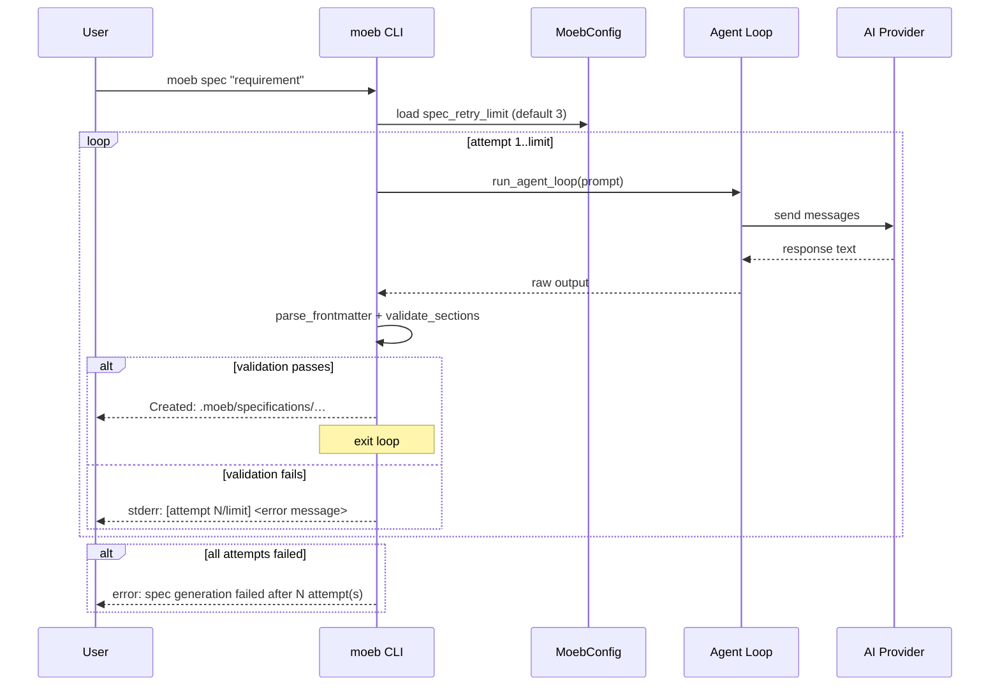

# Spec Validation Retry with User-Visible Error Reporting

## Raw Requirement

Error in spec reported to user rather than ai agent - should repeat until user configured limit detailing error. The only error I have seen is that 'Response does not begin with a '---' frontmatter block.', which may require an adjustment to spec.prompt

## Description

When `moeb spec` produces an AI response that fails validation (frontmatter absent, fields missing, or required sections out-of-order), the current behaviour is to propagate the error immediately and exit. The user sees the failure once and must re-run the command manually to try again.

Two coordinated changes are required:

1. **Retry loop in `SpecService::run_in`** — wrap the agent-loop call and subsequent parse/validate steps in a retry loop. On each failed attempt, print the validation error to stderr so the user can see what went wrong, then invoke a fresh agent loop for the next attempt. After exhausting all attempts, return the final error. The retry count must not be passed back into the AI agent; the agent is restarted from scratch each time.

2. **User-configurable retry limit** — add a `spec_retry_limit` field (`Option<u32>`) to `MoebConfig` in `src/moeb/src/config.rs`. When absent or `None`, a compiled-in default of `3` is used. The value is written to and read from `.moeb/config.toml` under the key `spec_retry_limit`.

3. **`spec.prompt` reinforcement** — add a hard-stop warning to `src/prompts/spec.prompt` immediately before the `{{input}}` substitution to re-emphasise that the very first character of the response must be the `---` opening delimiter, and that any preamble or explanation before it will cause the run to fail and be retried.

## Diagram



## Backlinks

| Label | Path | Purpose |
|-------|------|---------|
| Declarative Harness README | .moeb/README.md | Root index |
| Moeb Kernel | specifications/moeb/moeb.kernel.md | Parent spec; defines SpecService and agent loop |
| Spec Output Enforcement | specifications/moeb/moeb.spec-output-enforcement.md | Established parse_frontmatter and validate_sections; this spec extends their failure path |
| Moeb Init Configuration File Issue | specifications/moeb/moeb.init-config-file-issue.md | Established that config.toml is not created by init; user must set values explicitly |

## Steps

### Step 1 — Add `spec_retry_limit` to `MoebConfig`

In `src/moeb/src/config.rs`, extend `MoebConfig`:

```rust
#[derive(Debug, Default, Serialize, Deserialize)]
pub struct MoebConfig {
    pub active_adapter: Option<String>,
    pub spec_retry_limit: Option<u32>,
}
```

Add a helper on `MoebConfig`:

```rust
pub fn effective_spec_retry_limit(&self) -> u32 {
    self.spec_retry_limit.unwrap_or(3)
}
```

The default of `3` is a compiled-in fallback; users may override by writing `spec_retry_limit = 5` (or any positive integer) in `.moeb/config.toml`.

### Step 2 — Thread the retry limit into `SpecService`

`SpecService::run` (the public entry point in `src/moeb/src/domain/spec.rs`) already calls `MoebConfig::load()` indirectly or can do so. Load the config there and pass the effective limit down to `run_in`:

```rust
pub fn run(&self, input: &str) -> Result<()> {
    let working_dir = Path::new(".moeb");
    if !working_dir.exists() {
        bail!(".moeb/ not found. Run `moeb init` first.");
    }
    let cfg = crate::config::MoebConfig::load().unwrap_or_default();
    let limit = cfg.effective_spec_retry_limit();
    self.run_in(input, working_dir, limit)
}
```

Update `run_in`'s signature to accept the limit:

```rust
pub(crate) fn run_in(&self, input: &str, working_dir: &Path, retry_limit: u32) -> Result<()>
```

### Step 3 — Implement the retry loop in `run_in`

Replace the current single-shot call sequence with a loop from `1..=retry_limit`. On each iteration:

1. Call `run_agent_loop` with the same prompt.
2. If the call itself fails (network / adapter error), propagate immediately — do not retry transport failures.
3. Pass the raw output through `parse_frontmatter` then `validate_sections`.
4. On success: write the file, print the `Created:` line, run `link_readme`, return `Ok(())`.
5. On validation failure: print to stderr:
   ```
   [moeb] spec attempt {attempt}/{limit} failed: {error_message}
   ```
   then continue to the next iteration.

After the loop exhausts all attempts, return:

```rust
bail!("spec generation failed after {} attempt(s). Last error: {}", retry_limit, last_err);
```

The agent loop is restarted from scratch on each attempt (same initial prompt, no prior conversation state). Validation errors are never fed back to the AI.

### Step 4 — Strengthen the frontmatter instruction in `spec.prompt`

In `src/prompts/spec.prompt`, insert the following block immediately before the `{{input}}` line:

```
CRITICAL: Your response must begin with the exact three-character sequence "---" on its own line,
with no text, whitespace, or BOM before it. Any response that does not start with "---" is invalid
and will cause this run to fail. Do not write any introduction or explanation before the frontmatter block.
```

This directly addresses the observed failure mode ("Response does not begin with a '---' frontmatter block.") without altering the rest of the prompt structure.

### Step 5 — Update tests

In `src/moeb/src/domain/spec.rs`:

- Update all `run_in` call sites in unit and integration tests to pass an explicit `retry_limit` argument (e.g. `1` for single-attempt tests, higher values for retry tests).
- Add a unit test `run_in_retries_on_validation_failure`: provide a `MockAi` that returns an invalid response (no frontmatter) on the first call and a valid spec document on the second call; assert the service succeeds and writes the file.
- Add a unit test `run_in_fails_after_exhausting_retries`: provide a `MockAi` that always returns an invalid response; set `retry_limit = 2`; assert the returned error message contains "failed after 2 attempt(s)".
- Add a unit test `effective_spec_retry_limit_defaults_to_three` in `config.rs`: construct a `MoebConfig::default()` and assert `effective_spec_retry_limit() == 3`.

## Decisions

### Decision 1 — Do not feed validation errors back to the AI agent

**Rationale**: Injecting the parse/validate error into the agent's conversation history would require the agent to understand the harness's internal validation rules, which it does not need to do. A fresh restart with the same prompt is simpler and avoids the risk of the model hallucinating corrections that still fail.

**Alternatives considered**:

| Option | Reason rejected |
|--------|----------------|
| Append error to agent conversation and continue the same session | Risks infinite tool-call loops; model may fixate on the error text rather than re-reading the schema |
| Ask the user whether to retry interactively | Breaks the single-command UX and is inconsistent with how other CLI tools handle transient failures |

**Consequences**: Each retry incurs a full new agent-loop cost (API calls, tool reads). The retry limit keeps total cost bounded.

### Decision 2 — Default retry limit of 3

**Rationale**: The frontmatter omission error occurs because the model occasionally writes a preamble before the YAML block. In practice, a second or third attempt with the same prompt typically succeeds. Three attempts balances cost against the probability of eventual success without requiring the user to configure anything for the common case.

**Alternatives considered**:

| Option | Reason rejected |
|--------|----------------|
| Default of 1 (no retry) | Leaves the user to manually re-run on every transient failure |
| Default of 5 or more | Disproportionate API cost if the prompt itself is malformed |

**Consequences**: Users who need more or fewer retries can set `spec_retry_limit` in `.moeb/config.toml`. The default is not written to disk by `moeb init`, consistent with the policy established in `moeb.init-config-file-issue.md`.

### Decision 3 — Propagate transport errors immediately, do not retry

**Rationale**: Retrying a network or adapter error is the responsibility of the HTTP client or the adapter layer, not the domain service. Retrying inside `run_in` on transport failure would mask connectivity problems and confuse the user about why the command is slow.

**Alternatives considered**:

| Option | Reason rejected |
|--------|----------------|
| Retry all errors including transport | Hides real failures; wastes API budget on unrecoverable errors |

**Consequences**: Only `parse_frontmatter` and `validate_sections` failures trigger the retry loop. Errors returned from `run_agent_loop` itself propagate immediately.

## Rubric

### Structured

| Name | Description | Threshold | Pass condition |
|------|-------------|-----------|----------------|
| Retry on validation failure | A run that would previously fail with "does not begin with '---'" instead retries | 100% | Integration test `run_in_retries_on_validation_failure` passes |
| Exhaustion error message | After all retries fail, the error message includes attempt count | 100% | Integration test `run_in_fails_after_exhausting_retries` passes |
| Per-attempt stderr output | Each failed attempt prints a line matching `[moeb] spec attempt N/M failed: …` | 100% | Captured stderr in tests contains expected lines |
| Config round-trip | `spec_retry_limit` set in `config.toml` is read correctly by `effective_spec_retry_limit` | 100% | Unit test `effective_spec_retry_limit_defaults_to_three` and a round-trip save/load test pass |

### Qualitative

| Name | Description |
|------|-------------|
| Error legibility | The per-attempt stderr line gives the user enough context to understand what failed without reading the raw output unless they want to |
| Prompt clarity | The added CRITICAL block in `spec.prompt` is unambiguous about where the response must start; a model reading it cannot misinterpret the requirement |
