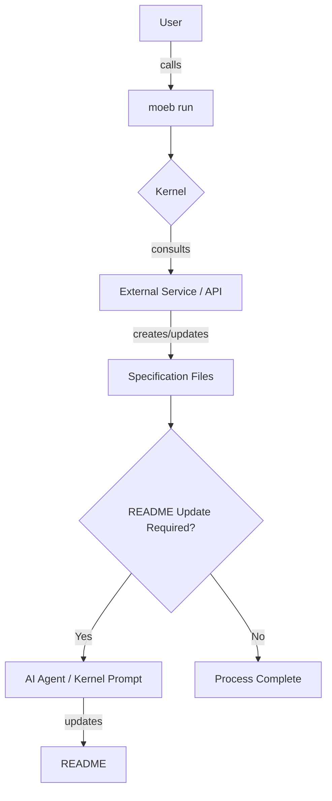

# Specification Update and README Linking

## Raw Requirement

When calling moeb run, files should be automatically updated and created as per the supplied specification. As with the improved spec.prompt, run.prompt should be revisited to ensure our constraints are adhered to as per the README and linked specification files. The kernel MUST remain as 'dumb' as possible, i.e. it exists as an interface to call out to external services given user input. Additionally this is a revision of a specification - now deleted - that did not update the .moeb/README for new specification link, it must, this may require a prompt revision for spec.prompt or to ensure that a response to moeb spec is if not automatically created and linked by an ai agent, that the kernel has means to prompt again for the link to be made i.e. user calls moeb spec, kernel applies the user input to the spec.prompt template and queries the configured adapter, the adapted ai api creates the new spec file and updates README OR the adapted ai api creates the new spec file followed by another prompt by the kernel to the same api to update README.md for the link (another .prompt template would be good here) OR the adapted ai api returns a response to the kernel and the file is not created, we check for the file and it does not exist, the kernel creates the file and copies the spec verbatim to the required spec file location, the ai api is prompted to add the link the to the README

## Description

The specification envisions a process where invoking `moeb run` leads to the automatic creation and update of files based on a provided specification, while ensuring that all operations remain compatible with constraints specified in the README and linked specification files. The kernel must function solely as an interface to external services without internal logic for decision-making. The updated process requires the kernel to ensure `.moeb/README` is updated with links to new specifications, either by using AI agents to directly update or create the file from a returned response and prompt AI agent for link update in the README. This process intends to ensure continuity and prevent oversight of outdated instructions in the `.moeb/README`.

## Backlinks

- parents:
  - label: Declarative Specification Harness
    path: README.md
    purpose: root index

- external:
  - label: Moeb Kernel
    path: specifications/moeb/moeb.kernel.md
    purpose: reference
  - label: Moeb Spec Command Output Enforcement
    path: specifications/moeb/moeb.spec-output-enforcement.md
    purpose: reference

## Steps

1. **Integration with External API**
   - Define the method for kernel to interact with the AI agent for creating specification files from templates using user input.
   
2. **Specification File Creation**
   - Implement logic to generate and store specification files in the correct path as indicated by user input and AI processing.
   
3. **README Update Logic**
   - Confirm AI agent capabilities to append new specification links to `.moeb/README`, or develop kernel to save a returned response and prompt AI agent for README update.

4. **Validation of File Updates**
   - Create tests ensuring specification files and `.moeb/README` are updated accordingly to maintain coherence with the harness policies.

5. **Internal Logging for Attempt Outcomes**
   - Implement detailed logging within kernel activity to track outcomes of calls to the AI agent detailing successes and points of failure.

## Decisions

- **Maintaining Kernel Dumbness**: 
  - **Rationale**: Preserve the kernel's role as a simple orchestrator to ensure modularity and enable easier maintenance.
  - **Alternatives**: Incorporating sophisticated logic within the kernel was rejected due to the increased complexity and maintenance burden it would entail.
  - **Consequences**: This enforces dependency on reliable external service integration.

- **AI Prompt for README Update**: 
  - **Rationale**: An AI-driven approach reduces human error in forgetting to update the README.
  - **Alternatives**: Manual prompts as backups rejected due to increased user friction.
  - **Consequences**: The requirement for robust AI service with strict adherence policy.

## Rubric

- structured:
  - name: Update Automation
    description: Validate automatic creation and updating of specification files and README.
    threshold: 100%
    pass_condition: All created specs must be documented in README upon the `moeb run`.

- qualitative:
  - name: Code Clarity
    description: The implementation should reflect the simplicity of the kernel interface without embedding additional logic layers.