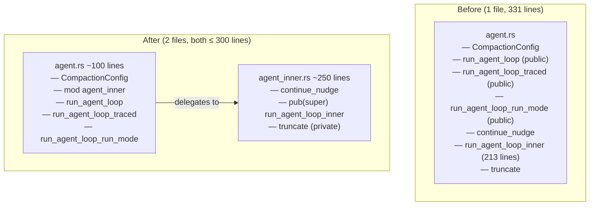

# Split Agent: Extract Inner Loop

## Raw Requirement

> Line budgets — ≤ 300 lines for implementation files. agent.rs is 331 lines and must
> be split to comply with the context budget policy.

## Description

`src/moeb/src/agent.rs` is 331 lines. The bulk is `run_agent_loop_inner` (~213 lines),
a private function that contains the full agent loop body. The three public wrapper
functions (`run_agent_loop`, `run_agent_loop_traced`, `run_agent_loop_run_mode`) and
`continue_nudge` are thin — their bodies total ~80 lines.

This specification extracts `run_agent_loop_inner`, `continue_nudge`, and `truncate`
into a new companion module `src/moeb/src/agent_inner.rs`. The three public functions
remain in `agent.rs` and delegate to `agent_inner::run_agent_loop_inner`. No public
API changes; no behaviour changes. The split reduces `agent.rs` to ~100 lines and
creates `agent_inner.rs` at ~250 lines, both within the 300-line budget.

## Diagram



## Backlinks

### Parents

| Label | Path | Purpose |
|-------|------|---------|
| Context Budget Design | [specifications/moeb/moeb.context-budget-design.md](specifications/moeb/moeb.context-budget-design.md) | Established the 300-line source-file budget; this split eliminates agent.rs from the known-exceptions allowlist |
| Test File Separation | [specifications/moeb/moeb.test-file-separation.md](specifications/moeb/moeb.test-file-separation.md) | Established the companion-file pattern used here for non-test code extraction |
| README | [README.md](../../README.md) | Root index |

### External

*(none)*

## Steps

### Step 1 — Create `src/moeb/src/agent_inner.rs`

Read `src/moeb/src/agent.rs` in full. Create a new file
`src/moeb/src/agent_inner.rs` containing, in this order:

1. The imports required by the moved functions. These include all imports currently
   in `agent.rs` that are referenced by `continue_nudge`, `run_agent_loop_inner`, or
   `truncate`. Add `use super::CompactionConfig;` to reference the struct that stays
   in the parent module.

2. The `continue_nudge` function verbatim from `agent.rs`, unchanged except that it
   is now a module-level function (not `pub` — visibility is unchanged).

3. The `run_agent_loop_inner` function verbatim from `agent.rs`, with its visibility
   changed from (implicit) private to `pub(super)`.

4. The `truncate` function verbatim from `agent.rs`, unchanged (remains private).

Do not add any other content to `agent_inner.rs`.

### Step 2 — Update `src/moeb/src/agent.rs`

Read `src/moeb/src/agent.rs` in full. Make the following changes:

**2a.** Remove `continue_nudge`, `run_agent_loop_inner`, and `truncate` from the file.

**2b.** Add the module declaration immediately before the test module reference,
after the last public function:

```rust
mod agent_inner;
```

**2c.** In `run_agent_loop`, replace the call:

```rust
run_agent_loop_inner(adapter, &executor, &tools, working_dir, messages, MAX_TURNS, &noop_trace, 1, true, CompactionConfig::default(), state)
```

with:

```rust
agent_inner::run_agent_loop_inner(adapter, &executor, &tools, working_dir, messages, MAX_TURNS, &noop_trace, 1, true, CompactionConfig::default(), state)
```

**2d.** In `run_agent_loop_traced`, replace:

```rust
run_agent_loop_inner(adapter, tool_exec, tools, working_dir, initial_messages, max_turns, trace, attempt, false, compaction_config, state)
```

with:

```rust
agent_inner::run_agent_loop_inner(adapter, tool_exec, tools, working_dir, initial_messages, max_turns, trace, attempt, false, compaction_config, state)
```

**2e.** In `run_agent_loop_run_mode`, replace:

```rust
run_agent_loop_inner(adapter, tool_exec, tools, working_dir, initial_messages, max_turns, trace, attempt, true, compaction_config, state)
```

with:

```rust
agent_inner::run_agent_loop_inner(adapter, tool_exec, tools, working_dir, initial_messages, max_turns, trace, attempt, true, compaction_config, state)
```

**2f.** Remove any imports from `agent.rs` that are no longer used after the move.
Keep all imports that are still referenced by the remaining functions.

### Step 3 — Verify

Run `cargo build --release` — zero errors. Run `cargo test` — all tests pass.

Confirm line counts:

```
(Get-Content src/moeb/src/agent.rs).Count
(Get-Content src/moeb/src/agent_inner.rs).Count
```

Both must be ≤ 300 lines. Confirm the three public functions are still exported:

```
grep -n "pub fn run_agent_loop" src/moeb/src/agent.rs
```

Must return three matches (`run_agent_loop`, `run_agent_loop_traced`,
`run_agent_loop_run_mode`).

## Decisions

### Decision 1 — Extract to `agent_inner.rs`; not a submodule directory

**Rationale:** `agent.rs` already uses `#[path]` for its test companion
(`agent_tests.rs`). A sibling file `agent_inner.rs` follows the same pattern: the
Rust module system resolves `mod agent_inner;` declared inside `agent.rs` to
`agent_inner.rs` in the same directory. No directory restructuring is needed; the
change is one new file and edits to one existing file.

**Alternatives:**

| Option | Reason Rejected |
|--------|-----------------|
| Convert to `agent/mod.rs` + `agent/inner.rs` | Requires moving `agent.rs` to `agent/mod.rs` and updating all import paths; scope creep |
| Extract `continue_nudge` only, keep `run_agent_loop_inner` in agent.rs | Does not bring agent.rs below 300 lines (run_agent_loop_inner is 213 lines alone) |
| Inline the inner loop body into each public wrapper | Triples the code; makes future changes to the loop require editing three functions |

**Consequences:** `agent_inner.rs` is a private implementation detail of the `agent`
module. Nothing outside the `agent` module can call `run_agent_loop_inner` directly;
the three public wrappers remain the only API. `continue_nudge` moves to
`agent_inner.rs` because it is only called by `run_agent_loop_inner`; it is not
needed in `agent.rs`.

---

### Decision 2 — `continue_nudge` moves with `run_agent_loop_inner`

**Rationale:** `continue_nudge` is called exclusively inside `run_agent_loop_inner`.
Moving it to the same file eliminates the need for a `pub(super)` visibility on it
and keeps the call site and definition co-located. If `continue_nudge` were left in
`agent.rs`, `run_agent_loop_inner` in `agent_inner.rs` would need to call it as
`super::continue_nudge(...)`, creating a cross-file call for a function that is not
part of the public API.

**Alternatives:**

| Option | Reason Rejected |
|--------|-----------------|
| Keep `continue_nudge` in `agent.rs`, call via `super::` | Creates unnecessary coupling; `continue_nudge` is an implementation detail of the loop |
| Move `continue_nudge` to `run_state.rs` | `continue_nudge` formats a nudge string from run state; it belongs near the loop that uses it |

**Consequences:** `continue_nudge` is no longer visible in `agent.rs`. Its tests, if
any exist in `agent_tests.rs`, can still access it via `super::agent_inner` if needed,
or the test can be moved to `agent_inner.rs` under a `#[cfg(test)]` block.

## Rubric

### Structured

| Name | Description | Threshold | Pass Condition |
|------|-------------|-----------|----------------|
| `binary-builds` | `cargo build --release` exits 0 | Zero errors | CI build exits 0 |
| `all-tests-pass` | `cargo test` exits 0 | Zero failures | `cargo test` exits 0 |
| `no-test-regression` | All existing agent tests pass | Zero failures | `cargo test agent` exits 0 with the same tests as before |
| `agent-rs-within-budget` | `agent.rs` is ≤ 300 lines after split | ≤ 300 lines | Line count check in Step 3 passes |
| `agent-inner-rs-within-budget` | `agent_inner.rs` is ≤ 300 lines | ≤ 300 lines | Line count check in Step 3 passes |
| `public-api-unchanged` | Three public loop functions remain in `agent.rs` | Three matches | `grep -n "pub fn run_agent_loop" src/moeb/src/agent.rs` returns 3 results |

### Qualitative

- **No behaviour change:** The agent loop logic inside `run_agent_loop_inner` must be byte-for-byte identical to the original. The only changes permitted are the visibility modifier (`pub(super)`) and the addition of `use super::CompactionConfig;`.
- **No new public items:** `agent_inner` must not be declared `pub mod`. All items in `agent_inner.rs` that are not `pub(super)` remain private to the module.
