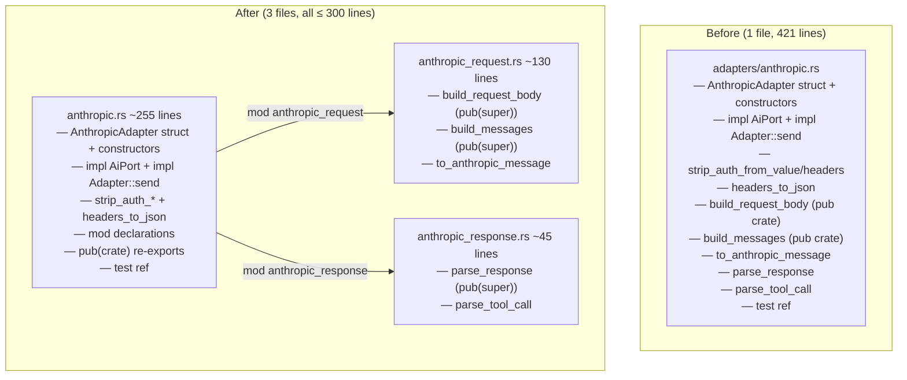

# Split Anthropic Adapter: Request and Response Extraction

## Raw Requirement

> Line budgets — ≤ 300 lines for implementation files. adapters/anthropic.rs is
> 421 lines and must be split to comply with the context budget policy.

## Description

`src/moeb/src/adapters/anthropic.rs` is 421 lines. The file mixes three concerns:
the `AnthropicAdapter` struct with its HTTP retry loop (`send`), the request
serialisation layer (`build_request_body`, `build_messages`, `to_anthropic_message`),
and the response parser (`parse_response`, `parse_tool_call`). The three auth/header
utility functions (`strip_auth_from_value`, `strip_auth_from_headers`,
`headers_to_json`) are small enough to remain in `anthropic.rs` alongside `send`,
where they are called.

This specification extracts the request and response concerns into two new companion
files in `src/moeb/src/adapters/`:

- **`anthropic_request.rs`** — `build_request_body`, `build_messages`,
  `to_anthropic_message`. Pure serialisation; no I/O.
- **`anthropic_response.rs`** — `parse_response`, `parse_tool_call`. Pure
  deserialisation; no I/O.

`anthropic.rs` retains the adapter struct, constructors, both `impl` blocks, and the
three HTTP utilities. `build_request_body` and `build_messages` are currently
`pub(crate)` and accessed by `anthropic_tests.rs` via `use super::*`. Their
visibility and accessibility are preserved through a `pub(crate) use` re-export in
`anthropic.rs`, so no changes are required to `anthropic_tests.rs`.

No behaviour changes. No public API changes.

## Diagram



## Backlinks

### Parents

| Label | Path | Purpose |
|-------|------|---------|
| Context Budget Design | [specifications/moeb/moeb.context-budget-design.md](specifications/moeb/moeb.context-budget-design.md) | Established the 300-line source-file budget; this split eliminates adapters/anthropic.rs from the exceptions allowlist |
| Split Domain Spec | [specifications/moeb/moeb.split-domain-spec.md](specifications/moeb/moeb.split-domain-spec.md) | Preceding split; established pattern for companion-module extraction with use re-exports |
| README | [README.md](../../README.md) | Root index |

### External

*(none)*

## Steps

### Step 1 — Create `src/moeb/src/adapters/anthropic_request.rs`

Read `src/moeb/src/adapters/anthropic.rs` in full. Create
`src/moeb/src/adapters/anthropic_request.rs` containing, in this order:

1. The imports required by the moved functions:

```rust
use anyhow::{Context, Result};
use serde_json::{json, Value};

use super::{Message, ToolDef};
```

2. The `build_request_body` function verbatim from `anthropic.rs`, with visibility
   changed to `pub(super)`.

3. The `build_messages` function verbatim from `anthropic.rs`, with visibility
   changed to `pub(super)`.

4. The `to_anthropic_message` function verbatim from `anthropic.rs`. This function is
   private (no `pub`) — it is only called by `build_messages` within this file.

### Step 2 — Create `src/moeb/src/adapters/anthropic_response.rs`

Create `src/moeb/src/adapters/anthropic_response.rs` containing, in this order:

1. The imports required by the moved functions:

```rust
use anyhow::{Context, Result};
use serde_json::Value;

use super::{AgentResponse, ToolCall};
```

2. The `parse_response` function verbatim from `anthropic.rs`, with visibility
   changed to `pub(super)`.

3. The `parse_tool_call` function verbatim from `anthropic.rs`. This function is
   private — it is only called by `parse_response` within this file.

### Step 3 — Update `src/moeb/src/adapters/anthropic.rs`

Read `src/moeb/src/adapters/anthropic.rs` in full. Make the following changes:

**3a.** Remove from `anthropic.rs` the following items (they now live in the
submodules):
- `build_request_body`
- `build_messages`
- `to_anthropic_message`
- `parse_response`
- `parse_tool_call`

**3b.** Add two module declarations and their associated use statements immediately
after the import block and before the constants:

```rust
mod anthropic_request;
pub(crate) use self::anthropic_request::{build_request_body, build_messages};
use self::anthropic_request::build_request_body as _build_request_body;

mod anthropic_response;
use self::anthropic_response::parse_response;
```

Wait — simpler: since `send()` calls `build_request_body(...)` and `parse_response(...)`
by name (without prefix), bring them into scope with unqualified `use`:

```rust
mod anthropic_request;
use self::anthropic_request::{build_request_body, build_messages};
pub(crate) use self::anthropic_request::build_request_body;
pub(crate) use self::anthropic_request::build_messages;

mod anthropic_response;
use self::anthropic_response::parse_response;
```

Write the above more concisely:

```rust
mod anthropic_request;
use self::anthropic_request::{build_request_body, build_messages};
pub(crate) use self::anthropic_request::{build_request_body, build_messages};

mod anthropic_response;
use self::anthropic_response::parse_response;
```

Note: a `use` and a `pub(crate) use` of the same names in the same scope is redundant.
Use only the `pub(crate) use` form — it both brings the names into scope and re-exports
them, satisfying both the call sites in `send()` and the `use super::*` in
`anthropic_tests.rs`:

```rust
mod anthropic_request;
pub(crate) use self::anthropic_request::{build_request_body, build_messages};

mod anthropic_response;
use self::anthropic_response::parse_response;
```

`parse_response` is not referenced outside the `anthropic` module, so a private `use`
is sufficient.

**3c.** No other changes to `anthropic.rs`. The call site `let body = build_request_body(...)?;`
and `return parse_response(&response_body);` in `send()` continue to resolve via the
`use` declarations added in 3b.

### Step 4 — Verify

Run `cargo build --release` — zero errors. Run `cargo test` — all tests pass,
including `anthropic_tests`.

Confirm line counts:

```
(Get-Content src/moeb/src/adapters/anthropic.rs).Count
(Get-Content src/moeb/src/adapters/anthropic_request.rs).Count
(Get-Content src/moeb/src/adapters/anthropic_response.rs).Count
```

All three must be ≤ 300 lines.

Confirm the moved functions are absent from `anthropic.rs`:

```
grep -n "^fn build_request_body\|^pub.* fn build_request_body\|^fn build_messages\|^fn parse_response\|^fn to_anthropic_message" src/moeb/src/adapters/anthropic.rs
```

Must return no matches.

## Decisions

### Decision 1 — HTTP utilities (`strip_auth_*`, `headers_to_json`) remain in `anthropic.rs`

**Rationale:** The three utilities total ~35 lines and are called exclusively inside
`impl Adapter::send`. Moving them to a submodule would require a `use` import and
module-prefixed calls or a re-export, adding complexity for no line-count benefit —
`anthropic.rs` fits within 300 lines without extracting them.

**Alternatives:**

| Option | Reason Rejected |
|--------|-----------------|
| Move utilities to `anthropic_response.rs` | Utilities deal with request body too (`strip_auth_from_value`); grouping them with response parsing is misleading |
| Create a third `anthropic_http.rs` module | Adds a third module for 35 lines; disproportionate overhead |

**Consequences:** `anthropic.rs` contains the retry loop and HTTP utilities as a
cohesive "HTTP transport" section. The two submodules are pure serialisation/parsing.

---

### Decision 2 — `pub(crate) use` re-export preserves `build_request_body` and `build_messages` accessibility without modifying `anthropic_tests.rs`

**Rationale:** Both functions are `pub(crate)` in the current file and accessed by
`anthropic_tests.rs` via `use super::*`. Moving them to `anthropic_request.rs` as
`pub(super)` and re-exporting from `anthropic.rs` with `pub(crate) use` restores
their effective visibility unchanged. The test file requires no edits.

**Alternatives:**

| Option | Reason Rejected |
|--------|-----------------|
| Update `anthropic_tests.rs` to import from `super::anthropic_request::*` | Requires editing the test file; more disruptive than a two-line re-export |
| Keep `build_request_body` and `build_messages` in `anthropic.rs` | Does not bring the file below 300 lines without removing them |

**Consequences:** The crate-level public API of `build_request_body` and
`build_messages` (accessible as `crate::adapters::anthropic::build_request_body`) is
unchanged. The `pub(super)` declarations in `anthropic_request.rs` are the canonical
definition; the re-export in `anthropic.rs` is the compatibility shim.

---

### Decision 3 — `to_anthropic_message` remains private inside `anthropic_request.rs`

**Rationale:** `to_anthropic_message` is only called from `build_messages`. It has no
callers outside `anthropic_request.rs` after the move, so no visibility upgrade is
needed. Keeping it private prevents it from becoming an accidental dependency for
other modules.

**Alternatives:**

| Option | Reason Rejected |
|--------|-----------------|
| `pub(super)` on `to_anthropic_message` | Unnecessary; no caller outside `anthropic_request.rs` |

**Consequences:** `to_anthropic_message` is an implementation detail of
`build_messages`. If a future test needs to verify message conversion independently,
it can do so by inspecting the output of `build_messages`.

## Rubric

### Structured

| Name | Description | Threshold | Pass Condition |
|------|-------------|-----------|----------------|
| `binary-builds` | `cargo build --release` exits 0 | Zero errors | CI build exits 0 |
| `all-tests-pass` | `cargo test` exits 0 | Zero failures | `cargo test` exits 0 |
| `no-test-regression` | All existing anthropic adapter tests pass | Zero failures | `cargo test anthropic` exits 0 |
| `anthropic-rs-within-budget` | `anthropic.rs` is ≤ 300 lines | ≤ 300 lines | Line count check in Step 4 passes |
| `anthropic-request-rs-within-budget` | `anthropic_request.rs` is ≤ 300 lines | ≤ 300 lines | Line count check in Step 4 passes |
| `anthropic-response-rs-within-budget` | `anthropic_response.rs` is ≤ 300 lines | ≤ 300 lines | Line count check in Step 4 passes |
| `moved-fns-absent-from-anthropic-rs` | `build_request_body`, `build_messages`, `parse_response`, `to_anthropic_message` are not defined in `anthropic.rs` | Zero definitions | `grep` in Step 4 returns no matches |

### Qualitative

- **No behaviour change:** All moved functions must be byte-for-byte identical to their originals. The only permitted changes are visibility modifiers and new import lines.
- **Test accessibility preserved:** `use super::*` in `anthropic_tests.rs` must still resolve `build_request_body` and `build_messages` without any change to that file. Verify by running `cargo test anthropic` without modifying `anthropic_tests.rs`.
- **No new public items:** `anthropic_request` and `anthropic_response` must not be declared `pub mod`. They are private submodules of the `anthropic` module.
