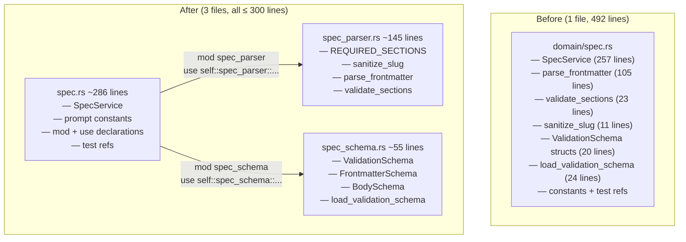

# Split Domain Spec: Parser and Schema Extraction

## Raw Requirement

> Line budgets — ≤ 300 lines for implementation files. domain/spec.rs is 492 lines
> and must be split to comply with the context budget policy.

## Description

`src/moeb/src/domain/spec.rs` is 492 lines — the largest file in the kernel. It
mixes three distinct concerns: the `SpecService` orchestration layer (~257 lines),
the YAML frontmatter parser (`parse_frontmatter`, `validate_sections`, `sanitize_slug`,
~140 lines), and the validation-schema loader (`ValidationSchema` structs,
`load_validation_schema`, ~50 lines).

This specification extracts the parser and schema concerns into two new companion
modules in the same directory:

- **`spec_parser.rs`** — `parse_frontmatter`, `validate_sections`, `sanitize_slug`,
  and `REQUIRED_SECTIONS`. These are pure parsing functions with no I/O.
- **`spec_schema.rs`** — `ValidationSchema`, `FrontmatterSchema`, `BodySchema`, and
  `load_validation_schema`. These are the deserialization types and the function that
  reads the JSON schema from disk.

`spec.rs` retains `SpecService` and the prompt-template constants. The call sites for
the moved functions do not change — `spec.rs` brings them into scope via
`use self::spec_parser::...` and `use self::spec_schema::...` declarations. The test
companion `spec_tests.rs` is updated with an explicit import for the parser items it
references directly.

No behaviour changes. No public API changes.

## Diagram



## Backlinks

### Parents

| Label | Path | Purpose |
|-------|------|---------|
| Context Budget Design | [specifications/moeb/moeb.context-budget-design.md](specifications/moeb/moeb.context-budget-design.md) | Established the 300-line source-file budget; this split eliminates domain/spec.rs from the exceptions allowlist |
| Split Agent: Extract Inner Loop | [specifications/moeb/moeb.split-agent.md](specifications/moeb/moeb.split-agent.md) | Preceding split; establishes pattern for companion-module extraction |
| README | [README.md](../../README.md) | Root index |

### External

*(none)*

## Steps

### Step 1 — Create `src/moeb/src/domain/spec_schema.rs`

Read `src/moeb/src/domain/spec.rs` in full. Create
`src/moeb/src/domain/spec_schema.rs` containing, in this order:

1. The imports required by the moved items:

```rust
use std::fs;
use std::path::Path;
```

2. The three structs verbatim from `spec.rs`, with visibility changed to `pub(super)`:

```rust
#[derive(serde::Deserialize)]
pub(super) struct ValidationSchema {
    pub(super) frontmatter: FrontmatterSchema,
    pub(super) body: BodySchema,
}

#[derive(serde::Deserialize)]
pub(super) struct FrontmatterSchema {
    pub(super) required: Vec<String>,
    #[serde(default)]
    #[allow(dead_code)]
    pub(super) optional: Vec<String>,
}

#[derive(serde::Deserialize)]
pub(super) struct BodySchema {
    pub(super) required_sections: Vec<String>,
}
```

3. The `load_validation_schema` function verbatim from `spec.rs`, with visibility
   changed to `pub(super)`:

```rust
pub(super) fn load_validation_schema(working_dir: &Path) -> Option<ValidationSchema> {
    // ... body unchanged
}
```

### Step 2 — Create `src/moeb/src/domain/spec_parser.rs`

Create `src/moeb/src/domain/spec_parser.rs` containing, in this order:

1. The imports required by the moved items:

```rust
use anyhow::{bail, Context, Result};
```

2. The `REQUIRED_SECTIONS` constant verbatim from `spec.rs`, with visibility changed
   to `pub(super)`:

```rust
pub(super) const REQUIRED_SECTIONS: &[&str] = &[
    "# ",
    "## Raw Requirement",
    "## Description",
    "```mermaid",
    "## Backlinks",
    "## Steps",
    "## Decisions",
    "## Rubric",
];
```

3. The `sanitize_slug` function verbatim from `spec.rs`, with visibility `pub(super)`.

4. The `parse_frontmatter` function verbatim from `spec.rs`, with visibility
   `pub(super)`.

5. The `validate_sections` function verbatim from `spec.rs`, with visibility
   `pub(super)`.

### Step 3 — Update `src/moeb/src/domain/spec.rs`

Read `src/moeb/src/domain/spec.rs` in full. Make the following changes:

**3a.** Remove from `spec.rs` the following items (they now live in the submodules):
- The `REQUIRED_SECTIONS` constant
- The `ValidationSchema`, `FrontmatterSchema`, and `BodySchema` struct definitions
- The `load_validation_schema` function
- The `sanitize_slug` function
- The `parse_frontmatter` function
- The `validate_sections` function

**3b.** Add two module declarations and their associated `use` statements immediately
after the import block and before the first constant declaration:

```rust
mod spec_parser;
use self::spec_parser::{parse_frontmatter, sanitize_slug, validate_sections, REQUIRED_SECTIONS};

mod spec_schema;
use self::spec_schema::{load_validation_schema, ValidationSchema};
```

**3c.** No other changes to `spec.rs`. All call sites within `SpecService::run_in`
and the constant references to `REQUIRED_SECTIONS` continue to compile without
modification because the `use` statements in 3b bring the names back into scope.

### Step 4 — Update `src/moeb/src/domain/spec_tests.rs`

Read `src/moeb/src/domain/spec_tests.rs` in full. The test file currently begins
with `use super::*;`. After Step 3, `parse_frontmatter` and `validate_sections` are
brought into `spec.rs`'s scope via a private `use` statement — they are not
re-exported by `super::*`.

Add an explicit import line immediately after `use super::*;`:

```rust
use super::spec_parser::{parse_frontmatter, validate_sections};
```

No other changes to `spec_tests.rs`.

### Step 5 — Verify

Run `cargo build --release` — zero errors. Run `cargo test` — all tests pass.

Confirm line counts:

```
(Get-Content src/moeb/src/domain/spec.rs).Count
(Get-Content src/moeb/src/domain/spec_parser.rs).Count
(Get-Content src/moeb/src/domain/spec_schema.rs).Count
```

All three must be ≤ 300 lines.

Confirm the moved functions are absent from `spec.rs`:

```
grep -n "fn parse_frontmatter\|fn validate_sections\|fn sanitize_slug\|fn load_validation_schema" src/moeb/src/domain/spec.rs
```

Must return no matches.

## Decisions

### Decision 1 — Two submodules (`spec_parser` and `spec_schema`), not one

**Rationale:** `spec_parser.rs` and `spec_schema.rs` have different characters:
the parser is pure computation (no I/O, no structs), the schema module is I/O with
deserialisation types. Combining them would mix concerns and produce a ~200-line file
with no single name. Keeping them separate makes each file's purpose obvious from its
name, consistent with the AI-first principle of one concern per file.

**Alternatives:**

| Option | Reason Rejected |
|--------|-----------------|
| Single `spec_impl.rs` submodule for all extracted items | One ~200-line file with mixed concerns; harder to grep for a specific function |
| Move `SpecService` to a submodule; keep parsing in `spec.rs` | `SpecService` is the primary export; its module should be the primary file |
| Keep parser in `spec.rs`; extract only schema types | Does not bring `spec.rs` close enough to 300 lines |

**Consequences:** Three files in `domain/` now share the spec concern: `spec.rs`
(orchestration), `spec_parser.rs` (parsing), `spec_schema.rs` (schema types). If a
fourth concern emerges, the same pattern applies.

---

### Decision 2 — `use self::spec_parser::...` in `spec.rs` preserves call sites

**Rationale:** The call sites in `SpecService::run_in` call `parse_frontmatter(...)`,
`validate_sections(...)`, and `sanitize_slug(...)` without a module prefix. Adding
`use self::spec_parser::{...}` brings these names back into the `spec` module scope,
so no call site changes are needed. This keeps the diff minimal and the method body
unchanged, which is required by HARD RULE 1 (minimal diffs).

**Alternatives:**

| Option | Reason Rejected |
|--------|-----------------|
| Prefix every call site with `spec_parser::` | Requires editing ~6 call sites inside `run_in`; higher diff surface |
| `pub use self::spec_parser::*` in `spec.rs` | Re-exports private parser functions to the crate; wider visibility than needed |

**Consequences:** `parse_frontmatter` and `validate_sections` are private to the
`spec` module but not re-exported. `spec_tests.rs` must import them explicitly from
`super::spec_parser` (Step 4), since `use super::*` only captures names that are
`pub` in the parent.

---

### Decision 3 — Struct fields in `spec_schema.rs` are `pub(super)`

**Rationale:** `SpecService::run_in` accesses `schema.frontmatter.required` and
`schema.body.required_sections`. With `ValidationSchema`, `FrontmatterSchema`, and
`BodySchema` moved to `spec_schema.rs`, their fields must be visible to `spec.rs`.
`pub(super)` limits visibility to the `domain` module (the immediate parent of
`spec_schema`), which is the correct scope — no other module accesses these types.

**Alternatives:**

| Option | Reason Rejected |
|--------|-----------------|
| `pub` fields | Unnecessarily wide; exposes internals to the whole crate |
| Accessor methods on `ValidationSchema` | Adds boilerplate for types used only within one module; fields are already correctly scoped by `pub(super)` |

**Consequences:** Any future code outside the `domain` module that needs to inspect
the schema types must be introduced via a method on `SpecService`, not by importing
the schema types directly.

## Rubric

### Structured

| Name | Description | Threshold | Pass Condition |
|------|-------------|-----------|----------------|
| `binary-builds` | `cargo build --release` exits 0 | Zero errors | CI build exits 0 |
| `all-tests-pass` | `cargo test` exits 0 | Zero failures | `cargo test` exits 0 |
| `no-test-regression` | All existing spec tests pass | Zero failures | `cargo test domain::tests` exits 0 |
| `spec-rs-within-budget` | `spec.rs` is ≤ 300 lines after split | ≤ 300 lines | Line count check in Step 5 passes |
| `spec-parser-rs-within-budget` | `spec_parser.rs` is ≤ 300 lines | ≤ 300 lines | Line count check in Step 5 passes |
| `spec-schema-rs-within-budget` | `spec_schema.rs` is ≤ 300 lines | ≤ 300 lines | Line count check in Step 5 passes |
| `moved-functions-absent-from-spec-rs` | `parse_frontmatter`, `validate_sections`, `sanitize_slug`, `load_validation_schema` are not defined in `spec.rs` | Zero definitions | `grep` in Step 5 returns no matches |

### Qualitative

- **No behaviour change:** The logic of `parse_frontmatter`, `validate_sections`, and `sanitize_slug` must be byte-for-byte identical to the original. The only changes permitted are the `pub(super)` visibility modifier and new import lines.
- **No public API change:** The `SpecService` struct and its `run` and `run_in` methods remain at the same paths and with the same signatures.
- **Test continuity:** All tests in `spec_tests.rs` and `spec_integration_tests.rs` that passed before this change must pass after. No test may be deleted, commented out, or weakened.
